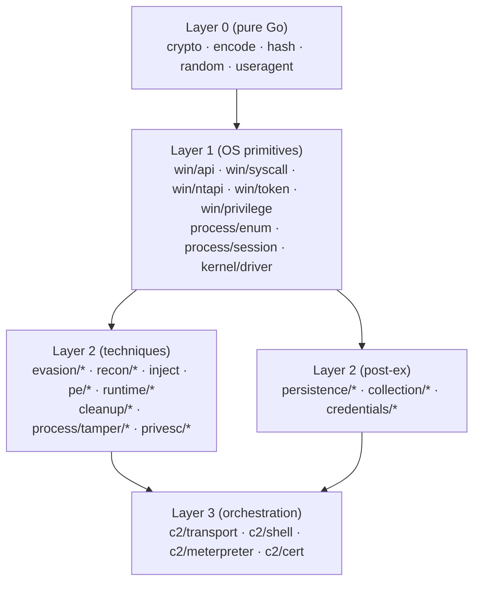
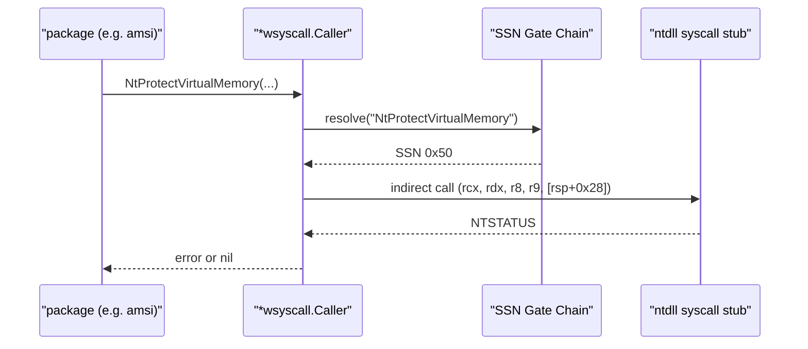

# For researchers (R&D)

[← maldev README](../../README.md) · [docs/index](../index.md)

You want to **understand**. This page walks the architecture, the design
patterns that make every package compose, and the references behind each
technique.

## TL;DR

The library is built around **one composable abstraction**: every
syscall-issuing package accepts an optional
[`*wsyscall.Caller`](../techniques/syscalls/README.md). The caller
encapsulates the calling method (WinAPI / NativeAPI / Direct / Indirect)
and the SSN-resolution strategy (chain of gates: HellsGate → HalosGate →
Tartarus → HashGate). This is the maldev "Caller pattern" — read it
first.

## Architecture



Detailed dependency rules and the complete package matrix:
[architecture.md](../architecture.md).

## The Caller pattern

Every package that issues syscalls follows this signature:

```go
func DoThing(args ..., caller *wsyscall.Caller) (..., error)
```

A `nil` caller falls back to **WinAPI** (the standard CRT path — easy
debugging, noisy in production). A non-nil caller routes the call through
the chosen method:



**Why this design?**

1. **Uniform OPSEC tuning** — change one variable, all dependent packages
   inherit the new stealth level. No per-call configuration sprawl.
2. **Resolver fall-back chain** — if `HellsGate` fails (ntdll hooked),
   `HalosGate` walks down to find a clean stub. Each package gets the
   chain "for free".
3. **Testability** — the WinAPI fall-back lets unit tests run on any
   Windows host without elevation, while integration tests in VMs run
   with `MethodIndirect` to validate the stealth path.

See: [`win/syscall/doc.go`](../../win/syscall/doc.go) and the
[direct-indirect](../techniques/syscalls/direct-indirect.md) /
[ssn-resolvers](../techniques/syscalls/ssn-resolvers.md) pages.

## Cross-version Windows behavior

Some techniques fail on newer Windows builds. Tracked deltas:

| Technique | Win10 22H2 | Win11 24H2 (build 26100) | Notes |
|---|---|---|---|
| `process/tamper/herpaderping.ModeRun` | ✅ | ❌ | Win11 image-load notify hardening — use [ModeGhosting](../techniques/process/herpaderping.md#modeghosting) |
| `cleanup/selfdelete.DeleteFile` | ✅ | ⚠️ | `MoveFileEx(MOVEFILE_DELAY_UNTIL_REBOOT)` rename-on-reboot semantics changed |
| `process/tamper/fakecmd.SpoofPID` | ✅ | ❌ | `PROC_THREAD_ATTRIBUTE_PARENT_PROCESS` tightened |
| `inject.CallerMatrix_RemoteInject` (some methods + Direct/Indirect) | ✅ | ⚠️ | Cross-process write + thread-create primitives |
| `evasion/hook` test EXE | (Defender flagged) | (Defender flagged) | Defender def-update — exclusions in `bootstrap-windows-guest.ps1` |

Source of truth: the `## Win10 → Win11 cross-version deltas` table in
[testing.md](../testing.md).

## Reading order — by complexity

1. **Pure Go**: [crypto](../techniques/crypto/README.md),
   [encode](../techniques/encode/README.md), [hash](../../hash) — read
   `*_test.go` first; the algorithms speak for themselves.
2. **OS-primitives**:
   [win/syscall](../techniques/syscalls/README.md) — start here, the
   Caller pattern radiates out.
3. **Detection-evasion mechanics**:
   [evasion/amsi](../techniques/evasion/amsi-bypass.md),
   [evasion/etw](../techniques/evasion/etw-patching.md),
   [evasion/unhook](../techniques/evasion/ntdll-unhooking.md). Concrete
   byte-pattern verification, easy to validate in x64dbg.
4. **Sleep masking**:
   [sleepmask](../techniques/evasion/sleep-mask.md) — the `Ekko` ROP
   chain is a small masterpiece; the Go bindings preserve the
   semantics.
5. **Injection**: [inject](../techniques/injection/README.md). 15+
   methods — read the `CallerMatrix` test in
   [testing.md](../testing.md#injection-callermatrix) for the
   feature × stealth grid.
6. **In-process runtime**: [runtime/bof](../techniques/runtime/bof-loader.md),
   [runtime/clr](../techniques/runtime/clr.md). BOF/COFF parsing in
   pure Go; CLR hosting via `ICorRuntimeHost` (legacy v2 activation).
7. **Kernel BYOVD**:
   [kernel/driver/rtcore64](../../kernel/driver/rtcore64). Layer-1
   primitives (Reader / ReadWriter / Lifecycle); CVE-2019-16098 IOCTL
   scaffold; consumed by `evasion/kcallback.Remove` and
   `credentials/lsassdump.Unprotect`.

## VM testing

Reproducible test harness: [coverage-workflow.md](../coverage-workflow.md).

```bash
# One-time: bootstrap VMs from scratch
bash scripts/vm-provision.sh

# Each session: full coverage with all gates open, merged report
bash scripts/full-coverage.sh --snapshot=TOOLS
```

The harness orchestrates Windows + Linux + Kali VMs; gating env vars
(`MALDEV_INTRUSIVE`, `MALDEV_MANUAL`) unlock destructive tests safely.

## How to extend

### Adding a new injection method

1. Add a `Method<Name>` constant to [`inject/method.go`](../../inject).
2. Implement `case MethodXxx:` in `WindowsInjector.Inject`. The
   `*wsyscall.Caller` is already wired — call through it for any
   syscall.
3. Add the method to the [CallerMatrix test](../testing.md#injection-callermatrix).
4. Update [docs/techniques/injection/](../techniques/injection/README.md)
   per the [doc-conventions template](../conventions/documentation.md).
5. Tag the MITRE ID in the new package's `doc.go`; `internal/tools/docgen` rolls it
   into [mitre.md](../mitre.md).

### Adding a new evasion technique

Same shape: package under `evasion/<name>`, exposes a function returning
an `evasion.Technique` so it composes via `evasion.ApplyAll`.

## References

- **Caller pattern**: [Hells/Halos Gate paper](https://www.crummie5.club/hells-gate/)
  · [Tartarus Gate](https://blog.kayrkay.gay/posts/tartarus-gate/)
- **AMSI bypass**: [Rasta Mouse — AmsiScanBuffer patch](https://rastamouse.me/2018/10/amsiscanbufferantimalwarescanbuffer-bypass/)
- **ETW patch**: [modexp — Disabling ETW](https://www.modexp.wtf/2020/04/disabling-etw-tracelogging.html)
- **Sleep mask (Ekko)**: [Cracked5pider/Ekko](https://github.com/Cracked5pider/Ekko)
- **Herpaderping / Ghosting**: [jxy-s/herpaderping](https://github.com/jxy-s/herpaderping)
  · [hasherezade — process ghosting](https://hshrzd.wordpress.com/2020/07/19/process-ghosting/)
- **Donut PE-to-shellcode**: [TheWover/donut](https://github.com/TheWover/donut)
- **Phantom DLL hollowing**: [forrest-orr/phantom-dll-hollower-poc](https://github.com/forrest-orr/phantom-dll-hollower-poc)
- **BOF spec**: [Cobalt Strike BOF documentation](https://hstechdocs.helpsystems.com/manuals/cobaltstrike/current/userguide/content/topics/beacon-object-files_main.htm)

Per-technique pages cite their own primary sources — these are the
spine references for the architecture.

## Where to next

- [Operator path](operator.md) — if you want the practical chain, not
  the theory.
- [Detection engineering path](detection-eng.md) — read the same
  techniques from the **artifacts left behind** angle.
- [Architecture](../architecture.md) — full layer-by-layer dependency
  map.
- [Testing](../testing.md) — evidence the techniques actually work
  cross-version.
