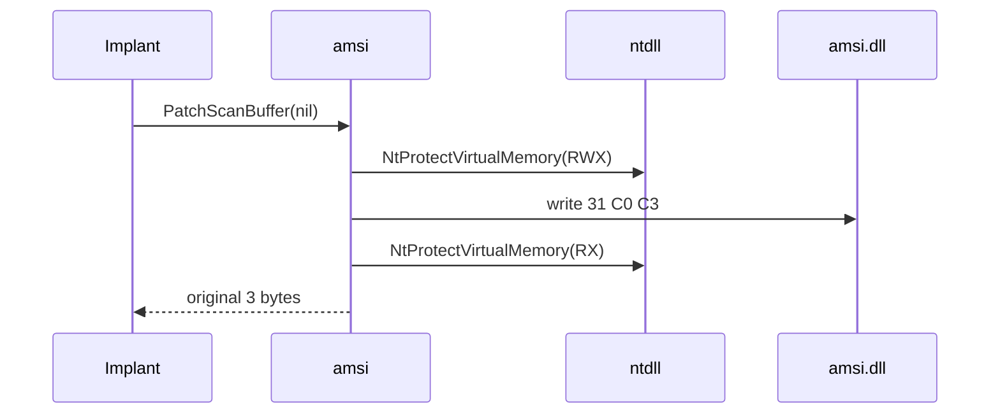

# Documentation Conventions Skill

Apply this skill to **all** documentation work in this project. The
methodology was decided 2026-04-27 and is the canonical source — older `.md`
files that diverge are legacy and must be migrated, not perpetuated.

## Surface (where docs live)

**Hybrid model.** `/docs/**.md` and `*/doc.go` files are the **canonical
source of truth**, browseable directly on GitHub. A CI job additionally
generates a richer site on `gh-pages` (mdBook or Docusaurus) with full-text
search, dark mode, and versioned snapshots.

- Anything that ships on `pkg.go.dev` (godoc) is godoc-rendered. Don't put
  GitHub-specific markdown in `doc.go` — write plain godoc that survives both
  surfaces.
- Anything in `/docs/**.md` may use full GFM + GitHub advanced formatting
  (Mermaid, alerts, math, collapsibles, tables, footnotes, task lists).
- The `gh-pages` site builds from `/docs/**.md` — never write content that
  only exists on the site. Source is markdown.

## Audience paths (3 explicit roles)

The README and `docs/index.md` route readers via three role pages:

- `docs/by-role/operator.md` — red team / ops focus: chains, OPSEC,
  payload-ready snippets, deployment patterns.
- `docs/by-role/researcher.md` — security R&D focus: how it works at the
  kernel/runtime layer, paper references, MITRE/D3FEND mapping.
- `docs/by-role/detection-eng.md` — blue team focus: artifacts left,
  detection telemetry, EDR signatures, hardening recommendations.

Every technique page links back to one or more role pages via "See also".
Every role page links forward to relevant technique pages. The tree is
acyclic and traversable both ways.

## Per-package docs (`doc.go`)

**Required structure.** Every public package MUST have a `doc.go` that
matches this template (literal section headers, in this order):

```go
// Package <name> <one-sentence purpose, ending with a period>.
//
// <intro paragraph: what problem it solves, who calls it, when to use it.
// 80–200 words, plain prose, no headers.>
//
// # MITRE ATT&CK
//
//   - T<id> (<full sub-technique name>)
//   - [more if applicable]
//
// # Detection level
//
// <one of: very-quiet | quiet | moderate | noisy | very-noisy>
//
// <one or two sentences on the artifacts left behind. Be concrete:
// syscalls invoked, registry keys touched, ETW providers triggered, etc.>
//
// # Example
//
// See [Example<First>] in <name>_example_test.go.
//
// # See also
//
//   - docs/techniques/<area>/<file>.md
package <name>
```

**Detection level scale** — pick exactly one bucket per package:

| Bucket | Meaning |
|---|---|
| `very-quiet` | Zero artifacts above noise. In-process only. Common syscalls only. |
| `quiet` | Minimal trace. No event log. May leave one transient registry/file artifact. |
| `moderate` | Distinguishable syscall pattern but commonly used by legitimate software. |
| `noisy` | Triggers ETW providers, event log entries, or cross-process activity that's monitorable. |
| `very-noisy` | High-confidence detection by signature: known sigs in Defender, hooked APIs that EDR specifically watches. |

**MITRE format** — always `T<id>(.<sub>)? (<full name>)`. Never bundle without
the `()` form. Examples:

- `T1003.001 (OS Credential Dumping: LSASS Memory)` ✅
- `T1003.001 — OS Credential Dumping: LSASS Memory` ❌ (em-dash)
- `T1071, T1573` ❌ (bundled, missing names)

## Per-technique pages (`docs/techniques/<area>/<file>.md`)

**Template — flexible, but API Reference is mandatory.** Sections in the
order listed. Omit a section if it has no content; never reorder.

1. `# <Title>` (H1, no subtitle).
2. **Front-matter (YAML)** — see Versioning below.
3. `## TL;DR` — 3 lines max. What / why / when.
4. `## Primer` — 100–200 words, beginner-accessible. Defines the problem
   space without code.
5. `## How It Works` — diagrams + step list. Mermaid encouraged when it adds
   clarity.
6. `## API Reference` — **REQUIRED, homogenized format** (see below).
7. `## Examples`:
   - `### Simple` — minimum-viable runnable snippet, ≤10 LOC.
   - `### Composed` — combined with ≥1 other package (e.g.,
     `evasion + caller`).
   - `### Advanced` — chain ≥4 packages.
   - `### Complex` — full end-to-end scenario, may link out to
     `docs/examples/*.md`.
8. `## OPSEC & Detection` — artifacts left, defender vantage points,
   D3FEND counter-techniques tagged `D3-XXX`.
9. `## MITRE ATT&CK` — mini-table:
   ```markdown
   | T-ID | Name | Sub-coverage | D3FEND counter |
   |---|---|---|---|
   | T1003.001 | OS Credential Dumping: LSASS Memory | full | D3-PA |
   ```
10. `## Limitations` — Windows version gates, admin/SYSTEM requirements,
    AV signatures encountered.
11. `## See also` — sibling technique pages, doc.go anchor, external
    references (papers, blog posts).

**Banned:** "Compared to Other Implementations" sections. We don't
benchmark against tooling we don't ship.

### API Reference format (REQUIRED, homogeneous)

Each public exported symbol gets a fixed-shape entry:

```markdown
### `Foo(arg Type) (Result, error)`

[godoc](https://pkg.go.dev/github.com/oioio-space/maldev/<path>#Foo)

<one-line summary, identical to first line of godoc>

**Parameters:**
- `arg` — what it represents, accepted ranges, who supplies it.

**Returns:**
- `Result` — meaning of the value.
- `error` — `<sentinel>` when X, wraps `<other>` when Y, nil on success.

**Side effects:** <if any, e.g. allocates RWX memory, writes to %TEMP%>.

**OPSEC:** <one-line summary of what this single call leaves behind>.

**Required privileges:** one of `unprivileged` / `medium-IL` /
`admin` / `SYSTEM` / `kernel`. Append the specific Windows
privileges this call needs (e.g. `SeDebugPrivilege`,
`SeLoadDriverPrivilege`) when applicable.

**Platform:** `windows` / `linux` / `cross-platform`. Add the
minimum build (e.g. `windows ≥ 10 1809`) when the call is
build-gated.
```

Privilege levels (closed set):

- **`unprivileged`** — runs as any logged-on interactive user, no
  UAC consent needed (e.g., reading own process memory, `domain.Name`).
- **`medium-IL`** — same as unprivileged but explicitly relies on
  the Medium integrity level (most user-mode primitives that touch
  HKCU but not HKLM).
- **`admin`** — High-IL token, post-UAC-consent or already
  elevated. Hostile UAC-bypass primitives target this state.
- **`SYSTEM`** — `NT AUTHORITY\SYSTEM` (winlogon-impersonation,
  service install, kernel-callback writes through BYOVD).
- **`kernel`** — needs a kernel R/W primitive (BYOVD via
  `kernel/driver/*`, or a future loaded-driver path).

Every package with public exports has a complete `## API Reference` section
with one entry per exported symbol. No exceptions.

## Examples (`example_test.go`)

**Mandatory — every public package.** Tier names and what each demonstrates:

- `Example<Func>` (Simple) — bare API, ≤10 LOC. `// Output:` line where
  deterministic.
- `Example<Pkg>_with<OtherPkg>` (Composed) — 2-3 packages chained.
- `Example<Pkg>_chain` (Advanced) — ≥4 packages, end-to-end.
- Complex scenarios live in `docs/examples/*.md` as runnable narrative.

godoc renders example bodies regardless of `//go:build` gates. Tests gated
by `MALDEV_INTRUSIVE` etc. still surface as examples on `pkg.go.dev`.

## Mermaid usage

Use Mermaid for:

- **Flowcharts** — architecture, dependency layers, decision trees.
- **Sequence diagrams** — technique execution sequences (e.g., AMSI patch
  resolution, sleepmask state transitions).
- **State diagrams** — multi-phase techniques (sleepmask Idle/Encrypted/
  Sleeping/Decrypted/Active, herpaderping write/replace/run/restore).
- **Class diagrams** — type/interface relationships (e.g., `Caller`
  interface implementations).
- **Mind maps** — MITRE T-ID hierarchy in `docs/mitre.md`.

Default to Mermaid over ASCII art when both work. Keep diagrams under 25
nodes; split into linked sub-diagrams beyond that.

Example syntax for sequence:



### Mermaid 11.2.0 strict-mode rules

`mdbook-mermaid` pins Mermaid 11.2.0 (see `book.toml`). Its parser
is stricter than older versions; the following patterns break the
gh-pages build silently (diagram renders as raw code):

- **Quote multi-word `participant`/`actor` aliases.** Bare
  `participant X as STA COM apartment` parses the alias as `STA`
  only and errors on the rest. Use `participant X as "STA COM
  apartment"`. Same rule for `subgraph` titles in flow diagrams.
- **Use `%%` for diagram comments**, not `#` or `//`.
- **Avoid the Unicode em-dash `—` inside message text.** ASCII
  `--` or `-` works across themes. Same for "smart quotes": use
  ASCII `"` and `'`.
- **Self-loops** (`Actor->>Actor: msg`) are fine; nested
  `loop` / `alt` / `opt` blocks must close with `end`.
- **`note over X,Y: text`** requires a comma between actors with
  no leading space.

When in doubt, quote — it's never wrong to quote.

## GFM features to use

Reference: [GitHub advanced formatting](https://docs.github.com/en/get-started/writing-on-github/working-with-advanced-formatting), [GFM spec](https://github.github.com/gfm/).

### Always use

| Feature | Syntax | When |
|---|---|---|
| Alerts | `> [!NOTE\|TIP\|IMPORTANT\|WARNING\|CAUTION]` | OPSEC warnings, version gates, prerequisites. **Replaces all `**Warning:**` bold prose.** |
| Collapsibles | `<details><summary>…</summary>…</details>` | Long stack traces, build outputs, verbose code. Default-collapsed for material > 20 lines. |
| Footnotes | `[^id]` + `[^id]: …` | Citing CVEs, papers, original blog posts. |
| Task lists | `- [x] done` / `- [ ] todo` | Setup checklists, coverage matrices, step trackers. |
| Diff blocks | ` ```diff ` | Showing a patch (e.g., AMSI bytes before/after). |
| Permalink to code lines | `https://github.com/.../blob/<sha>/file#L42-L60` | Cross-references from godoc → exact source range. **Use SHA, never branch.** |
| Math (LaTeX) | `$…$` inline, `$$…$$` block | Crypto algorithms, RC4 init, TEA round equations, hash math. |
| Tables w/ alignment | `:---\|:---:\|---:` | Comparison matrices, MITRE tables, capability matrices. |
| Mermaid | ` ```mermaid ` | All sequence/flow/state/class/mindmap diagrams. |
| Auto-linked refs | `#1234`, `@user`, full SHAs | Linking back to issues, mentions, commits. |
| Headings 1–6 | `#` … `######` | H1 once per page; H2 for sections; H3 for sub-sections. Don't skip levels. |

### Conditional / niche

| Feature | Syntax | When |
|---|---|---|
| Subscript / Superscript | `<sub>2</sub>`, `<sup>2</sup>` | Math indices, version annotations (`Win11<sub>24H2</sub>`). |
| Underline | `<ins>text</ins>` | Rare. Prefer bold for emphasis. |
| Color swatches | `` `#RRGGBB` ``, `` `rgb(r,g,b)` `` | Inline colour visualisation. Could illustrate byte-pattern signatures. |
| Picture element (theme-aware) | `<picture><source media="(prefers-color-scheme: dark)" …>` | Diagrams with light + dark variants. |
| Strikethrough | `~~deprecated~~` | Marking removed APIs in CHANGELOG. |
| Emoji shortcodes | `:rocket:` | Sparingly; never in API references. |
| HTML comments | `<!-- … -->` | TOC markers, `<!-- BEGIN AUTOGEN -->` / `<!-- END AUTOGEN -->` boundaries. |
| Line break inside paragraph | trailing `  ` (2 spaces), `\`, or `<br>` | Sparingly; usually a paragraph break is correct. |
| File attachments (drag-drop) | (UI) | Issue/PR comments only — uploads to user-attachments CDN. Not for repo docs (use `assets/` directory). |

### GitHub-platform features (commit messages & PRs only)

These are **not for docs in `/docs`**, but they're part of the project's
authoring conventions and listed here so contributors know to use them.

| Feature | Syntax | When |
|---|---|---|
| Closing keywords | `Closes #123`, `Fixes #456`, `Resolves #789` (also `close`, `fix`, `resolve`, `closed`, `fixed`, `resolved`) in commit/PR body | Auto-closes the linked issue when the PR merges to default branch. Always use lowercase form for consistency. |
| Cross-repo refs | `org/repo#123` | Linking issues/PRs across repositories. |
| Commit-SHA refs | full or 7-char SHA in commit/PR body | Auto-links to the commit. Always paste full SHA in committed prose; GitHub auto-shortens display. |
| Mention shortcuts | `@user` and `@org/team` | Notify a person or team in a PR/issue/discussion. |
| Suggestion blocks | ` ```suggestion ` | In PR review comments only. Reviewer proposes a fix; author can apply with one click. |
| Reactions | (UI shortcut) | Emoji-react instead of "+1" comments. |

### Not used in this project

| Feature | Reason |
|---|---|
| GeoJSON / TopoJSON maps | No geographic data. |
| STL 3D models | Not relevant. |
| Raw HTML beyond `<sub>/<sup>/<ins>/<details>/<summary>/<picture>/<br>/<!-- -->` | Sanitisation strips most other tags; keeps surfaces consistent. |

**Banned:** images of code (always use code blocks); free-form `**Note:**`
prefixed paragraphs (use Alerts); raw `<script>`, `<iframe>`, `<style>` (stripped
by GitHub anyway).

## README structure (root)

Length budget: **≤ 250 lines**.

1. `# maldev` + 1-line tagline.
2. Badges (Go version, license, MITRE technique count, test coverage).
3. `## What is this?` — ≤10 lines pitch covering audience, scope, and what
   makes it different.
4. `## Install` — ≤5 lines.
5. `## Quick start` — ≤30 lines, minimal runnable example.
6. `## Where to start` — explicit role-based and topical entry points:
   ```markdown
   - **Operator** → [docs/by-role/operator.md](...)
   - **Researcher** → [docs/by-role/researcher.md](...)
   - **Detection engineer** → [docs/by-role/detection-eng.md](...)

   Or browse:
   - **By technique area** → [docs/index.md](...)
   - **By MITRE ATT&CK ID** → [docs/mitre.md](...)
   - **API reference** → pkg.go.dev/github.com/oioio-space/maldev
   ```
7. `## Package map` — ≤30 lines, 2-column tree (category → 5 packages max
   with one-liner). Detailed flat list lives in `docs/index.md`.
8. `## Build` — ≤10 lines.
9. `## Acknowledgments`, `## License`.

## `docs/index.md` (navigation spine)

Required sections:

1. **By role** — pointer to the 3 role pages.
2. **By technique area** — 11 areas, each linking to
   `docs/techniques/<area>/README.md`.
3. **By MITRE ATT&CK ID** — reverse-index, **auto-generated**.
4. **By package** — flat alphabetical table of all public packages,
   **auto-generated**.

## Auto-generation

`internal/tools/docgen/main.go` (to be added) walks `go list ./...`, parses `doc.go`
for the structured fields (MITRE T-IDs, Detection level, summary), and
regenerates:

- `README.md` — Package map table.
- `docs/index.md` — "By package" + "By MITRE ATT&CK ID" sections.
- `docs/mitre.md` — full MITRE table.

Pre-commit hook runs `internal/tools/docgen` and fails the commit on diff. CI
re-checks. **Tables are read-only handcraft-wise** — edit the source
`doc.go`, regenerate.

Narrative content (per-technique markdown, role pages, README intro,
guides under `docs/*.md`) stays manual.

## Versioning (YAML front-matter)

Every `docs/**.md` page starts with:

```yaml
---
package: github.com/oioio-space/maldev/<area>/<pkg>
last_reviewed: 2026-04-27
reflects_commit: <short-sha>
---
```

`last_reviewed` is bumped by a pre-commit hook whenever the matching
`*.go` files change. `reflects_commit` is the SHA at the time of last
review. A six-month sweep flags pages with `last_reviewed > 180 days ago`.

`README.md` and `docs/index.md` use the same front-matter (`package:` is
omitted for these multi-package documents).

## Voice and style

- **Voice:** active English. "The implant calls X. The library returns Y."
  Avoid "you/we/our".
- **Tense:** present tense for current behavior ("The patch returns 3
  bytes"). Past tense for narrating runs/incidents ("The test failed on
  Win11 24H2 build 26100").
- **Person:** prefer named entity ("the operator", "the implant") over
  pronouns. Acceptable third-person impersonal ("the function").
- **Code references:** backticks for `funcName`, `varName`, `Pkg.Func`.
  Italics for *concepts*, bold for **key concepts** (sparingly, ≤2 per
  paragraph).
- **Numbers:** Arabic 1–9 inline; words for ten+ in prose ("four packages");
  Arabic always for technical counts ("180 packages", "T1003.001").
- **Acronyms:** spell out first occurrence per page. `LSASS (Local
  Security Authority Subsystem Service)` then plain `LSASS` thereafter.
- **Cross-references:** link first mention of every package to its godoc.
  Subsequent mentions plain `package`.
- **External resources:** prefer permanent links (`web.archive.org`,
  paper DOIs, immutable GitHub blob URLs with SHA).

## Migration order

**Top-down**, demonstrator-first, then sweep:

1. New root `README.md` + `docs/index.md` + 3 `docs/by-role/*.md` pages.
   Land first to give immediate readability impact.
2. **One demonstrator technique area** — completely refactored with the
   new template, all packages have `example_test.go`. Acts as the
   reference for subsequent areas. Suggested: `cleanup/*` (small,
   well-bounded, mix of simple and complex).
3. `internal/tools/docgen` + pre-commit hook + CI gh-pages workflow. Once these
   exist, the autogen tables are live for any new doc.
4. Remaining technique areas, one PR per area:
   `c2`, `crypto`+`encode`+`hash`, `evasion`, `collection`, `credentials`,
   `inject`, `pe`, `persistence`, `process`, `recon`, `runtime`, `win`.
5. `docs/architecture.md`, `docs/getting-started.md`, `docs/mitre.md`
   (regenerated), `docs/coverage-workflow.md` (revised),
   `docs/testing.md` (revised).
6. Final pass: cross-link audit, breadcrumb uniformity, dead-link sweep.

## Pre-commit checks (mandatory)

The `pre-commit-checks` skill is extended to include:

1. `internal/tools/docgen --check` — autogen tables are up to date.
2. Markdown link checker (e.g., `lychee` or `markdown-link-check`) — no
   dead links.
3. `doc.go` linter — every public package has a `doc.go` matching the
   template (MITRE section + Detection level + Example reference).
4. `last_reviewed` bump — front-matter is updated when the corresponding
   `*.go` files change.
5. Per-tier example presence — every public package has at least
   `Example<Func>` in `<name>_example_test.go`.

CI re-runs these checks on every PR.

## Rules of engagement

- **Never** write a documentation file from memory of how things "used
  to be". Always grep the source first.
- **Never** edit a generated table by hand. Edit the source `doc.go` or
  the generator.
- **Always** add the role-page link "See also" entry when creating or
  editing a technique page.
- **Always** add an `example_test.go` when adding a new public package.
  No exceptions.
- **Always** front-matter every new `docs/**.md` file.
- When in doubt about Mermaid vs prose: try Mermaid; if it's > 25 nodes,
  split or fall back to prose with a screenshot.
