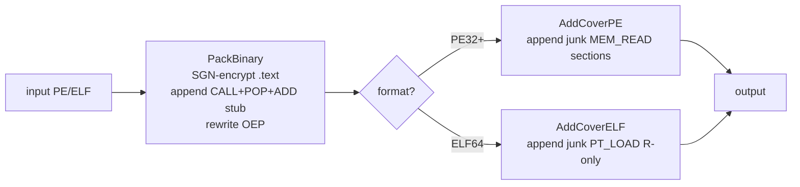

# Worked example — UPX-style packer + cover layer

[← examples index](README.md) · [docs/index](../index.md)

## Goal

Take a compiled Go static-PIE Linux ELF (or Windows PE32+),
produce a single self-contained binary the kernel loads
normally but whose `.text` is encrypted at rest. Optionally
chain a static-analysis cover layer that inflates the binary
with junk sections of mixed entropy.

This is the v0.61.0 ship of [`pe/packer.PackBinary`][pkg]. It
replaces the broken `v0.59.0` / `v0.60.0` architecture (host
wrapper + stage 2 Go EXE); see
[`.dev/refactor-2026/KNOWN-ISSUES-1e.md`][kn] for the
post-mortem.

[pkg]: https://pkg.go.dev/github.com/oioio-space/maldev/pe/packer#PackBinary
<!-- ref [kn] removed (linked .dev/ planning doc) -->

## What's in the chain



Three layers, all pure-Go, no cgo, no external tools:

1. **`PackBinary`** — encrypts the input's `.text` with the SGN
   polymorphic encoder, appends a small CALL+POP+ADD-prologue
   decoder stub as a new section, rewrites the entry point.
   Output is single-binary; the kernel handles loading.
2. **`ApplyDefaultCover`** — auto-detects PE vs ELF and appends
   3 junk sections (mixed Random / Pattern / Zero fill) with
   randomized legit-looking names. Defeats fingerprint matchers
   that rely on exact section count + offset.
3. **(Optional)** further `AddCoverPE` / `AddCoverELF` calls
   with operator-supplied `CoverOptions` for fine-grained cover
   tuning.

## Code

```go
package main

import (
    "fmt"
    "os"
    "time"

    "github.com/oioio-space/maldev/pe/packer"
)

func main() {
    if len(os.Args) != 3 {
        fmt.Println("usage: packer-example <input> <output>")
        os.Exit(2)
    }

    payload, err := os.ReadFile(os.Args[1])
    if err != nil {
        fmt.Printf("read input: %v\n", err)
        os.Exit(1)
    }

    // 1. UPX-style transform — encrypt .text, embed stub, rewrite OEP.
    //    Format auto-detection is left to the operator: pick PE for
    //    Windows targets, ELF for Linux. Stage1Rounds=3 is the
    //    ship-tested baseline (more rounds = larger stub + slower
    //    decrypt; few enough rounds to keep the stub under 4 KiB).
    format := packer.FormatLinuxELF
    if isPE(payload) {
        format = packer.FormatWindowsExe
    }
    packed, _, err := packer.PackBinary(payload, packer.PackBinaryOptions{
        Format:       format,
        Stage1Rounds: 3,
        Seed:         time.Now().UnixNano(),
    })
    if err != nil {
        fmt.Printf("PackBinary: %v\n", err)
        os.Exit(1)
    }

    // 2. Cover layer — three junk sections at randomized names +
    //    mixed entropy fills. v0.62.0 lifted the Go static-PIE
    //    limitation: ApplyDefaultCover now succeeds for ELF inputs
    //    by relocating the PHT to file-end when no in-place slack
    //    exists. The graceful-degrade fallback handles any
    //    unexpected edge-cases.
    out := packed
    if covered, err := packer.ApplyDefaultCover(packed, time.Now().UnixNano()); err == nil {
        out = covered
    } else {
        fmt.Printf("(skipping cover layer: %v)\n", err)
    }

    if err := os.WriteFile(os.Args[2], out, 0o755); err != nil {
        fmt.Printf("write output: %v\n", err)
        os.Exit(1)
    }
    fmt.Printf("wrote %d bytes to %s\n", len(out), os.Args[2])
}

func isPE(b []byte) bool {
    return len(b) >= 2 && b[0] == 'M' && b[1] == 'Z'
}
```

## Run it

```bash
# Build the example.
go build -o /tmp/packer-example ./examples/upx-style-packer

# Pack a Go static-PIE ELF.
go build -buildmode=pie -o /tmp/hello hello/main.go
/tmp/packer-example /tmp/hello /tmp/hello.packed
chmod +x /tmp/hello.packed
/tmp/hello.packed   # runs as if unpacked
```

## Verify

```bash
# Sections / segments grew.
readelf -lW /tmp/hello.packed | grep -c LOAD       # > original

# .text bytes are no longer plaintext.
xxd /tmp/hello.packed | head -200                   # no Go strings

# But the binary still runs to clean exit.
echo $?                                             # 0
```

## Multi-seed correctness

`v0.61.1` fixed a register-clobber bug that made `PackBinary`
silently produce non-runnable binaries for ~85% of seeds (only
`Seed: 1` and `Seed: 2` happened to dodge it). The root cause:
the per-round register allocator was allowed to pick `R15`,
which the CALL+POP+ADD prologue uses to carry the runtime
`.text` address. When a round took `R15` as its key/counter
register, that address was clobbered and the decoder loop
dereferenced the encryption key as a pointer. Multi-seed E2E
test (`TestPackBinary_LinuxELF_MultiSeed`) packs and runs eight
seeds end-to-end on every push.

If you observe a clean exit with `Seed: 1` but a SIGSEGV with
`time.Now().UnixNano()`, you are running pre-v0.61.1 — upgrade.

## Hardening dials

Three swap-points the operator can flip without re-architecting:

| Knob | Default | Tighten with |
|---|---|---|
| Per-build determinism | `time.Now().UnixNano()` seed | Hard-code a seed for reproducible packed output (CI builds, hash-based release artifacts) |
| Cover entropy profile | mixed Random/Pattern/Zero | Author your own `CoverOptions` with all-`JunkFillPattern` for a flat-entropy histogram, or all-`JunkFillRandom` to overwhelm % thresholds |
| Stub round count | 3 | 5–7 rounds for stronger polymorphism (each round randomizes substitution + register choice) at the cost of stub size |

## Limitations

Honest reading of where this technique **stops working**:

- **OEP must lie inside `.text`.** Custom-linker outputs that
  start in another section return `ErrOEPOutsideText`. Most
  Go / C / Rust toolchains comply.
- **TLS callbacks reject.** The transform refuses inputs with
  a populated TLS Data Directory because TLS callbacks run
  before OEP and would touch encrypted bytes.
- **ELF cover layer PHT-slack constraint lifted (v0.62.0).** Go
  static-PIE binaries (first PT_LOAD at file offset 0) previously
  caused `AddCoverELF` / `ApplyDefaultCover` to return
  `ErrCoverSectionTableFull`. The cover layer now relocates the
  PHT to file-end; the packed binary still runs to clean exit.
- **UPX-like single-binary signature.** The CALL+POP+ADD
  prologue + small entry-rewriting stub matches a well-known
  shape. Detection-engineering signal: medium-high. Per-build
  variance comes from the SGN engine (substitution + register +
  junk insertion), but the structural shape is constant.
- **Fake imports shipped (v0.63.0).** `ApplyDefaultCover` now
  chains `AddFakeImportsPE` for PE32+ inputs, adding
  kernel32/user32/shell32/ole32 `IMAGE_IMPORT_DESCRIPTOR` entries.
  A static analyzer walking `DataDirectory[1]` sees the full
  merged import table including the fakes.

## See also

- [`pe/packer` tech md](../techniques/pe/packer.md) — full
  API Reference for `PackBinary`, `AddCoverPE`/`ELF`,
  `DefaultCoverOptions`, `ApplyDefaultCover`.
- ``.dev/refactor-2026/packer-design.md`` (internal: `.dev/packer-design.md`)
  — three-phase design rationale + capability matrix.
- ``.dev/refactor-2026/KNOWN-ISSUES-1e.md`` (internal: `.dev/KNOWN-ISSUES-1e.md`)
  — v0.59.0 / v0.60.0 architectural gap post-mortem.
- [Phase 1f reflective loader](../techniques/pe/packer.md) —
  alternate operator path that DOES use `pe/packer/runtime`
  for in-process reflective load (separate from this example's
  kernel-loaded UPX-style flow). See the `runtime.LoadPE` row
  in the TL;DR table.
