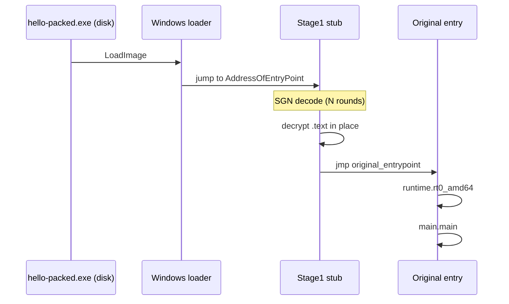

# Your first packed payload

> **5-step tutorial.** Each step produces a tangible artefact you
> can inspect. By the end you'll have packed a Go EXE with SGN+LZ4,
> watched it run, and seen what the unpacked vs packed binaries
> look like side-by-side.
>
> **Audience:** anyone who has Go ≥1.21 installed and 5 minutes.
> **Prerequisites:** none beyond the Go toolchain.

This is a tutorial in the [Diátaxis](https://diataxis.fr/) sense —
it teaches by hand-holding. If you already know what you want and
need a recipe, the [Cookbook](../examples/upx-style-packer.md) is
the page you want.

## Step 1 — clone and verify

```bash
git clone https://github.com/oioio-space/maldev
cd maldev
go build ./...
```

✅ **You should see:** silence (no errors). The whole module
compiled. If it fails, your Go is older than 1.21 — `go version`
to check.

## Step 2 — build a tiny victim binary

We'll pack a one-liner Go program. Make a scratch file:

```bash
mkdir -p /tmp/firstpack
cat > /tmp/firstpack/hello.go <<'GO'
package main
import "fmt"
func main() { fmt.Println("hello from a packed binary!") }
GO
GOOS=windows GOARCH=amd64 go build -o /tmp/firstpack/hello.exe /tmp/firstpack/hello.go
ls -la /tmp/firstpack/hello.exe
```

✅ **You should see:** `hello.exe` weighing ~1.8 MB. That's the
input.

## Step 3 — pack it

Use the `packer` CLI (operator-facing binary under `cmd/packer/`).

```bash
go run ./cmd/packer \
    -in /tmp/firstpack/hello.exe \
    -out /tmp/firstpack/hello-packed.exe \
    -rounds 3
ls -la /tmp/firstpack/hello-packed.exe
```

✅ **You should see:** a new `hello-packed.exe`, slightly larger
(stub + SGN-encrypted body). Roughly the same size — packing
doesn't compress by default, it encrypts the code section.

## Step 4 — verify it's actually different

```bash
sha256sum /tmp/firstpack/hello.exe /tmp/firstpack/hello-packed.exe
strings /tmp/firstpack/hello.exe       | grep -i "hello from" | head
strings /tmp/firstpack/hello-packed.exe | grep -i "hello from" | head
```

✅ **You should see:**
- Different sha256s (obviously).
- The plain binary leaks the string `hello from a packed binary!`.
- The packed binary doesn't (encrypted, recovered at runtime).

That's the core OPSEC win: static analysis of the packed binary
can't see your payload.

## Step 5 — run it on a Windows host

If you have a Windows VM (or any Win10+ host with the file
copied over):

```cmd
hello-packed.exe
```

✅ **You should see:** `hello from a packed binary!` printed on
stdout. The packed binary self-decrypts at runtime, jumps to the
original entry point, your program runs normally.

## What just happened



The stub at the new entry point peels off N rounds of
[SGN encoding](../techniques/pe/packer.md), restores the original
`.text` section in memory, then jumps to where the Go program
expected to start.

## Where to next

You now know how to:
- Build a maldev-managed binary.
- Pack it with the SGN+LZ4 stub.
- Verify the packing actually changed the on-disk artefact.

Pick a direction:

- **More packer modes?** → [Cookbook: UPX-style packer + cover](../examples/upx-style-packer.md)
- **Inject a payload elsewhere?** → [Cookbook: Evasive injection](../examples/evasive-injection.md)
- **Understand the architecture?** → [Concepts: Architecture](../architecture.md)
- **Find a specific technique?** → [Techniques](../techniques/) — per-package reference.

If you want the *full chain* (encrypt → evasion → inject → cleanup)
walk through the [Full chain cookbook entry](../examples/full-chain.md).
