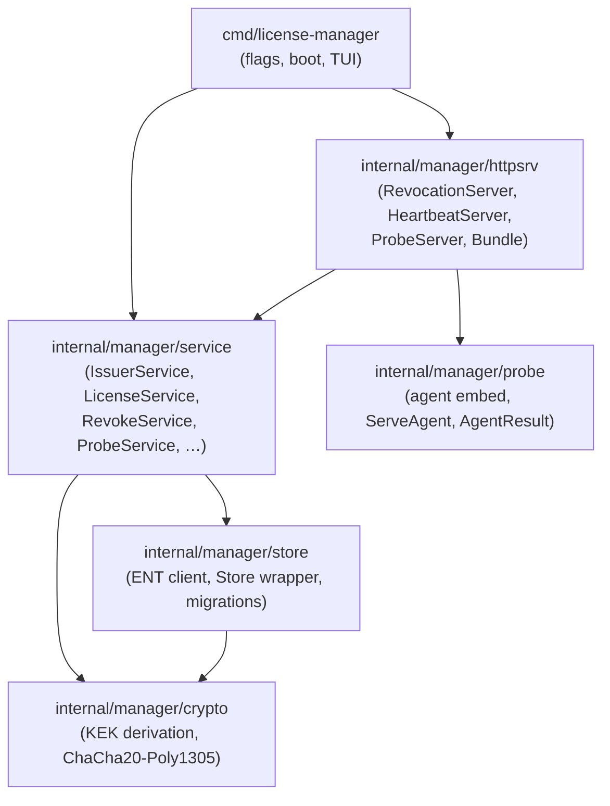
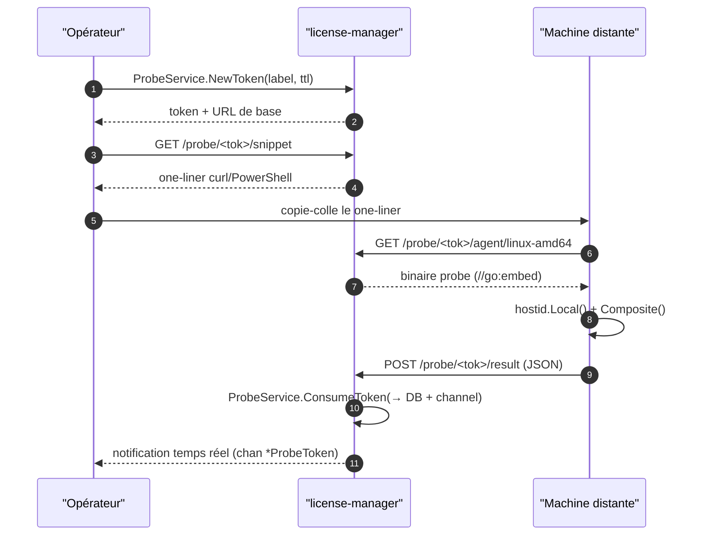

# License Manager — Concepts

Cette page décrit l'architecture du `license-manager`, son modèle de données, et ses mécanismes de sécurité. Pour les recettes opérationnelles, va directement au [Cookbook](./workflow.md).

## Vue d'ensemble

Le `license-manager` est un outil local-first en ligne de commande (TUI bubbletea en préparation) qui centralise le cycle de vie complet des licences de recherche maldev sans quitter le terminal. Il s'appuie sur le package `license/` pour l'émission et la vérification cryptographique, et y ajoute une couche de persistance (SQLite + chiffrement colonne), trois serveurs HTTP optionnels, et un mécanisme de _fingerprint probe_ pour obtenir le `hostid` d'une machine distante.

Le manager est un **outil opérateur**, pas une primitive défensive : il n'a pas d'entrée MITRE ATT&CK. Il vit dans `cmd/license-manager/` et son backend dans `internal/manager/`.

L'API backend est exposée via `*service.Services`. La TUI et tout autre frontend consomment ce struct — ils ne touchent jamais directement la couche store ni la crypto.

## Architecture en couches



| Couche | Rôle | Dépendances |
|--------|------|-------------|
| `crypto` | KDF (Argon2id) + AEAD (ChaCha20-Poly1305) | `golang.org/x/crypto` |
| `store` | Persistance SQLite via ENT, migrations auto | `crypto`, `entgo.io/ent`, `modernc.org/sqlite` |
| `service` | Logique métier, audit trail atomique | `store`, `crypto`, `license/*` |
| `httpsrv` | Serveurs HTTP startables/stoppables à chaud | `service`, `probe` |
| `cmd` | Boot, résolution passphrase, wiring, TUI | tout ce qui précède |

## Chiffrement au repos

La passphrase de l'opérateur ne touche jamais la DB. Elle sert uniquement à dériver une **KEK** (Key Encryption Key) via Argon2id.

```
passphrase + kek_salt (16 octets, stocké en clair dans Setting)
    → Argon2id(time=3, memory=64 MiB, threads=4, keylen=32)
    → KEK (32 octets, en RAM uniquement)
```

La KEK sert ensuite à envelopper les secrets colonne par colonne avec **ChaCha20-Poly1305** :

```
[12 octets nonce aléatoire] || [ciphertext] || [16 octets AEAD tag]
```

### Colonnes chiffrées

| Table | Colonne | Contenu |
|-------|---------|---------|
| `Issuer` | `encrypted_priv` | clé privée Ed25519 (64 octets) |
| `RecipientKey` | `encrypted_priv` | clé privée X25519 (32 octets) |
| `TOTPSecret` | `encrypted_secret` | secret TOTP base32 |
| `ServerConfig` | `revocation_admin_token_enc` | token admin du serveur de révocation |

### Colonnes en clair

Tout le reste : PEM de licences, sujets, résultats probe, identités, audit events. Raisonnement : ces données peuvent être reconstruites depuis les licences émises et ne permettent pas de forger de nouvelles licences.

### Canary de vérification

Un bloc `Setting.kek_canary = KEK.Wrap(random32)` est écrit à la création de la DB. À chaque démarrage, on tente `KEK.Unwrap(canary)` — si ça échoue, la passphrase est mauvaise. Trois tentatives, puis exit.

La KEK est effacée (zéro mémoire) à l'arrêt propre via `KEK.Wipe()`.

## Cycle de démarrage

La résolution de la passphrase suit une cascade stricte. Dès qu'une source fournit une valeur non vide, les suivantes sont ignorées :

```
1. flag --passphrase-file <chemin>   → lire le fichier, trim whitespace
2. env MALDEV_MGR_PASSPHRASE_FILE    → lire le fichier indiqué par la var
3. env MALDEV_MGR_PASSPHRASE         → valeur directe
4. (v2) OS keystore (DPAPI / Keychain / libsecret)
5. fallback : prompt interactif TUI (modal masqué)
```

Si la DB n'existe pas encore, le wizard de première utilisation se déclenche : choix passphrase, génération du sel KEK, stockage du canary, création du premier Issuer.

Si la DB existe, on vérifie immédiatement le canary. Échec = mauvaise passphrase.

## Les trois serveurs HTTP

Tous sont **OFF par défaut**. Chaque serveur doit être démarré explicitement par l'opérateur (via TUI ou `SettingsService.UpdateServerConfig`). Confirmation requise si des serveurs tournent à la fermeture (configurable via `Setting.confirm_quit_with_servers`).

| Serveur | Port défaut | Endpoints principaux | Rôle |
|---------|-------------|----------------------|------|
| Revocation | `:8443` | `GET /revoked.pem` | Publie la CRL signée par l'issuer actif |
| Heartbeat | `:8444` | `GET /heartbeat` | Répond `ok: true` si la licence est active |
| Probe | `:8445` | `GET /probe/<tok>/agent[/<os-arch>]`<br/>`GET /probe/<tok>/snippet`<br/>`POST /probe/<tok>/result` | Distribue l'agent fingerprint et reçoit les résultats |

Les trois implémentent l'interface `httpsrv.Server` :

```go
type Server interface {
    Name()   string
    Start(ctx context.Context) error
    Stop(timeout time.Duration) error
    Status() Status
    Events() <-chan Event
}
```

`Bundle.MergedEvents()` agrège les trois canaux `Events()` en un seul pour la TUI.

## Fingerprint probe

Le fingerprint probe permet à l'opérateur d'obtenir le `hostid.Local()` et `hostid.Composite()` d'une machine distante sans y installer d'outil permanent.



Les binaires agent sont compilés à l'avance pour 5 cibles (linux-amd64, linux-arm64, darwin-amd64, darwin-arm64, windows-amd64) et embarqués via `//go:embed`. L'agent lui-même fait ~80 lignes de Go : collecte les fingerprints, POST le JSON, exit.

One-liner distribué par `/snippet` :

```bash
# Linux / macOS
URL="https://<manager>:<port>/probe/<token>"
curl -fsSL "$URL/agent/$(uname -s | tr A-Z a-z)-$(uname -m | sed 's/x86_64/amd64/;s/aarch64/arm64/')" \
  -o /tmp/maldev-probe && chmod +x /tmp/maldev-probe \
  && /tmp/maldev-probe "$URL/result"

# Windows PowerShell
$URL = "https://<manager>:<port>/probe/<token>"
Invoke-WebRequest "$URL/agent/windows-amd64" -OutFile $env:TEMP\maldev-probe.exe
& "$env:TEMP\maldev-probe.exe" "$URL/result"
```

## Modèle de données

10 entités ENT, schéma SQLite. Toutes les heures sont en UTC.

| Entité | Rôle | FK principales |
|--------|------|----------------|
| `Issuer` | Paire de clés Ed25519 + metadata | — |
| `License` | Licence émise (PEM + metadata) | `→ Issuer` |
| `Revocation` | Enregistrement de révocation | `→ License` (1:1) |
| `Identity` | 32 octets random pour identity pinning | — |
| `RecipientKey` | Paire X25519 pour sealed payload | — |
| `TOTPSecret` | Secret TOTP chiffré | `→ License` |
| `ProbeToken` | Token + résultat fingerprint probe | — |
| `ServerConfig` | Singleton (PK=1) — config des 3 serveurs | — |
| `Setting` | Singleton (PK=1) — préférences opérateur, KEK salt/canary | — |
| `AuditEvent` | Trace immuable de chaque mutation | index `target_id`, `created_at` |

Indexes notables sur `License` : `subject`, `status`, `not_after`, `identity_sha256`, `(issuer_id, status)`.

## Audit trail

Chaque méthode de service mutante écrit la ligne métier **et** un `AuditEvent` dans la même transaction SQLite. Il est impossible d'émettre, révoquer ou pivoter une clé sans laisser une trace.

Structure d'un événement :

```json
{
  "kind":        "license.issue",
  "target_kind": "License",
  "target_id":   "<uuid>",
  "actor":       "mathieu",
  "payload":     { "subject": "alice@example.com", "not_after": "2026-12-31T00:00:00Z" },
  "created_at":  "2026-05-20T14:00:00Z"
}
```

`kind` suit le format `<entité>.<action>` : `license.issue`, `license.revoke`, `issuer.create`, `issuer.retire`, `issuer.rotate`, `identity.create`, `probe.token_created`, `probe.result`, etc.

## Voir aussi

- [Cookbook (recettes)](./workflow.md)
- [Configuration](./configuration.md)
- [License framing — Concepts](../license/concepts.md)
- [Threat model](../license/threat-model.md)
