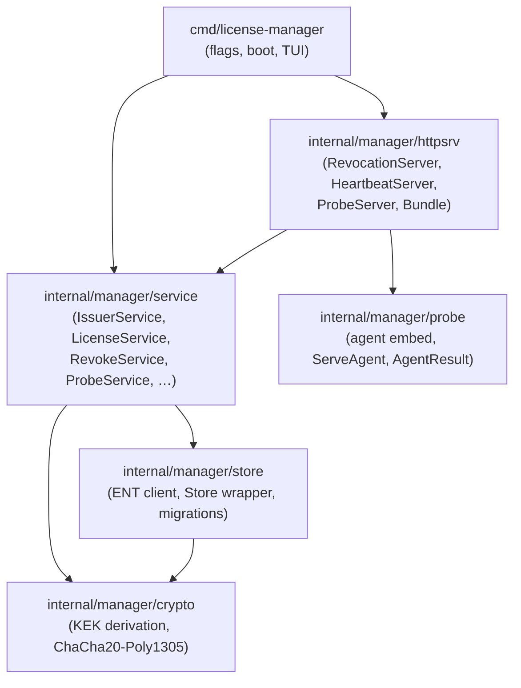
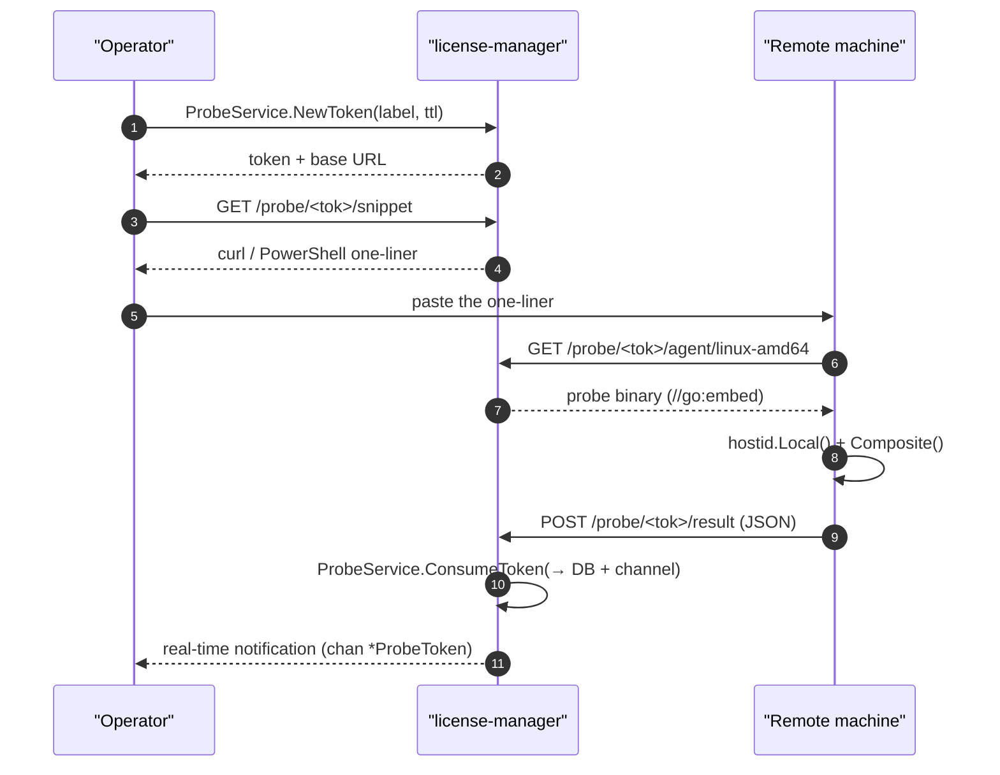

# License Manager — Concepts

This page describes the architecture of `license-manager`, its data
model, and its security mechanisms. For operational recipes, jump
straight to the [Cookbook](./workflow.md). For runnable code, see
[`examples/license-manager/`](../../examples/license-manager/).

## Concept index

Each notion below has a dedicated page that links back here AND to
the example program that exercises it:

| Notion | Page | Demonstrated in |
|---|---|---|
| Issuer (Ed25519 signing key) | [concepts/issuer.md](./concepts/issuer.md) | [01-issue-basic](../../examples/license-manager/01-issue-basic/) |
| KEK & passphrase cascade | [concepts/kek-passphrase.md](./concepts/kek-passphrase.md) *(coming)* | — |
| Bindings (machine / password / TOTP) | [concepts/bindings.md](./concepts/bindings.md) *(coming)* | `02-issue-with-bindings` *(coming)* |
| CRL (Certificate Revocation List) | [concepts/crl.md](./concepts/crl.md) *(coming)* | `03-revoke-and-crl` *(coming)* |
| Audit chain | [concepts/audit-chain.md](./concepts/audit-chain.md) *(coming)* | every example |
| Argon2id preset | [concepts/argon-preset.md](./concepts/argon-preset.md) *(coming)* | `02-issue-with-bindings` |
| Sealed payload (X25519) | [concepts/sealed-payload.md](./concepts/sealed-payload.md) *(coming)* | `07-sealed-payload` *(coming)* |
| Identity pin (host SHA-256) | [concepts/identity-pin.md](./concepts/identity-pin.md) *(coming)* | `08-identity-pin` *(coming)* |

## Overview

`license-manager` is a local-first command-line tool (with a
bubbletea TUI) that centralises the full life cycle of maldev
research licences without leaving the terminal. It builds on the
[`license/`](../../license/) package for cryptographic issuance
and verification, then adds:

- A persistence layer (SQLite + per-column encryption).
- Three optional HTTP servers (revocation, heartbeat, probe).
- A *fingerprint probe* mechanism to capture the `hostid` of a
  remote machine.

The manager is an **operator tool**, not a defensive primitive —
it carries no MITRE ATT&CK ID. It lives in `cmd/license-manager/`
with the backend in `internal/manager/`.

The backend API is exposed via `*service.Services`. The TUI and
any other frontend consume this struct — they never touch the
store layer or crypto directly.

## Layered architecture



| Layer | Role | Dependencies |
|---|---|---|
| `crypto` | KDF (Argon2id) + AEAD (ChaCha20-Poly1305) | `golang.org/x/crypto` |
| `store` | SQLite persistence via ENT, auto-migrations | `crypto`, `entgo.io/ent`, `modernc.org/sqlite` |
| `service` | Business logic, atomic audit trail | `store`, `crypto`, `license/*` |
| `httpsrv` | Hot-startable / stoppable HTTP servers | `service`, `probe` |
| `cmd` | Boot, passphrase resolution, wiring, TUI | everything above |

## Encryption at rest

The operator's passphrase never touches the DB. It is used only
to derive a **KEK** (Key Encryption Key) through Argon2id.

```
passphrase + kek_salt (16 bytes, stored in plaintext in Setting)
    → Argon2id(time=3, memory=64 MiB, threads=4, keylen=32)
    → KEK (32 bytes, in RAM only)
```

The KEK then wraps each sensitive column with **ChaCha20-Poly1305**:

```
[12-byte random nonce] || [ciphertext] || [16-byte AEAD tag]
```

### Encrypted columns

| Table | Column | Contents |
|---|---|---|
| `Issuer` | `encrypted_priv` | Ed25519 private key (64 bytes) |
| `RecipientKey` | `encrypted_priv` | X25519 private key (32 bytes) |
| `TOTPSecret` | `encrypted_secret` | TOTP secret (base32) |
| `ServerConfig` | `revocation_admin_token_enc` | Revocation-server admin token |

### Plaintext columns

Everything else — licence PEMs, subjects, probe results,
identities, audit events. Rationale: this data can be
reconstructed from the issued licences and cannot be used to
forge new ones.

### Canary check

A `Setting.kek_canary = KEK.Wrap(random32)` block is written when
the DB is created. On every startup we try `KEK.Unwrap(canary)` —
failure means the passphrase is wrong. Three attempts, then exit.

The KEK is zeroed (`KEK.Wipe()`) on a clean shutdown.

## Startup cycle

Passphrase resolution follows a strict cascade. The first source
that yields a non-empty value wins; later sources are ignored:

```
1. flag --passphrase-file <path>   → read file, trim whitespace
2. env MALDEV_MGR_PASSPHRASE_FILE  → read the file named by the var
3. env MALDEV_MGR_PASSPHRASE       → direct value
4. (v2) OS keystore (DPAPI / Keychain / libsecret)
5. fallback: interactive TUI prompt (masked modal)
```

If the DB does not yet exist, the first-launch wizard fires:
choose passphrase, generate KEK salt, store canary, create the
first issuer.

If the DB exists, the canary check runs immediately. Failure =
wrong passphrase.

## The three HTTP servers

All three are **OFF by default**. Each must be started explicitly
by the operator (TUI or `SettingsService.UpdateServerConfig`). A
confirmation modal fires on quit when one or more servers are
running (controlled by `Setting.confirm_quit_with_servers`); when
`Setting.stop_servers_on_exit` is on the manager auto-drains them
before `tea.Quit`.

| Server | Default port | Main endpoints | Role |
|---|---|---|---|
| Revocation | `:8443` | `GET /revoked.pem` | Publishes the CRL signed by the active issuer |
| Heartbeat | `:8444` | `GET /heartbeat` | Returns `ok: true` if the licence is active |
| Probe | `:8445` | `GET /probe/<tok>/agent[/<os-arch>]`<br/>`GET /probe/<tok>/snippet`<br/>`POST /probe/<tok>/result` | Distributes the fingerprint agent and collects results |

All three implement the `httpsrv.Server` interface:

```go
type Server interface {
    Name()   string
    Start(ctx context.Context) error
    Stop(timeout time.Duration) error
    Status() Status
    Events() <-chan Event
}
```

`Bundle.MergedEvents()` fans the three event channels into one
for the TUI.

## Fingerprint probe

The fingerprint probe lets the operator capture `hostid.Local()`
and `hostid.Composite()` from a remote machine without leaving a
permanent tool installed there.



Agent binaries are pre-built for 5 targets (linux-amd64,
linux-arm64, darwin-amd64, darwin-arm64, windows-amd64) and
embedded via `//go:embed`. The agent itself is ~80 lines of Go:
collect the fingerprints, POST the JSON, exit.

One-liner served by `/snippet`:

```bash
# Linux / macOS
URL="https://<manager>:<port>/probe/<token>"
curl -fsSL "$URL/agent/$(uname -s | tr A-Z a-z)-$(uname -m | sed 's/x86_64/amd64/;s/aarch64/arm64/')" \
  -o /tmp/maldev-probe && chmod +x /tmp/maldev-probe \
  && /tmp/maldev-probe "$URL/result"

# Windows PowerShell
$URL = "https://<manager>:<port>/probe/<token>"
Invoke-WebRequest "$URL/agent/windows-amd64" -OutFile $env:TEMP\maldev-probe.exe
& "$env:TEMP\maldev-probe.exe" "$URL/result"
```

## Data model

11 ENT entities, SQLite schema. All times are UTC.

| Entity | Role | Main FKs |
|---|---|---|
| `Issuer` | Ed25519 key pair + metadata | — |
| `License` | Issued licence (PEM + metadata) | `→ Issuer` |
| `Revocation` | Revocation record | `→ License` (1:1) |
| `Identity` | 32 random bytes for identity pinning | — |
| `RecipientKey` | X25519 pair for sealed payloads | — |
| `TOTPSecret` | Encrypted TOTP secret | `→ License` |
| `ProbeToken` | Token + fingerprint-probe result | — |
| `ServerConfig` | Singleton (PK=1) — three servers' config | — |
| `Setting` | Singleton (PK=1) — operator preferences, KEK salt/canary | — |
| `AuditEvent` | Immutable trace of every mutation | indexes on `target_id`, `created_at` |

Notable `License` indexes: `subject`, `status`, `not_after`,
`identity_sha256`, `(issuer_id, status)`.

## Audit trail

Every mutating service method writes the business row **and** an
`AuditEvent` in the same SQLite transaction. It is impossible to
issue, revoke, or pivot a key without leaving a trace.

Event shape:

```json
{
  "kind":        "license.issue",
  "target_kind": "License",
  "target_id":   "<uuid>",
  "actor":       "mathieu",
  "payload":     { "subject": "alice@example.com", "not_after": "2026-12-31T00:00:00Z" },
  "created_at":  "2026-05-20T14:00:00Z"
}
```

`kind` follows the `<entity>.<action>` shape: `license.issue`,
`license.revoke`, `license.delete`, `license.supersede`,
`issuer.create`, `issuer.retire`, `issuer.delete`,
`identity.create`, `probe.token_created`, `probe.result`, …

## See also

- [Cookbook (recipes)](./workflow.md)
- [Configuration](./configuration.md)
- [Runnable examples](../../examples/license-manager/)
- [License framing — Concepts](../license/concepts.md)
- [Threat model](../license/threat-model.md)
