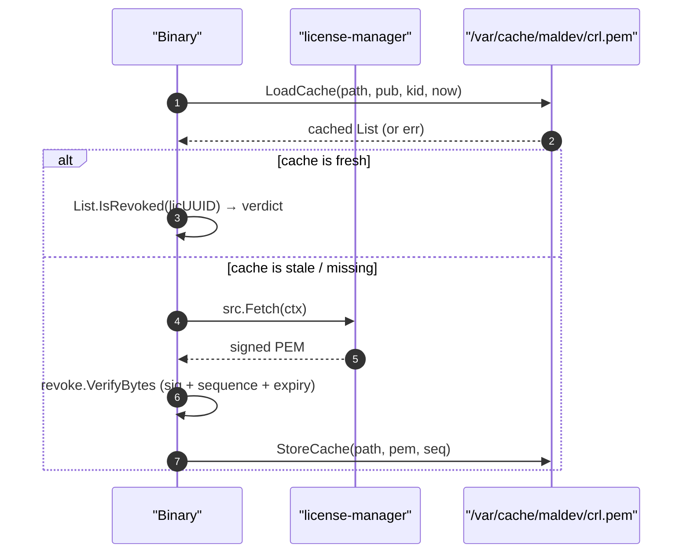

# CRL — Certificate Revocation List

> The **CRL** is a signed list of revoked licence UUIDs the
> manager publishes via `GET /revoked.pem`. A deployed binary
> fetches it at startup (or on a refresh cadence) and rejects
> any licence whose UUID is on the list — even though the
> licence's own signature is still valid.

## Why a separate list

A licence is signed at issue time and never modified. The
"signed PEM" cannot carry "revoked yet?" because revocation is
a runtime decision the issuer makes after the licence has
shipped. The CRL is the side-channel that lets the issuer say
"this UUID is dead" without re-issuing every licence.

## Anatomy of a signed CRL

[`revoke.List`](../../../license/revoke/list.go):

```go
type List struct {
    Version    int            // 1
    KeyID      string         // issuer that signed it
    Sequence   uint64         // strictly increasing; rejects downgrade
    IssuedAt   time.Time
    ExpiresAt  time.Time      // refuse to use past this
    ServerTime time.Time
    Revoked    []string       // licence UUIDs (canonical, flat)
    Entries    []Entry        // optional metadata: reason, RevokedAt
}
```

`Sign(list, priv)` produces the PEM, `VerifyBytes(pem, pub, kid)`
parses + checks the signature + the freshness invariants.

## Manager side: RevokeService

| Method | Role |
|---|---|
| `Revoke(ctx, id, reason, actor)` | Atomic: insert `Revocation` row + flip License status + audit. |
| `Unrevoke(ctx, id, actor)` | Reverse: drop the Revocation row + flip status active. |
| `ListRevoked(ctx)` | Read-only view used by the Revocation TUI screen. |
| `PublishSignedList(ctx, validFor)` | Build a fresh `revoke.List` from the current state, sign with the active issuer, return PEM. Cached for `validFor/2`; invalidated by every Revoke/Unrevoke. |

The HTTP revocation server (`internal/manager/httpsrv`) calls
`PublishSignedList` on every `GET /revoked.pem` request — the
cache means a quiet manager doesn't re-sign on every hit.

## Verifier side: license.WithRevocation

A binary in the field consults the CRL via a
[`revoke.RevocationSource`](../../../license/revoke/source.go):

```go
src := revoke.HTTPSource("https://manager:8443/revoked.pem", nil)
v, err := license.Verify(pem, trusted,
    license.WithRevocation(src, time.Hour, "/var/cache/maldev/crl.pem"),
)
```

- `src` — where to pull the CRL from. `HTTPSource`, `FileSource`,
  `EmbedSource`, or `MultiSource` (tries each in order).
- `refresh` — how often the binary will re-fetch.
- `cachePath` — optional disk cache so a binary surviving a
  manager outage keeps the last known CRL. The cache enforces a
  monotonic `Sequence` so a downgrade attack via a stale file is
  rejected.

If the source returns an error AND no usable cache, verify falls
back to the licence-only path (signature OK = accept). That
fail-open behaviour is opinionated — binaries that require
fail-closed should pass `WithGracePeriod(0)` and inspect the
returned error.

## Cache lifecycle



`Sequence` monotonicity is the key safety property: an attacker
that ships an OLD signed CRL (where the licence wasn't revoked
yet) cannot trick the cache into accepting it because the
on-disk file remembers the highest sequence the binary has ever
seen.

## Tested in

- [`examples/license-manager/03-revoke-and-crl/`](../../../examples/license-manager/03-revoke-and-crl/)
  — full round-trip: issue → revoke → publish → verify rejects
  with CRL / accepts without.
