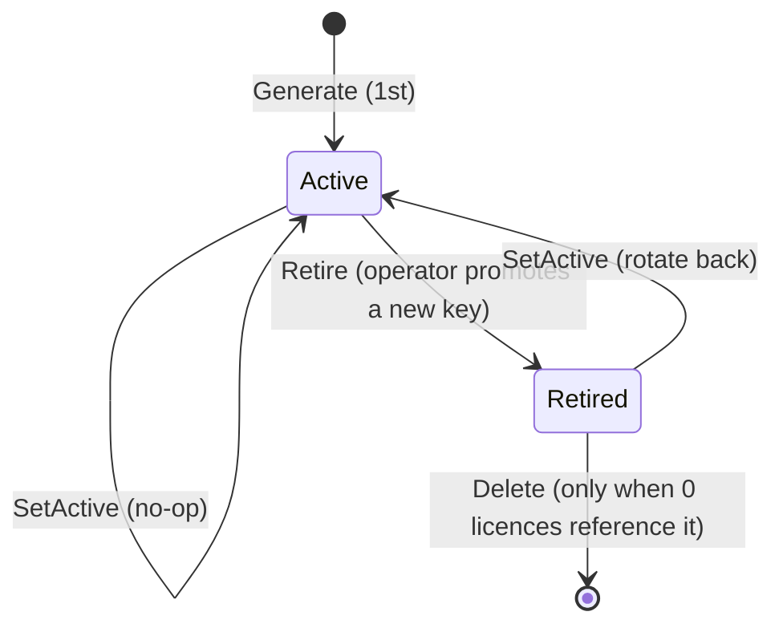

# Issuer

> An **issuer** is the Ed25519 key pair that signs licences. Every
> licence carries the `key-id` of the issuer that signed it; verify
> needs that issuer's public key to validate the signature.

## Glossary

| Term | Meaning |
|---|---|
| **Issuer** | A persisted `Issuer` row holding an Ed25519 key pair, a human name, a key-id, and a status (active / retired). |
| **Active issuer** | The single issuer whose private key is used to sign newly-issued licences and the CRL. Exactly zero or one row has `active = true` at any time. |
| **Key-id** | A short opaque string the operator chooses (e.g. `prod-2026-q2`). The same string is embedded in every PEM the issuer signs and in the public-key PEM the verifying binary loads. The cryptographic signature does not depend on it — it is a routing label so a binary that trusts multiple issuers can pick the right public key per licence. |
| **Retired** | An issuer that is no longer the active signer but whose row stays so existing licences still verify. Retired issuers can be deleted only after every licence they signed is gone. |

## Where it lives

- Service: [`IssuerService`](../../../internal/manager/service/issuer.go)
- Schema: [`schema.Issuer`](../../../internal/manager/store/schema/issuer.go)
- TUI screen: `screen_issuers.go` (tab `[3]`)

## Lifecycle



Operations on the `Issuer` row are all atomic — every mutating
service method writes the row AND an `AuditEvent` in the same
SQLite transaction.

| Service method | Audit kind | Notes |
|---|---|---|
| `Generate(name, keyID, actor)` | `issuer.create` | New random Ed25519 pair, private key wrapped under the KEK. |
| `Import(name, keyID, privPEM, actor)` | `issuer.import` | Adopt a key that was generated outside the manager (e.g. on another instance). |
| `SetActive(id, actor)` | `issuer.set_active` | Flips the singleton flag in one transaction (clears all others first). |
| `Retire(id, actor)` *(planned)* | `issuer.retire` | Marks status=retired without deleting. |
| `Delete(id, actor)` | `issuer.delete` | Refuses if any licence references this issuer. Zeroes the wrapped private-key buffer before drop. |
| `ExportPublic(id)` | — | Marshals the public half as `MALDEV PUBLIC KEY` PEM (with the key-id header). This is the file the verifying binary loads. |
| `ExportPrivate(id)` | — | Marshals the decrypted private half. Treat the bytes as sensitive — anyone with them can sign new licences. |

## Why exactly one active issuer

The wizard, CRL publisher, and the re-issue flow all consult the
*active* issuer when they need to sign something. Allowing two
active rows would force a per-operation key-id choice; instead the
operator promotes a new issuer via `SetActive` and the old one
becomes retired in the same transaction. Existing licences keep
verifying — verify uses the licence's own key-id to pick the
public key, not the active flag.

## How verify picks the public key

The verifying binary loads a `Trusted` set:

```go
trusted := licensekg.Trusted{
    Keys: licensekg.SingleKey(keyID, pubKey),
    // …or licensekg.MultiKey for binaries that accept several issuers
}
```

When `licensekg.Verify(pem, trusted)` runs, it reads the
`key-id` field from the PEM header and looks the matching public
key up in `trusted.Keys`. A missing key-id → fail with a clear
"unknown issuer" error.

## Operator marker on the TUI

The active issuer row carries a `>>` ASCII marker in the
[`Issuers`] tab and inside the new-licence wizard's identity step.
The marker is ASCII-only so it renders identically across every
terminal/font combo — earlier iterations used `●` and `▶` which
some Windows consoles refused to draw, hiding the active row
entirely.

## Tested in

- [`examples/license-manager/01-issue-basic/`](../../../examples/license-manager/01-issue-basic/)
  — generates an issuer, signs one licence, exports the public key,
  verifies round-trip.
- Backend tests: `internal/manager/service/issuer_test.go` covers
  Generate / Import / SetActive / Delete (with the licences-still-
  reference-it guard).
