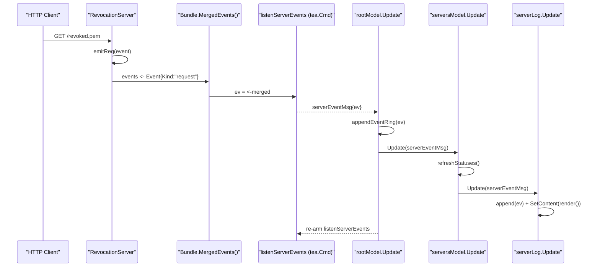

# Servers Screen — Operator Walkthrough

The **Servers screen** (tab `7`, key `7`) provides a real-time view of the three
HTTP servers bundled with license-manager — Revocation, Heartbeat, and Probe —
and lets the operator start or stop each one individually or all at once.

## Layout overview

```
┌──────────────────────────────────────────────────────────────────────────────┐
│  [A] Start all   [Z] Stop all   s=start  S=stop  c=clear log  1-4=filter    │
├──────────────────┬───────────────────┬──────────────────────────────────────┤
│  revocation      │  heartbeat        │  probe                               │
│  ┌────┐          │  ┌────┐           │  ┌─────┐                             │
│  │ ON │          │  │ ON │           │  │ OFF │                             │
│  └────┘          │  └────┘           │  └─────┘                             │
│  Addr: …:8443    │  Addr: …:8444     │  LastErr: bind: addr in use          │
│  Uptime: 5m 12s  │  Uptime: 3m 01s   │                                      │
│  Reqs:  42       │  Reqs:  7         │  Reqs: 0                             │
│  [s] Start  [S] Stop               [s] Start  [S] Stop                      │
├─────────────────────────────────────────────────────────────────────────────┤
│  Event log  [ all ] [ revocation ] [ heartbeat ] [ probe ]   c=clear        │
│  12:00:00  revocation    started   127.0.0.1:8443                           │
│  12:00:01  heartbeat     started   127.0.0.1:8444                           │
│  12:00:02  revocation    request   GET /revoked.pem  200  10.0.0.1:52000    │
│  12:00:03  probe         error     bind: address already in use             │
└─────────────────────────────────────────────────────────────────────────────┘
```

## Server cards

Each of the three server cards shows:

| Field | Notes |
|---|---|
| **Name** | `revocation`, `heartbeat`, or `probe` |
| **ON / OFF pill** | Green border when running, grey when stopped |
| **Addr** | TCP listen address once the server is bound |
| **Uptime** | Wall-clock time since the server was last started; `—` when stopped |
| **Reqs** | Cumulative request counter, never reset between start/stop cycles |
| **LastReq** | Wall-clock time of the most recent handled request (`HH:MM:SS`) |
| **LastErr** | Last error string, shown in red; absent when no error has occurred |

### Start / Stop buttons

Every card has two buttons:

- **`[s] Start`** — calls `Start(ctx, name)` on the controller; if the server
  is already running the underlying call returns an error which is pushed to the
  event log.
- **`[S] Stop`** — calls `Stop(name)` with a 5-second graceful drain; in-flight
  HTTP requests complete before the listener closes.

Mouse click on either button works when the program is launched with
`--mouse-cell-motion` (default in interactive mode).

## Global start / stop

- **`A`** — start all three servers simultaneously (batch parallel commands).
- **`Z`** — stop all three servers simultaneously.

Both keys are active only when the Servers screen is focused.

## Event log

The scrollable event log below the cards streams every lifecycle transition
and HTTP request from all three servers via `Bundle.MergedEvents()`.  Up to
**500 entries** are retained in memory; older events are evicted with
drop-oldest semantics.

### Log columns

```
HH:MM:SS  server-name   kind      detail
```

| Kind | Colour | Detail |
|---|---|---|
| `started` | Green | Listen address |
| `stopped` | Yellow | — |
| `request` | Dim | `METHOD /path STATUS remote-addr` |
| `error` | Red | Error string |

### Auto-scroll

The log auto-scrolls to the bottom as new events arrive.  Scrolling **up**
(mouse wheel or arrow keys) pauses auto-scroll so the operator can read
historical entries.  Scrolling back **down** re-enables it.

### Filtering

Click a chip or press `1`–`4` to filter the log:

| Key | Filter |
|---|---|
| `1` | All servers (default) |
| `2` | Revocation only |
| `3` | Heartbeat only |
| `4` | Probe only |

The filter applies to the live stream and to the retained ring buffer, so
switching filters instantly re-renders the full history.

Press **`c`** to clear the log (discards all retained entries).

## History across screen switches

The root model retains the last 500 events in an in-memory ring buffer.  When
the operator navigates away to another screen and returns, all buffered events
are replayed into the log so history is not lost.

## Event fan-in — sequence

The following diagram shows how a single HTTP request propagates from the
server goroutine to the TUI log widget.



The listener is a **self-rearming** `tea.Cmd`: after each delivery the root
model immediately re-issues `listenServerEvents(bundle)` so the next event is
picked up without spawning a persistent goroutine.  This model is safe with
bubbletea's single-threaded Update loop and exits cleanly when the merged
channel is closed at program shutdown.

## No new flags or environment variables

The Servers screen reads its data entirely from the live `httpsrv.Bundle`
wired at startup.  The listen addresses, TLS certs, and admin tokens are
configured via the existing settings stored in the database — see
[Configuration](configuration.md) for details.
