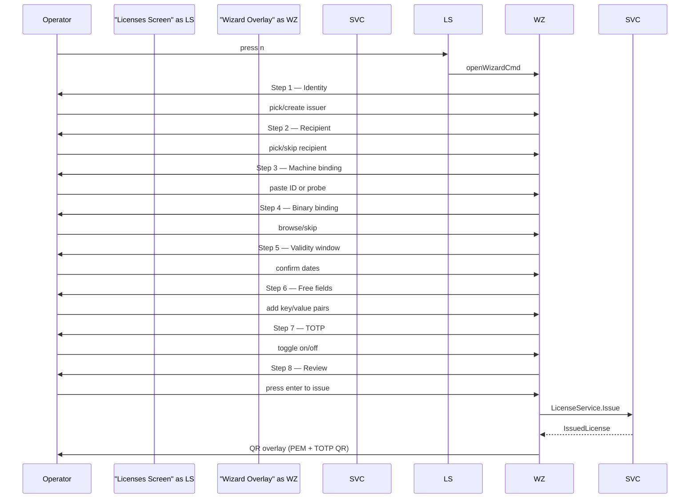
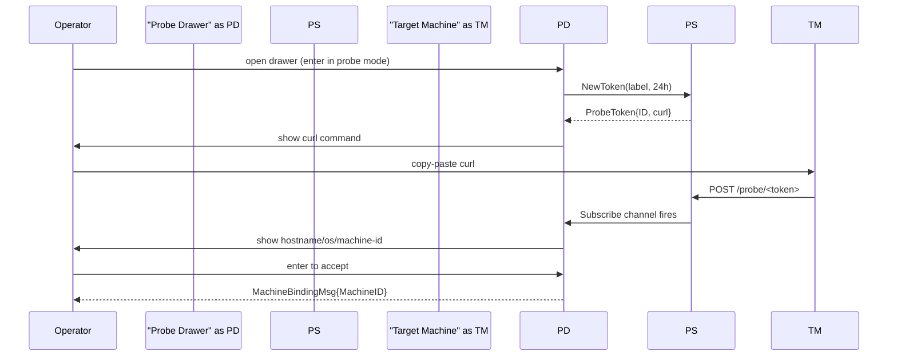

# New License Wizard — TUI Walkthrough

The **New License Wizard** is an 8-step guided flow for issuing a signed licence from the
`license-manager` terminal UI. Launch it from the **Licenses** screen by pressing `n` or
clicking the `+ New license` button.

## Overview



## Progress Breadcrumb

A breadcrumb bar at the top of the wizard shows all 8 step names. The current step is
highlighted in magenta; completed steps appear dimmed; future steps are muted.

```
 Identity › Recipient › Machine › Binary › Validity › Fields › TOTP › Review
```

`esc` steps back one step at any point. `q` on the Licenses screen cancels and returns.

---

## Step 1 — Identity

Pick the Ed25519 signing issuer for this licence, or create a new one.

```
Step 1 — Signing Identity
Pick an existing issuer or create a new Ed25519 signing key.

> prod-2026                      maldev-prod-01
  staging-2026                   maldev-staging-01
  + Create new issuer

  ↑/↓ navigate   enter select   n create new
```

**Create path:** press `n` or navigate to `+ Create new issuer` and hit enter. Two fields
appear: **Name** and **Key-ID**. `tab` moves between them; `enter` on the Key-ID field
generates the keypair via `IssuerService.Generate` and advances to step 2.

---

## Step 2 — Recipient

Pick the X25519 recipient key used to seal the embedded payload, or skip (no sealed
payload).

```
Step 2 — Recipient
Pick or create the X25519 recipient key for sealed payload delivery.

  acme-corp
  beta-tester-01
  — Skip (no sealed payload)
> + Create new recipient

  ↑/↓ navigate   enter select
```

Choosing **Skip** records an empty RecipientID — the licence will carry no sealed payload.

---

## Step 3 — Machine Binding (optional)

Bind the licence to a specific machine. Two sub-modes, toggled with `tab`:

```
Step 3 — Machine Binding (optional)
Bind this licence to a specific machine ID. Tab to switch input method.

  [Paste]

  Machine-ID hex:
  > deadbeefcafe0000...

  enter confirm   tab probe mode   s/esc skip
```

### Probe sub-mode

Pressing `tab` switches to **Probe target** mode. Pressing `enter` opens the
**Probe Drawer** (a slide-in overlay described below). The probe flow issues a
one-time token, shows a `curl` command to run on the target, and waits for the
agent callback.

---

## Step 4 — Binary Binding (optional)

Bind the licence to a specific binary by SHA-256 hash.

```
Step 4 — Binary Binding (optional)
Bind this licence to a specific binary by SHA-256 hash.

  Binary path:
  > /home/operator/builds/agent-v2.exe

  SHA-256: a3f9...c1d2

  enter hash/confirm   f file picker   s/esc skip
```

Press `f` or `enter` with an empty field to open the **File Picker** overlay. Once a file
is chosen, its SHA-256 is computed in a background goroutine and shown on screen.

---

## Step 5 — Validity Window

Set the `not-before` and `not-after` dates.

```
Step 5 — Validity Window
Set the not-before / not-after dates for this licence.

  Not before:
  > 2026-05-21

  Not after (or 'forever'):
  > 2027-05-21

  shortcuts: +7d  +30d  +1y  forever(0)
  tab switch field   enter confirm
```

**Shortcuts** (available when the end-date field is selected but not in typing mode):

| Key | Effect |
|-----|--------|
| `7` | now + 7 days |
| `3` | now + 30 days |
| `y` | now + 1 year |
| `f` | forever (year 9999) |

---

## Step 6 — Free Fields (optional)

Add arbitrary `key=value` metadata. Any number of rows; encoded into the licence
`Features` list as `key=value` strings.

```
Step 6 — Free Fields (optional)
Add arbitrary key/value metadata to this licence.

> env      =  prod
  customer =  acme

  tab next field   a add row   d delete row   enter/esc confirm
```

`a` adds a new row; `d` deletes the current row (minimum one row retained).

---

## Step 7 — TOTP Requirement

Toggle whether the licence requires a time-based one-time password at validation time.

```
Step 7 — TOTP Requirement
Require a time-based one-time password at validation time.

  [x] Require TOTP

  Select TOTP secret:
> maldev:acme-corp

  t toggle   ↑/↓ select secret   enter confirm
```

When enabled, the wizard adds a `BindingSpec{Type: "totp"}` to the `IssueRequest` and
`LicenseService.Issue` generates a fresh TOTP secret, wraps it under the KEK, and includes
provisioning QR artefacts in the `IssuedLicense` response.

---

## Step 8 — Review and Issue

A summary of all collected choices. Press `enter` or `i` to call `LicenseService.Issue`.

```
Step 8 — Review & Issue
Confirm all choices and press enter to sign the licence.

  Issuer ID:           00000000-0000-0000-0000-000000000001
  Recipient ID:        —
  Machine ID:          deadbeefcafe
  Binary SHA-256:      a3f9...c1d2
  Not before:          2026-05-21
  Not after:           2027-05-21
  Free fields:         env=prod
  Require TOTP:        no

  [ enter / i ]  Issue licence
  [ esc ]        Cancel
```

On success, the wizard closes and the **QR Overlay** appears.

---

## Probe Drawer

The probe drawer is a modal overlay that automates machine-ID collection from a target
host.

```
┌──────────────────────────────────────────────────────────────────────────┐
│ Probe Drawer                                                             │
│                                                                          │
│ Waiting for agent callback…                                              │
│                                                                          │
│ Run on the target machine:                                               │
│                                                                          │
│   curl -sf https://localhost:8080/probe/<token> | sh                     │
│                                                                          │
│ Token expires in 24 h.                                                   │
│                                                                          │
│ c copy   esc cancel                                                      │
└──────────────────────────────────────────────────────────────────────────┘
```

**Flow:**



Once the agent reports in, the drawer shows the resolved hostname, OS/arch, and composite
machine-ID. Press `enter` to use the machine-ID and advance, or `esc` to discard
(the token is revoked immediately on cancel).

---

## QR Overlay

After a successful `Issue` call, the QR overlay displays:

- ASCII-art QR codes for any TOTP provisioning secrets (one per TOTP binding).
- A scrollable PEM block of the signed licence.
- Save (`s`) and copy-to-clipboard (`c`) actions.

```
┌──────────────────────────────────────────────────────────────────────────┐
│ Licence Issued                                                           │
│                                                                          │
│ TOTP binding 1 — binding index 0                                        │
│ [QR ASCII art]                                                           │
│                                                                          │
│ PEM (↑/↓ scroll):                                                        │
│ -----BEGIN MALDEV LICENSE-----                                           │
│ eyJhbGci...                                                              │
│ -----END MALDEV LICENSE-----                                             │
│                                                                          │
│ s save   c copy PEM   esc/enter close                                    │
└──────────────────────────────────────────────────────────────────────────┘
```

The PEM file is saved to `~/licence-<uuid>.pem` with mode `0600`.

---

## File Picker Overlay

A lightweight directory navigator used by step 4 (binary binding).

```
┌────────────────────────────────────────────────────────────────┐
│ File Picker                                                    │
│   /home/operator/builds                                        │
│                                                                │
│   bin/                                                         │
│   lib/                                                         │
│ > agent-v2.exe                                                 │
│   agent-v2.pdb                                                 │
│                                                                │
│   ↑/↓ navigate   enter select/descend   ← up   esc cancel     │
└────────────────────────────────────────────────────────────────┘
```

Hidden files (dotfiles) are filtered. Directories appear first, coloured cyan with a
trailing `/`. Press `backspace` or `←` to navigate up. `esc` cancels without selecting.

---

## Key Bindings Summary

| Screen | Key | Action |
|--------|-----|--------|
| Licenses | `n` | Open wizard |
| Any step | `esc` | Back one step |
| Step 1/2 | `↑`/`↓` | Navigate list |
| Step 1/2 | `enter` | Select item |
| Step 3 | `tab` | Toggle paste/probe |
| Step 4 | `f` | Open file picker |
| Step 5 | `tab` | Switch date field |
| Step 5 | `7`/`3`/`y`/`f` | Duration shortcut |
| Step 6 | `a` / `d` | Add / delete row |
| Step 7 | `t` | Toggle TOTP |
| Step 8 | `enter` / `i` | Issue licence |
| Probe drawer | `c` | Copy curl command |
| QR overlay | `s` | Save PEM to disk |
| QR overlay | `c` | Copy PEM |
