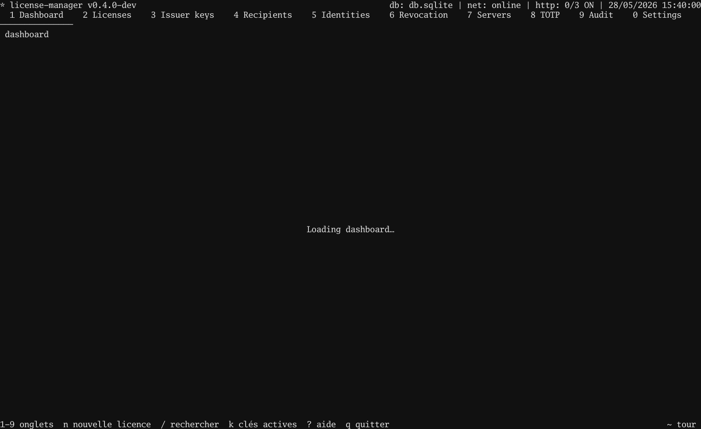

# Tutorial 01 — Issue a licence, verify it in your binary

> **Objectif** — produce a signed licence file and run a Go binary
> that accepts it.
> **Concepts** — Ed25519 signature · issuer key · `license.Verify`
> **Attendu** — the client prints `[ok] licence verified` with the
> subject; flipping any byte of the PEM makes it exit 1.

## In the TUI

1. `2` → Licences screen.
2. `n` → open the wizard.
3. Press `Enter` through every step (the defaults are fine for
   this tutorial — no bindings, 1-year validity).
4. On the last step, `Enter` again to sign.
5. Cursor lands on the new row. Press `E` → type
   `/tmp/alice.license` → `Enter`.
6. `3` → Issuer keys screen → press `E` on the active issuer →
   type `/tmp/issuer.pub` → `Enter`.

You now have two files: the licence PEM and the issuer's public
key.



## In your program

```go
package main

import (
    "log"
    "os"

    license "github.com/oioio-space/maldev/license"
)

func main() {
    licPEM, _ := os.ReadFile("/tmp/alice.license")
    pubPEM, _ := os.ReadFile("/tmp/issuer.pub")

    pub, kid, _ := license.ParsePublicKey(pubPEM)
    trusted := license.Trusted{Keys: license.SingleKey(kid, pub)}

    v, err := license.Verify(licPEM, trusted)
    if err != nil {
        log.Fatalf("license check failed: %v", err)
    }
    log.Printf("running for %s (expires %s)", v.Subject, v.NotAfter)
}
```

That's it. The runnable version is
[`examples/.../client/main.go`](https://github.com/oioio-space/maldev/tree/master/examples/license-manager/tutorials/01-issue-and-verify/client),
adds `flag` parsing.

## Test it together

```bash
go test ./examples/license-manager/tutorials/01-issue-and-verify
```

Renders the TUI tape AND runs the client against a real licence.
