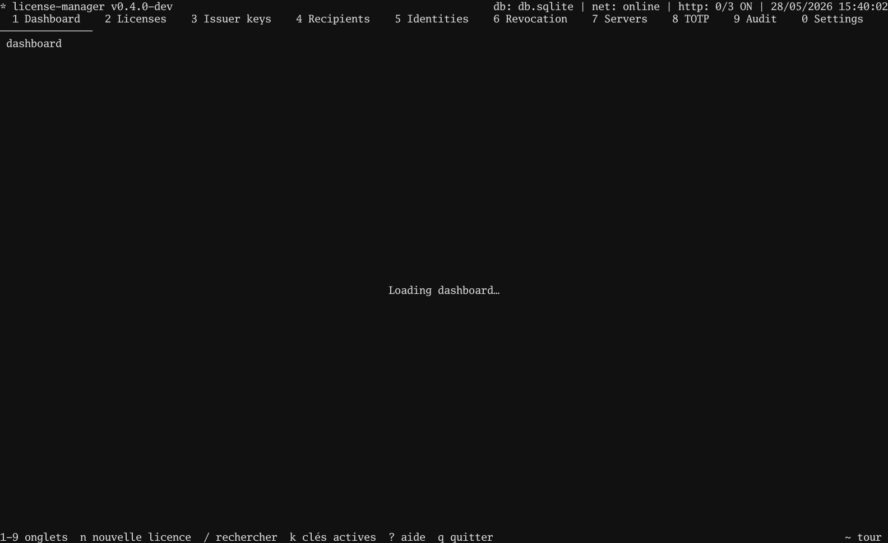

# Tutorial 02 — Bindings (machine + password + TOTP)

## In the TUI

1. `2` → Licences. `n` → wizard.
2. Step 3 (Machine): type `host-alpha` → `Enter`.
3. Step 5 (Validity): `Enter` for defaults.
4. Step 6 (FreeFields): type `subject=alice@example.com` → `Enter`.
5. Step 7 (TOTP): toggle ON → `Enter`.
6. Step 8 (Review): `Enter` to sign.
7. The post-issue overlay shows the **TOTP secret** and a 6-digit
   sanity code. Copy both — the secret goes to the licensee out
   of band.
8. `E` on the licence row → save `/tmp/alice.license`.
9. `3` → Issuers → `E` → save `/tmp/issuer.pub`.

The wizard captures the **password** evidence inline before
step 8 — type `hunter2` when it asks.



## In your program

```go
package main

import (
    "log"
    "os"

    license "github.com/oioio-space/maldev/license"
)

func main() {
    licPEM, _ := os.ReadFile("/tmp/alice.license")
    pubPEM, _ := os.ReadFile("/tmp/issuer.pub")

    pub, kid, _ := license.ParsePublicKey(pubPEM)
    trusted := license.Trusted{Keys: license.SingleKey(kid, pub)}

    // Collect all three pieces of evidence from your runtime.
    machine  := []byte("host-alpha")     // hostid.Composite() in production
    password := "hunter2"                // prompt the user
    totpCode := "123456"                 // also prompted; from Google Authenticator etc.

    v, err := license.Verify(licPEM, trusted,
        license.WithMachineID(machine),
        license.WithPassword(password),
        license.WithTOTPCode(totpCode),
    )
    if err != nil {
        log.Fatalf("license check failed: %v", err)
    }
    log.Printf("running for %s", v.Subject)
}
```

Missing or wrong evidence on ANY of the three → `err != nil`.
That's the security property — a leaked licence on a different
machine doesn't start.

Runnable client:
[`examples/.../02-bindings-and-verify/client`](https://github.com/oioio-space/maldev/tree/master/examples/license-manager/tutorials/02-bindings-and-verify/client).

## Test it together

```bash
go test ./examples/license-manager/tutorials/02-bindings-and-verify
```

The test issues a real bound licence and runs the client with
**full**, **missing**, and **wrong** evidence — proving the
"AND" semantics.
