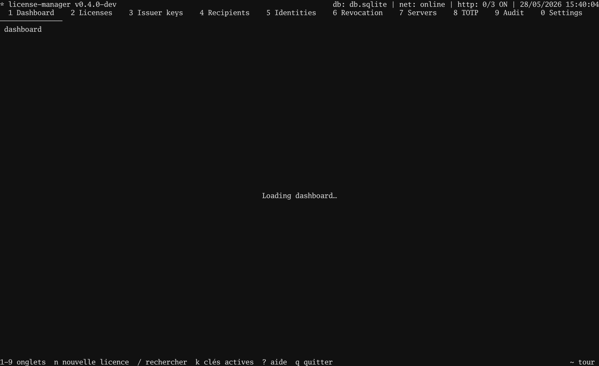

# Tutorial 03 — Revocation server + client that polls it

> **Objectif** — run the signed-CRL HTTP server in the TUI and have
> a client honour revocations the operator publishes live.
> **Concepts** — CRL · monotonic sequence (downgrade defence) ·
> `revoke.HTTPSource` · on-disk cache fallback
> **Attendu** — client accepts the licence; after the operator
> presses `r`, the next poll rejects it. With the manager offline,
> the cached CRL still enforces the last known revocations.

## In the TUI

1. `7` → Servers screen.
2. Cursor on **Revocation**, press `s` to start.
3. The row shows `running` and a `Listen` address such as
   `127.0.0.1:8443`. Copy it.
4. `2` → Licences. Issue a licence (any wizard path). Press `E`
   → `/tmp/alice.license` → `Enter`.
5. `3` → Issuers → `E` → `/tmp/issuer.pub` → `Enter`.

To revoke later: `2` → Licences → cursor on the row → `r` →
type a reason → `Enter`. The CRL re-publishes immediately.



## In your program

```go
package main

import (
    "log"
    "net/http"
    "os"
    "time"

    license "github.com/oioio-space/maldev/license"
    "github.com/oioio-space/maldev/license/revoke"
)

func main() {
    licPEM, _ := os.ReadFile("/tmp/alice.license")
    pubPEM, _ := os.ReadFile("/tmp/issuer.pub")

    pub, kid, _ := license.ParsePublicKey(pubPEM)
    trusted := license.Trusted{Keys: license.SingleKey(kid, pub)}

    src := revoke.HTTPSource(
        "http://127.0.0.1:8443/revoked.pem",
        &http.Client{Timeout: 5 * time.Second},
    )

    v, err := license.Verify(licPEM, trusted,
        license.WithRevocation(src, time.Hour, "/var/cache/myapp/crl.pem"),
    )
    if err != nil {
        log.Fatalf("license check failed: %v", err)
    }
    log.Printf("running for %s", v.Subject)
}
```

The `cachePath` matters: if the manager is offline, the client
replays the last signed CRL it saw. The CRL's monotonic
`Sequence` blocks stale-cache downgrade attacks.

Runnable client:
[`examples/.../03-revocation-server/client`](https://github.com/oioio-space/maldev/tree/master/examples/license-manager/tutorials/03-revocation-server/client).

## Test it together

```bash
go test ./examples/license-manager/tutorials/03-revocation-server
```

Boots a real CRL server, issues a licence, runs the client
(accepted), revokes via the TUI service, runs the client again
(rejected).
