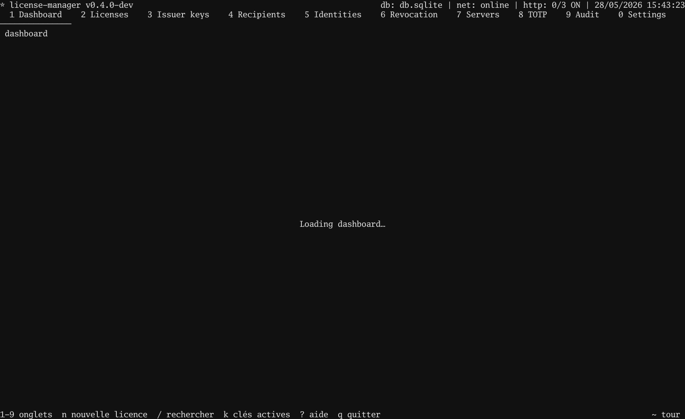

# Tutorial 04 — TOTP authenticator handoff

## In the TUI

1. `8` → TOTP screen.
2. `n` → mint a fresh secret. The new row is selected.
3. `Q` → pop the QR overlay. Hand your phone to the licensee
   and let them scan it into Google Authenticator / Authy /
   1Password / Yubico.
4. `Esc` to close the overlay.
5. Bind it to a licence: `2` → Licences → `n` → wizard, step 7
   (TOTP): pick the secret you just minted → `Enter`.
6. After signing, `E` → `/tmp/alice.license` → `Enter`.
7. `3` → Issuers → `E` → `/tmp/issuer.pub` → `Enter`.

The secret never leaves the manager DB — only the QR was
displayed, once.



## In your program

```go
package main

import (
    "bufio"
    "log"
    "os"
    "strings"

    license "github.com/oioio-space/maldev/license"
)

func main() {
    licPEM, _ := os.ReadFile("/tmp/alice.license")
    pubPEM, _ := os.ReadFile("/tmp/issuer.pub")

    pub, kid, _ := license.ParsePublicKey(pubPEM)
    trusted := license.Trusted{Keys: license.SingleKey(kid, pub)}

    // Prompt the user for the current 6-digit code.
    os.Stdout.WriteString("TOTP code: ")
    line, _ := bufio.NewReader(os.Stdin).ReadString('\n')
    code := strings.TrimSpace(line)

    v, err := license.Verify(licPEM, trusted, license.WithTOTPCode(code))
    if err != nil {
        log.Fatalf("license check failed: %v", err)
    }
    log.Printf("running for %s", v.Subject)
}
```

Wrong code → `err != nil`. The window tolerates ±30 s of clock
drift; outside that, the user retypes the current code.

Runnable client:
[`examples/.../04-totp-authenticator/client`](https://github.com/oioio-space/maldev/tree/master/examples/license-manager/tutorials/04-totp-authenticator/client).

## Test it together

```bash
go test ./examples/license-manager/tutorials/04-totp-authenticator
```

Renders the tape, issues a real TOTP-bound licence, runs the
client with both the live code (accepted) and `000000`
(rejected).
