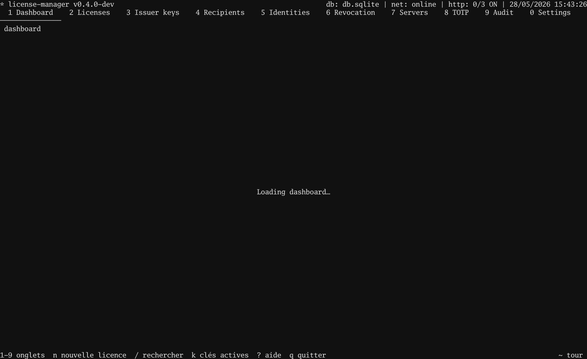

# Tutorial 05 — Sealed payload (X25519)

> **Objectif** — embed a per-licensee secret inside a licence so
> that only the targeted recipient's private key can read it.
> **Concepts** — X25519 sealed box · `seal.Open` · ciphertext is
> bound to the recipient public key, not just the licence
> **Attendu** — holder of the correct private key prints the
> plaintext; any other key → `seal.Open` errors and the binary
> exits 1.

The licence body is signed in the open, but a portion is
encrypted to a single recipient — only their private key reads
it.

## In the TUI

1. `4` → Recipients screen.
2. `n` → mint a fresh X25519 keypair. The new row is selected.
3. Note the recipient's `name` / `id` — the wizard will offer
   it as a target.
4. `2` → Licences → `n` → wizard.
5. Step 4 (Sealed payload): pick the recipient → type the
   payload bytes (or paste them) → `Enter`.
6. Confirm wizard → sign → `E` → `/tmp/alice.license` → `Enter`.
7. `3` → Issuers → `E` → `/tmp/issuer.pub` → `Enter`.

Ship the recipient's **private key** with the binary (embed,
sealed section, secrets manager — your call). Never ship it
alongside the licence in the same channel.



## In your program

```go
package main

import (
    "log"
    "os"

    license "github.com/oioio-space/maldev/license"
    "github.com/oioio-space/maldev/license/seal"
)

func main() {
    licPEM, _ := os.ReadFile("/tmp/alice.license")
    pubPEM, _ := os.ReadFile("/tmp/issuer.pub")
    priv, _ := os.ReadFile("/etc/myapp/recipient.x25519") // 32 raw bytes

    pub, kid, _ := license.ParsePublicKey(pubPEM)
    trusted := license.Trusted{Keys: license.SingleKey(kid, pub)}

    v, err := license.Verify(licPEM, trusted)
    if err != nil {
        log.Fatalf("license check failed: %v", err)
    }
    plain, err := seal.Open(priv, v.SealedPayload)
    if err != nil {
        log.Fatalf("sealed payload: %v", err)
    }
    log.Printf("payload: %s", string(plain))
}
```

`seal.Open` returns an error if `priv` is wrong, if the
ciphertext is tampered, or if the payload was sealed to a
different recipient.

Runnable client:
[`examples/.../05-sealed-payload/client`](https://github.com/oioio-space/maldev/tree/master/examples/license-manager/tutorials/05-sealed-payload/client).

## Test it together

```bash
go test ./examples/license-manager/tutorials/05-sealed-payload
```

Renders the tape, issues a sealed-payload licence, runs the
client with the correct private key (decrypts) and a wrong
one (rejected).
