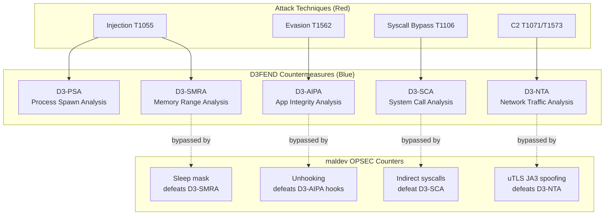

# MITRE ATT&CK + D3FEND Coverage

[← Back to README](../README.md)

## ATT&CK Techniques

| ATT&CK ID | Technique Name | Package(s) | D3FEND Countermeasure |
|-----------|---------------|------------|----------------------|
| T1016 | System Network Configuration Discovery | `recon/network` (interfaces, gateway, DNS, public IP), `win/domain` (paired use) | D3-NTPM (Network Traffic Pattern Matching) |
| T1027 | Obfuscated Files or Information | `evasion/sleepmask`, `pe/strip`, `crypto` (TEA/XTEA/ArithShift/SBox/MatrixTransform), `win/api` (PEB-walk hash imports) | D3-SMRA (System Memory Range Analysis) |
| T1027.002 | Software Packing | `pe/morph`, `pe/packer` — three pipelines: (1) `Pack`/`PackPipeline` encrypt-and-embed blob; (2) `PackBinary` v0.61.0 UPX-style in-place `.text` encryption + polymorphic decoder stub (single-binary output, kernel does loading); (3) `AddCoverPE`/`AddCoverELF` + `ApplyDefaultCover` anti-static-unpacker junk-section overlay; plus `pe/packer/runtime` (Windows x64 reflective loader) | D3-SEA (Static Executable Analysis) |
| T1027.007 | Dynamic API Resolution | `win/api` (Hell's/Halo's/Tartarus/HashGate resolvers), `win/syscall` (SSN gating chain) | D3-SCA (System Call Analysis) |
| T1027.013 | Encrypted/Encoded File | `crypto`, `encode` | D3-FCA (File Content Analysis) |
| T1036 | Masquerading | `evasion/stealthopen`, `evasion/callstack` (call-stack spoof metadata) | D3-FHA (File Hash Analysis) |
| T1036.005 | Masquerading: Match Legitimate Name or Location | `process/tamper/fakecmd` (self + remote via `SpoofPID`), `pe/masquerade` | D3-PLA (Process Listing Analysis) |
| T1047.001 | Boot or Logon Autostart Execution: Registry Run Keys | `persistence/registry` | D3-SBV (Service Binary Verification) |
| T1003.001 | OS Credential Dumping: LSASS Memory | `credentials/lsassdump` (producer — dump + PPL unprotect), `credentials/sekurlsa` (consumer — pure-Go MSV1_0 + Wdigest + Kerberos + DPAPI + TSPkg + CloudAP + LiveSSP + CredMan parser; PTH write-back into live lsass) | D3-PSA (Process Spawn Analysis), D3-SICA (System Image Change Analysis) |
| T1003.002 | OS Credential Dumping: Security Account Manager | `credentials/samdump` (offline SAM/SYSTEM hive dump — pure-Go REGF parser + boot-key permutation + AES/RC4 hashed-bootkey derivation + per-RID DES de-permutation; live mode via `reg save`) | D3-PSA (Process Spawn Analysis), D3-FCA (File Content Analysis on `reg save` artefacts) |
| T1550.002 | Use Alternate Authentication Material: Pass the Hash | `credentials/sekurlsa` (`Pass` / `PassImpersonate` — spawn under LOGON_NETCREDENTIALS_ONLY, NtWrite MSV + Kerberos hashes back into live lsass for the spawned LUID; SetThreadToken duplicate-token impersonation) | D3-PSA, D3-SICA |
| T1550.003 | Use Alternate Authentication Material: Pass the Ticket | `credentials/sekurlsa` (`KerberosTicket.ToKirbi` / `ToKirbiFile` — emit mimikatz-format KRB-CRED with replayable session key); `credentials/goldenticket` (`Submit` — LsaCallAuthenticationPackage(KerbSubmitTicketMessage)) | D3-NTA (Network Traffic Analysis on Kerberos AP-REQ patterns) |
| T1558.001 | Steal or Forge Kerberos Tickets: Golden Ticket | `credentials/goldenticket` (`Forge` — pure-Go PAC marshaling + KRB5 ticket signing with operator-supplied krbtgt key) | D3-NTA |
| T1053.005 | Scheduled Task/Job: Scheduled Task | `persistence/scheduler` | D3-SBV (Service Binary Verification) |
| T1055 | Process Injection | `inject` (15 methods), `process/tamper/herpaderping` (ModeHerpaderping + ModeGhosting; both work on Win10/Win11 ≤ 26100, blocked on Win11 26100+) | D3-PSA (Process Spawn Analysis) |
| T1055.001 | DLL Injection | `pe/srdi`, `inject/phantomdll` | D3-SICA (System Image Change Analysis) |
| T1055.003 | Thread Execution Hijacking | `inject` (ThreadHijack) | D3-PSA |
| T1055.004 | Asynchronous Procedure Call | `inject` (QueueUserAPC, EarlyBirdAPC, NtQueueApcThreadEx) | D3-PSA |
| T1055.012 | Process Hollowing | `inject` (SpawnWithSpoofedArgs) | D3-PSMD (Process Spawn Monitoring) |
| T1068 | Exploitation for Privilege Escalation | `privesc/cve202430088` (kernel TOCTOU race), `kernel/driver/rtcore64` (BYOVD IOCTL R/W) | D3-EAL (Exploit Activity Logging), D3-DLIC (Driver Load Integrity Checking) |
| T1078 | Valid Accounts | `win/privilege` (alt-creds spawn via Secondary Logon), `win/impersonate` (alt-creds → thread context swap) | D3-UAP (User Account Profiling) |
| T1056.001 | Input Capture: Keylogging | `collection/keylog` | D3-KBIM (Keyboard Input Monitoring) |
| T1057 | Process Discovery | `process/enum` | D3-PLA (Process Listing Analysis) |
| T1059 | Command and Scripting Interpreter | `c2/shell`, `c2/meterpreter`, `runtime/bof`, `runtime/pe` (in-process EXE / DLL) | D3-EFA (Executable File Analysis) |
| T1070 | Indicator Removal on Host | `cleanup/memory` | D3-SMRA |
| T1070.004 | File Deletion | `cleanup/selfdelete`, `cleanup/wipe` | D3-FRA (File Removal Analysis) |
| T1070.006 | Timestomp | `cleanup/timestomp` | D3-FHA (File Hash Analysis) |
| T1071.001 | Web Protocols | `c2/transport/malleable`, `c2/transport/namedpipe` | D3-NTA (Network Traffic Analysis) |
| T1082 | System Information Discovery | `win/domain`, `win/version` | D3-SYSIP (System Information Profiling) |
| T1083 | File and Directory Discovery | `recon/folder` | D3-FDA (File Discovery Analysis) |
| T1090.001 | Proxy: Internal Proxy | `c2/pivot/socks5` (forward SOCKS5v5 + RFC 1929 auth + RuleSet scope enforcement) | D3-NTA (Network Traffic Analysis), D3-PA (Process Analysis) |
| T1106 | Native API | `win/api` (PEB walk, API hashing), `win/syscall`, `win/ntapi`, `pe/imports` (import table enumeration) | D3-SCA (System Call Analysis) |
| T1113 | Screen Capture | `collection/screenshot` | D3-DA (Dynamic Analysis) |
| T1115 | Clipboard Data | `collection/clipboard` | D3-DA (Dynamic Analysis) |
| T1120 | Peripheral Device Discovery | `recon/drive` | D3-PDD (Peripheral Device Discovery) |
| T1134 | Access Token Manipulation | `win/token`, `win/privilege` | D3-TAAN (Token Auth Normalization) |
| T1134.001 | Token Impersonation/Theft | `win/impersonate`, `win/token`, `privesc/cve202430088` (`_EPROCESS.Token` swap) | D3-TAAN |
| T1134.002 | Create Process with Token | `process/session`, `win/privilege` (Secondary Logon path) | D3-TAAN |
| T1134.004 | Parent PID Spoofing | `c2/shell` (PPID spoofing chain), `win/impersonate` (RunAsTrustedInstaller lineage) | D3-PSA (Process Spawn Analysis) |
| T1136.001 | Create Account: Local Account | `persistence/account` | D3-UAP (User Account Profiling) |
| T1204.002 | User Execution: Malicious File | `persistence/lnk` | D3-EFA (Executable File Analysis) |
| T1497 | Virtualization/Sandbox Evasion | `recon/sandbox` | D3-DA (Dynamic Analysis) |
| T1497.001 | System Checks | `recon/antivm` — registry/file/NIC/DMI/process probes (`Detect`/`DetectAll`) + CPUID hypervisor stack (`Hypervisor`, `HypervisorPresent`, `HypervisorVendor`, `RDTSCDelta`) + Red Pill descriptor-table primitives (`SIDT`, `SGDT`, `SLDT`, `Probe`) | D3-DA |
| T1497.003 | Time Based Evasion | `recon/timing` | D3-DA |
| T1529 | System Shutdown/Reboot | `cleanup/bsod` | D3-DA (Dynamic Analysis) |
| T1014 | Rootkit | `kernel/driver/rtcore64` (BYOVD — RTCore64 / CVE-2019-16098) | D3-DLIC (Driver Load Integrity Checking) |
| T1543.003 | Create or Modify System Process: Windows Service | `persistence/service`, `cleanup/service`, `kernel/driver/rtcore64` (signed-driver service install) | D3-SBV (Service Binary Verification) |
| T1547.009 | Shortcut Modification | `persistence/lnk`, `persistence/startup` | D3-FDA (File Discovery Analysis) |
| T1548.002 | Bypass UAC | `privesc/uac`, `recon/dllhijack` (AutoElevate scanner) | D3-UAP (User Account Profiling) |
| T1553.002 | Subvert Trust Controls: Code Signing | `pe/cert` | D3-SEA (Static Executable Analysis) |
| T1562.001 | Disable or Modify Tools | `evasion/amsi`, `evasion/etw`, `evasion/unhook`, `evasion/acg`, `evasion/blockdlls`, `evasion/kcallback` (kernel callback enumeration) | D3-AIPA (Application Integrity Analysis) |
| T1562.002 | Disable Windows Event Logging | `process/tamper/phant0m` | D3-EAL (Execution Activity Logging) |
| T1574.001 | Hijack Execution Flow: DLL Search Order Hijacking | `recon/dllhijack` (discovery) · `pe/dllproxy` (payload generator) | D3-PFV (Process File Verification) |
| T1574.002 | Hijack Execution Flow: DLL Side-Loading | `pe/dllproxy` (forwarder DLL emitter) | D3-PFV (Process File Verification) |
| T1574.012 | Hijack Execution Flow: Inline Hooking | `evasion/hook` | D3-AIPA (Application Integrity Analysis) |
| T1564 | Hide Artifacts | `cleanup/service` | D3-FRA |
| T1564.001 | Hide Artifacts: Hidden Process | `process/tamper/hideprocess` | D3-PLA (Process Listing Analysis) |
| T1564.004 | Hide Artifacts: NTFS File Attributes | `cleanup/ads` | D3-FRA (File Removal Analysis) |
| T1620 | Reflective Code Loading | `runtime/clr`, `runtime/pe` (No-Consolation BOF wrapper), `pe/packer/runtime` (Windows x64 PE reflective loader) | D3-AIPA (Application Integrity Analysis) |
| T1571 | Non-Standard Port | `c2/multicat` (operator-side multi-session listener) | D3-NTA (Network Traffic Analysis) |
| T1573.002 | Asymmetric Cryptography | `c2/transport` (TLS, uTLS) | D3-DNSTA (DNS Traffic Analysis) |
| T1622 | Debugger Evasion | `recon/antidebug`, `recon/hwbp` | D3-DICA (Debug Instruction Analysis) |

## D3FEND Defensive Techniques

The D3FEND column above indicates which defensive technique a blue team would use to detect each maldev capability. This helps red teamers understand what they're evading and blue teamers understand what to implement.

