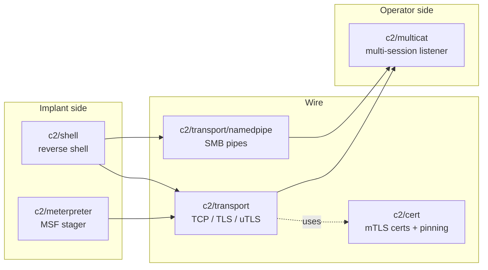

---
---

# C2 techniques

[← maldev README](../../../README.md) · [docs/index](../../index.md)

The `c2/*` package tree is the implant's outbound communication layer
plus the operator's listener side. Six sub-packages compose into a
complete reverse-shell / staging / multi-session stack:

> **Where to start (novice path):**
> 1. [`reverse-shell`](reverse-shell.md) — the canonical
>    "land a shell, react when it drops" loop. Most operators
>    start and end here.
> 2. [`transport`](transport.md) — pick TCP / TLS / uTLS based
>    on what defenders inspect (table at top of that page).
> 3. [`namedpipe`](namedpipe.md) — for local IPC or SMB
>    lateral movement when network egress isn't an option.
> 4. [`meterpreter`](meterpreter.md) — when the engagement
>    needs a full MSF session, not just a shell.
> 5. [`multicat`](multicat.md) — operator-side listener when
>    you have more than one agent. NEVER ship in implants.

## Packages

| Package | Tech page | Detection | One-liner |
|---|---|---|---|
| [`c2/shell`](https://pkg.go.dev/github.com/oioio-space/maldev/c2/shell) | [reverse-shell.md](reverse-shell.md) | noisy | reverse shell with PTY + auto-reconnect + AMSI/ETW evasion hooks |
| [`c2/meterpreter`](https://pkg.go.dev/github.com/oioio-space/maldev/c2/meterpreter) | [meterpreter.md](meterpreter.md) | noisy | MSF stager (TCP / HTTP / HTTPS) with optional `inject.Injector` for stage delivery |
| [`c2/transport`](https://pkg.go.dev/github.com/oioio-space/maldev/c2/transport) | [transport.md](transport.md) · [malleable-profiles.md](malleable-profiles.md) | moderate | pluggable TCP / TLS / uTLS + malleable HTTP profiles |
| [`c2/transport/namedpipe`](https://pkg.go.dev/github.com/oioio-space/maldev/c2/transport/namedpipe) | [namedpipe.md](namedpipe.md) | quiet | Windows named-pipe transport (local IPC + SMB lateral) |
| [`c2/cert`](https://pkg.go.dev/github.com/oioio-space/maldev/c2/cert) | [transport.md](transport.md) | quiet | self-signed X.509 generation + SHA-256 fingerprint pinning |
| [`c2/multicat`](https://pkg.go.dev/github.com/oioio-space/maldev/c2/multicat) | [multicat.md](multicat.md) | quiet | operator-side multi-session listener (BANNER protocol) |

## Quick decision tree

| You want to… | Use |
|---|---|
| …land a reverse shell that survives drops | [`c2/shell.New`](reverse-shell.md) + [`c2/transport`](transport.md) |
| …blend C2 with browser TLS fingerprints | [`c2/transport`](transport.md) uTLS profile (Chrome / Firefox / iOS Safari) |
| …pin the operator certificate against TLS-MITM | [`c2/cert.Fingerprint`](transport.md) + transport `PinSHA256` |
| …carry C2 over local IPC / SMB lateral | [`c2/transport/namedpipe`](namedpipe.md) |
| …stage a Meterpreter session with `inject` middleware | [`c2/meterpreter`](meterpreter.md) + `Config.Injector` |
| …disguise HTTP traffic as jQuery CDN fetches | [malleable-profiles.md](malleable-profiles.md) |
| …host many simultaneous reverse-shell agents | [`c2/multicat`](multicat.md) on the operator box |

## MITRE ATT&CK

| T-ID | Name | Packages | D3FEND counter |
|---|---|---|---|
| [T1071](https://attack.mitre.org/techniques/T1071/) | Application Layer Protocol | `c2/transport` (HTTP/TLS), `c2/transport/namedpipe` | D3-NTA |
| [T1071.001](https://attack.mitre.org/techniques/T1071/001/) | Web Protocols | `c2/transport` (malleable), `c2/meterpreter` (HTTP/HTTPS) | D3-NTA |
| [T1573](https://attack.mitre.org/techniques/T1573/) | Encrypted Channel | `c2/transport` (TLS) | D3-NTA |
| [T1573.002](https://attack.mitre.org/techniques/T1573/002/) | Asymmetric Cryptography | `c2/cert` (mTLS) | D3-NTA |
| [T1095](https://attack.mitre.org/techniques/T1095/) | Non-Application Layer Protocol | `c2/transport` (raw TCP) | D3-NTA |
| [T1059](https://attack.mitre.org/techniques/T1059/) | Command and Scripting Interpreter | `c2/shell` | D3-PSA |
| [T1571](https://attack.mitre.org/techniques/T1571/) | Non-Standard Port | `c2/multicat` | D3-NTA |
| [T1021.002](https://attack.mitre.org/techniques/T1021/002/) | SMB/Admin Shares | `c2/transport/namedpipe` (cross-host) | D3-NTA |

## See also

- [Operator path: build a reliable shell](../../by-role/operator.md)
- [Detection eng path: C2 telemetry](../../by-role/detection-eng.md)
- [`evasion`](../evasion/README.md) — apply patches **before** the
  shell connects.
- [`useragent`](https://pkg.go.dev/github.com/oioio-space/maldev/useragent) — pair with HTTP transports for
  realistic User-Agent headers.
- [`inject`](../injection/README.md) — stage execution surface for
  `c2/meterpreter`.
