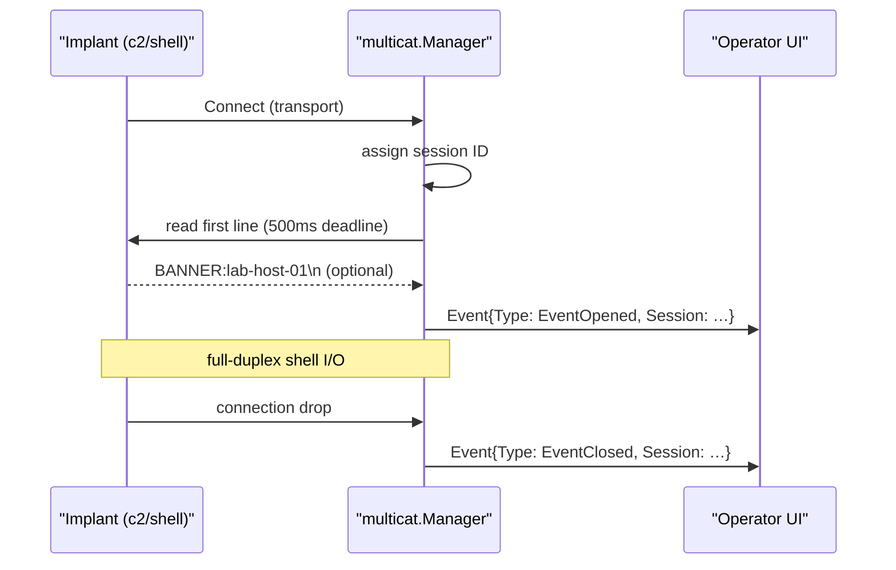

# Multicat — multi-session listener

[← c2 index](README.md) · [docs/index](../../index.md)

## TL;DR

Operator-side counterpart to `c2/shell`. One `Listener`, many
concurrent agents. Each inbound connection gets a sequential session
ID, optional BANNER-encoded hostname metadata, and a lifecycle event
(`EventOpened` / `EventClosed`) on the manager's channel. Sessions
are in-memory only — they do not survive a manager restart. Never
embedded in the implant.

| You want to… | Use | Notes |
|---|---|---|
| Accept multiple incoming reverse-shell agents | [`Manager.Serve`](#serve) | Wraps any [`c2/transport`](transport.md) listener. Single port, many sessions. |
| React to agent connect/disconnect events | `Manager.Events()` channel | `EventOpened{ID, Hostname}` + `EventClosed{ID}` |
| Send commands to a specific session | `Manager.Session(id).Write(...)` | Per-session R/W; the operator picks who runs what |
| Persist sessions across restart | **Not supported** | Wrap `Manager` with your own state file; in-memory by design |

⚠ **Operator-side only**: this is the listener that runs on
your C2 box. NEVER include `c2/multicat` in implant builds —
it would create a listener on the target.

What this DOES achieve:

- Replaces `nc -lvp` for ops with more than one host.
- Same transport flexibility as the implant side: TCP / TLS /
  uTLS / named pipes (when you receive over an SMB pipe) all
  work.
- Optional `BANNER:<hostname>\n` hello so the operator's UI
  can label sessions ("dc01" / "ws-finance-3") instead of
  `192.168.1.5:34521`.

What this does NOT achieve:

- **Not a TUI / UI** — it's a manager library. Build your own
  CLI / web UI on top using the events channel.
- **No persistence** — manager restart = all sessions lost.
  Implants reconnect on drop ([`c2/shell.ReverseLoop`](reverse-shell.md)),
  so sessions reappear quickly under their new IDs.
- **No authentication** — first connection in is session 1, no
  shared-secret check. Pair the transport with `c2/transport`
  cert pinning + mTLS to gate access.

## Primer

Engagements with more than one host quickly outgrow a single `nc -lvp
4444`. Multicat is a thin manager that owns one transport `Listener`,
accepts every incoming agent, assigns a session ID, optionally reads
a `BANNER:<hostname>\n` hello line, and emits a typed event so an
operator UI (TUI, web dashboard, anything) can render an arrival /
departure stream.

The wire protocol is intentionally tiny: when an agent connects,
multicat reads the first line with a 500 ms deadline. If the line
matches `BANNER:<hostname>\n`, it populates `SessionMetadata.Hostname`.
All other bytes are part of the normal shell I/O stream and pass
through. Agents that do not implement BANNER are unaffected.

The package never runs on a target — it is operator infrastructure.
That keeps the detection surface zero.

## How it works



## API → godoc

[`pkg.go.dev/github.com/oioio-space/maldev/c2/multicat`](https://pkg.go.dev/github.com/oioio-space/maldev/c2/multicat) is the authoritative
reference for every exported symbol. This page teaches the
*concepts*; the godoc is the *specification*.

## Examples

### Simple

```go
import (
    "context"
    "fmt"

    "github.com/oioio-space/maldev/c2/multicat"
    "github.com/oioio-space/maldev/c2/transport"
)

ln, _ := transport.NewTCPListener(":4444")
mgr := multicat.New()
go func() { _ = mgr.Listen(context.Background(), ln) }()

for ev := range mgr.Events() {
    if ev.Type == multicat.EventOpened {
        fmt.Printf("[+] %s from %s\n", ev.Session.Meta.Hostname, ev.Session.Meta.RemoteAddr)
    }
}
```

### Composed (TLS listener + BANNER agents)

Operator side:

```go
ln, _ := transport.NewTLSListener(":8443", "server.crt", "server.key")
mgr := multicat.New()
go mgr.Listen(context.Background(), ln)
```

Agent side (in `c2/shell` extension or custom code):

```go
_, _ = conn.Write([]byte("BANNER:" + osHostname + "\n"))
```

### Advanced (channel multiplexer routing into a TUI)

```go
go func() {
    for ev := range mgr.Events() {
        switch ev.Type {
        case multicat.EventOpened:
            ui.Add(ev.Session)
        case multicat.EventClosed:
            ui.Remove(ev.Session.Meta.ID)
        }
    }
}()
```

### Complex

The `Manager` does not own session selection or interactive
"foreground" semantics — that is the operator UI's job. See
`cmd/rshell` for a reference TUI.

See `ExampleNew` in
[`multicat_example_test.go`](../../../c2/multicat/multicat_example_test.go).

## OPSEC & Detection

This package never executes on a target. The only relevant signals
are on the agent side ([reverse-shell.md](reverse-shell.md)).

The operator-side listener is an inbound TCP / TLS port on the
operator's box. Common operator-hygiene practices apply: bind on a
private interface, front with a redirector (Apache rewrite,
Cloudflare worker), put it behind a single jump host.

## MITRE ATT&CK

| T-ID | Name | Sub-coverage | D3FEND counter |
|---|---|---|---|
| [T1571](https://attack.mitre.org/techniques/T1571/) | Non-Standard Port | listener typically binds a high non-standard port | D3-NTA |

## Limitations

- **In-memory state.** Restarting the manager loses every session.
  Persist out-of-band (log file, database) if the engagement needs
  continuity.
- **No interactive multiplexer.** The package emits events; the
  operator UI implements foreground selection, scroll-back, kill-on-
  exit. `cmd/rshell` is the reference TUI.
- **BANNER deadline is 500 ms.** Lossy networks may miss the BANNER
  line and treat the bytes as shell I/O. The agent should retry or
  fall back to inline `BANNER` once authenticated.
- **No authentication.** `multicat` accepts whoever the listener
  hands it. For mTLS, configure on the listener
  ([`c2/cert`](transport.md#cert-pinning)).

## See also

- [Reverse shell](reverse-shell.md) — agent counterpart.
- [Transport](transport.md) — listener factories
  (`NewTCPListener`, `NewTLSListener`).
- [`cmd/rshell`](https://pkg.go.dev/github.com/oioio-space/maldev/cmd/rshell) — reference TUI built on
  multicat.
