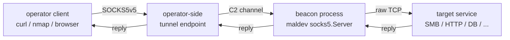

# SOCKS5 pivoting

[← c2 index](README.md) · [docs/index](../../index.md)

## TL;DR

You want the operator's curl / browser / nmap to reach a target on
the beacon's network. Bind a SOCKS5 listener on the beacon side,
forward an operator-side port to it via the existing C2 tunnel, and
every request the operator makes through the proxy lands inside
the target network as if it had originated on the beacon's host.

| You want to… | Use | Notes |
|---|---|---|
| Spin a beacon-side proxy | [`New`](#new--build) → [`Start`](#start--background-launch) | One-shot, returns the bound address |
| Run it on the implant goroutine | [`Serve`](#serve--blocking-lifecycle) with `ctx` | Cancellable via context |
| Constrain destinations | `Config.Rules` | Plug any `gosocks5.RuleSet` — PermitAll, PermitNone, custom |
| Add credentials | `Config.Auth` | RFC 1929 user/password |

What this DOES achieve:

- Bind a SOCKS5v5 proxy on a configurable address (loopback by
  default — opt-in to non-loopback exposure).
- Accept the operator's traffic and relay it to arbitrary
  TCP destinations on the beacon's network.
- Authenticate connections via RFC 1929 user/password.
- Block destinations via a `RuleSet` hook — useful for scope
  enforcement on red-team engagements.

What this DOES NOT achieve:

- **No reverse pivoting** — the listener is operator-pulls. For
  beacon-initiated tunnels (operator listens, beacon dials),
  pair with a yamux/smux-based reverse tunnel (M5.b on the
  roadmap).
- **No traffic encapsulation** — SOCKS5 is plaintext on the
  wire. If the operator-to-beacon path is not already encrypted
  (TLS, in-process via Caller, etc.), pair this with
  [`crypto`](../crypto/README.md).
- **No DNS proxying** — only TCP CONNECT is honoured. UDP
  ASSOCIATE / BIND would need extra wiring on the inner server.

## Primer

SOCKS5 (RFC 1928) is the canonical pivot primitive. The operator
treats the beacon as a network gateway: every CONNECT the
operator-side client sends is opened by the beacon process
against the requested destination, and bytes shuttle back and
forth over the operator-to-beacon socket.

Use cases:

- **Internal recon**: point `nmap` at the proxy and scan the
  beacon's subnet.
- **Cred-grab follow-up**: dump LSASS via [credentials/lsassdump],
  pivot a Cobalt Strike Beacon back through the same SOCKS5 to
  the DC, run BloodHound queries.
- **Lateral-movement preparation**: use the proxy to fingerprint
  SMB / WinRM / RDP exposure before committing to one of the
  lateral-movement primitives.

## How It Works



The `socks5.Server` runs entirely inside the beacon process — no
new process / no service. The operator-to-beacon tunnel is OUTSIDE
this package's scope; usually it's an HTTP CONNECT tunnel, an SSH
local-forward, or a custom Malleable C2 channel from
[`c2/transport`](transport.md).

## API → godoc

[`pkg.go.dev/github.com/oioio-space/maldev/c2/pivot/socks5`](https://pkg.go.dev/github.com/oioio-space/maldev/c2/pivot/socks5)
is the authoritative reference. This page teaches the *concepts*;
godoc is the *specification*.

## Examples

### Simple — bind a no-auth proxy

```go
srv, _ := socks5.New(nil)
addr, stop, _ := srv.Start()
defer stop()
// operator dials addr through the existing C2 forward
fmt.Println("SOCKS5 bound on", addr)
```

`socks5.New(nil)` uses the zero-value `Config` — no auth,
PermitAll routing, random loopback port. Production deployments
should set `Listen` to a fixed port the operator's forward knows,
and gate access via `Auth` or `Rules`.

### Composed — credentials + scope enforcement

```go
srv, _ := socks5.New(&socks5.Config{
    Listen: "127.0.0.1:1080",
    Auth:   &socks5.Auth{User: "operator", Password: "s3cret"},
    Rules:  gosocks5.PermitAll(),
})
addr, stop, _ := srv.Start()
defer stop()
```

Both knobs are independent. `Auth` requires the operator's
SOCKS5 client to present RFC 1929 credentials; `Rules` constrains
what destinations CONNECT is permitted to reach. Use a custom
`gosocks5.RuleSet` to block egress back to the operator's own
infrastructure or out-of-scope assets.

### Advanced — context-cancel lifecycle

```go
srv, _ := socks5.New(nil)

ctx, cancel := context.WithTimeout(context.Background(), 8*time.Hour)
defer cancel()

go func() { _ = srv.Serve(ctx) }()
for srv.Addr() == "" {
    time.Sleep(10 * time.Millisecond)
}

// ... operator pivots through srv.Addr() until ctx fires ...
```

`Serve` blocks until ctx is cancelled or the listener closes;
returns nil on clean shutdown so the caller can distinguish
"engagement window expired" from a genuine error.

### Complex — end-to-end loop against a fake target

See [`Example_complex`](https://pkg.go.dev/github.com/oioio-space/maldev/c2/pivot/socks5#example-package-Complex)
in `socks5_example_test.go` for the full beacon-server +
operator-client + fake-backend loop. It's the same shape
`TestServer_E2E_ProxiesToBackend` pins.

## OPSEC & Detection

| Artefact | Where defenders look |
|---|---|
| Sustained outbound TCP connections to RFC1918 neighbours from a non-network-tool process | EDR process-network correlation |
| Bound listener on a non-standard port | Sysmon Event ID 22 (DNS) is irrelevant here, but EID 5 (network listener) flags |
| SOCKS5 protocol bytes (0x05 0x01 0x00 handshake) over the operator tunnel | Inline IDS with SOCKS5 signature, e.g. Suricata `app-layer.socks5` |

**D3FEND counters:**

- [D3-NTA](https://d3fend.mitre.org/technique/d3f:NetworkTrafficAnalysis/) — flow-based outbound connection volume.
- [D3-PA](https://d3fend.mitre.org/technique/d3f:ProcessAnalysis/) — process-to-network correlation.

**Hardening for the operator:**

- Bind to loopback (the default) and use the operator-side tunnel
  for exposure — never `0.0.0.0:1080`.
- Encrypt the operator-to-beacon path. SOCKS5 is plaintext; the
  CONNECT target host shows up on the wire.
- Use `Rules` to enforce engagement scope. Block egress back to
  the operator's C2 infrastructure so a misconfigured client
  never proxies back through the implant.
- Pair with [`evasion/sleepmask`](../evasion/sleep-mask.md) to
  hide the listener buffer between accepts.

## MITRE ATT&CK

| T-ID | Name | Sub-coverage | D3FEND counter |
|---|---|---|---|
| [T1090](https://attack.mitre.org/techniques/T1090/) | Proxy | sub-technique T1090.001 (Internal Proxy) | D3-NTA |

## Limitations

- **Forward-only.** No reverse pivot (operator-listens, beacon-
  dials). Queued as M5.b on the maldev primitives roadmap.
- **TCP CONNECT only.** UDP ASSOCIATE / BIND are not wired. UDP
  pivot needs separate plumbing.
- **No traffic-shape obfuscation.** Default protocol bytes are
  recognisable on the wire — pair with TLS or in-tunnel
  encryption.
- **MPL-2.0 dependency** ([`github.com/armon/go-socks5`](https://github.com/armon/go-socks5)).
  File-level copyleft, compatible with maldev's MIT licence as a
  Go import — but ensure downstream products understand the
  dependency's licence terms when redistributing binaries.

## See also

- [`crypto`](../crypto/README.md) — pair with this when the
  operator-side tunnel is plaintext.
- [`evasion/sleepmask`](../evasion/sleep-mask.md) — mask the
  listener buffer at rest.
- [`c2/transport`](transport.md) — sibling C2 plumbing for
  Malleable HTTP profiles and TLS / uTLS.
- [Operator path](../../by-role/operator.md).
- [Detection eng path](../../by-role/detection-eng.md).
