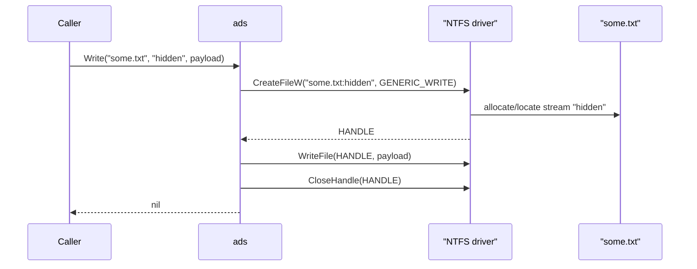

# NTFS Alternate Data Streams

[← cleanup index](README.md) · [docs/index](../../index.md)

## TL;DR

NTFS lets you attach **named data streams** to any file. The
streams share the host file's MFT entry / ACL / timestamps but
are invisible to `dir`, Explorer, `Get-ChildItem`, and most
file-listing APIs. Useful as a quiet stash for payloads,
config, encrypted second-stage bytes, etc.

| You want to… | Use | Notes |
|---|---|---|
| Hide a second-stage payload in an existing file | [`Write`](#write) | `\\file.txt:hidden:$DATA` |
| Read it back | [`Read`](#read) | Same syntax — both stager and host file unaffected |
| Enumerate hidden streams on a file | [`List`](#list) | Returns names only; not visible to `dir` |
| Drop a stream without altering the host file | [`Delete`](#delete) | Removes only the named stream |

What this DOES achieve:

- Stash data on disk without creating a "new file" — defenders
  enumerating new files in `\Users\Public\` see only what was
  there before; ADS payload is invisible.
- ACL inheritance from the host file — a stream attached to
  `notepad.exe` inherits `notepad.exe`'s ACL.
- Survives `os.Stat` (the host file's size unchanged from
  the perspective of standard APIs).

What this does NOT achieve:

- **Sysmon EID 15 (FileCreateStreamHash) catches every write** —
  named-stream creation is logged by default-Sysmon-config
  installations. Stash with care.
- **`dir /R` shows them** — defenders running it (or PowerShell
  `Get-Item -Stream *`) see every stream. Standard tools don't,
  but specialised triage scripts do.
- **NTFS only** — no FAT / exFAT / network shares. Mail
  attachments + zip extraction strip ADS by design.
- **Mark-of-the-Web (`Zone.Identifier`) is also an ADS** —
  removing it via this package's `Delete` clears the SmartScreen
  warning but leaves your own audit trail in `$LogFile` /
  `$UsnJrnl`.

## Primer

Every file on an NTFS volume has a default unnamed data stream
(`:$DATA`) — that's what `cat` / `Get-Content` reads. NTFS additionally
allows arbitrary named streams attached to the same file. The streams
share the file's MFT entry, ACL, and timestamps; they're addressable as
`file.txt:hidden:$DATA`. Most user-facing tooling ignores everything but
the default stream, which makes ADS a quiet stash spot.

ADS support is filesystem-bound. NTFS supports it; FAT32, exFAT, ext4,
and any non-Windows filesystem do not. Crossing a non-NTFS boundary
(e.g., copying to a USB stick) silently drops the streams.

## How it works



The package wraps `CreateFileW` with the colon-suffix syntax. The kernel
handles stream allocation transparently. List uses
`NtQueryInformationFile(FileStreamInformation)` to walk the MFT entry's
stream attribute list.

## API → godoc

[`pkg.go.dev/github.com/oioio-space/maldev/cleanup/ads`](https://pkg.go.dev/github.com/oioio-space/maldev/cleanup/ads) is the authoritative
reference for every exported symbol. This page teaches the
*concepts*; the godoc is the *specification*.

## Examples

### Simple

```go
import "github.com/oioio-space/maldev/cleanup/ads"

_ = ads.Write(`C:\Users\Public\desktop.ini`, "config", []byte("c2=1.2.3.4"))

cfg, _ := ads.Read(`C:\Users\Public\desktop.ini`, "config")

streams, _ := ads.List(`C:\Users\Public\desktop.ini`)
// streams: []string{"config"}

_ = ads.Delete(`C:\Users\Public\desktop.ini`, "config")
```

### Composed (with `crypto`)

```go
key := crypto.RandomKey(32)
ct, _ := crypto.AESGCMEncrypt(key, []byte(state))
_ = ads.Write(`C:\Windows\Temp\index.dat`, "s", ct)

// Later:
ct, _ = ads.Read(`C:\Windows\Temp\index.dat`, "s")
state, _ := crypto.AESGCMDecrypt(key, ct)
```

### Advanced (chain with selfdelete)

`cleanup/selfdelete` uses ADS rename internally:

```go
// selfdelete renames the default stream to ":x" via the same primitive
// surface the ads package exposes, then sets DELETE disposition.
// See cleanup/selfdelete/selfdelete.go for the full sequence.
selfdelete.Run()
```

## OPSEC & Detection

| Artefact | Where defenders look |
|---|---|
| MFT entry size grows when stream is added | NTFS forensic tools (Sleuth Kit, Plaso) |
| `CreateFileW` with colon-suffix path | EDR file-IO event aggregation; rare in benign software |
| `dir /R` lists all streams | Manual triage |
| `Get-Item -Stream *` (PowerShell) | Manual hunt |
| Sysinternals Streams tool | Forensic walkthrough |

**D3FEND counter:** [D3-FCR](https://d3fend.mitre.org/technique/d3f:FileContentRules/)
(File Content Rules) — antivirus engines can scan named streams when
configured.

## MITRE ATT&CK

| T-ID | Name | Sub-coverage |
|---|---|---|
| [T1564.004](https://attack.mitre.org/techniques/T1564/004/) | Hide Artifacts: NTFS File Attributes | Named-stream payload storage |

## Limitations

- **NTFS-only.** Cross-filesystem copy drops streams.
- **Many AVs scan ADS.** Defender enumerates and scans named streams by
  default since Win10 1607.
- **Mark-of-the-Web** stream (`Zone.Identifier`) is added automatically
  to internet-downloaded files; collisions are unlikely but worth
  avoiding (don't use `Zone.Identifier` as your stream name).
- **Backup tools** (Robocopy with `/B`, Windows Backup) preserve streams;
  unaware tools (`copy`, `xcopy` without `/B`) silently drop them.
- **Stealth read of named ADS streams is non-trivial.** [`ReadVia`](#readviaopener-stealthopenopener-path-stream-string-byte-error)
  + nil-fallback uses path-based `os.Open` on `<path>:<stream>` —
  visible to path-hooking EDRs. The repo's bundled
  [`*stealthopen.Stealth`](../evasion/stealthopen.md) routes through
  NTFS Object IDs which addresses the MFT entry only (main stream),
  *not* a specific named stream. A stealth-on-ADS read primitive
  needs a custom Opener built on `NtCreateFile` with the composite
  path; not provided by this package.

## See also

- [`cleanup/selfdelete`](self-delete.md) — primary internal consumer.
- [Sysinternals Streams](https://learn.microsoft.com/sysinternals/downloads/streams)
  — operator-side enumeration.
- [microsoft/go-winio backup.go](https://github.com/microsoft/go-winio/blob/main/backup.go)
  — original ADS code structure inspiration.
- [CQURE Academy — Alternate Data Streams](https://cqureacademy.com/blog/alternate-data-streams/).
