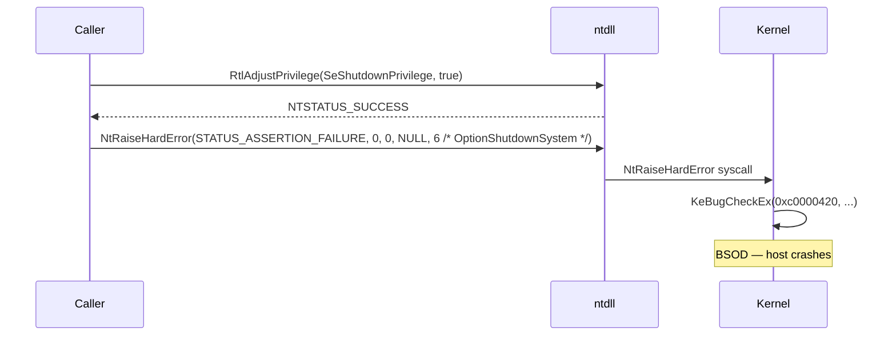

# Controlled Blue Screen of Death

[← cleanup index](README.md) · [docs/index](../../index.md)

> [!CAUTION]
> This is a **destructive, irreversible** primitive. Calling
> `bsod.Trigger` crashes the host immediately. Use only as a last-resort
> kill switch when stopping log shipping or process collection is more
> valuable than the host. The example tests are gated behind a build
> tag and do **not** run by default.

## TL;DR

Last-resort kill switch: crash the host so in-memory state
(unflushed logs, EDR's pending event queue, your secrets) is
destroyed before anything can hit disk.

| You're up against… | Use | Cost |
|---|---|---|
| EDR about to ship telemetry, no time to wipe gracefully | [`Trigger`](#trigger) | One syscall, host gone |
| Just want to wipe memory | **Don't use this** — see [`memory-wipe`](memory-wipe.md) | Reversible cleanup |

⚠ **Destructive and irreversible.** The host reboots
immediately. Use only when stopping log shipping is more
valuable than the host itself. Tests for this primitive are
gated behind a build tag and never run in CI by default.

What this DOES achieve:

- Pending writes in EDR's user-mode buffers, Event Log
  service queues, and Sysmon's pre-flush state are all lost.
- Memory dumps that would have captured your shellcode /
  keys are gone — kernel produces a minidump on next boot
  which excludes user-mode allocations by default.
- One-syscall trigger; no need for admin shell — only
  `SeShutdownPrivilege` (granted by default to interactive
  users).

What this does NOT achieve:

- **Doesn't hide that it happened** — Event Log entry
  "0xDEADBEEF" + `MEMORY.DMP` on disk after reboot tell the
  forensic team a process called `NtRaiseHardError`. This is
  a panic button, not stealth.
- **Doesn't survive the reboot** — your implant is gone.
  Persistence (auto-start service / registry run key /
  scheduled task) must be in place beforehand.
- **Doesn't wipe disk artefacts** — anything already on disk
  (your dropper, prefetch, recent file activity) survives.
  Pair with [`cleanup/wipe`](wipe.md) BEFORE crashing.

## Primer

`NtRaiseHardError` is the kernel's mechanism for raising errors from
user-mode that the kernel decides how to handle. With the right
parameters (notably `OptionShutdownSystem`), the kernel treats the
report as an unrecoverable system fault and crashes immediately with the
specified bug-check code (`KeBugCheckEx`).

The technique requires `SeShutdownPrivilege`, which any process running
as a Medium-IL user with that privilege available can enable via
`RtlAdjustPrivilege`. Most local accounts have it.

Use cases:

- Operator wants to abort an exfil operation when an EDR alert fires —
  faster to crash the host than to clean up.
- Anti-forensic last resort: terminate the implant + all running
  collection agents in one shot.
- Red-team exercise: validate the blue team's "host went silent"
  response.

## How it works



`OptionShutdownSystem` (value 6) tells the kernel to treat the hard
error as fatal. The supplied status code propagates into the bug-check
parameter shown on the BSOD screen.

## API → godoc

[`pkg.go.dev/github.com/oioio-space/maldev/cleanup/bsod`](https://pkg.go.dev/github.com/oioio-space/maldev/cleanup/bsod) is the authoritative
reference for every exported symbol. This page teaches the
*concepts*; the godoc is the *specification*.

## Examples

### Simple

```go
//go:build windows
package main

import (
    "github.com/oioio-space/maldev/cleanup/bsod"
    wsyscall "github.com/oioio-space/maldev/win/syscall"
)

func main() {
    caller := wsyscall.New(wsyscall.MethodIndirect, nil)
    if err := bsod.Trigger(caller); err != nil {
        // Reached only on failure; host doesn't come back on success.
        panic(err)
    }
}
```

### Composed — guard with explicit operator confirmation

```go
if !operatorConfirmed("really BSOD?") {
    return
}
// Wipe in-memory secrets first so even crash dumps reveal less.
memory.WipeAndFree(payloadAddr, payloadSize)
_ = bsod.Trigger(caller)
```

### Advanced — chain with operator-side TLS handshake

A pattern from real ops: BSOD on receipt of a "BURN" command from C2.

```go
go func() {
    for cmd := range c2Channel {
        if cmd == "BURN" {
            memory.WipeAndFree(stateAddr, stateSize)
            _ = bsod.Trigger(caller)
        }
    }
}()
```

## OPSEC & Detection

| Artefact | Where defenders look |
|---|---|
| Bug-check itself | System event log Event 1001 (BugCheck), Event 41 (Kernel-Power) on next boot |
| Memory dump (if configured) | `C:\Windows\MEMORY.DMP` (or `C:\Dumps\` per WER LocalDumps) names the originating process |
| `SeShutdownPrivilege` adjustment | Pre-crash ETW from `Microsoft-Windows-Security-Auditing` (Event 4673 with audit policy on) |
| Cluster of identical bug-checks across hosts | Sysmon-shipped Event 1001 in SIEM |

**D3FEND counter:** [D3-PSEP](https://d3fend.mitre.org/technique/d3f:ProcessSelfModification/)
(weak — bug-checks are inherent to OS); the real counter is **availability
monitoring** (host-up dashboard) and **crash-dump analysis** post-incident.

## MITRE ATT&CK

| T-ID | Name | Sub-coverage |
|---|---|---|
| [T1529](https://attack.mitre.org/techniques/T1529/) | System Shutdown/Reboot | Forced bug-check variant |

## Limitations

- **`SeShutdownPrivilege` required.** Sandboxed processes (Edge Renderer,
  AppContainer Store apps) cannot adjust this privilege.
- **Crash dump destination** depends on system config. If the host is
  configured for kernel-only minidumps, the dump may not include the
  full process state — but it WILL include the originating thread.
- **VM hosts** with snapshot-on-crash configurations may preserve state
  better than the operator wants.
- **Win11 modern standby** — some bug-checks are recoverable on Win11 if
  the system is on AC power and the kernel decides to attempt recovery
  (rare for `STATUS_ASSERTION_FAILURE`-class codes).

## See also

- [`cleanup/memory`](memory-wipe.md) — pair with `WipeAndFree` to
  destroy in-memory secrets before the bug-check.
- [`evasion/sleepmask`](../evasion/sleep-mask.md) — alternative when you
  want to merely hide, not destroy.
- [Microsoft — NtRaiseHardError reference](https://learn.microsoft.com/windows-hardware/drivers/ddi/wdm/nf-wdm-zwraisehardware)
  (kernel-mode signature; user-mode is undocumented but stable).
