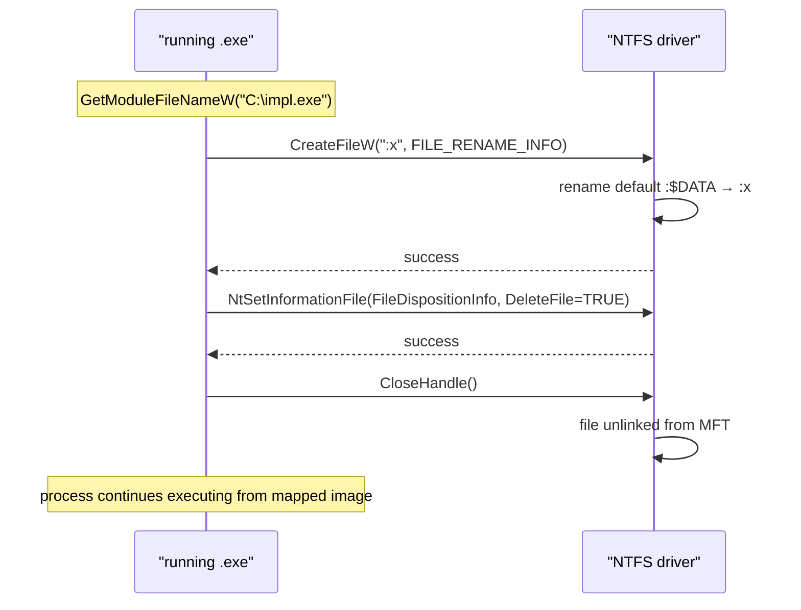

# Self-deletion (running EXE)

[← cleanup index](README.md) · [docs/index](../../index.md)

## TL;DR

You ran your implant from disk; it's now in memory. You want
the disk artefact gone — but Windows holds a handle on the
running EXE's image and `os.Remove` returns "file in use".
This package exploits an NTFS quirk to delete-while-running.

| You want… | Use | Compatibility |
|---|---|---|
| Modern path (NTFS rename + mark-for-delete) | [`Delete`](#delete) | Win10+ |
| Maximum compat (older Windows) | [`DeleteCompat`](#deletecompat) | Win7+ |
| In-memory implant should keep running | Both work — process keeps executing the mapped image | All |
| Want the file to vanish from `dir` listing immediately | `Delete` returns once the rename succeeds | n/a |

What this DOES achieve:

- File disappears from disk before the process exits — forensic
  triage that finds the implant in memory still has nothing
  on-disk to image.
- Process keeps running (mapped image stays valid until exit).
  Implant can finish its work before going down.
- No external tools, no bat-file delete-on-reboot trick.

What this does NOT achieve:

- **Doesn't wipe filesystem journal entries** — `$LogFile`,
  `$UsnJrnl` still record the create + delete events. Forensic
  recovery from these journals can recover the path + first
  4 KB of content.
- **Doesn't wipe `Prefetch`** — `C:\Windows\Prefetch\<exe>-XXXX.pf`
  records every executable run. Pair with [`cleanup/wipe`](wipe.md)
  for prefetch cleanup.
- **NTFS only** — the `:$DATA` rename trick doesn't work on
  FAT / exFAT / network shares.
- **Doesn't survive reboot of a forensic image** — if the
  attacker takes a disk image BEFORE delete, the file is in
  unallocated clusters until overwritten.

## Primer

Windows holds an open handle on a running EXE's image file (it's mapped
into the process). `os.Remove` on a running EXE returns "in use".

The NTFS quirk this package exploits: every file has an unnamed default
data stream `:$DATA` that holds the file's content. NTFS allows you to
**rename** that default stream to a named stream (e.g. `:x`). After
rename, the file from the kernel's perspective has zero bytes in its
default stream — and Windows happily deletes the file even though our
process still has its image mapped.

Three other paths exist when ADS isn't workable:

- `RunForce(retry, duration)` — same trick, retry loop for transient
  locks.
- `RunWithScript` — drop a `.bat` file that polls until the process
  exits, then deletes the EXE. Universal, but the batch script is a
  signature.
- `MarkForDeletion` — `MoveFileEx(MOVEFILE_DELAY_UNTIL_REBOOT)`. No
  on-disk write, but the `PendingFileRenameOperations` registry value
  retains the artefact until next reboot.

## How it works

The ADS-rename path:



Step-by-step:

1. Resolve own path via `GetModuleFileNameW(NULL, …)`.
2. `CreateFileW(path, DELETE | SYNCHRONIZE, FILE_SHARE_READ|WRITE|DELETE, …, OPEN_EXISTING, …)`.
3. `SetFileInformationByHandle(FileRenameInfo, ":x")` — rename
   default stream.
4. `SetFileInformationByHandle(FileDispositionInfo, DeleteFile=TRUE)`
   — schedule deletion at handle close.
5. `CloseHandle()` — file vanishes.
6. The process continues; its image stays mapped.

## API → godoc

[`pkg.go.dev/github.com/oioio-space/maldev/cleanup/selfdelete`](https://pkg.go.dev/github.com/oioio-space/maldev/cleanup/selfdelete) is the authoritative
reference for every exported symbol. This page teaches the
*concepts*; the godoc is the *specification*.

## Examples

### Simple

```go
//go:build windows
package main

import "github.com/oioio-space/maldev/cleanup/selfdelete"

func main() {
    defer selfdelete.Run()
    // implant work …
}
```

### Composed (with `cleanup/memory`)

Wipe in-memory state before disappearing from disk:

```go
defer selfdelete.Run()
defer memory.SecureZero(c2State)
// work …
```

### Advanced (full end-of-mission chain)

```go
defer func() {
    // 1. Reset timestamps so any disk forensic sees a "stale" file.
    _ = timestomp.CopyFrom(`C:\Windows\System32\notepad.exe`, droppedFile)
    // 2. Wipe + delete dropped artefacts.
    _ = wipe.File(droppedFile, 3)
    // 3. Wipe in-memory state.
    memory.SecureZero(stateBuf)
    // 4. Self-delete the running EXE.
    _ = selfdelete.Run()
}()
```

### Complex (RunWithScript fallback)

```go
if err := selfdelete.Run(); err != nil {
    // ADS path failed (FAT volume, locked-down server) — fall back.
    _ = selfdelete.RunWithScript(2 * time.Second)
}
```

## OPSEC & Detection

| Artefact | Where defenders look |
|---|---|
| `FileRenameInfo` on a default-stream rename of a running EXE | Sysmon Event 2 (file creation timestamp change) — partial signal |
| `FileDispositionInfo` setting DELETE on a running EXE | Sysmon Event 23 (FileDelete) |
| MFT entry with `$BITMAP` change (file freed but still in mapping) | Forensic-grade MFT analysis |
| Batch script in `%TEMP%` (RunWithScript) | Sysmon Event 11 + clear signature |
| `PendingFileRenameOperations` registry value (MarkForDeletion) | Reboot-time analysis |

**D3FEND counter:** [D3-FRA](https://d3fend.mitre.org/technique/d3f:FileRemovalAnalysis/)
(File Removal Analysis) — defeats casual deletion patterns; the ADS-rename
variant defeats most file-deletion-watch rules. Hardening: monitor for
`FileRenameInfo` on PE files in writable directories.

## MITRE ATT&CK

| T-ID | Name | Sub-coverage |
|---|---|---|
| [T1070.004](https://attack.mitre.org/techniques/T1070/004/) | Indicator Removal: File Deletion | self-delete-while-running variant |

## Limitations

- **NTFS-only** — `Run` requires ADS support. FAT32, exFAT, ext4 (mounted
  via WSL), or any mounted SMB share without ADS pass-through fail. Use
  `RunWithScript` as fallback.
- **Win11 24H2 (build 26100+)** — `MoveFileEx(MOVEFILE_DELAY_UNTIL_REBOOT)`
  semantics changed; the `PendingFileRenameOperations` value is still
  written but kernel-level processing differs. `MarkForDeletion` may
  silently fail on this build. Track in [docs/testing.md](../../testing.md#cleanup).
- **Defender realtime scan** — if the EXE is in a directory with
  realtime monitoring (anything not in the exclusion list) the rename may
  trigger an AV scan that holds the handle long enough to fail
  `SetFileDisposition`. Use `RunForce`.
- **Process Mitigation** — some EDRs apply `Process Mitigation Policy:
  ProhibitDynamicCode` which doesn't affect this primitive directly,
  but the same EDR likely watches for the unusual rename pattern.

## See also

- [`cleanup/ads`](ads.md) — primitive ADS CRUD; `selfdelete` is its
  highest-leverage user.
- [Original technique writeup — LloydLabs/delete-self-poc](https://github.com/LloydLabs/delete-self-poc).
- [Microsoft — `FileDispositionInfo`](https://learn.microsoft.com/windows/win32/api/winbase/ne-winbase-file_info_by_handle_class).
