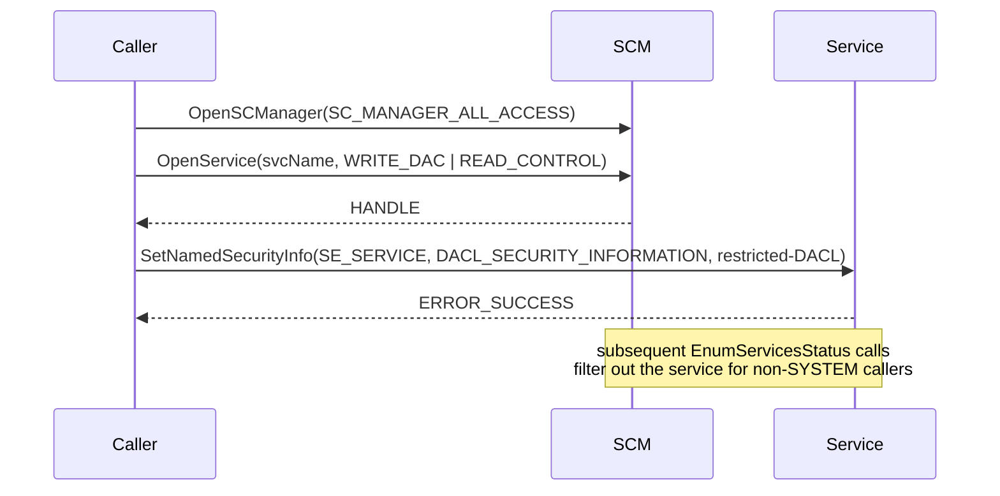

# Hide Windows services via DACL

[← cleanup index](README.md) · [docs/index](../../index.md)

## TL;DR

You installed a persistence service (or want to hide an
existing one) and want it invisible to standard service
enumerators. This package replaces the service's DACL so
even admins can't query its config or status through the SCM.
The service still runs.

| You want… | Use | Effect |
|---|---|---|
| Hide a service from `services.msc` / `sc query` / `Get-Service` | [`Hide`](#hide) | Service runs; querying returns ACCESS_DENIED |
| Restore visibility | [`Unhide`](#unhide) | Re-applies default DACL |
| Snapshot a DACL before mutating | [`GetSecurityDescriptor`](#getsecuritydescriptor) | For backup/restore by the operator |

What this DOES achieve:

- `services.msc`, `sc query`, `Get-Service`, `Win32_Service`
  WMI all see "access denied" or skip the service entirely.
- Naive EDR enumerators (`EnumServicesStatusEx`) skip
  inaccessible services by default.
- Service still runs — `Stop-Service` from a process holding
  the original handle still works; the OS just blocks new
  enumeration.

What this does NOT achieve:

- **Doesn't hide from the kernel** — `EtwTI` Service Control
  Manager events fire on service start regardless. Defenders
  watching ETW kernel-level service events still see you.
- **Sophisticated EDR enumerators** open services with low
  privileges first, retry with elevated. They notice the
  ACCESS_DENIED anomaly + log it.
- **Doesn't hide registry traces** — `HKLM\SYSTEM\CurrentControlSet\Services\<name>`
  is still visible to `reg query` / `Get-ChildItem` from any
  user with read access to the registry key. Combine with
  registry-key DACL hardening (out of scope here).
- **Reboot persistence depends on the registry config** — the
  DACL change is on the SCM in-memory copy. After reboot,
  the SCM re-reads the registry — your DACL change is lost
  unless persisted there too.

## Primer

Every Windows service has a security descriptor controlling who can
query, start, stop, change config, or change ACL on it. The default
DACL grants `SERVICE_QUERY_CONFIG | SERVICE_QUERY_STATUS |
SERVICE_INTERROGATE | SERVICE_USER_DEFINED_CONTROL` to interactive users
and admins. Replacing that DACL with one that **denies** those rights
makes the service invisible to standard listing tools without affecting
its execution.

The persistence side (creating + starting the service) lives in
[`persistence/service`](../persistence/README.md). This package handles
the **hiding** side, applied AFTER install.

## How it works



The restricted DACL the package applies:

```
D:(D;;CCSWLOLCRC;;;IU)
 (D;;CCSWLOLCRC;;;SU)
 (D;;CCSWLOLCRC;;;BA)
 (A;;LCRPRC;;;SY)
```

- **D** entries deny `CCSWLOLCRC` (query config / status / control / read
  control) to Interactive Users (IU), Service users (SU), Built-in
  Admins (BA).
- **A** entry allows `LCRPRC` (read DACL + read control + start) to
  SYSTEM only.

Result: the service runs as SYSTEM, but only SYSTEM can enumerate it.

## API → godoc

[`pkg.go.dev/github.com/oioio-space/maldev/cleanup/service`](https://pkg.go.dev/github.com/oioio-space/maldev/cleanup/service) is the authoritative
reference for every exported symbol. This page teaches the
*concepts*; the godoc is the *specification*.

## Examples

### Simple

```go
import "github.com/oioio-space/maldev/cleanup/service"

if _, err := service.HideService(service.Native, "", "MyService"); err != nil {
    log.Fatal(err)
}
// MyService runs but does not appear in services.msc / sc query / Get-Service.

// Restore at end of mission:
_, _ = service.UnHideService(service.Native, "", "MyService")
```

### Composed (with `persistence/service`)

```go
// Install + start
_ = persistenceService.InstallAndStart("MyService", "C:\\Path\\to\\impl.exe")
// Hide
_, _ = service.HideService(service.Native, "", "MyService")
```

### Advanced — remote hide via UNC

```go
out, err := service.HideService(service.SC_SDSET, `\\TARGET-HOST`, "MyService")
if err != nil {
    log.Fatalf("hide on TARGET-HOST: %v\noutput: %s", err, out)
}
```

## OPSEC & Detection

| Artefact | Where defenders look |
|---|---|
| Security event 4670 (DACL change on object) | Audit Object Access policy must be enabled |
| Sysmon Event 4697 (service control change) | Always logged when Sysmon configured |
| Service still listed in `HKLM\SYSTEM\CurrentControlSet\Services\<name>` | Registry-based enumeration sees through DACL |
| `EnumServicesStatusEx` from SYSTEM context returns the service | EDR running as SYSTEM is unaffected |

**D3FEND counter:** [D3-RAPA](https://d3fend.mitre.org/technique/d3f:ResourceAccessPatternAnalysis/)
(Resource Access Pattern Analysis) — registry-based service enumeration
defeats DACL hiding. **Hardening:** scan `HKLM\SYSTEM\CurrentControlSet\
Services\` directly, not via SCM.

## MITRE ATT&CK

| T-ID | Name | Sub-coverage |
|---|---|---|
| [T1564](https://attack.mitre.org/techniques/T1564/) | Hide Artifacts | DACL-based service hiding |
| [T1543.003](https://attack.mitre.org/techniques/T1543/003/) | Create or Modify System Process: Windows Service | hide-side companion to install/start |

## Limitations

- **Requires SeTakeOwnership / WRITE_DAC.** Standard admin OK; non-admin
  cannot rewrite the security descriptor.
- **Defeated by registry enumeration.** Anyone who reads `HKLM\SYSTEM\
  CurrentControlSet\Services\` directly sees the service regardless.
- **SYSTEM-context EDR is unaffected.** The DACL allows SYSTEM read.
- **Audit policy on object access** logs Event 4670 for the DACL change
  itself; not always enabled by default but trivial for blue to enable.
- **`SC_SDSET` mode shells out to `sc.exe`** — leaves a child-process
  artefact that `Native` mode avoids.

## See also

- [`persistence/service`](../persistence/README.md) — install/start side.
- [Microsoft — Service security and access rights](https://learn.microsoft.com/windows/win32/services/service-security-and-access-rights).
- [Sigma rule: service DACL change](https://github.com/SigmaHQ/sigma/blob/master/rules/windows/builtin/security/win_security_dacl_change.yml)
  (illustrative — exact rule path may vary).
