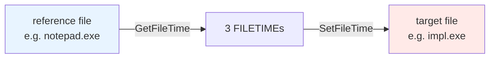

# Timestomp

[← cleanup index](README.md) · [docs/index](../../index.md)

## TL;DR

You dropped a file in a system directory and want it to blend
in with the OS install timestamps. This package rewrites the
file's user-visible timestamps to match a "donor" system file.

| You want to… | Use | Notes |
|---|---|---|
| Set timestamps to specific values | [`SetTimes`](#settimes) | Three explicit timestamps in one call |
| Copy timestamps from another file | [`CopyFromFull`](#copyfromfull) | All four `$SI` timestamps from donor |
| Match a chosen System32 binary's timestamps | `CopyFromFull(donor, target)` | E.g. `\Windows\System32\notepad.exe` for "looks installed by Windows" |

What this DOES achieve:

- `dir`, `Get-ChildItem`, Explorer, `os.Stat` all see the
  spoofed timestamps. Casual triage doesn't notice.
- Quick alignment — drop a file at 14:32:11, copy notepad's
  install timestamps, the file appears to be from
  Windows-install date.

What this does NOT achieve:

- **Forensic-grade tooling defeats this trivially** — Sleuth
  Kit's `fls`, Plaso's `psort`, Velociraptor all read the
  immutable `$FILE_NAME` (`$FN`) timestamps too, which user-mode
  APIs cannot modify. The `$SI` vs `$FN` mismatch IS the
  signature of timestomping.
- **NTFS only** — `$SI`/`$FN` are NTFS concepts. FAT / exFAT
  / network shares have one set of timestamps, no duality
  signature.
- **Doesn't hide the create event** — `$LogFile`, `$UsnJrnl`
  recorded the original create+modify timestamps before the
  stomp. Forensic recovery from journals catches you.
- **Doesn't help on memory-only artefacts** — by definition
  no on-disk timestamps. This is for dropped files only.

## Primer

Every NTFS file has **two** sets of timestamps:

- `$STANDARD_INFORMATION` (`$SI`) — read by `dir`, Explorer, `os.Stat`,
  `GetFileTime`. Mutable from user-mode via `SetFileTime`.
- `$FILE_NAME` (`$FN`) — maintained by the filesystem driver itself.
  Read by forensic tooling (Sleuth Kit, Plaso). User-mode APIs cannot
  modify it; only kernel-mode code (e.g. `FSCTL_SET_FILE_INFORMATION`
  with the right context) can.

Standard timestomping changes only `$SI`. Triage tools and AV looking at
the four `$SI` timestamps see the implant as "old". Forensic tools
comparing `$SI` against `$FN` see the disparity and flag it.

This package handles the user-mode `$SI` path. To also rewrite `$FN`,
you'd need a kernel driver — out of scope here.

## How it works



`CopyFrom` is the common path: open the reference, read its three
timestamps, apply them to the target. `Set` is the explicit-value path
when you want a specific date.

The OS kernel's `$FN` records remain untouched — that's the gap forensic
tools exploit.

## API → godoc

[`pkg.go.dev/github.com/oioio-space/maldev/cleanup/timestomp`](https://pkg.go.dev/github.com/oioio-space/maldev/cleanup/timestomp) is the authoritative
reference for every exported symbol. This page teaches the
*concepts*; the godoc is the *specification*.

## Examples

### Simple

```go
import (
    "time"
    "github.com/oioio-space/maldev/cleanup/timestomp"
)

// Make impl.exe look 5 years old
old := time.Now().Add(-5 * 365 * 24 * time.Hour)
_ = timestomp.Set(`C:\Users\Public\impl.exe`, old, old)
```

### Composed (with reference file)

Match a stable system binary so the dropped artefact blends with
neighbours:

```go
ref := `C:\Windows\System32\notepad.exe`
_ = timestomp.CopyFrom(ref, `C:\Users\Public\impl.exe`)
```

### Advanced (chain into wipe + selfdelete)

Reset directory metadata so the parent doesn't show "recently modified":

```go
ref := `C:\Windows\System32\notepad.exe`
_ = timestomp.CopyFrom(ref, filepath.Dir(target))
_ = wipe.File(target, 3)
_ = timestomp.CopyFrom(ref, filepath.Dir(target)) // re-stomp after unlink
_ = selfdelete.Run()
```

### Complex (build-time stomping)

For implants you build and deliver — not for runtime cleanup:

```go
//go:build ignore

// Pre-flight build hook: make the dropped EXE look like cmd.exe in a
// snapshot from 2019 (BUILD-TIME, not runtime).
_ = timestomp.CopyFrom("samples/cmd.exe", "dist/impl.exe")
```

## OPSEC & Detection

| Artefact | Where defenders look |
|---|---|
| `$STANDARD_INFORMATION` recently changed but `$FILE_NAME` unchanged | Sleuth Kit `istat`, Plaso, `MFTECmd` |
| `SetFileTime` API call on a file in a writable user directory | EDR file-IO event aggregation (low-fidelity) |
| Cluster of files with identical `$SI` timestamps | Statistical hunt — multiple stomped files often inherit identical times |

**D3FEND counter:** [D3-FH](https://d3fend.mitre.org/technique/d3f:FileHashing/)
(weak; the real counter is **MFT analysis**). Hardening: enable
audit-policy on file modifications in critical directories.

## MITRE ATT&CK

| T-ID | Name | Sub-coverage |
|---|---|---|
| [T1070.006](https://attack.mitre.org/techniques/T1070/006/) | Indicator Removal: Timestomp | `$STANDARD_INFORMATION`-only variant |

## Limitations

- **`$FILE_NAME` not touched.** A forensic comparison defeats this. To
  also rewrite `$FN`, kernel-mode access (a driver, or a BYOVD primitive)
  is needed — out of scope for this package.
- **Resolution differs by filesystem.** NTFS stores 100-ns precision;
  FAT32 stores 2-second precision. Cloning from NTFS to FAT32 truncates.
- **Some `$SI` triggers** (e.g. content rewrite by another tool, AV
  scan) re-update the timestamps after the stomp. Stomp last in the
  cleanup sequence.

## See also

- [`cleanup/wipe`](wipe.md) — pair to clean directory mtime after
  unlink.
- [Sleuth Kit `istat`](https://wiki.sleuthkit.org/index.php?title=Istat)
  — defender-side comparison tool.
- [Eric Zimmerman's MFTECmd](https://ericzimmerman.github.io/) — modern
  forensic MFT parser.
- [SANS — NTFS Time Rules](https://www.sans.org/blog/the-windows-ntfs-time-rules/)
  — overview of when `$SI` vs `$FN` updates fire.
