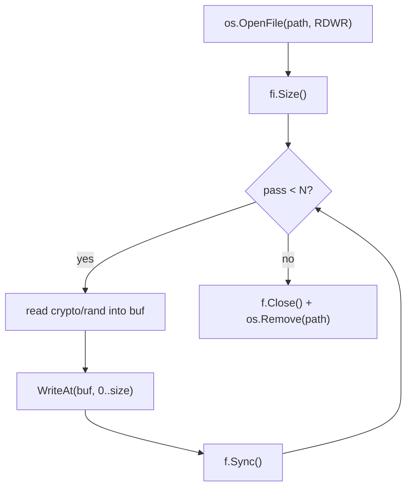

# Secure file wipe

[← cleanup index](README.md) · [docs/index](../../index.md)

## TL;DR

You want a file gone from disk such that PhotoRec / Recuva /
`ntfsundelete` can't recover it. `os.Remove` only unlinks the
directory entry — content stays in unallocated clusters until
overwritten. This package overwrites first, then removes.

| You want to… | Use | Cost |
|---|---|---|
| Wipe a single file | [`File`](#file) | One pass random + remove |
| Multi-pass for paranoia | [`FileN`](#filen) | N passes — diminishing returns past 1-3 |
| Wipe a directory tree | [`Tree`](#tree) | Walks + wipes every regular file |

What this DOES achieve:

- Recovered cluster content is `crypto/rand` bytes. `strings`,
  carve-by-format (PhotoRec), and undelete utilities all see
  noise.
- Cross-platform — works on Windows / Linux / macOS without
  filesystem-specific code.

What this does NOT achieve:

- **SSD wear-levelling makes single-overwrite ineffective** —
  the SSD controller maps logical writes to physical cells
  via FTL. Your "overwrite" hits a NEW cell; the original
  cell stays in the wear-leveling pool until garbage-collected.
  TRIM/discard helps but isn't guaranteed. For high-assurance
  SSD wipe: `secure erase` ATA command (out of scope here).
- **Doesn't wipe `$LogFile` / `$UsnJrnl`** — NTFS journals
  recorded the file's path + first ~4 KB on create. Forensic
  carving from journals can recover.
- **Doesn't wipe Volume Shadow Copies** — VSS snapshots taken
  before your wipe still contain the original file. Run
  `vssadmin delete shadows` (admin) BEFORE relying on this.
- **Doesn't wipe physical residual magnetism on HDDs** — at
  the platter level, multiple overwrites + slot rotation
  reduce but don't eliminate. Threat model: nation-state
  forensic lab. For most ops, single-pass is plenty.

## Primer

When you `os.Remove` a file, the OS unlinks the directory entry but the
underlying disk blocks remain readable until reused. Tools like
PhotoRec, Recuva, and `ntfsundelete` walk the MFT and recover those
blocks. A multi-pass random overwrite makes the recovered content
indistinguishable from random — useful for keys, configs, and any
short-lived artefact you want to leave behind cleanly.

The countermeasure isn't perfect: SSDs remap blocks transparently, so
overwriting "the same file" may write to fresh cells while the original
data sits in the wear-levelling pool until the controller rewrites it.
For SSD targets, paired host-level encryption (BitLocker, LUKS) is the
real answer.

## How it works



Each pass reads a new random buffer (no buffer reuse — fresh randomness
forces the filesystem to actually rewrite blocks rather than dedup
identical writes). `f.Sync()` after each pass forces the page cache to
flush to disk.

## API → godoc

[`pkg.go.dev/github.com/oioio-space/maldev/cleanup/wipe`](https://pkg.go.dev/github.com/oioio-space/maldev/cleanup/wipe) is the authoritative
reference for every exported symbol. This page teaches the
*concepts*; the godoc is the *specification*.

## Examples

### Simple

```go
import "github.com/oioio-space/maldev/cleanup/wipe"

if err := wipe.File("/tmp/secret.bin", 3); err != nil {
    log.Fatal(err)
}
```

### Composed (with `cleanup/timestomp`)

```go
import (
    "github.com/oioio-space/maldev/cleanup/timestomp"
    "github.com/oioio-space/maldev/cleanup/wipe"
)

// Reset parent dir mtime BEFORE wiping the child — otherwise the child
// removal updates the parent dir.
ref := `C:\Windows\System32\notepad.exe`
_ = timestomp.CopyFrom(ref, filepath.Dir(target))

_ = wipe.File(target, 3)

// Re-stomp parent (the unlink we just did updated it again).
_ = timestomp.CopyFrom(ref, filepath.Dir(target))
```

### Advanced

End-of-mission cleanup chain:

```go
// 1. Wipe payload droppers
for _, f := range []string{"impl.dll", "loader.exe", "config.json"} {
    _ = wipe.File(filepath.Join(workDir, f), 3)
}

// 2. Reset workdir parent mtime
_ = timestomp.CopyFrom(`C:\Windows\System32\notepad.exe`, filepath.Dir(workDir))

// 3. Self-delete the running EXE
_ = selfdelete.Run()
```

## OPSEC & Detection

| Artefact | Where defenders look |
|---|---|
| Repeated full-file writes of the same size | EDR file-IO event aggregation |
| `crypto/rand` reads driving large writes | `RtlGenRandom` / `BCryptGenRandom` event volume |
| Final unlink event | NTFS `$LogFile` / Sysmon Event 11 |

**D3FEND counter:** [D3-PFV](https://d3fend.mitre.org/technique/d3f:PersistentFileVolume/)
(Persistent File Volume Inspection) — file-recovery tooling against
journaled filesystems. Mitigates partial overwrites, defeated by complete
multi-pass overwrites only on rotational disks.

## MITRE ATT&CK

| T-ID | Name | Sub-coverage |
|---|---|---|
| [T1070.004](https://attack.mitre.org/techniques/T1070/004/) | Indicator Removal: File Deletion | overwrite-then-delete variant |

## Limitations

- **Not effective on SSDs** at the physical layer (wear levelling).
- **Not effective on copy-on-write filesystems** (ZFS, Btrfs, ReFS) — old
  blocks survive in the volume's snapshot space until garbage-collected.
- **Filesystem journaling** (NTFS `$LogFile`, ext4 jbd2) may retain
  metadata copies of file size and name even after the data blocks are
  overwritten.
- **Antivirus realtime scan** may already have copied the file to its
  scan cache; wiping the original doesn't reach those copies.

## See also

- [`cleanup/selfdelete`](self-delete.md) — for the running EXE itself.
- [`cleanup/timestomp`](timestomp.md) — pair to reset parent-dir mtime.
- [`cleanup/memory`](memory-wipe.md) — same intent, in-memory.
- [DoD 5220.22-M historical reference](https://www.esd.whs.mil/Portals/54/Documents/DD/issuances/dodm/522022M.pdf)
  — the canonical "secure delete" standard.
