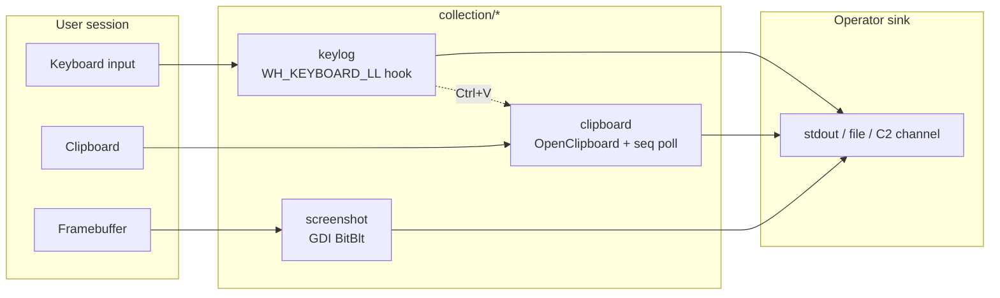

# Collection techniques

[← maldev README](../../../README.md) · [docs/index](../../index.md)

The `collection/*` package tree groups **local data-acquisition primitives**
for post-exploitation: keystrokes, clipboard contents, screen captures.
Each sub-package is self-contained and Windows-only — pick the data source
the operator needs and import the matching package.

> **Where to start (novice path):**
> 1. [`clipboard`](clipboard.md) — quietest collector. One-shot
>    `ReadText` or polling `Watch` channel. Catches passwords
>    pasted from password managers.
> 2. [`screenshot`](screenshot.md) — periodic visual capture.
>    Useful for rich applications (banking, encrypted chat)
>    where the actual data isn't accessible programmatically.
> 3. [`keylog`](keylogging.md) — last resort. Catches everything
>    typed but the WH_KEYBOARD_LL hook is the textbook EDR
>    signal. Use only when other paths don't suffice.

## Packages

| Package | Tech page | Detection | One-liner |
|---|---|---|---|
| [`collection/keylog`](https://pkg.go.dev/github.com/oioio-space/maldev/collection/keylog) | [keylogging.md](keylogging.md) | noisy | low-level keyboard hook with per-event window/process attribution and Ctrl+V clipboard capture |
| [`collection/clipboard`](https://pkg.go.dev/github.com/oioio-space/maldev/collection/clipboard) | [clipboard.md](clipboard.md) | quiet | one-shot `ReadText` plus `Watch` channel driven by `GetClipboardSequenceNumber` polling |
| [`collection/screenshot`](https://pkg.go.dev/github.com/oioio-space/maldev/collection/screenshot) | [screenshot.md](screenshot.md) | quiet | GDI `BitBlt` → PNG; primary, arbitrary rectangle, or per-monitor capture |

## Quick decision tree

| You want to… | Use |
|---|---|
| …record what the user types, with window context | [`keylog.Start`](keylogging.md) |
| …also capture pasted credentials | [`keylog.Start`](keylogging.md) — Ctrl+V auto-snapshots clipboard into the event |
| …read clipboard once (e.g. after `runas`) | [`clipboard.ReadText`](clipboard.md) |
| …stream clipboard changes for a session | [`clipboard.Watch`](clipboard.md) |
| …grab the primary monitor as PNG | [`screenshot.Capture`](screenshot.md) |
| …enumerate monitors first, then capture one | [`screenshot.DisplayCount`](screenshot.md) → [`CaptureDisplay`](screenshot.md) |
| …crop to a specific UI region (e.g. an open RDP window) | [`screenshot.CaptureRect`](screenshot.md) |

## MITRE ATT&CK

| T-ID | Name | Packages | D3FEND counter |
|---|---|---|---|
| [T1056.001](https://attack.mitre.org/techniques/T1056/001/) | Input Capture: Keylogging | `collection/keylog` | [D3-PA](https://d3fend.mitre.org/technique/d3f:ProcessAnalysis/) |
| [T1115](https://attack.mitre.org/techniques/T1115/) | Clipboard Data | `collection/clipboard`, `collection/keylog` (paste capture) | [D3-PA](https://d3fend.mitre.org/technique/d3f:ProcessAnalysis/) |
| [T1113](https://attack.mitre.org/techniques/T1113/) | Screen Capture | `collection/screenshot` | [D3-PA](https://d3fend.mitre.org/technique/d3f:ProcessAnalysis/) |

## Cross-referenced techniques

Two adjacent collection workflows live under sibling areas. They are
listed here as a navigation convenience; their canonical homes are the
packages that own them.

| Area concern | Tech page | Owning package |
|---|---|---|
| NTFS Alternate Data Streams (hide collected data in `:stream` suffixes) | [alternate-data-streams.md](alternate-data-streams.md) | [`cleanup/ads`](../cleanup/README.md) |
| LSASS minidump (in-process MINIDUMP assembly via `NtReadVirtualMemory`) | [lsass-dump.md](lsass-dump.md) | [`credentials/lsassdump`](https://pkg.go.dev/github.com/oioio-space/maldev/credentials/lsassdump) |

> [!NOTE]
> Both pages will move to their owning areas in Phase 6 of the doc
> refactor (see [.dev/refactor-2026/progress.md](../../refactor-2026-doc/progress.md)).

## See also

- [Operator path: post-exploitation collection](../../by-role/operator.md)
- [Detection eng path: collection telemetry](../../by-role/detection-eng.md)
- [`c2/transport`](../c2/README.md) — exfiltrate captured data over the
  established channel.
- [`crypto`](../crypto/README.md) — encrypt collected blobs before
  staging or transmission.
- [`cleanup`](../cleanup/README.md) — wipe collection artefacts after
  exfiltration.
