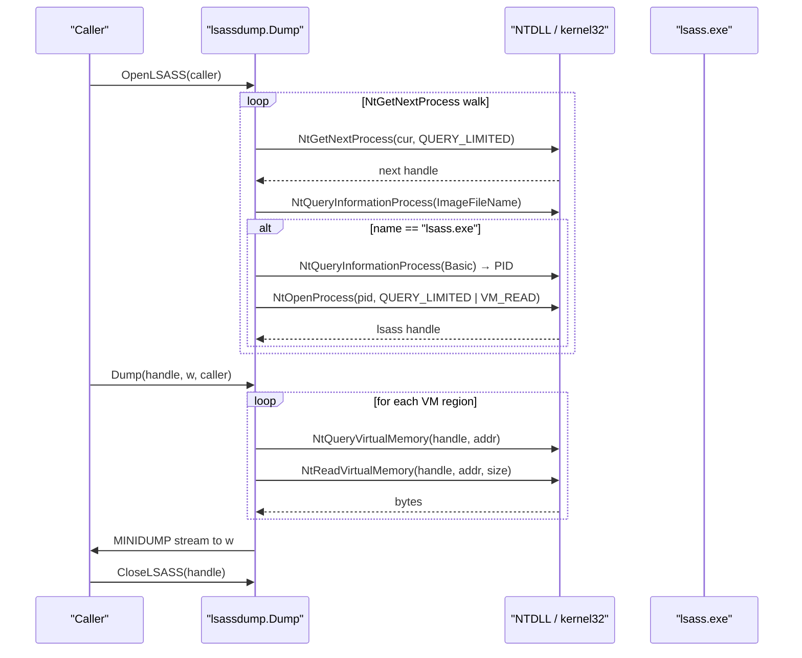

---
---

# LSASS Credential Dump

[<- Back to Collection](README.md)

**MITRE ATT&CK:** [T1003.001 — OS Credential Dumping: LSASS Memory](https://attack.mitre.org/techniques/T1003/001/)
**Package:** `credentials/lsassdump`
**Platform:** Windows
**Detection:** High

---

## Primer

`lsass.exe` holds, in memory, every credential material the OS has seen
since boot: NTLM hashes (MSV), Kerberos TGT/keys, WDigest plaintexts
(when enabled), DPAPI master keys, cached domain credentials, and
CloudAP / Live session tokens. Dumping the process and feeding the blob
to mimikatz / pypykatz is the single most common lateral-movement prime
in Windows red-team engagements.

The loud path — `MiniDumpWriteDump(lsass.exe, out.dmp, MiniDumpWithFullMemory)` —
is blocked or alerted by every modern EDR: `MiniDumpWriteDump` is
heavily hooked, and so is `OpenProcess(PROCESS_VM_READ, lsass.pid)` on
its own.

`credentials/lsassdump` ships a quieter variant:

1. **Stealthier process discovery**: `NtGetNextProcess` walks the
   running-process list with `PROCESS_QUERY_LIMITED_INFORMATION` only
   (cheap access that even protected processes grant). No
   `EnumProcesses` call, no PID enumeration via ToolHelp.
2. **Minimal audit surface**: the single `VM_READ` request only targets
   lsass.exe — via `NtOpenProcess(CLIENT_ID{pid, 0}, QUERY_LIMITED|VM_READ)`
   after the walk identifies it. No other process is opened with
   `VM_READ`.
3. **No dbghelp**: the MINIDUMP blob is assembled in-process, streaming
   to the caller's `io.Writer`. `MiniDumpWriteDump` is never imported.
4. **Caller-routed syscalls**: every `Nt*` call accepts an optional
   `*wsyscall.Caller` so the operator can route via direct / indirect
   syscalls / Hell's Gate, bypassing ntdll function-start hooks.

---

## How It Works



**Step-by-step:**

1. `OpenLSASS(caller)` walks the process list with QUERY_LIMITED_INFORMATION.
2. For each handle, `NtQueryInformationProcess(ProcessImageFileName, 27)`
   returns the image path; we basename-match case-insensitively against
   `lsass.exe`.
3. On match, `NtQueryInformationProcess(ProcessBasicInformation, 0)`
   yields the PID. The walk handle is closed.
4. `NtOpenProcess` opens the target with `QUERY_LIMITED | VM_READ`.
   `STATUS_ACCESS_DENIED` → `ErrOpenDenied` (need admin);
   `STATUS_PROCESS_IS_PROTECTED` → `ErrPPL` (Credential Guard / RunAsPPL=1).
5. `Dump(h, w, caller)` assembles a MINIDUMP `Config`:
   - **Regions**: `NtQueryVirtualMemory` loop from addr 0, every
     committed non-free non-guard region, contents via
     `NtReadVirtualMemory` in one shot.
   - **Modules**: `K32EnumProcessModulesEx(LIST_MODULES_ALL)` +
     `K32GetModuleFileNameExW` (path-hooked psapi today; PEB-walk
     variant is future work).
   - **SystemInfo**: `win/version.Current()` under the hood, so
     credential parsers pick the right per-build offset table.
6. `minidump.Build(w, cfg)` streams the four streams
   (SystemInfoStream, ThreadListStream, ModuleListStream,
   Memory64ListStream) plus raw region bytes — no intermediate buffer
   for memory contents.

---

## Usage

```go
import (
    "github.com/oioio-space/maldev/credentials/lsassdump"
)

func main() {
    stats, err := lsassdump.DumpToFile(`C:\ProgramData\Intel\snapshot.bin`, nil)
    if err != nil {
        switch {
        case errors.Is(err, lsassdump.ErrOpenDenied):
            // Need admin. Escalate or bail.
        case errors.Is(err, lsassdump.ErrPPL):
            // Credential Guard / RunAsPPL=1 — separate unprotect chantier.
        default:
            log.Fatal(err)
        }
    }
    fmt.Printf("dumped %d regions / %d bytes / %d modules\n",
        stats.Regions, stats.Bytes, stats.ModuleCount)
}
```

### Stealthier syscalls via `*wsyscall.Caller`

```go
caller := wsyscall.New(wsyscall.MethodIndirect, wsyscall.NewHellsGate())
stats, err := lsassdump.DumpToFile("snapshot.bin", caller)
// Every NtGetNextProcess / NtQueryInformationProcess /
// NtQueryVirtualMemory / NtReadVirtualMemory / NtOpenProcess above
// goes through caller → no ntdll function-start hook ever fires.
```

### Streaming into memory (no on-disk artifact)

```go
var buf bytes.Buffer
h, err := lsassdump.OpenLSASS(nil)
if err != nil { log.Fatal(err) }
defer lsassdump.CloseLSASS(h)
stats, err := lsassdump.Dump(h, &buf, nil)
// buf now holds the full MINIDUMP — exfil via C2 without ever writing.
```

---

## Validation

The package's `TestDumpToFile_ProducesValidMiniDump` runs on the
Windows VM under `MALDEV_INTRUSIVE=1` and asserts:

- MDMP magic + version 42899 + 4 streams
- At least one memory region and one module
- File size > 1 MB (lsass is typically 50–200 MB of committed VM)

A real run against an unprotected Win10 VM parses cleanly with
pypykatz — MSV NT hashes, WDigest plaintexts (if available), Kerberos
session material, DPAPI master keys, and CloudAP tokens all come
through. Compatibility with mimikatz is equivalent by construction:
the stream layout matches `MiniDumpWriteDump(MiniDumpWithFullMemory)`.

---

## Limitations

- **PPL-protected lsass** (default on Win11, opt-in on Win10 via
  `RunAsPPL=1` or Credential Guard) refuses VM_READ to userland. The
  package now ships an **EPROCESS-unprotect** path
  (`Unprotect(rw driver.ReadWriter, eprocess uintptr, tab PPLOffsetTable)`):
  caller plugs in a `kernel/driver.ReadWriter` (RTCore64, GDRV, custom),
  passes lsass's EPROCESS kernel VA + the build's
  `PS_PROTECTION` byte offset, and Unprotect zeros the byte. A
  subsequent `OpenLSASS` succeeds normally; `Reprotect(tok, rw)` puts
  the byte back. Caller is responsible for resolving lsass's EPROCESS
  upstream (PsActiveProcessHead walk / handle-table parse / bring
  your own primitive) — different attack chains use different
  walks, so wrapping that lookup is not part of the surface. See
  [BYOVD — RTCore64](../kernel/byovd-rtcore64.md) for the
  driver-side primitive and `kernel/driver/rtcore64`'s SCM lifecycle.
- **Module enumeration** uses `K32EnumProcessModulesEx` (psapi), which
  is path-hooked by some EDRs. A PEB-walk variant (`InMemoryOrderModuleList`)
  is tracked as **future work**.
- **Threads are not captured** — the ThreadListStream is emitted with
  zero entries. Credential parsers (mimikatz / pypykatz) only need
  modules + memory; threads are cosmetic for our use case. Can be
  added if a consumer explicitly needs context bytes (e.g., live
  debugger open).
- **No chunked reads**: each region is read in one `NtReadVirtualMemory`.
  For a 200 MB capture this means a 200 MB allocation cross-pagefile —
  acceptable for the threat model but a future optimisation.

---

## API → godoc

[`pkg.go.dev/github.com/oioio-space/maldev/credentials/lsassdump`](https://pkg.go.dev/github.com/oioio-space/maldev/credentials/lsassdump) is the authoritative
reference for every exported symbol. This page teaches the
*concepts*; the godoc is the *specification*.

## See also

- [Collection area README](README.md)
- [`credentials/lsassdump`](../credentials/lsassdump.md) — canonical owner of the LSASS dump producer (PPL bypass + MINIDUMP build)
- [`credentials/sekurlsa`](../credentials/sekurlsa.md) — pure-Go MINIDUMP parser; consumes the bytes produced here
