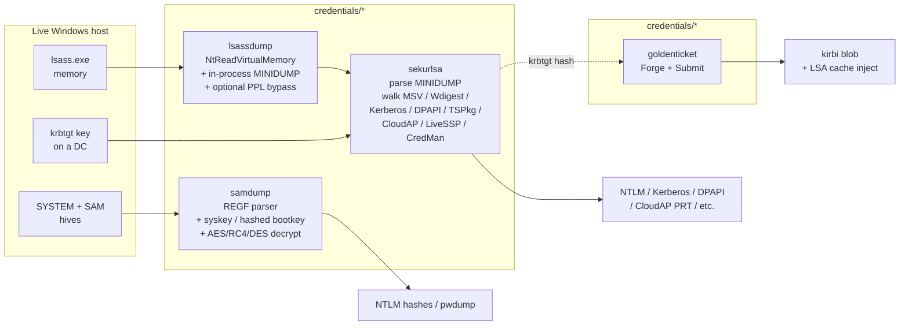

---
---

# Credential access

[← maldev README](../../../README.md) · [docs/index](../../index.md)

Pure-Go credential-extraction primitives for Windows: live LSASS
process dumping, offline SAM hive parsing, in-process MINIDUMP
parsing, and Kerberos ticket forging. The four packages chain
end-to-end — `lsassdump` produces a dump, `sekurlsa` parses it
into typed credentials, `goldenticket` re-uses an extracted
krbtgt hash to mint a Golden TGT, and `samdump` covers the
local-account branch when LSASS access is unavailable.

> **Where to start (novice path):**
> 1. Want NTLM hashes / Kerberos tickets from the live host? →
>    [`lsassdump`](lsassdump.md) → [`sekurlsa`](sekurlsa.md)
>    chain. The two-package pipeline covers 90% of credential
>    extraction needs.
> 2. Want local SAM hashes (no LSASS access)? →
>    [`samdump`](samdump.md) — offline-friendly REGF parser.
> 3. Already have a krbtgt hash and want long-dwell domain admin? →
>    [`goldenticket`](goldenticket.md) — forge + submit.
>
> The Quick decision tree below maps every common operator
> question to the exact entry point.

## Packages

| Package | Tech page | Detection | One-liner |
|---|---|---|---|
| [`credentials/lsassdump`](https://pkg.go.dev/github.com/oioio-space/maldev/credentials/lsassdump) | [lsassdump.md](lsassdump.md) | noisy | `NtGetNextProcess` + in-process MINIDUMP + EPROCESS PPL unprotect via RTCore64 |
| [`credentials/sekurlsa`](https://pkg.go.dev/github.com/oioio-space/maldev/credentials/sekurlsa) | [sekurlsa.md](sekurlsa.md) | quiet (parser only) | Pure-Go MSV1_0 / Wdigest / Kerberos / DPAPI / TSPkg / CloudAP / LiveSSP / CredMan walkers + LSA-crypto unwrap + PTH write-back + Kerberos kirbi export |
| [`credentials/samdump`](https://pkg.go.dev/github.com/oioio-space/maldev/credentials/samdump) | [samdump.md](samdump.md) | quiet (offline) / noisy (LiveDump) | Offline SAM hive dump — REGF parser + boot-key permutation + AES/RC4 hashed-bootkey + per-RID DES de-permutation |
| [`credentials/goldenticket`](https://pkg.go.dev/github.com/oioio-space/maldev/credentials/goldenticket) | [goldenticket.md](goldenticket.md) | noisy (visible TGT lifetime) | PAC marshaling + KRB5 `Forge` + LSA `Submit` for Golden Ticket attacks |

## Quick decision tree

| You want to… | Use |
|---|---|
| …get NTLM hashes / Kerberos tickets from a live host | [`lsassdump`](lsassdump.md) → [`sekurlsa.Parse`](sekurlsa.md) chain |
| …parse a `.dmp` you obtained out-of-band | [`sekurlsa.Parse`](sekurlsa.md) |
| …dump SAM offline (no LSASS access) | [`samdump.Dump`](samdump.md) |
| …acquire SAM/SYSTEM live (loud) | [`samdump.LiveDump`](samdump.md) |
| …forge a Golden Ticket | [`goldenticket.Forge`](goldenticket.md) → [`Submit`](goldenticket.md) |
| …pass-the-hash into a live LSASS | [`sekurlsa.Pass`](sekurlsa.md) / `PassImpersonate` |
| …pass-the-ticket | [`sekurlsa.KerberosTicket.ToKirbi`](sekurlsa.md) → [`goldenticket.Submit`](goldenticket.md) |
| …bypass PPL on lsass.exe | [`lsassdump.Unprotect`](lsassdump.md) + [`kernel/driver/rtcore64`](../kernel/byovd-rtcore64.md) |

## MITRE ATT&CK

| T-ID | Name | Packages | D3FEND counter |
|---|---|---|---|
| [T1003.001](https://attack.mitre.org/techniques/T1003/001/) | OS Credential Dumping: LSASS Memory | `credentials/lsassdump`, `credentials/sekurlsa` | [D3-PSA](https://d3fend.mitre.org/technique/d3f:ProcessSpawnAnalysis/), [D3-SICA](https://d3fend.mitre.org/technique/d3f:SystemConfigurationDatabaseAnalysis/) |
| [T1003.002](https://attack.mitre.org/techniques/T1003/002/) | OS Credential Dumping: SAM | `credentials/samdump` | [D3-PSA](https://d3fend.mitre.org/technique/d3f:ProcessSpawnAnalysis/), [D3-FCA](https://d3fend.mitre.org/technique/d3f:FileContentAnalysis/) |
| [T1068](https://attack.mitre.org/techniques/T1068/) | Exploitation for Privilege Escalation | `credentials/lsassdump` (PPL bypass via BYOVD) | [D3-SICA](https://d3fend.mitre.org/technique/d3f:SystemConfigurationDatabaseAnalysis/) |
| [T1550.002](https://attack.mitre.org/techniques/T1550/002/) | Use Alternate Authentication Material: Pass the Hash | `credentials/sekurlsa` | [D3-PSA](https://d3fend.mitre.org/technique/d3f:ProcessSpawnAnalysis/), [D3-SICA](https://d3fend.mitre.org/technique/d3f:SystemConfigurationDatabaseAnalysis/) |
| [T1550.003](https://attack.mitre.org/techniques/T1550/003/) | Use Alternate Authentication Material: Pass the Ticket | `credentials/sekurlsa`, `credentials/goldenticket` | [D3-NTA](https://d3fend.mitre.org/technique/d3f:NetworkTrafficAnalysis/) |
| [T1558.001](https://attack.mitre.org/techniques/T1558/001/) | Steal or Forge Kerberos Tickets: Golden Ticket | `credentials/goldenticket` | [D3-AZET](https://d3fend.mitre.org/technique/d3f:AuthorizationEventThresholding/), [D3-NTA](https://d3fend.mitre.org/technique/d3f:NetworkTrafficAnalysis/) |
| [T1558.003](https://attack.mitre.org/techniques/T1558/003/) | Steal or Forge Kerberos Tickets: Kerberoasting | `credentials/sekurlsa` (downstream consumer) | [D3-NTA](https://d3fend.mitre.org/technique/d3f:NetworkTrafficAnalysis/) |

## See also

- [Operator path: credential harvest scenario](../../by-role/operator.md#credential-harvest)
- [Detection eng path: credential-access artifacts](../../by-role/detection-eng.md#credential-access)
- [`kernel/driver/rtcore64`](../kernel/byovd-rtcore64.md) — BYOVD primitive for PPL unprotect
- [`evasion/stealthopen`](../evasion/stealthopen.md) — path-based file-hook bypass for `ntoskrnl.exe` discovery reads
- [`recon/shadowcopy`](../recon/) — VSS-based hive acquisition for `samdump`
