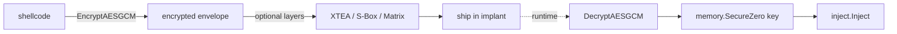

---
---

# Crypto techniques

[← maldev README](../../../README.md) · [docs/index](../../index.md)

The `crypto/` package supplies confidentiality and signature-breaking
primitives for payload protection. Two surfaces sit side-by-side: strong
AEAD ciphers for the outer envelope, and lightweight transforms for layered
unpackers and signature defeat.

> [!NOTE]
> Encoding (Base64, UTF-16LE, PowerShell `-EncodedCommand`) lives in
> [`docs/techniques/encode`](../encode/README.md). Hashing (cryptographic +
> fuzzy + ROR13) lives in [`docs/techniques/hash`](../hash/README.md).

## TL;DR

Build-time: encrypt with AES-256-GCM (or XChaCha20-Poly1305), optionally
wrap in 1–2 lightweight obfuscation layers, embed in the implant. Runtime:
decrypt → wipe key → inject → wipe plaintext.

> **Where to start (novice path):**
> 1. [`payload-encryption`](payload-encryption.md) — the only
>    page in this area. Read the "Pick the primitive" 9-row
>    matrix at the top to choose your cipher; read the
>    recommended 3-layer stack diagram for the standard
>    permutation→cipher→AEAD ordering.
> 2. After encrypting, pair with [`cleanup/memory-wipe`](../cleanup/memory-wipe.md)
>    to scrub the key + plaintext from memory after use.

## Packages

| Package | Tech page | Detection | One-liner |
|---|---|---|---|
| [`crypto`](https://pkg.go.dev/github.com/oioio-space/maldev/crypto) | [payload-encryption.md](payload-encryption.md) | very-quiet | AEAD (AES-GCM, ChaCha20), stream/block (RC4, TEA, XTEA), signature-breaking transforms (S-Box, Matrix, XOR, ArithShift) |

The package mixes three layers; the technique page documents each layer
separately.

For a side-by-side comparison of every primitive (Layer / Speed / Entropy /
Key size / IV / Authenticated / Reversible / Static signature / Best-for),
see the **["Pick the primitive"](payload-encryption.md#pick-the-primitive)**
9-row matrix in `payload-encryption.md`. The matrix is the canonical place
to make a "which cipher / transform do I reach for?" choice; the decision
tree below is a quick-reference shortcut.

## Quick decision tree

| You want to… | Use |
|---|---|
| …encrypt the outer payload envelope | [`crypto.EncryptAESGCM`](payload-encryption.md#encryptaesgcmkey-plaintext-byte-byte-error) (preferred) or [`crypto.EncryptChaCha20`](payload-encryption.md#encryptchacha20key-plaintext-byte-byte-error) |
| …generate a sane key | [`crypto.NewAESKey`](payload-encryption.md#newaeskey-byte-error) / [`crypto.NewChaCha20Key`](payload-encryption.md#newchacha20key-byte-error) |
| …break a YARA byte signature without changing semantics | [`crypto.NewSBox`](payload-encryption.md#newsbox-sbox-256byte-inverse-256byte-err-error) + [`SubstituteBytes`](payload-encryption.md#substitutebytesdata-byte-sbox-256byte-byte) |
| …add a tiny in-process unpacker stage | [`crypto.EncryptXTEA`](payload-encryption.md#encryptxteakey-16byte-data-byte-byte-error) |
| …diffuse byte patterns across a block (Hill cipher) | [`crypto.MatrixTransform`](payload-encryption.md#matrixtransformdata-byte-key-byte-byte-error) |
| …match a legacy Metasploit handler | [`crypto.EncryptRC4`](payload-encryption.md#encryptrc4key-data-byte-byte-error) (cryptographically broken — compatibility only) |
| …compute SHA-256 / MD5 / ROR13 | [`hash` package](../hash/README.md) |
| …Base64 / UTF-16LE / PowerShell-encode | [`encode` package](../encode/README.md) |

## MITRE ATT&CK

| T-ID | Name | Packages | D3FEND counter |
|---|---|---|---|
| [T1027](https://attack.mitre.org/techniques/T1027/) | Obfuscated Files or Information | `crypto` (XOR, TEA, S-Box, Matrix, ArithShift) | D3-SEA (Static Executable Analysis) |
| [T1027.013](https://attack.mitre.org/techniques/T1027/013/) | Encrypted/Encoded File | `crypto` (AES-GCM, ChaCha20, RC4) | D3-FCR (File Content Rules) |

## See also

- [Operator path: payload protection](../../by-role/operator.md)
- [Researcher path: cipher choice](../../by-role/researcher.md)
- [Detection eng path: high-entropy artefacts](../../by-role/detection-eng.md)
- [`encode`](../encode/README.md) — transport-safe representations.
- [`hash`](../hash/README.md) — integrity + fuzzy similarity + ROR13.
- [`cleanup/memory.SecureZero`](../cleanup/memory-wipe.md) — pair to wipe keys after use.
