---
---

# ACG + BlockDLLs

> **MITRE ATT&CK:** T1562.001 -- Impair Defenses: Disable or Modify Tools | **D3FEND:** D3-AIPA -- Application Integrity Protection Analysis | **Detection:** Low

## Primer

Imagine you are in a clean room doing sensitive work. You lock the door so nobody can enter, and you cover all the air vents so nothing can be blown in. That is what ACG and BlockDLLs do to your process.

**ACG (Arbitrary Code Guard)** tells Windows: "Do not allow any new executable memory allocations in this process." Once enabled, nobody -- not even the operating system -- can create new `PAGE_EXECUTE_*` memory regions. This blocks EDR from injecting dynamic hooks or code into your process. It also blocks shellcode injection from outside.

**BlockDLLs (Binary Signature Policy)** tells Windows: "Only load DLLs that are signed by Microsoft." This prevents EDR products from loading their monitoring DLLs (like `CrowdStrike.dll` or `SentinelOne.dll`) into your process. Since these DLLs are typically signed by their vendor (not Microsoft), they are blocked.

Together, these two mitigations create a hardened process that rejects external code injection and unsigned DLL loading. The critical caveat: ACG also prevents your own shellcode from allocating executable memory, so you must apply it AFTER your injection is complete.

## How It Works

```mermaid
flowchart TD
    subgraph ACG["Arbitrary Code Guard"]
        A1[SetProcessMitigationPolicy] --> A2[ProcessDynamicCodePolicy]
        A2 --> A3[ProhibitDynamicCode = 1]
        A3 --> A4[All future VirtualAlloc\nwith PAGE_EXECUTE_* → FAIL]
        A3 --> A5[All future VirtualProtect\nto PAGE_EXECUTE_* → FAIL]
    end

    subgraph BlockDLLs["Block Non-Microsoft DLLs"]
        B1[SetProcessMitigationPolicy] --> B2[ProcessBinarySignaturePolicy]
        B2 --> B3[MicrosoftSignedOnly = 1]
        B3 --> B4[LoadLibrary of unsigned DLL → FAIL]
        B3 --> B5[EDR DLL injection → FAIL]
    end

    subgraph Timeline["Correct Application Order"]
        T1[1. Evasion: AMSI + ETW] --> T2[2. Injection: shellcode]
        T2 --> T3[3. Harden: ACG + BlockDLLs]
        T3 --> T4[Process is now locked down]
    end

    style A4 fill:#5c1a1a,color:#fff
    style A5 fill:#5c1a1a,color:#fff
    style B4 fill:#5c1a1a,color:#fff
    style B5 fill:#5c1a1a,color:#fff
    style T3 fill:#2d5016,color:#fff
```



**ACG internals:**
- Calls `SetProcessMitigationPolicy` with policy ID 2 (`ProcessDynamicCodePolicy`).
- Sets `ProhibitDynamicCode = 1` in the policy flags.
- Once set, this is **irreversible** for the process lifetime.

**BlockDLLs internals:**
- Calls `SetProcessMitigationPolicy` with policy ID 8 (`ProcessBinarySignaturePolicy`).
- Sets `MicrosoftSignedOnly = 1`.
- Once set, this is **irreversible** for the process lifetime.

## Usage

```go
package main

import (
    "log"

    "github.com/oioio-space/maldev/evasion/acg"
    "github.com/oioio-space/maldev/evasion/blockdlls"
)

func main() {
    // Enable ACG -- no more dynamic code allocation.
    if err := acg.Enable(nil); err != nil {
        log.Fatal(err)
    }

    // Block non-Microsoft DLLs.
    if err := blockdlls.Enable(nil); err != nil {
        log.Fatal(err)
    }
}
```

## Combined Example

```go
package main

import (
    "log"

    "github.com/oioio-space/maldev/evasion"
    "github.com/oioio-space/maldev/evasion/preset"
    "github.com/oioio-space/maldev/inject"
)

func main() {
    shellcode := []byte{0x90, 0x90, 0xCC}

    // 1. FIRST: Evasion (AMSI + ETW + unhook).
    evasion.ApplyAll(preset.Stealth(), nil)

    // 2. SECOND: Inject shellcode (needs executable memory allocation).
    if err := inject.ThreadPoolExec(shellcode); err != nil {
        log.Fatal(err)
    }

    // 3. LAST: Lock down the process.
    //    Aggressive preset includes ACG + BlockDLLs.
    //    WARNING: No more RWX allocations possible after this!
    evasion.ApplyAll(preset.Aggressive(), nil)

    // From this point:
    // - No EDR can inject hooks or DLLs
    // - No new executable memory can be created
    // - The process is hardened for the rest of its lifetime
}
```

## Advantages & Limitations

| Aspect | Detail |
|--------|--------|
| Stealth | High -- uses legitimate Windows mitigation APIs. Looks like a security-conscious application. |
| Effectiveness | Very high -- kernel-enforced. Even ring-0 drivers respect these mitigations (by design). |
| Irreversibility | Both policies are permanent for the process lifetime. Cannot be undone. |
| Order dependency | MUST apply AFTER all shellcode injection and evasion patching is complete. ACG blocks `VirtualProtect` to RX. |
| Compatibility | Windows 10 1709+ (Fall Creators Update). Returns error on older versions. |
| Limitations | `SetProcessMitigationPolicy` is a kernel32 export with no NT equivalent routable through `*wsyscall.Caller`. The `caller` parameter is accepted for API consistency but cannot bypass hooks on this specific function. BlockDLLs may break legitimate third-party DLLs. |

## API Reference

Two sibling packages: `evasion/acg` (Arbitrary Code Guard) and
`evasion/blockdlls` (Microsoft-signed-only DLL gate). Both expose
parallel `Enable` / Technique-constructor pairs and are typically
used together.

### Package `evasion/acg`

#### `acg.Enable(caller *wsyscall.Caller) error`

[godoc](https://pkg.go.dev/github.com/oioio-space/maldev/evasion/acg#Enable)

Activates Arbitrary Code Guard for the current process via
`SetProcessMitigationPolicy(ProcessDynamicCodePolicy, {ProhibitDynamicCode: 1})`.

**Parameters:** `caller` optional `*wsyscall.Caller` (nil = WinAPI
default) for routing the underlying syscall.

**Returns:** error if the policy call fails — most often when the
process has already executed `VirtualAlloc(PAGE_EXECUTE_*)` and the
kernel rejects the late opt-in.

**Side effects:** **irreversible for the lifetime of the process** —
ACG cannot be unset once enabled. All subsequent `VirtualAlloc(RX)` /
`VirtualProtect(→ RX)` calls are blocked by the kernel.

**OPSEC:** the policy enable itself is silent. Detection focuses on
the *absence* of dynamic-code allocations afterwards — fingerprint
of "implant that is done expanding its working set". Run **after**
any RWX allocations the implant needs (shellcode region, stub pages).

**Required privileges:** unprivileged.

**Platform:** Windows ≥ 10 1709. Returns "not implemented" on
older builds.

#### `acg.Guard() evasion.Technique`

[godoc](https://pkg.go.dev/github.com/oioio-space/maldev/evasion/acg#Guard)

Wraps `acg.Enable` as an `evasion.Technique` for use in
[`evasion/preset`](preset.md) stacks (`Hardened`, `Aggressive`).

**Returns:** `evasion.Technique` whose `Apply` calls `Enable` and
whose `Name` is `"acg.Guard"`.

**Side effects / OPSEC / Required privileges / Platform:** as
`Enable`.

### Package `evasion/blockdlls`

#### `blockdlls.Enable(caller *wsyscall.Caller) error`

[godoc](https://pkg.go.dev/github.com/oioio-space/maldev/evasion/blockdlls#Enable)

Blocks loading of non-Microsoft-signed DLLs into the current process
via `SetProcessMitigationPolicy(ProcessSignaturePolicy, {MicrosoftSignedOnly: 1})`.

**Parameters:** `caller` optional `*wsyscall.Caller` (nil = WinAPI
default).

**Returns:** error if the policy call fails — typically when an
unsigned DLL is already loaded (cannot retroactively unload it).

**Side effects:** **irreversible for the lifetime of the process** —
matches ACG's one-way contract. All subsequent `LoadLibrary*`
attempts on non-Microsoft-signed binaries return `ERROR_BAD_EXE_FORMAT`.

**OPSEC:** silent enable; subsequent failed `LoadLibrary` attempts
by EDR injection drivers may surface in EDR's own logs as failed
hooks. The policy is the standard browser-sandbox hardening — its
*presence* is unremarkable.

**Required privileges:** unprivileged.

**Platform:** Windows ≥ 10 1709.

#### `blockdlls.MicrosoftOnly() evasion.Technique`

[godoc](https://pkg.go.dev/github.com/oioio-space/maldev/evasion/blockdlls#MicrosoftOnly)

Wraps `blockdlls.Enable` as an `evasion.Technique`.

**Returns:** `evasion.Technique` whose `Apply` calls `Enable` and
whose `Name` is `"blockdlls.MicrosoftOnly"`.

**Side effects / OPSEC / Required privileges / Platform:** as
`Enable`.

## See also

- [Evasion area README](README.md)
- [`evasion/cet`](cet.md) — sibling process-mitigation hardening (CET shadow stack)
- [`evasion/preset`](preset.md) — bundles ACG + BlockDLLs into composable Technique stacks
