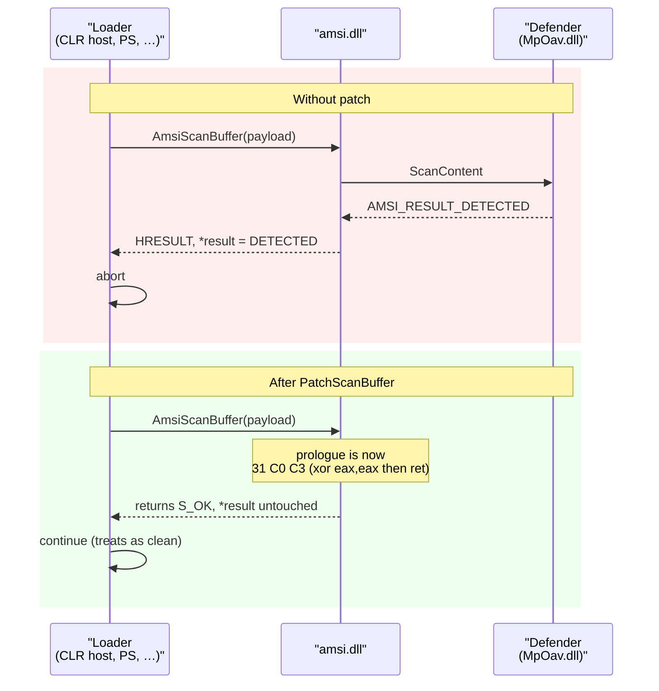

# AMSI bypass

[← evasion index](README.md) · [docs/index](../../index.md)

> **TL;DR** — patch `AmsiScanBuffer` (3-byte `xor eax,eax; ret`
> prologue) and/or `AmsiOpenSession` (flip the conditional jump)
> in the loaded `amsi.dll` of the current process. Every AMSI scan
> then returns "clean" without reaching the registered antimalware
> provider.

## What it does

The Antimalware Scan Interface (AMSI) is the Windows mechanism that
ships script bodies — PowerShell, .NET `Assembly.Load`, VBScript,
JScript — to a registered antimalware provider (usually Defender)
for inspection **before** the runtime executes them. If the provider
flags the body, the runtime aborts.

This package patches `amsi.dll` in the *current process's* address
space so that every subsequent scan returns a clean verdict without
the provider ever being called. It's a per-process operation;
other processes on the host stay unaffected.

> [!IMPORTANT]
> **Per-process scope only.** Patching here does not disable AMSI
> system-wide — a child PowerShell will get scanned unless that
> child also patches. Persists for the lifetime of the calling
> process.

## How it works



`PatchScanBuffer` walks five steps:

1. `LoadLibraryW("amsi.dll")` — ensures the module is mapped (no-op
   if already loaded).
2. `GetProcAddress(amsi, "AmsiScanBuffer")` resolves the entry.
3. `NtProtectVirtualMemory(addr, 3, PAGE_EXECUTE_READWRITE)` via
   the supplied `*wsyscall.Caller`.
4. memcpy `31 C0 C3` (`xor eax,eax; ret`) over the prologue.
5. `NtProtectVirtualMemory(addr, 3, original)` restores protection.

`PatchOpenSession` is the same shape but flips one byte
(`JZ → JNZ`) in `AmsiOpenSession`, so session creation always
"succeeds" without the provider initialising.

## Usage

```go
import (
    "github.com/oioio-space/maldev/evasion/amsi"
    "github.com/oioio-space/maldev/win/syscall" // wsyscall
)

caller, _ := wsyscall.New(wsyscall.MethodIndirect)
if err := amsi.PatchAll(caller); err != nil {
    return fmt.Errorf("amsi bypass: %w", err)
}
// AmsiScanBuffer + AmsiOpenSession now both short-circuit
// in this process for its lifetime.
```

Composed with the rest of the evasion stack via
[`evasion.ApplyAll`](preset.md):

```go
caller, _ := wsyscall.New(wsyscall.MethodIndirect)
results := evasion.ApplyAll([]evasion.Technique{
    unhook.CommonClassic(), // restore ntdll first
    amsi.All(),             // then blind AMSI
    etw.All(),              // then blind ETW
}, caller)
```

## Non-obvious behaviour

- `caller == nil` falls back to direct WinAPI for debug — never
  ship that to production (loud telemetry).
- `PatchScanBuffer` is naturally idempotent — it always writes
  the same 3 bytes at the function entry.
- `PatchOpenSession` carries a package-level atomic flag so
  re-invoking (e.g. once per caller in a sweep) doesn't consume
  additional `0x74` sites and surface a spurious "conditional
  jump not found" error.
- Returns `nil` silently if `amsi.dll` is not loaded **and**
  cannot be loaded (some sandbox flavours).

## OPSEC & detection

| Artefact | Where defenders look |
|---|---|
| `NtProtectVirtualMemory(amsi.dll, RWX)` | ETW TI `EVENT_TI_NTPROTECT` — **highest-leverage signal** |
| 3 bytes of `amsi.dll` differ from disk image | EDR memory-integrity scan of loaded modules |
| `AmsiScanBuffer` returns S_OK in 0 µs | Statistical hunt — real scans take 100 µs–10 ms |
| Process loaded `amsi.dll` but never calls back to provider | ETW provider event volume per process |

**D3FEND counters:**
[D3-PMC](https://d3fend.mitre.org/technique/d3f:ProcessModuleCodeManipulation/),
[D3-PSA](https://d3fend.mitre.org/technique/d3f:ProcessSpawnAnalysis/).

**Hardening:** AMSI Provider DLL pinned + signed; on Win11 CFG +
`ProcessUserShadowStackPolicy` raise the cost of reliably reaching
the patch site.

## MITRE ATT&CK

| T-ID | Name | Sub-coverage |
|---|---|---|
| [T1562.001](https://attack.mitre.org/techniques/T1562/001/) | Impair Defenses: Disable or Modify Tools | full (per-process AMSI nullification) |

## Limitations

- **Per-process only.** Children get scanned unless they also patch.
- **Defender signatures** flag the loaded-process side effect
  (`Windows-AMSI-Bypass` family). Composing with `unhook` first
  reduces the chance of being mid-flight when Defender's hooks fire.
- **CFG** doesn't block prologue patches but EDR hook-scanners that
  re-scan `amsi.dll` periodically catch it.
- **Non-Defender providers** (third-party AV) may take code paths
  that don't go through `AmsiScanBuffer` — rare today.

## API → godoc

[`pkg.go.dev/github.com/oioio-space/maldev/evasion/amsi`](https://pkg.go.dev/github.com/oioio-space/maldev/evasion/amsi)
is the authoritative reference for every symbol the package
exports. This page teaches the *concepts*; the godoc is the
*specification*.

## See also

- [`evasion/etw`](etw-patching.md) — sibling defence-impair.
- [`evasion/unhook`](ntdll-unhooking.md) — restore EDR-hooked APIs first.
- [`evasion/preset`](preset.md) — pre-baked stacks (Stealth, Aggressive).
- [Rasta Mouse — Memory Patching AMSI Bypass](https://rastamouse.me/2018/10/amsiscanbufferantimalwarescanbuffer-bypass/) (original reference).
- [Microsoft — AMSI overview](https://learn.microsoft.com/windows/win32/amsi/how-amsi-helps).
