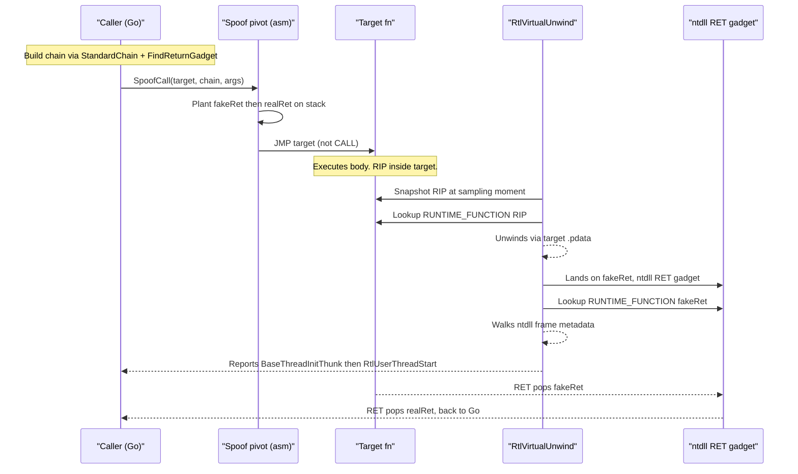

---
---

# Call-stack spoofing — metadata primitives

[← evasion area README](README.md) · [docs/index](../../index.md)

## TL;DR

When EDR sees `VirtualAllocEx` called, it walks the calling
thread's stack and asks "who got us here?". A real Win32 program
shows `RtlUserThreadStart → BaseThreadInitThunk → main → ...
→ VirtualAllocEx`. A Go injector shows `runtime.goexit → ...
→ syscall.Syscall6 → VirtualAllocEx` — instantly suspicious.

Spoofing the call stack rewrites the stack so the walker sees
the benign Win32 lineage instead.

The package splits into two halves with very different maturity:

| Layer | What you get | Status |
|---|---|---|
| **Metadata helpers** ([`StandardChain`](#standardchain-frame-error), [`FindReturnGadget`](#findreturngadget-uintptr-error), [`LookupFunctionEntry`](#lookupfunctionentry), [`Validate`](#validate)) | Build the synthetic Frame chain (`RtlUserThreadStart → BaseThreadInitThunk → …`) with valid RUNTIME_FUNCTION rows pulled from ntdll/kernel32 `.pdata`. Use independently of any pivot. | **Production-ready.** Used today by `evasion/preset` for stack metadata. |
| **Asm pivot** (`SpoofCall`) | Plants the chain on the thread's stack and JMPs into the target so the unwinder walks the synthetic frames | **Experimental scaffold** — gated behind `MALDEV_SPOOFCALL_E2E=1`, documented crash path. Use the metadata helpers + your own pivot for production. |

What the metadata helpers DO:

- Resolve `kernel32!BaseThreadInitThunk` + `ntdll!RtlUserThreadStart`
  via `RtlLookupFunctionEntry` so each Frame carries a *valid*
  RUNTIME_FUNCTION the unwinder will follow.
- Find a `RET` gadget in ntdll's `.text` so the CPU "lands"
  inside ntdll after the target returns — the unwinder then
  walks ntdll's full `.pdata` coverage.
- `Validate` catches structural mistakes (wrong unwind info,
  RIP out of `[Begin, End)`) before the chain hits a walker.

What this DOES NOT do:

- **Doesn't bypass ETW Threat-Intelligence cross-validation** —
  ETW's `Microsoft-Windows-Threat-Intelligence` provider can
  cross-check the walked RIPs against actual control flow. EDRs
  paying for ETW-TI subscriptions still see you.
- **Doesn't change WHAT the spoofed thread does** — only WHO it
  appears to call from. The actual `VirtualAllocEx` still
  happens; it just looks like it came from `BaseThreadInitThunk`.
- **`SpoofCall` is not safe** — the asm pivot is research
  scaffold. For production, use the metadata helpers
  (`StandardChain` returns a usable `[]Frame` chain) and write
  your own asm pivot tuned to your target's calling convention.

## Primer — vocabulary

Six terms recur on this page:

> **Stack walking** — the process of following return addresses
> on a thread's stack to reconstruct the chain of callers (the
> "back trace"). EDRs do this on suspicious API calls; debuggers
> do it for crash analysis.
>
> **`RtlVirtualUnwind`** — the user-mode function (and its
> kernel-mode sibling) that performs the actual stack-walk step.
> Given a current RIP, it looks up the matching RUNTIME_FUNCTION
> in the module's `.pdata` and follows the unwind info to compute
> the previous frame.
>
> **RUNTIME_FUNCTION** — a 12-byte record in a PE's `.pdata`
> section describing one function's start RVA, end RVA, and a
> pointer to its `UNWIND_INFO`. Without a RUNTIME_FUNCTION
> covering the current RIP, the unwinder can't proceed — which
> is why the spoof needs the fake "return address" to land
> INSIDE ntdll (full `.pdata` coverage).
>
> **`.pdata`** — the PE section holding all RUNTIME_FUNCTION
> entries for the module. Sorted by start RVA; binary-searched
> by `RtlLookupFunctionEntry`.
>
> **Thread-init lineage** — the canonical Win32 thread startup
> chain: `RtlUserThreadStart → BaseThreadInitThunk → main`.
> Every legitimate thread on Windows has these two frames at
> the bottom. Spoofing aims to make the walker SEE this lineage
> even when the actual code path didn't go through it.
>
> **RET gadget** — a single `RET` instruction (`0xC3`) somewhere
> in ntdll's `.text`. Used as the "land here after the target
> returns" address in the spoof. After the gadget RETs, the CPU
> pops the next address (the next frame in the chain) and
> continues.

## How It Works



Steps:

1. `StandardChain` resolves the canonical thread-init lineage:
   `kernel32!BaseThreadInitThunk` (inner caller) and
   `ntdll!RtlUserThreadStart` (outer caller). Both are looked up via
   `RtlLookupFunctionEntry` so the returned `Frame[i]` carries a
   valid `RUNTIME_FUNCTION` row from the legitimate module's
   `.pdata`.
2. `FindReturnGadget` scans `ntdll.dll`'s `.text` for a lone `RET`
   (`0xC3` followed by alignment padding). The address is used as
   the **fake return** at the top of the chain — when the target's
   own `RET` fires, the CPU jumps into ntdll's image, which has full
   `.pdata` coverage.
3. The asm pivot (`SpoofCall` scaffold, gated behind
   `MALDEV_SPOOFCALL_E2E=1`) plants `[fakeRet, ...chain]` on the
   thread's stack, then `JMP`s (not `CALL`s) into the target. When
   the target returns, it pops `fakeRet` and the CPU lands inside
   ntdll. A walker that samples `RIP` at any point above the target
   walks ntdll's metadata and reports a benign thread-init sequence.
4. `Validate` confirms structural consistency before any of this:
   non-zero return / image base / unwind-info; `ControlPc` bounded
   by the `RUNTIME_FUNCTION [Begin, End)` window.

## API → godoc

[`pkg.go.dev/github.com/oioio-space/maldev/evasion/callstack`](https://pkg.go.dev/github.com/oioio-space/maldev/evasion/callstack) is the authoritative
reference for every exported symbol. This page teaches the
*concepts*; the godoc is the *specification*.

## Examples

### Simple — build + validate a chain

```go
chain, err := callstack.StandardChain()
if err != nil {
    log.Fatal(err)
}
if err := callstack.Validate(chain); err != nil {
    log.Fatalf("chain invalid: %v", err)
}
gadget, err := callstack.FindReturnGadget()
if err != nil {
    log.Fatal(err)
}
log.Printf("chain frames=%d gadget=%#x", len(chain), gadget)
```

### Composed — chain + injection landing-site spoof

The chain is one piece of the deception. Pair it with
`evasion/unhook` and an indirect-syscall caller so a walker that
lands on any of the hot calls sees ntdll-resident addresses with
valid `.pdata`.

```go
import (
    "github.com/oioio-space/maldev/evasion/callstack"
    "github.com/oioio-space/maldev/inject"
    wsyscall "github.com/oioio-space/maldev/win/syscall"
)

stdChain, _ := callstack.StandardChain()
_ = callstack.Validate(stdChain)
gadget, _ := callstack.FindReturnGadget()
gadgetFrame, _ := callstack.LookupFunctionEntry(gadget)
full := append([]callstack.Frame{gadgetFrame}, stdChain...)

caller := wsyscall.New(wsyscall.MethodIndirect, wsyscall.NewHashGate())
defer caller.Close()
inj, _ := inject.NewWindowsInjector(&inject.WindowsConfig{
    Config:        inject.Config{Method: inject.MethodCreateThread},
    SyscallMethod: wsyscall.MethodIndirect,
})
_ = inj.Inject(shellcode)
_ = full // hand off to operator's own pivot OR callstack.SpoofCall
```

### Advanced — SpoofCall (gated)

```go
// MALDEV_SPOOFCALL_E2E=1 must be set; the asm pivot is debug-only.
chain, _ := callstack.StandardChain()
gadget, _ := callstack.FindReturnGadget()
gadgetFrame, _ := callstack.LookupFunctionEntry(gadget)
full := append([]callstack.Frame{gadgetFrame}, chain...)

target := unsafe.Pointer(windows.NewLazyDLL("ntdll.dll").
    NewProc("RtlGetVersion").Addr())
ret, err := callstack.SpoofCall(target, full /* no args */)
if err != nil {
    log.Fatalf("spoofcall: %v", err)
}
log.Printf("RtlGetVersion returned %#x", ret)
```

## OPSEC & Detection

| Vector | Visibility | Mitigation |
|---|---|---|
| `RtlLookupFunctionEntry` reads | not logged | none needed |
| Synthetic frame on the thread stack | reflection-based walkers may flag | live with the residual; pair with HW-BP variant (P2.6) on hardened targets |
| ETW Threat-Intelligence | cross-references RIP against legitimate call graph | EDRs subscribing to TI can still flag — `evasion/callstack` makes the chain *plausible*, not *indistinguishable* |
| ntdll RET-gadget address | static — same value across calls within a process | randomise gadget pick from `FindReturnGadget` candidates (future enhancement) |

D3FEND counters: **D3-PSA** (Process Spawn Analysis) — when paired
with a benign thread-init RIP sequence the spawn / call chain
appears legitimate.

## MITRE ATT&CK

| T-ID | Name | Sub-coverage | D3FEND counter |
|---|---|---|---|
| [T1036](https://attack.mitre.org/techniques/T1036/) | Masquerading | call-stack metadata | D3-PSA |
| [T1027](https://attack.mitre.org/techniques/T1027/) | Obfuscated Files or Information | runtime stack obfuscation | D3-EAL |

## Limitations

- **x64 only.** x86 uses frame-pointer walking rather than
  `.pdata`-based unwind, which requires a different spoof strategy.
- **Synthetic frames detected by ETW Threat-Intelligence.** Some
  EDRs (especially those consuming the TI provider) cross-check
  every stack frame RIP against the current call graph.
- **Module relocations.** `StandardChain` caches the frames after
  first call; if the target module unmaps + remaps at a new base
  (unusual but possible under ASLR-stressed environments), the
  cached frames become stale. Spawn a fresh process or build a
  one-shot chain via `LookupFunctionEntry`.
- **No hardware-breakpoint variant yet.** The fortra-style HWBP
  pivot (HW-BP on RET gadget for stronger obfuscation) is tracked
  under backlog row P2.6.
- **`SpoofCall` is experimental.** The pivot occasionally crashes
  through Go's `lastcontinuehandler` due to runtime M:N
  scheduling. Promotion to a tagged release waits on a clean
  root-cause.

## See also

- [Evasion area README](README.md)
- [`evasion/sleepmask`](sleep-mask.md) — pair with sleep-mask so spoofed frames are also wiped between callbacks
- [`win/syscall`](../syscalls/direct-indirect.md) — `MethodIndirect` returns into ntdll, complementary stack-stealth path
- [`recon/hwbp`](../recon/hw-breakpoints.md) — companion HW-BP variant tracked under backlog P2.6
- [package godoc](https://pkg.go.dev/github.com/oioio-space/maldev/evasion/callstack)
